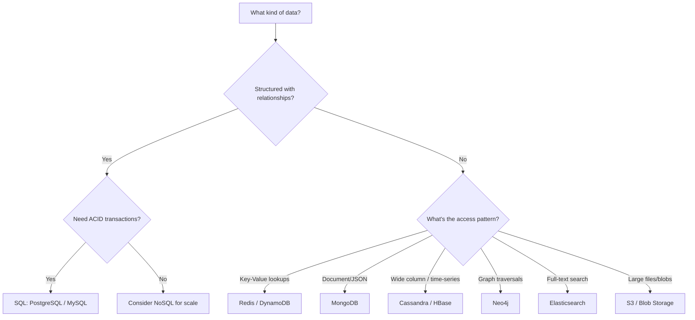
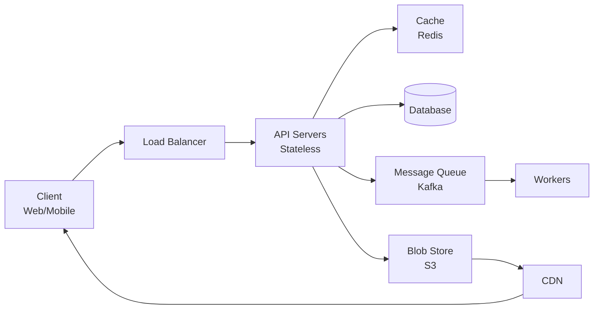

# How to Think About System Design

> This is the most important document in the course. Read it first, re-read it weekly.

## The RESHADED Framework

Every system design interview follows the same structure. Use RESHADED to never miss a step:

| Step | Time | What You Do |
|------|------|------------|
| **R**equirements | 5 min | Clarify functional & non-functional requirements |
| **E**stimation | 5 min | Back-of-envelope: QPS, storage, bandwidth |
| **S**torage | 3 min | Data model, database choice (SQL vs NoSQL) |
| **H**igh-level Design | 10 min | Draw the box diagram: clients, services, databases |
| **A**PI Design | 5 min | Define key API endpoints (REST/gRPC) |
| **D**etailed Design | 12 min | Deep dive into 2-3 critical components |
| **E**valuation | 3 min | Trade-offs, bottlenecks, failure modes |
| **D**eployment | 2 min | Scaling, monitoring, deployment strategy |

### Total: 45 minutes

This maps perfectly to a standard system design interview round.

## Step 1: Requirements (5 min)

**Goal:** Turn an ambiguous question into a concrete problem.

### Always Ask

**Functional requirements** (what the system does):
- Who are the users? How many?
- What are the core features? (Pick 3-5 max for scope)
- What does the user flow look like?

**Non-functional requirements** (how well it does it):
- What's the expected scale? (DAU, requests/sec)
- What's the latency requirement? (< 200ms? < 1s?)
- Availability vs consistency -- which matters more?
- Do we need real-time updates?

### Example: "Design Twitter"

> **Functional:** Users can post tweets, follow users, view home timeline (news feed), search tweets.
>
> **Non-functional:** 500M DAU, 600M tweets/day, read-heavy (100:1 read/write ratio), eventual consistency acceptable, timeline should load in < 500ms.

**Pro tip:** Write requirements on the whiteboard. The interviewer wants to see your thought process.

## Step 2: Estimation (5 min)

**Goal:** Quantify the problem so your design decisions are grounded in numbers.

### The Formula

```
Daily active users (DAU) = X
Actions per user per day = Y
QPS = (X * Y) / 86,400
Peak QPS = QPS * 2-5x (depending on traffic patterns)
Storage per item = Z bytes
Daily storage = X * Y * Z
Monthly storage = Daily * 30
```

### Example: Twitter Estimation

```
DAU = 500M
Tweets/day = 600M
Write QPS = 600M / 86,400 = ~7,000 QPS
Peak write QPS = ~14,000 QPS

Read QPS (100:1) = ~700,000 QPS
Peak read QPS = ~1.4M QPS

Tweet size = ~300 bytes text + metadata = ~1 KB
Daily storage = 600M * 1 KB = 600 GB/day
Monthly storage = 18 TB/month
5-year storage = ~1 PB (just text, excluding media)
```

**Key insight:** These numbers tell you immediately that you need caching (700K QPS exceeds any single database) and sharding (1 PB doesn't fit on one machine).

## Step 3: Storage (3 min)

**Goal:** Define your data model and choose the right database.

### Decision Framework



### SQL vs NoSQL Quick Reference

| Criteria | SQL | NoSQL |
|----------|-----|-------|
| Schema | Fixed, predefined | Flexible, schema-on-read |
| Scaling | Vertical (scale up) | Horizontal (scale out) |
| Consistency | Strong (ACID) | Eventual (BASE) |
| Joins | Native support | Application-level |
| Best for | Transactions, complex queries | High throughput, flexible data |

## Step 4: High-Level Design (10 min)

**Goal:** Draw the big picture. Every component gets a box. Every connection gets an arrow.

### The Universal Template



Most systems are variations of this template:
- **Clients** talk to **load balancers**
- Load balancers distribute to **stateless API servers**
- API servers read from **cache** first, then **database**
- Async work goes through **message queues** to **workers**
- Static/media content goes through **CDN**

### What to Emphasize

- Draw the happy path first (user creates a post, user views feed)
- Label each component with its technology ("Redis", "PostgreSQL", "Kafka")
- Show data flow direction with arrows

## Step 5: API Design (5 min)

**Goal:** Define the contract between client and server.

### Template

```
POST /api/v1/tweets
  Body: { text, media_ids[] }
  Response: { tweet_id, created_at }

GET /api/v1/timeline?page=1&limit=20
  Response: { tweets[], next_cursor }

GET /api/v1/users/{user_id}/followers?cursor=X&limit=20
  Response: { users[], next_cursor }
```

### Key Design Decisions

- **Pagination:** Use cursor-based (not offset) for large datasets
- **Idempotency:** POST requests should include an idempotency key for retries
- **Versioning:** Use URL versioning (`/v1/`) for backward compatibility
- **Rate limiting:** Include rate limit headers in responses

## Step 6: Detailed Design (12 min)

**Goal:** Deep dive into the 2-3 most interesting/challenging components.

The interviewer will usually tell you which part to focus on. Common deep dives:

| Component | What They Want to See |
|-----------|----------------------|
| Database schema | Table design, indexes, partitioning strategy |
| Caching layer | What to cache, invalidation strategy, cache-aside vs write-through |
| Message queue | Ordering guarantees, consumer groups, exactly-once delivery |
| News feed | Fan-out strategy (push vs pull vs hybrid) |
| Search | Inverted index, ranking algorithm, query processing |
| Real-time | WebSocket management, connection state, reconnection |

### How to Go Deep

1. State the problem clearly: "The challenge here is..."
2. Present 2-3 options with trade-offs
3. Pick one and justify: "I'd choose X because..."
4. Walk through edge cases: "What happens when..."

## Step 7: Evaluation (3 min)

**Goal:** Show you can think about failure modes and trade-offs.

### Questions to Address

- **Single points of failure:** What happens if this component goes down?
- **Bottlenecks:** Where will the system break under 10x load?
- **Trade-offs:** What did we sacrifice? (Consistency for availability? Latency for correctness?)
- **Security:** Authentication, authorization, encryption, input validation

### Framework

```
"The main trade-off in this design is [X vs Y].
We chose [X] because [reason].
If requirements change to need [Y], we would modify [component] by [change]."
```

## Step 8: Deployment (2 min)

**Goal:** Show you understand production realities.

- **Multi-region:** Deploy in 2+ regions for disaster recovery
- **Auto-scaling:** Scale API servers based on CPU/memory metrics
- **Monitoring:** Track latency (p99), error rate, QPS
- **CI/CD:** Blue-green or canary deployments
- **Cost:** Mention cost implications of your choices

## Common Mistakes

| Mistake | Fix |
|---------|-----|
| Jumping into design without requirements | Always start with 5 min of requirements |
| Not doing estimation | Numbers justify every design choice |
| Designing for current scale only | Show how the system scales 10x, 100x |
| Ignoring failure modes | Discuss what happens when things break |
| Over-engineering | Start simple, add complexity as needed |
| Not communicating | Talk through your thought process constantly |
| Memorizing designs instead of understanding | Focus on WHY, not just WHAT |

## The Golden Rule

> **Start simple. Add complexity only when the numbers demand it.**

A URL shortener for 100 users doesn't need sharding. Twitter with 500M users does. Let the requirements and estimation drive your architecture.

---

## Pattern Identification Workout

Read each prompt below. Without scrolling, write down (a) the 2-3 building blocks you'd reach for first, (b) the partition / sharding key, (c) the rough read:write ratio. Then expand the answer to see what most interviewers expect. Budget 1-2 minutes per prompt — these are recognition drills, not full designs.

### Prompt 1 — "Design a service that converts a 100-char URL into a 6-char short code; 100M URLs stored, 10K redirects/s peak"

<details>
<summary>Reveal expected answer</summary>

- **Building blocks:** Cache (Redis for hot codes), KV store (DynamoDB / Cassandra for `code → URL`), Key Generation Service (counter + base62). See Phase 1 modules 3, 5; Phase 4 module 1.
- **Partition key:** `short_code` on the read path; `created_at` on a secondary analytics index.
- **Ratio:** read-heavy, ~1:1000 (one write per thousand redirects). Cache hit ratio 90%+ on hot links.
- **Why:** classic write-once-read-many. The write path is trivial; spend your air-time on the redirect latency budget and the analytics fan-out.

</details>

### Prompt 2 — "Push a breaking-news notification to all 50M users of an app within 60 seconds"

<details>
<summary>Reveal expected answer</summary>

- **Building blocks:** Pub-sub (Kafka or SNS), fan-out workers, per-platform push gateways (APNs / FCM), DLQ + retry. See Phase 1 modules 7, 8; Phase 3 fan-out + circuit-breaker modules.
- **Partition key:** `device_token` hashed across worker shards; `region` for locality-aware delivery.
- **Ratio:** burst-write — 0 traffic baseline, then 50M deliveries in 60s (~830K/s). Reads are zero; this is a pure fan-out problem.
- **Why:** the trick is bounded parallelism. Don't enqueue 50M individual jobs in one transaction — batch by region, by platform, by user segment.

</details>

### Prompt 3 — "Inventory counter for a flash sale: 10K items, must never go negative, 100K buyers in the first second"

<details>
<summary>Reveal expected answer</summary>

- **Building blocks:** Strongly-consistent store (Redis with Lua decrement, or a relational row with `UPDATE … WHERE qty > 0`), distributed lock or single-writer queue, idempotency keys. See Phase 2 consistency module; Phase 3 saga / idempotency.
- **Partition key:** `sku_id`.
- **Ratio:** write-heavy and contention-bound on a single key.
- **Why:** this is the textbook "hot key" + "exactly-once" problem. Cache-aside is wrong here; you want atomic decrement at the source of truth. If you mention CRDTs, explain why they're a bad fit (counters can be negative under merge).

</details>

### Prompt 4 — "File-upload UI that shows live progress for files up to 5 GB"

<details>
<summary>Reveal expected answer</summary>

- **Building blocks:** Blob storage (S3) with multipart upload + presigned URLs, an upload-session record in a small RDBMS, optional WebSocket for progress. See Phase 1 module 5 (blob), Phase 1 module 4 (API).
- **Partition key:** `upload_session_id`.
- **Ratio:** write-heavy on the blob side; metadata reads are negligible.
- **Why:** the trap is routing 5 GB through your API tier. The right answer is presigned URLs — the client uploads parts directly to S3 and your server only tracks the manifest.

</details>

### Prompt 5 — "Distributed-trace system for 500 microservices producing 2M spans/sec"

<details>
<summary>Reveal expected answer</summary>

- **Building blocks:** Append-only event log (Kafka), columnar store (ClickHouse / BigQuery), pub-sub for live tailing, sampling layer at the SDK. See Phase 1 module 7, Phase 2 module on event-driven, Phase 5 metrics design.
- **Partition key:** `trace_id` (so all spans of one trace land together).
- **Ratio:** extreme write-heavy (2M/s ingest, ~10/s human reads). Compression and tiered storage are mandatory.
- **Why:** the volume forces head-based or tail-based sampling. Mention the trade-off: head sampling is cheap but blind to errors; tail sampling buffers and is expensive.

</details>

### Prompt 6 — "Outbound email pipeline that must retry on bounce and back off if the SMTP provider 429s"

<details>
<summary>Reveal expected answer</summary>

- **Building blocks:** Message queue with delayed retries (SQS, RabbitMQ TTL, or Kafka with retry topics), circuit breaker around the SMTP client, DLQ + alarm. See Phase 1 module 7, Phase 3 circuit-breaker module.
- **Partition key:** `tenant_id` (so a noisy tenant can't starve the queue for everyone else).
- **Ratio:** moderate write, retries dominate worst-case load (10×).
- **Why:** the gotcha is per-tenant fairness. A single uniform queue is the wrong default — use weighted/sharded queues so a runaway customer is rate-limited in isolation.

</details>

### Prompt 7 — "Concert-seat booking: 50K seats, first-come-first-served, no double-bookings"

<details>
<summary>Reveal expected answer</summary>

- **Building blocks:** Consensus on the seat-state machine (Redis with SET-NX + TTL, or a transactional DB row per seat), idempotent reservation tokens, short-lived hold (~5 min) before payment. See Phase 2 consensus module, Phase 3 idempotency + saga.
- **Partition key:** `event_id` for the hot 5-minute window; `seat_id` within event.
- **Ratio:** write-heavy on burst; high contention on premium seats.
- **Why:** the killer detail is the "hold then confirm" two-phase commit equivalent. Don't release a seat to the next user until either the timer expires or payment fails — and make the confirm step idempotent.

</details>

### Prompt 8 — "Reading-list app that syncs across phone, tablet, and laptop, including offline edits"

<details>
<summary>Reveal expected answer</summary>

- **Building blocks:** Per-user document store with CRDTs (or last-write-wins with a vector clock fallback), local write-ahead log on each device, pub-sub for change notifications. See Phase 2 consistency module, Phase 3 event-sourcing.
- **Partition key:** `user_id`.
- **Ratio:** balanced; offline-write bursts when reconnecting.
- **Why:** "offline + multi-device" is the trigger phrase for CRDT or operational-transform. Name one (e.g. observed-remove set or Yjs's Y.Doc) so the interviewer knows you've read Kleppmann ch. 5.

</details>

### Prompt 9 — "Photo upload that must be searchable by face within 30 seconds of upload"

<details>
<summary>Reveal expected answer</summary>

- **Building blocks:** Blob (S3) + metadata DB, async ML inference pipeline (queue → GPU worker → embedding), vector index (Milvus / Pinecone / pgvector). See Phase 1 module 5, Phase 5 search / ML modules.
- **Partition key:** `photo_id` for blobs; `user_id` + `embedding` for the index.
- **Ratio:** write-heavy on upload, read-heavy on search; ML inference is the bottleneck (~hundreds of ms per face).
- **Why:** call out the pipeline: upload → enqueue → embed → index. The 30-second SLA is achievable with batched GPU inference and ANN (approximate nearest neighbour) at query time.

</details>

### Prompt 10 — "Cross-region active-active write app: users in US and EU both writing to the same product catalog"

<details>
<summary>Reveal expected answer</summary>

- **Building blocks:** Multi-leader replication (Cassandra, DynamoDB Global Tables, or Spanner), per-region write endpoints, conflict-resolution policy (LWW with hybrid logical clocks, or per-field merge). See Phase 2 replication module.
- **Partition key:** `product_id`; region inferred from client geo-routing.
- **Ratio:** moderate write, heavy read; conflict rate is low but non-zero.
- **Why:** the question is *how do you resolve conflicting writes?* Quote Spanner (TrueTime + external consistency) for the strong-consistency answer, or DynamoDB Global Tables (LWW with vector clock + custom resolver) for the AP answer. Mention the cost: cross-region commit latency is ≥ 50ms even on private fibre.

</details>

### Self-Scoring

For each prompt, give yourself one point per correct component (building block, partition key, ratio). Out of 30 total points:

- **24-30:** you can pattern-match in interviews; focus next on depth + trade-offs.
- **18-23:** solid foundation; review the 2-3 modules whose prompts tripped you up.
- **12-17:** you need more reps on Phase 1-2 modules before tackling Phase 4-5 full designs.
- **0-11:** read `how-to-think.md` § The RESHADED Framework cold one more time, then redo the workout tomorrow.

Re-take the workout every 7 days during Phase 4-6. The drill is cheap; the recognition is the moat.
