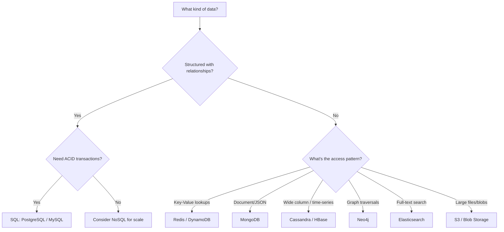
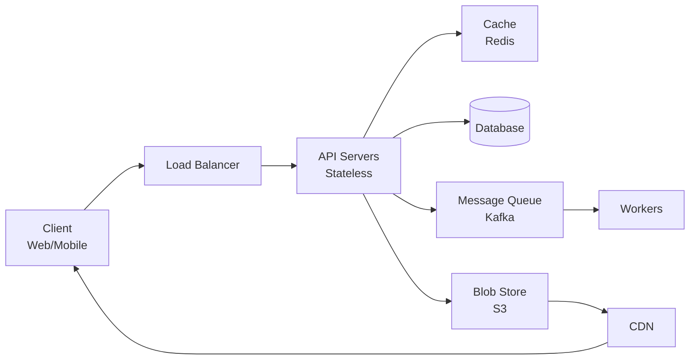

# How to Think About System Design

> This is the most important document in the course. Read it first, re-read it weekly.

## The RESHADED Framework

Every system design interview follows the same structure. Use RESHADED to never miss a step:

| Step | Time | What You Do |
|------|------|------------|
| **R**equirements | 5 min | Clarify functional & non-functional requirements |
| **E**stimation | 5 min | Back-of-envelope: QPS, storage, bandwidth |
| **S**torage | 3 min | Data model, database choice (SQL vs NoSQL) |
| **H**igh-level Design | 10 min | Draw the box diagram: clients, services, databases |
| **A**PI Design | 5 min | Define key API endpoints (REST/gRPC) |
| **D**etailed Design | 12 min | Deep dive into 2-3 critical components |
| **E**valuation | 3 min | Trade-offs, bottlenecks, failure modes |
| **D**eployment | 2 min | Scaling, monitoring, deployment strategy |

### Total: 45 minutes

This maps perfectly to a standard system design interview round.

## Step 1: Requirements (5 min)

**Goal:** Turn an ambiguous question into a concrete problem.

### Always Ask

**Functional requirements** (what the system does):
- Who are the users? How many?
- What are the core features? (Pick 3-5 max for scope)
- What does the user flow look like?

**Non-functional requirements** (how well it does it):
- What's the expected scale? (DAU, requests/sec)
- What's the latency requirement? (< 200ms? < 1s?)
- Availability vs consistency -- which matters more?
- Do we need real-time updates?

### Example: "Design Twitter"

> **Functional:** Users can post tweets, follow users, view home timeline (news feed), search tweets.
>
> **Non-functional:** 500M DAU, 600M tweets/day, read-heavy (100:1 read/write ratio), eventual consistency acceptable, timeline should load in < 500ms.

**Pro tip:** Write requirements on the whiteboard. The interviewer wants to see your thought process.

## Step 2: Estimation (5 min)

**Goal:** Quantify the problem so your design decisions are grounded in numbers.

### The Formula

```
Daily active users (DAU) = X
Actions per user per day = Y
QPS = (X * Y) / 86,400
Peak QPS = QPS * 2-5x (depending on traffic patterns)
Storage per item = Z bytes
Daily storage = X * Y * Z
Monthly storage = Daily * 30
```

### Example: Twitter Estimation

```
DAU = 500M
Tweets/day = 600M
Write QPS = 600M / 86,400 = ~7,000 QPS
Peak write QPS = ~14,000 QPS

Read QPS (100:1) = ~700,000 QPS
Peak read QPS = ~1.4M QPS

Tweet size = ~300 bytes text + metadata = ~1 KB
Daily storage = 600M * 1 KB = 600 GB/day
Monthly storage = 18 TB/month
5-year storage = ~1 PB (just text, excluding media)
```

**Key insight:** These numbers tell you immediately that you need caching (700K QPS exceeds any single database) and sharding (1 PB doesn't fit on one machine).

## Step 3: Storage (3 min)

**Goal:** Define your data model and choose the right database.

### Decision Framework



### SQL vs NoSQL Quick Reference

| Criteria | SQL | NoSQL |
|----------|-----|-------|
| Schema | Fixed, predefined | Flexible, schema-on-read |
| Scaling | Vertical (scale up) | Horizontal (scale out) |
| Consistency | Strong (ACID) | Eventual (BASE) |
| Joins | Native support | Application-level |
| Best for | Transactions, complex queries | High throughput, flexible data |

## Step 4: High-Level Design (10 min)

**Goal:** Draw the big picture. Every component gets a box. Every connection gets an arrow.

### The Universal Template



Most systems are variations of this template:
- **Clients** talk to **load balancers**
- Load balancers distribute to **stateless API servers**
- API servers read from **cache** first, then **database**
- Async work goes through **message queues** to **workers**
- Static/media content goes through **CDN**

### What to Emphasize

- Draw the happy path first (user creates a post, user views feed)
- Label each component with its technology ("Redis", "PostgreSQL", "Kafka")
- Show data flow direction with arrows

## Step 5: API Design (5 min)

**Goal:** Define the contract between client and server.

### Template

```
POST /api/v1/tweets
  Body: { text, media_ids[] }
  Response: { tweet_id, created_at }

GET /api/v1/timeline?page=1&limit=20
  Response: { tweets[], next_cursor }

GET /api/v1/users/{user_id}/followers?cursor=X&limit=20
  Response: { users[], next_cursor }
```

### Key Design Decisions

- **Pagination:** Use cursor-based (not offset) for large datasets
- **Idempotency:** POST requests should include an idempotency key for retries
- **Versioning:** Use URL versioning (`/v1/`) for backward compatibility
- **Rate limiting:** Include rate limit headers in responses

## Step 6: Detailed Design (12 min)

**Goal:** Deep dive into the 2-3 most interesting/challenging components.

The interviewer will usually tell you which part to focus on. Common deep dives:

| Component | What They Want to See |
|-----------|----------------------|
| Database schema | Table design, indexes, partitioning strategy |
| Caching layer | What to cache, invalidation strategy, cache-aside vs write-through |
| Message queue | Ordering guarantees, consumer groups, exactly-once delivery |
| News feed | Fan-out strategy (push vs pull vs hybrid) |
| Search | Inverted index, ranking algorithm, query processing |
| Real-time | WebSocket management, connection state, reconnection |

### How to Go Deep

1. State the problem clearly: "The challenge here is..."
2. Present 2-3 options with trade-offs
3. Pick one and justify: "I'd choose X because..."
4. Walk through edge cases: "What happens when..."

## Step 7: Evaluation (3 min)

**Goal:** Show you can think about failure modes and trade-offs.

### Questions to Address

- **Single points of failure:** What happens if this component goes down?
- **Bottlenecks:** Where will the system break under 10x load?
- **Trade-offs:** What did we sacrifice? (Consistency for availability? Latency for correctness?)
- **Security:** Authentication, authorization, encryption, input validation

### Framework

```
"The main trade-off in this design is [X vs Y].
We chose [X] because [reason].
If requirements change to need [Y], we would modify [component] by [change]."
```

## Step 8: Deployment (2 min)

**Goal:** Show you understand production realities.

- **Multi-region:** Deploy in 2+ regions for disaster recovery
- **Auto-scaling:** Scale API servers based on CPU/memory metrics
- **Monitoring:** Track latency (p99), error rate, QPS
- **CI/CD:** Blue-green or canary deployments
- **Cost:** Mention cost implications of your choices

## Common Mistakes

| Mistake | Fix |
|---------|-----|
| Jumping into design without requirements | Always start with 5 min of requirements |
| Not doing estimation | Numbers justify every design choice |
| Designing for current scale only | Show how the system scales 10x, 100x |
| Ignoring failure modes | Discuss what happens when things break |
| Over-engineering | Start simple, add complexity as needed |
| Not communicating | Talk through your thought process constantly |
| Memorizing designs instead of understanding | Focus on WHY, not just WHAT |

## The Golden Rule

> **Start simple. Add complexity only when the numbers demand it.**

A URL shortener for 100 users doesn't need sharding. Twitter with 500M users does. Let the requirements and estimation drive your architecture.
