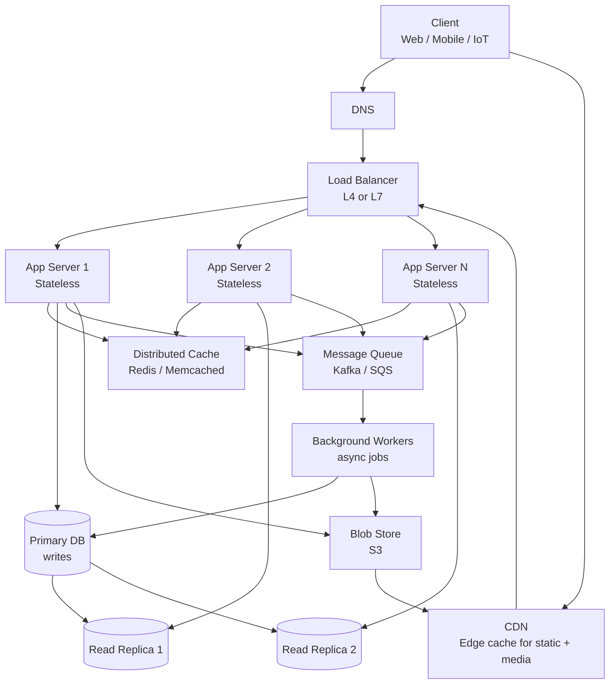
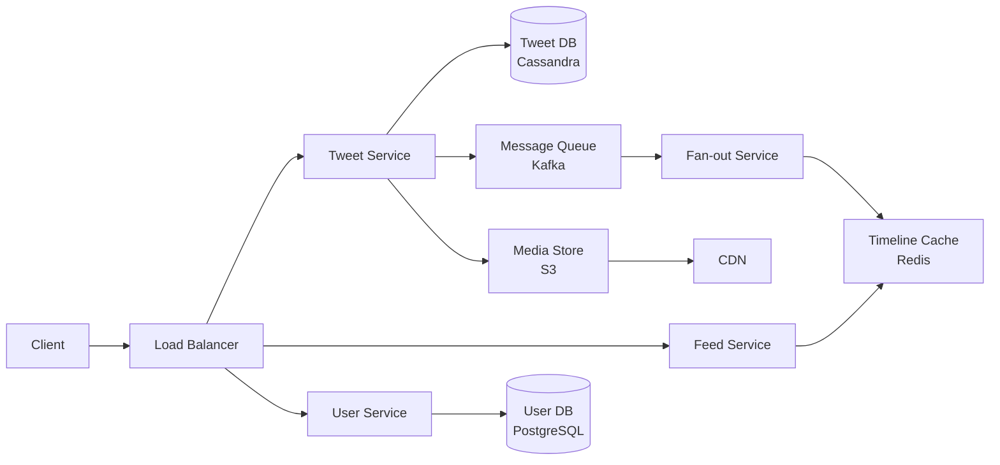

# How to Approach Any System Design Question

> The RESHADED framework: 8 steps, 45 minutes, every time.

## The Reference 3-Tier Web Architecture

Every system design is a variation on this picture. Memorise the boxes — the interview is about *which ones you need*, *which ones you scale*, and *where the bottleneck moves first*.



Three tiers, plus async: presentation (CDN + LB), application (stateless app servers + cache), data (primary + replicas + blob + queue). Drop any box you don't need. Add specialised boxes (search index, geospatial index, ML scorer) for the specific question.

## The Framework

RESHADED stands for:

| Step | Name | Time | Focus |
|------|------|------|-------|
| **R** | Requirements | 5 min | What are we building? For whom? At what scale? |
| **E** | Estimation | 5 min | QPS, storage, bandwidth -- let numbers drive design |
| **S** | Storage | 3 min | Data model, database choice |
| **H** | High-level Design | 10 min | Box diagram with all major components |
| **A** | API Design | 5 min | Key endpoints, request/response contracts |
| **D** | Detailed Design | 12 min | Deep dive into 2-3 critical components |
| **E** | Evaluation | 3 min | Trade-offs, bottlenecks, failure modes |
| **D** | Deployment | 2 min | Scaling, monitoring, multi-region |

## Step-by-Step Walkthrough

### R -- Requirements (5 min)

Every interview starts with a vague prompt: "Design Twitter" or "Design a URL shortener."

Your job is to **narrow the scope**. Ask these questions:

**Functional (what it does):**
- Who are the primary users?
- What are the 3-5 core features?
- What's in scope vs out of scope?

**Non-functional (how well it does it):**
- What's the expected scale? (users, requests)
- What's the latency budget? (< 200ms? < 1s?)
- Availability target? (99.9%? 99.99%?)
- Consistency requirement? (strong or eventual?)
- Do we need real-time updates?

**Example -- "Design Twitter":**

> **In scope:** Post tweets, follow users, view home timeline, search tweets.
>
> **Out of scope:** DMs, ads, analytics, video.
>
> **Scale:** 500M DAU, 600M tweets/day, read-heavy (100:1).
>
> **Latency:** Timeline loads < 500ms. Tweets appear < 5s after posting.
>
> **Consistency:** Eventual is fine for timeline. Strong for follow/unfollow.

### E -- Estimation (5 min)

Turn requirements into numbers. This drives every subsequent decision.

```
DAU = 500M
Tweets/day = 600M

Write QPS = 600M / 86,400 ~= 7,000
Peak write QPS = 7,000 * 2 = 14,000

Read QPS (100:1) = 700,000
Peak read QPS = 1,400,000

Tweet size = ~1 KB (text + metadata)
Daily storage = 600M * 1 KB = 600 GB/day
5-year = ~1 PB

Bandwidth (reads) = 700,000 QPS * 1 KB = ~700 MB/s
```

**What these numbers tell us:**
- 1.4M peak QPS -> no single database can handle this -> need caching + sharding
- 1 PB in 5 years -> need distributed storage
- 700 MB/s read bandwidth -> need CDN for media

### S -- Storage (3 min)

Choose your database and design the data model.

**Decision:** Use SQL (PostgreSQL) for user data (relationships, ACID). Use NoSQL (Cassandra) for tweet timeline (write-heavy, partitioned by user).

**Schema (simplified):**
```
Users: user_id (PK), username, email, created_at
Tweets: tweet_id (PK), user_id, text, media_url, created_at
Follows: follower_id, followee_id (composite PK)
Timeline: user_id (partition key), tweet_id, created_at
```

### H -- High-Level Design (10 min)

Draw the box diagram. Every component gets a box, every connection gets an arrow.



**Walk through the happy paths:**
1. User posts a tweet -> Tweet Service -> stores in DB -> publishes to Kafka -> Fan-out Service pushes to followers' timelines in Redis
2. User views timeline -> Feed Service -> reads from Redis timeline cache -> returns sorted tweets

### A -- API Design (5 min)

```
POST /api/v1/tweets
  Body: { text, media_ids[] }
  Headers: { Authorization: Bearer <token>, Idempotency-Key: <uuid> }
  Response: 201 { tweet_id, text, created_at }

GET /api/v1/feed?cursor=<tweet_id>&limit=20
  Response: 200 { tweets[], next_cursor }

POST /api/v1/users/{user_id}/follow
  Response: 200 { status: "following" }

GET /api/v1/search?q=<query>&cursor=X&limit=20
  Response: 200 { tweets[], next_cursor }
```

### D -- Detailed Design (12 min)

Pick 2-3 components and go deep. For Twitter, the interviewer usually asks about:

1. **Fan-out strategy:** Push (pre-compute timelines) vs Pull (fetch on demand) vs Hybrid (push for normal users, pull for celebrities with millions of followers).

2. **Timeline caching:** Store each user's timeline as a sorted set in Redis. When a tweet is created, fan-out service inserts it into each follower's timeline. Keep only the latest 800 tweets per user in cache.

3. **Search:** Inverted index using Elasticsearch. Index tweets by keywords. Rank by recency and engagement.

### E -- Evaluation (3 min)

**Trade-offs:**
- Chose eventual consistency for timeline (5-second delay acceptable) to gain higher availability
- Hybrid fan-out adds complexity but solves the celebrity problem (user with 100M followers)

**Bottlenecks:**
- Redis memory for timelines at 500M users * 800 tweets * 1 KB = ~400 TB -> need Redis cluster with sharding
- Fan-out for celebrities is slow -> mitigate with pull-based approach

**Failure modes:**
- If Kafka goes down, tweets are still stored but timelines don't update -> use dead letter queue + retry
- If Redis cache is cold, fall back to database read (slower but functional)

### D -- Deployment (2 min)

- Deploy in 3+ regions (US, EU, Asia) for latency
- Auto-scale API servers based on QPS metrics
- Blue-green deployments for zero-downtime updates
- Monitor: p99 latency, error rate, fan-out lag, cache hit ratio

## Practice Exercise

Pick any system from Phase 4-5 and walk through RESHADED in 45 minutes with a timer. Write down your design. Then compare with the solution.
