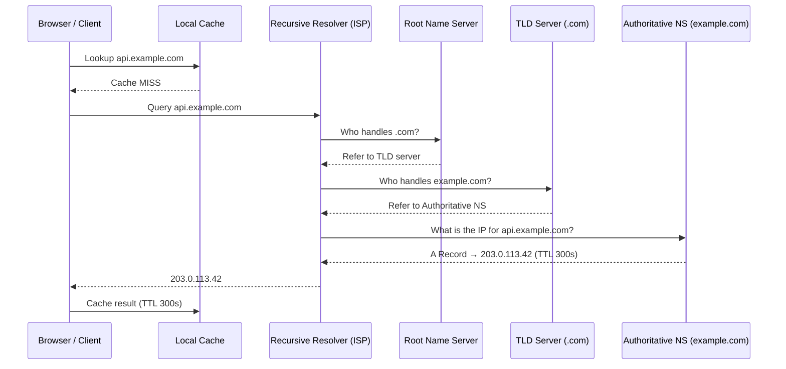

# 1.1 DNS & Networking

> Every system design answer starts with a client request traversing the network — understanding DNS and networking fundamentals is the bedrock of every architecture you will ever draw on a whiteboard.

## Why This Matters

When an interviewer asks you to design any system, the very first hop is DNS resolution and network communication. You cannot credibly discuss latency budgets, failover strategies, or global distribution without understanding how clients discover and connect to your services. Interviewers use networking questions as a litmus test for depth — if you can explain what happens between a browser keystroke and a rendered page, you signal senior-level understanding.

DNS is also the first lever for global load balancing, disaster recovery, and multi-region deployment. Companies like Netflix use DNS-based routing (via AWS Route 53) to steer users to the nearest healthy region. Understanding TTL trade-offs, DNS failover, and the difference between authoritative and recursive resolvers separates candidates who memorize boxes-and-arrows from those who can reason about production systems.

Networking protocols (TCP, UDP, HTTP/2, WebSocket) dictate the communication patterns available to your design. Choosing the wrong protocol can add hundreds of milliseconds of latency or break real-time features entirely. Interviewers expect you to justify why you would pick WebSocket over long polling, or gRPC over REST, with concrete trade-off reasoning.

## How It Works

### DNS Resolution Flow

DNS translates human-readable domain names into IP addresses through a hierarchical lookup process. The resolution involves multiple layers of caching and delegation.

**Key details interviewers expect:**

- **Recursive resolver** does the heavy lifting — the client makes one request, the resolver walks the hierarchy.
- **TTL (Time To Live)** controls how long DNS answers are cached. Low TTL (30-60s) enables fast failover but increases DNS traffic. High TTL (3600s) reduces load but slows failover.
- **DNS record types:** A (IPv4), AAAA (IPv6), CNAME (alias), MX (mail), NS (nameserver), TXT (verification/SPF).
- **GeoDNS** returns different IPs based on client location — this is how Netflix routes you to the nearest CDN edge.

### HTTP vs HTTPS and the TLS Handshake

HTTPS adds a TLS handshake on top of the TCP handshake, adding 1-2 round trips before any application data flows. TLS 1.3 reduced this to a single round trip (1-RTT), and supports 0-RTT resumption for repeat connections.

**TCP 3-Way Handshake:** SYN → SYN-ACK → ACK (1 round trip)
**TLS 1.2:** Adds 2 round trips for key exchange
**TLS 1.3:** Adds 1 round trip (or 0-RTT for resumed sessions)

### Real-Time Communication Patterns

| Pattern | How It Works | Latency | Server Cost | Use Case |
|---------|-------------|---------|-------------|----------|
| **Short Polling** | Client sends requests at fixed intervals | High (interval gap) | Wasted requests | Legacy dashboards |
| **Long Polling** | Client holds open request until server has data | Medium | Moderate (open connections) | Chat (Slack fallback) |
| **SSE (Server-Sent Events)** | Server pushes over a single HTTP connection | Low | Low (unidirectional) | Live feeds, notifications |
| **WebSocket** | Full-duplex persistent connection | Very Low | High (stateful) | Gaming, trading, collaborative editing |

### TCP vs UDP

| Property | TCP | UDP |
|----------|-----|-----|
| **Connection** | Connection-oriented (handshake) | Connectionless |
| **Reliability** | Guaranteed delivery, ordering | Best-effort, no ordering |
| **Overhead** | Higher (headers, ACKs, retransmit) | Minimal |
| **Use Cases** | HTTP, database connections, file transfer | DNS queries, video streaming, VoIP, gaming |

## Key Concepts

| Concept | Description | When to Use |
|---------|-------------|-------------|
| **DNS Caching** | Results cached at browser, OS, resolver, and ISP levels | Always — reduces latency and DNS server load |
| **TTL Tuning** | Controls cache duration; low TTL for fast failover | Low TTL during migrations; high TTL for stable services |
| **GeoDNS** | Returns different IPs based on client geography | Multi-region deployments, CDN routing |
| **Anycast** | Multiple servers share one IP; routing picks the nearest | CDN edge nodes, DNS root servers |
| **Connection Pooling** | Reuse TCP connections across requests | HTTP/2 multiplexing, database connections |
| **HTTP/2 Multiplexing** | Multiple streams over a single TCP connection | Reducing head-of-line blocking for web apps |

## Trade-offs

| Approach A | Approach B | Choose A When | Choose B When |
|-----------|-----------|---------------|---------------|
| Low DNS TTL (30s) | High DNS TTL (3600s) | Active failover, blue-green deploys | Stable infrastructure, reduce DNS query volume |
| WebSocket | Long Polling | True bidirectional real-time needed | Simpler infrastructure, firewall constraints |
| HTTP/2 | HTTP/1.1 | Multiple concurrent resources from same origin | Legacy client support required |
| TCP | UDP | Reliability matters (APIs, DB) | Latency matters more than reliability (video, DNS) |
| gRPC (HTTP/2) | REST (HTTP/1.1) | Internal service-to-service, strong typing | Public APIs, browser clients, simplicity |

## Interview Cheat Sheet

- DNS resolution has **4 levels of caching**: browser → OS → recursive resolver → authoritative server
- **TTL is the most important DNS knob** — it controls failover speed vs query volume
- **CNAME records cannot coexist** with other records at the zone apex (use ALIAS/ANAME)
- HTTP/2 multiplexing eliminates head-of-line blocking at the HTTP layer (but not TCP layer — hence HTTP/3 using QUIC/UDP)
- **WebSocket** requires sticky sessions or a pub/sub backplane for scaling across multiple servers
- **Long polling** is simpler to deploy behind standard load balancers than WebSocket
- DNS is a **single point of failure** — always mention redundant DNS providers in large-scale designs
- **Anycast** is how Cloudflare and Google serve DNS from 200+ edge locations with a single IP

## Common Interview Questions

1. **What happens when you type google.com in a browser?** (DNS → TCP → TLS → HTTP → render — cover each hop)
2. How would you design a system that needs to fail over between regions in under 60 seconds?
3. When would you choose WebSocket over SSE? What about long polling?
4. How does HTTP/2 improve performance over HTTP/1.1?
5. Why does DNS use UDP instead of TCP for most queries?
6. How would you handle DNS caching issues during a service migration?

## Deep Dive: What Happens When You Type a URL

This question is the **single most common networking interview question**. A strong answer covers every layer:

1. **Browser cache check** — Has this domain been resolved recently?
2. **OS resolver** — Check `/etc/hosts` and the OS DNS cache.
3. **Recursive DNS resolution** — Walk Root → TLD → Authoritative as shown in the diagram above.
4. **TCP connection** — 3-way handshake (SYN, SYN-ACK, ACK) to the resolved IP.
5. **TLS handshake** — Certificate verification, key exchange, cipher suite negotiation.
6. **HTTP request** — GET / HTTP/2 with headers (Host, Accept, cookies, etc.).
7. **Server processing** — Load balancer → web server → application logic → database query.
8. **HTTP response** — Status code, headers (Cache-Control, Content-Type), body (HTML).
9. **Browser rendering** — Parse HTML → build DOM → fetch CSS/JS → layout → paint → composite.

Interviewers use this question to probe depth. The more layers you can explain with precision (e.g., mentioning TLS 1.3 vs 1.2, HTTP/2 server push, TCP slow start), the stronger your signal.

---

## First-time Recognition Signals

When you read a brand-new system design prompt, this building block is the right tool if you see:

- **"Geographically distributed users / route each user to the nearest data center"** — GeoDNS / latency-based routing answers DNS queries differently per requester region.
- **"Fail over between regions with no client code changes"** — DNS-level failover with health checks + low TTL is the cheapest cross-region failover knob.
- **"Custom domain support for tenants / vanity URLs"** — CNAME/A record provisioning per tenant is a DNS-first design problem.
- **"Migrate traffic gradually from old infra to new"** — weighted DNS records let you shift 1% → 10% → 100% without code changes.
- **"Mitigate DDoS at the edge / global anycast"** — anycast DNS (Route 53, Cloudflare) absorbs floods far from your origin.

### Anti-signals (looks like this building block, isn't)

- **"Sub-second failover when a server dies"** — DNS TTL caching (often 30s-5min, longer at resolvers) makes DNS too slow; use a Layer-4/7 load balancer with health checks.
- **"Route each request based on URL path or HTTP header"** — that is an L7 load balancer / API gateway decision, not DNS (DNS only sees the hostname).
- **"Authenticate the caller / rate-limit per user"** — DNS does not see HTTP; reach for an API gateway or proxy.

---

### Intuition

Think of DNS as calling 411 to look up a phone number — except the operator first asks the country directory, then the area-code directory, then the local listings. Every level memorises the answer for a while (the TTL) so you don't have to walk the whole tree on every call. Shorten the memory and you get faster cutover when numbers change, but more 411 calls; lengthen it and you save calls but serve stale answers. Picking the right TTL is the single biggest knob you'll touch in any DNS-driven design — and it's also the one most candidates get hand-wavy about in interviews.

### Worked Example: Sizing TTL for a multi-region API

You run an API in `us-east-1` and `eu-west-1`, fronted by a DNS record that should steer clients to the nearest healthy region. The question: what TTL?

| TTL | Worst-case failover (resolvers respect TTL) | DNS queries per client per day | Notes |
|---|---|---|---|
| 60 s | ~1–2 min (incl. resolver lag) | 1,440 | Aggressive; good for active-active failover. Many resolvers floor at 30–60 s anyway. |
| 300 s | ~5–10 min | 288 | Common default; balances failover speed and query volume. |
| 3600 s | up to hours | 24 | Cheap & stable; only safe when an L4 LB / anycast does the *real* failover. |

For 10 M daily clients at TTL = 60 s: `10M × 1,440 = 14.4B queries/day` to your authoritative tier. At TTL = 300 s the same fleet generates 2.88 B — **a 5× saving for 5× slower failover**.

**Surprise:** many recursive resolvers (large ISPs, public DNS) silently clamp TTLs to a minimum of 30–60 s *or* cache them for hours regardless of what you set — so haggling between 30 s and 60 s is mostly theatre. **Lesson:** treat DNS as your *coarse* failover (minutes) and rely on a Layer-4/7 LB + health checks for *fast* (seconds) failover. Quote both numbers in the interview.

### Further Reading

- [Cloudflare Learning Center — What is DNS?](https://www.cloudflare.com/learning/dns/what-is-dns/) — the clearest free intro to the resolver hierarchy.
- [AWS Route 53 routing policies](https://docs.aws.amazon.com/Route53/latest/DeveloperGuide/routing-policy.html) — canonical reference for weighted, latency, geolocation, and failover routing.
- [Julia Evans — How DNS works (zine)](https://wizardzines.com/zines/dns/) — visual deep-dive; great for cementing the hierarchy.
- DDIA ch. 8 sidebar — *Designing Data-Intensive Applications* discusses DNS as a globally distributed, eventually-consistent system.

