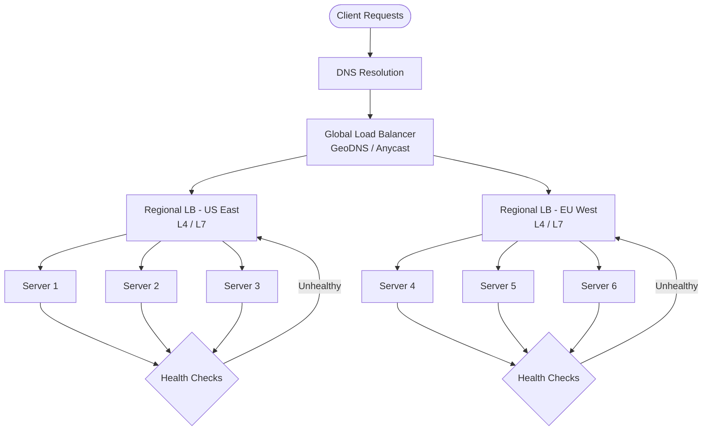

# 1.2 Load Balancing

> Load balancers are the traffic cops of distributed systems — every scalable architecture you draw in an interview will have at least one, and interviewers expect you to reason about algorithms, layers, and failure modes.

## Why This Matters

No production system serves traffic from a single server. The moment your design has more than one instance of anything — web servers, API servers, database replicas — you need a strategy to distribute traffic. Load balancers sit at the critical path of every request, and a misconfigured balancer can create hotspots, cascade failures, or session loss.

Interviewers test load balancing knowledge to assess whether you understand horizontal scaling. When you say "we'll add more servers," the immediate follow-up is "how does traffic get distributed?" If you cannot articulate L4 vs L7 trade-offs, or explain why consistent hashing matters for cache-heavy workloads, you signal a gap in production experience.

Companies like Google (Maglev), Facebook (Katran), and Netflix (Zuul/Eureka) have built custom load balancing solutions because the default off-the-shelf approaches do not scale to their traffic volumes. Understanding why they made those choices demonstrates depth.

## How It Works

### Load Balancing Architecture

### L4 (Transport Layer) vs L7 (Application Layer)

| Feature | L4 Load Balancer | L7 Load Balancer |
|---------|-----------------|-----------------|
| **Operates At** | TCP/UDP (IP + port) | HTTP/HTTPS (headers, URL, cookies) |
| **Decision Data** | Source IP, dest port | URL path, headers, body, cookies |
| **Performance** | Faster (no payload inspection) | Slower (must parse HTTP) |
| **SSL Termination** | Pass-through only | Can terminate and re-encrypt |
| **Content Routing** | Not possible | Route `/api/*` to API servers, `/static/*` to CDN |
| **Examples** | AWS NLB, HAProxy (TCP mode) | AWS ALB, Nginx, Envoy |
| **Best For** | High-throughput TCP (databases, gaming) | HTTP microservices, content-based routing |

### Load Balancing Algorithms

**Static Algorithms (no server state needed):**

| Algorithm | How It Works | Pros | Cons |
|-----------|-------------|------|------|
| **Round Robin** | Rotate sequentially through servers | Simple, even distribution | Ignores server load/capacity |
| **Weighted Round Robin** | Round robin with weights per server | Handles heterogeneous hardware | Weights need manual tuning |
| **IP Hash** | Hash client IP → deterministic server | Session affinity without cookies | Uneven distribution with NAT |

**Dynamic Algorithms (require server state):**

| Algorithm | How It Works | Pros | Cons |
|-----------|-------------|------|------|
| **Least Connections** | Route to server with fewest active connections | Adapts to slow requests | Needs real-time connection tracking |
| **Least Response Time** | Route to server with lowest latency | Optimal user experience | Higher monitoring overhead |
| **Consistent Hashing** | Hash key maps to ring of servers | Minimal redistribution on scale events | Complex implementation |

### Health Checks

Load balancers must detect unhealthy backends and stop routing traffic to them.

- **Active health checks:** LB periodically sends probe requests (HTTP GET /health, TCP connect). Configurable interval (5-30s), threshold (3 failures = unhealthy).
- **Passive health checks:** LB monitors live traffic responses. If a backend returns 5xx errors above a threshold, it is marked unhealthy.
- **Graceful degradation:** Backends should expose readiness vs liveness endpoints. A server can be alive but not ready to serve (e.g., warming cache).

### Sticky Sessions (Session Affinity)

When a client must consistently reach the same backend (shopping cart in server memory, WebSocket connections):

- **Cookie-based:** LB injects a cookie (`SERVERID=backend-3`) so subsequent requests route to the same server.
- **IP-based:** Hash the client IP. Breaks with NAT/proxies.
- **Trade-off:** Sticky sessions reduce the effectiveness of load balancing and complicate scaling. Prefer externalizing session state to Redis/Memcached.

## Key Concepts

| Concept | Description | When to Use |
|---------|-------------|-------------|
| **Horizontal Scaling** | Add more servers behind a load balancer | Default scaling strategy for stateless services |
| **SSL Termination** | LB decrypts HTTPS, forwards plain HTTP to backends | Offload CPU-intensive crypto from app servers |
| **Connection Draining** | Allow in-flight requests to complete before removing a server | During deployments, scale-down events |
| **Global Server Load Balancing (GSLB)** | DNS-based routing across regions | Multi-region active-active architectures |
| **Consistent Hashing** | Minimize key redistribution when servers are added/removed | Cache layers, sharded databases |

## Trade-offs

| Approach A | Approach B | Choose A When | Choose B When |
|-----------|-----------|---------------|---------------|
| L4 Load Balancer | L7 Load Balancer | Raw throughput, TCP protocols | Content-based routing, HTTP features needed |
| Round Robin | Least Connections | Uniform request cost, identical servers | Varying request duration, heterogeneous fleet |
| Sticky Sessions | Externalized State | Legacy apps, short migration window | New designs, need horizontal scale |
| Single LB | LB Pair (Active-Passive) | Dev/test, cost-sensitive | Production — LB is a SPOF otherwise |
| Hardware LB (F5) | Software LB (Nginx/Envoy) | Extreme throughput, regulatory requirements | Cost flexibility, cloud-native, rapid iteration |

## Interview Cheat Sheet

- **Always mention eliminating single points of failure** — use active-passive or active-active LB pairs
- L7 balancers can do **content-based routing** (path, header, cookie) — essential for microservices
- **Consistent hashing** is the go-to algorithm when discussing caching layers or sharded data stores
- **Health checks** should be mentioned whenever you add a load balancer — interviewers expect it
- **Connection draining** (graceful shutdown) should be part of your deployment story
- **SSL termination** at the LB reduces backend CPU load by 50-80% for HTTPS workloads
- Google's **Maglev** uses consistent hashing + ECMP for connection-level load balancing at massive scale
- Netflix uses **Zuul** (L7 gateway) + **Eureka** (service discovery) for internal microservice routing

## Common Interview Questions

1. What is the difference between L4 and L7 load balancing? When would you use each?
2. How would you ensure no single point of failure in your load balancing layer?
3. Explain consistent hashing and why it matters for distributed caches.
4. How do you handle session state with load balanced servers?
5. A new deployment causes 10% of requests to fail — how would you mitigate with your LB?
6. How would you load balance WebSocket connections differently than HTTP requests?

## Deep Dive: Consistent Hashing

Consistent hashing is the **most interview-relevant** load balancing concept because it bridges load balancing, caching, and database sharding.

**The problem:** With simple modular hashing (`hash(key) % N`), adding or removing a server remaps almost every key — catastrophic for caches.

**The solution:** Arrange servers on a virtual ring (0 to 2³²). Each key is hashed onto the ring and assigned to the next server clockwise. When a server is added or removed, only keys between it and its predecessor are remapped.

**Virtual nodes:** Each physical server gets multiple positions on the ring (100-200 virtual nodes) to ensure even distribution. Without virtual nodes, servers can own wildly different portions of the ring.

**Real-world usage:**
- **Amazon DynamoDB** uses consistent hashing for partition key placement across storage nodes.
- **Memcached** client libraries use consistent hashing to decide which shard holds a given cache key.
- **Cassandra** uses a variant (token ring) for data distribution across nodes in a cluster.

**What interviewers want to hear:** "Consistent hashing minimizes key redistribution during scale events from O(N) to O(K/N), where K is the number of keys and N is the number of servers."
