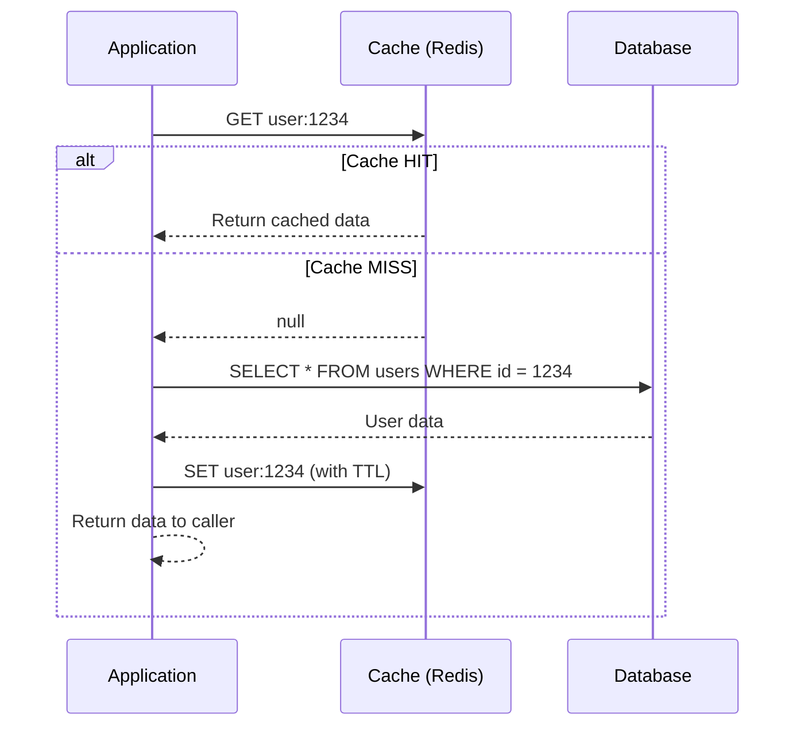
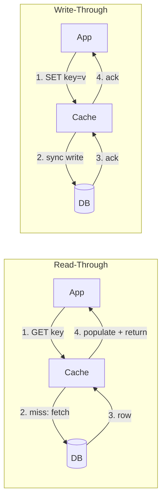

# 1.3 Caching

> Caching is the single most impactful performance optimization in system design — it turns O(disk) into O(memory) and can reduce database load by 90%+. Every design you propose in an interview should address caching.

## Why This Matters

When an interviewer asks you to design a system that serves millions of users, the database will be the bottleneck in your first-pass architecture. Caching is invariably the first optimization they expect you to propose. But it is not enough to just say "add Redis" — interviewers want to hear you reason about cache strategies, invalidation approaches, failure modes (thundering herd, cache stampede), and consistency trade-offs.

Facebook serves billions of requests per day from Memcached clusters. Twitter caches entire timelines. YouTube caches video metadata and CDN-served thumbnails. At scale, the cache layer handles 10-100x more read traffic than the database — making cache design as important as database design.

The hard part of caching is not reading from cache — it is deciding when and how to invalidate stale data. As Phil Karlton famously said: "There are only two hard things in Computer Science: cache invalidation and naming things." Interviewers know this and will probe your invalidation strategy.

## How It Works

### Cache-Aside (Lazy Loading) Pattern

This is the most common caching pattern and the one you should default to in interviews.

#### Read-Through vs Write-Through (side-by-side)

In **read-through**, the cache itself is responsible for fetching from the DB on miss — the application talks only to the cache. In **write-through**, every write goes through the cache synchronously so a subsequent read is guaranteed fresh.

Cache-aside (shown above) leaves the DB fetch to the app; read-through hides it inside the cache. Write-through keeps cache and DB consistent at write time, but doubles write latency (you wait for both).

### Caching Strategies Comparison

| Strategy | Write Path | Read Path | Consistency | Use Case |
|----------|-----------|-----------|-------------|----------|
| **Cache-Aside** | App writes to DB only | App checks cache → DB on miss → populate cache | Eventual (stale reads possible) | General purpose, read-heavy |
| **Write-Through** | App writes to cache → cache writes to DB synchronously | Always read from cache | Strong (cache always fresh) | Data you read immediately after writing |
| **Write-Back (Write-Behind)** | App writes to cache → cache async writes to DB | Always read from cache | Risky (data loss if cache crashes) | Write-heavy workloads (logging, analytics) |
| **Write-Around** | App writes directly to DB (cache not updated) | Cache-aside on read | Eventual (first read after write is slow) | Infrequently read data |

### Cache Eviction Policies

When cache memory is full, something must be evicted:

| Policy | How It Works | Best For | Weakness |
|--------|-------------|----------|----------|
| **LRU (Least Recently Used)** | Evict the item accessed longest ago | General purpose — most commonly used | Scan pollution (one-time reads fill cache) |
| **LFU (Least Frequently Used)** | Evict the item with fewest accesses | Workloads with stable hot set | Cold start — new items have low frequency |
| **FIFO (First In First Out)** | Evict the oldest inserted item | Simple, predictable | Ignores access patterns entirely |
| **Random** | Evict a random item | Surprising effective in many workloads | No guarantees |
| **TTL-based** | Items expire after a fixed duration | Time-sensitive data (sessions, tokens) | Popular items may expire unnecessarily |

### Redis vs Memcached

| Feature | Redis | Memcached |
|---------|-------|-----------|
| **Data Structures** | Strings, Lists, Sets, Sorted Sets, Hashes, Streams | Strings only |
| **Persistence** | RDB snapshots + AOF log | None (pure in-memory) |
| **Replication** | Master-replica with automatic failover (Sentinel/Cluster) | Client-side sharding only |
| **Pub/Sub** | Built-in | Not available |
| **Lua Scripting** | Yes (atomic operations) | No |
| **Max Value Size** | 512 MB | 1 MB |
| **Threading** | Single-threaded event loop (I/O threads in 6.0+) | Multi-threaded |
| **Best For** | Feature-rich caching, leaderboards, sessions, queues | Simple high-throughput key-value caching |

**Interview default:** Choose Redis unless you need pure simplicity at extreme scale — Memcached's multi-threaded model can outperform Redis for simple GET/SET at very high throughput.

## Key Concepts

| Concept | Description | When to Use |
|---------|-------------|-------------|
| **TTL (Time To Live)** | Automatic expiration of cache entries | Always — sets an upper bound on staleness |
| **Cache Warming** | Pre-populate cache before traffic hits | After deployments, new cache cluster spin-up |
| **Cache Stampede / Thundering Herd** | Many concurrent requests hit DB when a popular key expires | Any high-traffic key with TTL |
| **Distributed Cache** | Cache shared across multiple app servers | Stateless applications, microservices |
| **Local Cache (L1)** | In-process cache on each app server | Extremely hot data, reduce network hops |
| **Multi-tier Caching** | L1 (local) → L2 (distributed) → DB | Ultra-low latency for hot keys |

## Trade-offs

| Approach A | Approach B | Choose A When | Choose B When |
|-----------|-----------|---------------|---------------|
| Cache-Aside | Write-Through | Read-heavy, can tolerate stale reads | Need strong consistency on reads after writes |
| Redis | Memcached | Need data structures, persistence, pub/sub | Pure speed for simple key-value at massive scale |
| Short TTL (30s) | Long TTL (1h) | Data changes frequently, freshness matters | Data rarely changes, want fewer DB queries |
| Distributed Cache | Local Cache | Multiple app instances need shared state | Single instance or extremely latency-sensitive |
| Lazy Expiration | Active Expiration | Simple implementation | Must guarantee no stale data is served |

## Interview Cheat Sheet

- **Cache-aside is the default pattern** — mention it first, then discuss alternatives
- **Always set a TTL** — even if it is long. Without TTL, stale data lives forever
- **Cache stampede mitigation:** locking (only one request fetches from DB), probabilistic early expiration, or stale-while-revalidate
- **Cache invalidation strategies:** TTL-based (simplest), event-driven (DB change triggers cache delete), versioned keys
- **Cold cache problem:** After a deployment or cache restart, all traffic hits the DB. Mitigate with cache warming
- **Hotkey problem:** A single key getting millions of reads. Mitigate with local caching or key replication across shards
- Facebook's **TAO** system (graph cache) serves 99%+ of reads from cache, not the database
- Twitter caches **pre-computed timelines** in Redis for its 300M+ users (fan-out on write)
- **Caching is not free:** memory cost, consistency complexity, debugging difficulty (stale data bugs are hard to reproduce)

## Common Interview Questions

1. Explain the cache-aside pattern. What happens on a cache miss?
2. How would you handle a cache stampede when a popular key expires?
3. When would you choose write-through over cache-aside?
4. How do you keep the cache consistent with the database?
5. Compare Redis and Memcached — when would you pick each?
6. How would you cache the home timeline for a social media app?
7. What happens when your cache server goes down?

## Deep Dive: Cache Stampede and Mitigation

The **cache stampede** (also called thundering herd) is the most dangerous caching failure mode and a favorite interview topic.

**The scenario:** A heavily accessed cache key expires. Simultaneously, thousands of requests arrive, all see a cache miss, and all hit the database with the same expensive query. The database gets overwhelmed, response times spike, and potentially the entire system cascades into failure.

**Mitigation strategies (from simplest to most robust):**

1. **Locking (Mutex):** The first request to see a cache miss acquires a distributed lock, fetches from DB, and populates cache. All other requests wait or return a stale version. Redis `SET key value NX EX 5` acts as a simple distributed lock.

2. **Probabilistic Early Expiration:** Each request has a small probability of refreshing the cache *before* TTL expires. As TTL approaches, the probability increases. This spreads the refresh load over time instead of concentrating it at expiration. The formula: `currentTime - (timeToCompute * beta * ln(random())) > expiry`.

3. **Stale-While-Revalidate:** Serve the stale cached value immediately while asynchronously refreshing in the background. The client gets a fast (slightly stale) response, and the cache is updated for subsequent requests.

4. **External Refresh (Background Worker):** A dedicated worker process refreshes popular cache keys before they expire. The cache TTL is set very high, and the worker handles freshness. This completely decouples read traffic from cache misses.

**What to say in an interview:** "For high-traffic keys, I would use a locking mechanism with a fallback to stale data. The first request acquires a lock and refreshes the cache, while concurrent requests receive the slightly stale previous value. This prevents database overload while keeping latency low."

---

## First-time Recognition Signals

When you read a brand-new system design prompt, this building block is the right tool if you see:

- **"Read-heavy workload, read:write ratio of 10:1 or higher"** — the database is about to be the bottleneck; cache the hot read path.
- **"Reduce p99 latency to < 100 ms"** with data that is reused across requests — Redis/Memcached lookups are 1-5 ms vs 10-50 ms for a hot SQL query.
- **"Trending / hot keys / celebrity post / viral content"** — a few items get most of the reads; cache them aggressively (and worry about hot-key stampede).
- **"Stale-by-N-seconds is acceptable"** — the prompt explicitly tolerates eventual freshness, opening cache-aside or TTL-based caching.
- **"Same expensive computation repeated for many users"** — feed ranking, leaderboards, search suggestions — cache the *result*, not just the inputs.

### Anti-signals (looks like this building block, isn't)

- **"Strong consistency on every read, no stale data ever"** — caching introduces a stale window; either skip it or use write-through with care, and never claim caching is "free" here.
- **"Write-heavy / unique-per-request data"** (e.g., raw analytics events) — cache hit rate will be near zero; you'd just be adding a layer.
- **"Secrets / PII that must not live in shared memory across tenants"** — caches are tempting but scoping and encryption complicate things; consider per-tenant in-process caches or skip.

---

### Intuition

A cache is a sticky note on your desk — everything you've looked up recently is right there instead of buried in the filing cabinet. The trick is two-fold: knowing *what* to write down (read-heavy keys with reuse) and *when to cross things out* (invalidation). When a hot sticky note gets ripped off at exactly the wrong moment — say, the lunch rush — every clerk runs to the filing cabinet at once. That's the cache stampede, and it can topple the whole office.

### Worked Example: Stampede math at 1M QPS hot key, 60 s TTL

A celebrity profile is fetched **1,000,000 times/sec**. Cache TTL = 60 s. The underlying DB query takes 50 ms.

**Baseline (no protection):** when the key expires, in the next 50 ms (the DB compute window), `1,000,000 × 0.05 = 50,000` concurrent requests all miss and stampede the DB. The DB is probably sized for ~10k QPS — so it dies, and the cascade begins.

**Mitigation 1 — Mutex lock.** Only one request fetches; others wait or serve stale. DB load drops to *exactly one query per expiry* = **1/60 ≈ 0.017 QPS**. But waiters either block (p99 spikes to 50 ms) or return stale.

**Mitigation 2 — Probabilistic early expiration (XFetch).** Each request refreshes with probability `exp(-β × delta_remaining / compute_time)`. As TTL nears expiry, probability climbs. With β=1, compute=50 ms, refreshes spread over the last ~1 s of TTL.

| Strategy | Peak DB QPS on a hot-key expiry | p99 latency on miss | Complexity |
|---|---|---|---|
| None | 50,000 | 50 ms (everyone hits DB) | trivial |
| Mutex (single-flight) | 1 | 50 ms (everyone waits) or stale | medium |
| XFetch (probabilistic) | ~50 (spread over 1 s) | unchanged ~5 ms | low |

**Surprise:** XFetch gives near-optimal protection *without* the latency cliff of locking — but only if your refresh function is idempotent. For very large fan-out, combine both: XFetch + a single-flight lock at the application. **Lesson:** for any key whose `QPS × compute_ms > DB_capacity_QPS`, you need explicit stampede protection — TTL alone is a loaded gun.

### Further Reading

- Nishtala et al., *Scaling Memcache at Facebook* (NSDI '13) — lease-based stampede prevention and gutter pools at planetary scale.
- Alex Xu, *System Design Interview vol. 1*, ch. 5 — cache layer & invalidation patterns.
- DDIA ch. 1 — reliability, scalability, maintainability fundamentals.
- [Discord Engineering — How Discord Stores Trillions of Messages](https://discord.com/blog/how-discord-stores-trillions-of-messages) — what happens when the cache + DB choice meets billions of hot reads.
- Vattani et al., *Optimal Probabilistic Cache Stampede Prevention* (VLDB '15) — the XFetch paper.

