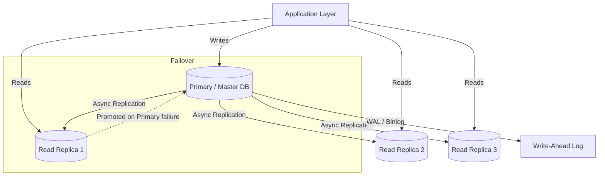

# 1.4 Databases — SQL (Relational)

> Relational databases are the workhorse of production systems — understanding ACID guarantees, indexing strategies, and replication patterns is non-negotiable for any system design interview.

## Why This Matters

Most interview problems involve data that has relationships: users have orders, orders contain items, items belong to categories. SQL databases model these relationships naturally with foreign keys, joins, and constraints. Even when a candidate ultimately chooses a NoSQL solution, interviewers expect them to first consider SQL and articulate why it does or does not fit.

Understanding *how* a relational database works under the hood — B-tree indexes, query planners, write-ahead logs, MVCC — separates candidates who can design correct systems from those who can design *performant* systems. An index can turn a 5-second query into a 5-millisecond query. A missing index on a growing table is one of the most common production incidents, and explaining why demonstrates operational maturity.

Scaling SQL databases is the point where most system designs get interesting. Single-leader replication, read replicas, connection pooling, and sharding are all strategies interviewers expect you to discuss fluently. Companies like Shopify (MySQL), Instagram (PostgreSQL), and Stripe (PostgreSQL) have scaled SQL to hundreds of millions of rows — proving it is viable at massive scale when done correctly.

## How It Works

### Master-Replica Replication

**Key points:**
- **All writes go to the primary.** Replicas are read-only copies.
- **Replication lag** is the delay between a write on the primary and its visibility on replicas. Can range from milliseconds to seconds.
- **Read-after-write consistency:** If a user writes data and immediately reads, they might hit a replica that has not received the write yet. Solution: route reads-after-writes to the primary for a short window.

### ACID Properties

| Property | Meaning | Why It Matters |
|----------|---------|----------------|
| **Atomicity** | A transaction either fully completes or fully rolls back | No partial updates — money does not disappear mid-transfer |
| **Consistency** | DB transitions from one valid state to another | Constraints (FK, unique, check) are always enforced |
| **Isolation** | Concurrent transactions do not interfere with each other | Prevents dirty reads, phantom reads, lost updates |
| **Durability** | Committed transactions survive crashes | Write-ahead log ensures data is not lost on power failure |

### Isolation Levels

| Level | Dirty Read | Non-Repeatable Read | Phantom Read | Performance |
|-------|-----------|-------------------|-------------|-------------|
| **Read Uncommitted** | Possible | Possible | Possible | Fastest |
| **Read Committed** | Prevented | Possible | Possible | Default in PostgreSQL |
| **Repeatable Read** | Prevented | Prevented | Possible | Default in MySQL InnoDB |
| **Serializable** | Prevented | Prevented | Prevented | Slowest |

### Indexing Strategies

| Index Type | Structure | Best For | Limitation |
|-----------|-----------|----------|------------|
| **B-Tree** | Balanced tree, O(log n) lookup | Range queries, sorting, equality | Slower writes (tree rebalancing) |
| **Hash Index** | Hash table, O(1) lookup | Exact equality lookups | No range queries, no sorting |
| **Composite Index** | B-tree on multiple columns | Multi-column queries (leftmost prefix rule) | Order matters — (a, b) helps WHERE a=1, not WHERE b=2 |
| **Covering Index** | Index includes all queried columns | Avoiding table lookups entirely | Larger index size, more write overhead |
| **Partial Index** | Index on a filtered subset of rows | Sparse queries (WHERE status = 'active') | Only helps the filtered condition |

**The leftmost prefix rule** is critical for composite indexes and frequently tested: an index on `(country, city, zip)` supports queries filtering on `(country)`, `(country, city)`, or `(country, city, zip)` — but **not** `(city)` alone.

### Normalization vs Denormalization

| Normalization | Denormalization |
|--------------|----------------|
| Eliminate data redundancy | Intentionally duplicate data |
| Multiple tables with joins | Fewer tables, embedded data |
| Write-optimized (single update point) | Read-optimized (avoid joins) |
| Strong consistency | Possible inconsistency across copies |
| Use in OLTP (transactional) systems | Use in OLAP (analytical) or read-heavy systems |

## Key Concepts

| Concept | Description | When to Use |
|---------|-------------|-------------|
| **Connection Pooling** | Pre-opened DB connections shared across requests (PgBouncer, HikariCP) | Always — opening a new connection per request is extremely expensive |
| **Query Optimizer** | DB engine chooses the execution plan (seq scan vs index scan vs nested loop join) | Understand EXPLAIN plans to debug slow queries |
| **Write-Ahead Log (WAL)** | Append-only log written before data files; enables crash recovery | Built into all RDBMS — key for durability and replication |
| **MVCC** | Multi-Version Concurrency Control — readers don't block writers | PostgreSQL, MySQL InnoDB — enables high concurrency |
| **Sharding** | Partition data across multiple DB instances by a shard key | When single-node DB cannot handle write volume or data size |
| **Read Replicas** | Copies of the primary that serve read queries | Read-heavy workloads (90% reads / 10% writes) |

## Trade-offs

| Approach A | Approach B | Choose A When | Choose B When |
|-----------|-----------|---------------|---------------|
| Single Primary | Multi-Primary | Simplicity, strong consistency | Write scalability across regions (with conflict resolution) |
| Vertical Scaling (bigger machine) | Horizontal Sharding | Data fits on one node, simpler ops | Data exceeds single-node capacity |
| Normalized Schema | Denormalized Schema | Write-heavy, data integrity critical | Read-heavy, need to eliminate joins |
| Synchronous Replication | Asynchronous Replication | Zero data loss required (financial) | Lower latency writes, tolerate lag |
| PostgreSQL | MySQL | JSON support, complex queries, extensions | Simpler replication, ecosystem familiarity |

## Interview Cheat Sheet

- **Default to PostgreSQL** in interviews — it covers more use cases than MySQL and interviewers respect it
- **Always mention indexing** when discussing query performance — it is the #1 optimization
- **Connection pooling** (PgBouncer, HikariCP) is mandatory in production — each raw connection costs ~10 MB of memory
- **Read replicas** are the first scaling step for read-heavy workloads (serve ~80% of reads from replicas)
- **Sharding** is the nuclear option — prefer read replicas, caching, and query optimization first
- **EXPLAIN ANALYZE** is how you debug slow queries — mention it to show operational awareness
- Instagram runs on **PostgreSQL** with thousands of shards managed by their custom sharding layer (pgPartman, Vitess-like)
- Shopify runs on **MySQL** with Vitess for horizontal sharding across tens of thousands of shards
- **Replication lag** is a real problem — design your reads to tolerate a few seconds of staleness or route critical reads to the primary

## Common Interview Questions

1. Explain ACID properties. Why does each one matter?
2. How would you scale a SQL database handling 50,000 writes per second?
3. What index would you add to optimize `SELECT * FROM orders WHERE user_id = ? AND status = 'active' ORDER BY created_at DESC`?
4. When would you denormalize a schema? What are the risks?
5. How do read replicas work? What is replication lag and how do you handle it?
6. Compare vertical scaling vs sharding for a growing database.

## Deep Dive: Database Sharding

Sharding is the strategy of splitting a large database into smaller, independently managed pieces (shards) that can live on different machines.

**When to shard:** When a single database instance cannot handle the write throughput, storage volume, or connection count — and you have already exhausted vertical scaling, read replicas, caching, and query optimization.

**Shard key selection** is the most critical decision:
- **Choose a key with high cardinality** (e.g., user_id). Low cardinality keys (e.g., country) create unbalanced shards.
- **Choose a key that matches your primary access pattern.** If 90% of queries filter by user_id, shard by user_id.
- **Avoid shard keys that create hotspots.** A celebrity user generating 100x the traffic causes one shard to overload.

**Cross-shard queries** are the biggest operational pain. A query like `SELECT * FROM orders WHERE product_id = 123` requires querying all shards if you sharded by user_id. This is why denormalization and data duplication become necessary in sharded systems.

**Resharding** (adding or removing shards) is extremely painful. Consistent hashing or range-based partitioning with automatic splitting (like CockroachDB or Vitess) can reduce the pain, but it is never free.

**What to say in an interview:** "I would shard by user_id using consistent hashing so that adding new shards only redistributes a fraction of the data. For queries that cross shards, I would denormalize the data or use an async materialized view that aggregates cross-shard data."
