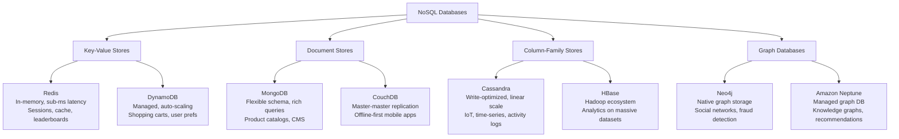

# 1.5 Databases — NoSQL

> NoSQL databases trade relational guarantees for horizontal scalability and schema flexibility — knowing when to choose each type and understanding the CAP theorem trade-offs is what separates a good system design answer from a great one.

## Why This Matters

Not every data model fits neatly into rows and columns. User sessions, social graphs, product catalogs, IoT sensor streams, and time-series metrics all have access patterns that relational databases handle awkwardly or inefficiently. NoSQL databases are purpose-built for specific access patterns, and choosing the right one can mean the difference between a 5ms response and a 500ms response.

Interviewers use NoSQL questions to test two things: (1) can you identify when relational is the wrong fit, and (2) can you reason about consistency vs availability trade-offs using the CAP theorem. A candidate who says "I would use MongoDB because it's web scale" without discussing document access patterns, consistency needs, or query requirements signals shallow understanding.

Companies like Amazon (DynamoDB for shopping cart), Facebook (Cassandra for inbox search), Uber (Cassandra for trip data), and Netflix (Cassandra for user activity) chose NoSQL after careful analysis of their access patterns. Understanding their reasoning demonstrates production-level thinking.

## How It Works

### NoSQL Database Types

### Detailed Comparison

| Type | Data Model | Query Pattern | Scaling | Consistency | Best For |
|------|-----------|--------------|---------|-------------|----------|
| **Key-Value** | Simple key → value blob | GET/PUT by key only | Horizontal (sharding by key) | Tunable (AP or CP) | Caching, sessions, feature flags |
| **Document** | JSON/BSON documents with nested fields | Rich queries on document fields | Horizontal (sharding) | Tunable | Product catalogs, user profiles, CMS |
| **Column-Family** | Rows with dynamic columns, grouped by family | Wide-row scans, write-heavy | Linear horizontal | Tunable (eventual by default) | Time-series, IoT, activity feeds |
| **Graph** | Nodes + edges + properties | Traversals (friends of friends, shortest path) | Limited horizontal | Usually CP | Social networks, fraud detection, knowledge graphs |

### CAP Theorem

The CAP theorem states that in the presence of a **network partition**, a distributed system must choose between **Consistency** and **Availability**:

| Term | Meaning |
|------|---------|
| **Consistency (C)** | Every read returns the most recent write or an error |
| **Availability (A)** | Every request receives a response (not necessarily the latest data) |
| **Partition Tolerance (P)** | System continues operating despite network failures between nodes |

**Network partitions will happen** in any distributed system — so the real choice is C or A:

| System | CAP Choice | Behavior During Partition |
|--------|-----------|--------------------------|
| **MySQL, PostgreSQL** | CP | Rejects writes to maintain consistency |
| **Cassandra, DynamoDB** | AP (default) | Accepts writes, resolves conflicts later |
| **MongoDB** | CP | Primary elections; reads blocked during failover |
| **Redis Cluster** | CP | Minority partition becomes read-only |
| **CockroachDB** | CP | Uses Raft consensus, blocks on minority partition |

**PACELC extension:** Even when there is no partition (E for "else"), there is a trade-off between Latency and Consistency. Cassandra chooses low latency (AP/EL). CockroachDB chooses consistency (CP/EC).

### When to Choose Each NoSQL Type

| Scenario | Choose | Reasoning |
|----------|--------|-----------|
| Caching layer, session store | **Redis** (Key-Value) | Sub-ms latency, TTL support, data structures |
| Shopping cart, user preferences | **DynamoDB** (Key-Value) | Single-digit ms at any scale, managed |
| Product catalog with varying attributes | **MongoDB** (Document) | Flexible schema, rich queries on nested fields |
| IoT sensor data, time-series logs | **Cassandra** (Column-Family) | Write-optimized, linear scale, time-based partitioning |
| Social network connections | **Neo4j** (Graph) | Multi-hop traversals are O(1) per hop, not O(n) joins |
| Real-time analytics dashboard | **Cassandra + Redis** | Cassandra for storage, Redis for pre-computed aggregates |

## Key Concepts

| Concept | Description | When to Use |
|---------|-------------|-------------|
| **Eventual Consistency** | Reads may return stale data; all replicas converge over time | AP systems (Cassandra, DynamoDB) — acceptable for user feeds, analytics |
| **Quorum Reads/Writes** | R + W > N ensures consistency (R=read replicas, W=write replicas, N=total) | Tunable consistency in Cassandra/DynamoDB |
| **Partition Key** | Determines which shard/node stores the data | Must match primary access pattern to avoid scatter-gather |
| **Sort Key** | Orders data within a partition | Enables range queries within a partition (DynamoDB) |
| **LSM Tree** | Log-Structured Merge Tree — write-optimized storage engine | Cassandra, HBase, RocksDB — fast writes, compaction overhead |
| **Vector Clocks** | Tracks causal ordering of events for conflict resolution | DynamoDB conflict detection |

## Trade-offs

| Approach A | Approach B | Choose A When | Choose B When |
|-----------|-----------|---------------|---------------|
| SQL (PostgreSQL) | NoSQL (MongoDB) | Complex queries, joins, ACID needed | Flexible schema, horizontal scale, document access |
| DynamoDB | Cassandra | Fully managed, AWS-native, simple ops | Multi-cloud, need more query flexibility, cost control |
| MongoDB | Cassandra | Rich queries, secondary indexes, aggregation pipeline | Write-heavy, time-series, multi-DC replication |
| Strong Consistency | Eventual Consistency | Financial transactions, inventory counts | Social feeds, analytics, recommendations |
| Embedded Documents | References (normalized) | Data accessed together, 1:few relationship | Data changes independently, 1:many relationship |

## Interview Cheat Sheet

- **Do not default to NoSQL** — start with SQL and articulate why it does not fit before switching
- **CAP is a partition-time choice** — in normal operation, you get all three. The question is what you sacrifice during network failures
- **DynamoDB** requires you to **design your access patterns first** — you cannot add indexes after the fact without creating a new table
- **Cassandra** is optimized for **writes** (LSM tree, append-only). Reads are slower due to compaction and merging SSTables
- **MongoDB** supports **multi-document ACID transactions** since version 4.0 — it is not "schemaless chaos" anymore
- **Graph databases** shine when relationships are the primary query target — calculating "friends of friends" is O(1) per hop vs O(n²) in SQL
- Amazon chose DynamoDB for the shopping cart because it needs **always-available writes** — it is okay if the cart temporarily shows stale data (AP choice)
- **Partition key design** is the #1 factor in NoSQL performance — a bad partition key creates hotspots

## Common Interview Questions

1. When would you choose NoSQL over SQL? Give specific scenarios.
2. Explain the CAP theorem. What does "partition tolerance" actually mean?
3. Compare DynamoDB and Cassandra — when would you choose each?
4. How does eventual consistency work? When is it acceptable?
5. Design the data model for a social media activity feed using Cassandra.
6. When would you use a graph database instead of a relational database?
7. How would you model a product catalog with varying attributes per category?

## Deep Dive: Data Modeling in DynamoDB

DynamoDB is the **most commonly referenced NoSQL database in system design interviews** because it forces you to think about access patterns upfront.

**The fundamental rule:** In DynamoDB, you design your table around your queries, not around your entities. There are no joins, no flexible queries — you get exactly the access patterns you design for.

**Single-table design:** Advanced DynamoDB usage puts multiple entity types in a single table using partition key and sort key overloading:

| PK | SK | Attributes |
|----|-----|-----------|
| USER#alice | PROFILE | name, email, created_at |
| USER#alice | ORDER#2024-001 | total, status, items |
| USER#alice | ORDER#2024-002 | total, status, items |
| ORDER#2024-001 | ITEM#widget-1 | quantity, price |

This enables:
- **Get user profile:** PK = `USER#alice`, SK = `PROFILE`
- **List user orders:** PK = `USER#alice`, SK begins_with `ORDER#`
- **Get order items:** PK = `ORDER#2024-001`, SK begins_with `ITEM#`

**Global Secondary Index (GSI):** Enables alternate query patterns by projecting data with a different key structure. For example, a GSI with `PK = status` and `SK = created_at` lets you query all orders by status sorted by date — something the base table cannot do.

**What to say in an interview:** "I would use DynamoDB with a single-table design. My partition key is user_id, and my sort key encodes the entity type and timestamp. This gives me O(1) access to a user's data and efficient range queries within a partition. For cross-partition queries like 'all orders by status,' I would create a GSI."
