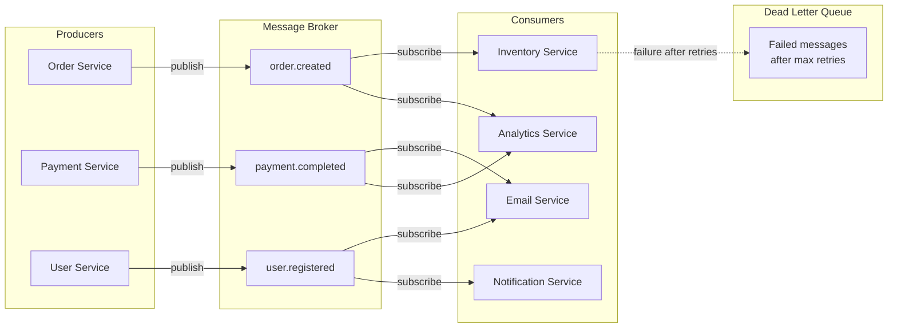

# 1.6 Message Queues & Event-Driven Architecture

> Message queues decouple producers from consumers, absorb traffic spikes, and enable asynchronous processing — they are the backbone of every scalable microservice architecture you will design in an interview.

## Why This Matters

Synchronous request-response works until it does not. When your system needs to send emails after signup, process video uploads, aggregate analytics events, or coordinate between microservices, tightly coupling these operations to the request path creates fragile, slow systems. Message queues introduce a buffer between components that independently produce and consume work.

Interviewers frequently ask "how would you handle this asynchronously?" and expect you to propose a queue. But they also probe deeper: What happens if the consumer crashes mid-processing? How do you guarantee exactly-once delivery? How do you handle message ordering? These failure mode questions separate mid-level from senior candidates.

LinkedIn built Kafka to handle 7 trillion messages per day for activity tracking, metrics, and data pipeline integration. Uber uses Kafka and custom queuing to coordinate millions of concurrent ride requests. Netflix uses a combination of SQS and custom event buses for microservice choreography. Understanding these patterns gives you a vocabulary to discuss real-world architecture.

## How It Works

### Event-Driven Architecture Flow

### Point-to-Point vs Pub/Sub

| Pattern | How It Works | Use Case |
|---------|-------------|----------|
| **Point-to-Point (Queue)** | One message → one consumer. Message removed after processing. | Task distribution (process this image, send this email) |
| **Pub/Sub (Topic)** | One message → multiple subscribers. Each gets a copy. | Event broadcasting (order.created triggers inventory, email, analytics) |

### Kafka vs RabbitMQ

| Feature | Apache Kafka | RabbitMQ |
|---------|-------------|----------|
| **Model** | Distributed log (append-only) | Traditional message broker |
| **Message Retention** | Retained for configured duration (days/weeks) | Deleted after consumer ACK |
| **Ordering** | Guaranteed within a partition | Guaranteed within a queue |
| **Throughput** | Millions of messages/sec per cluster | Tens of thousands/sec per queue |
| **Consumer Model** | Pull-based (consumers poll) | Push-based (broker delivers) |
| **Replay** | Consumers can re-read from any offset | Not possible after ACK |
| **Delivery Guarantee** | At-least-once (exactly-once with Kafka Streams) | At-most-once or at-least-once |
| **Protocol** | Custom binary protocol | AMQP, MQTT, STOMP |
| **Best For** | Event streaming, log aggregation, data pipelines | Task queues, RPC, routing logic |

**Interview rule of thumb:** Use **Kafka** when you need event streaming, replay, and high throughput (activity logs, metrics, change data capture). Use **RabbitMQ/SQS** when you need simple task queues with routing and message acknowledgment.

### Consumer Groups

Consumer groups enable parallel consumption while maintaining ordering guarantees:

- Messages in a **partition** are processed by exactly one consumer in the group.
- Adding more consumers (up to the partition count) increases parallelism.
- If a consumer dies, its partitions are rebalanced to surviving consumers.

| Scenario | Partitions | Consumers | Result |
|----------|-----------|-----------|--------|
| Under-provisioned | 8 | 3 | Some consumers handle 3 partitions, others 2 |
| Balanced | 8 | 8 | Each consumer handles exactly 1 partition |
| Over-provisioned | 8 | 12 | 4 consumers sit idle (wasted resources) |

### Delivery Guarantees

| Guarantee | How It Works | Trade-off |
|-----------|-------------|-----------|
| **At-most-once** | Fire and forget; no retry on failure | Fastest; messages may be lost |
| **At-least-once** | Retry until ACK received; may produce duplicates | Safe; consumers must be idempotent |
| **Exactly-once** | Transactional produce + consume + commit in one atomic operation | Slowest; limited to Kafka Streams / specific frameworks |

**At-least-once + idempotent consumers** is the standard production approach. Design consumers to handle duplicate messages safely (use idempotency keys, upsert instead of insert).

## Key Concepts

| Concept | Description | When to Use |
|---------|-------------|-------------|
| **Dead Letter Queue (DLQ)** | Queue for messages that fail processing after max retries | Always — prevents poison messages from blocking the queue |
| **Backpressure** | Slow consumers cause message buildup; broker applies flow control | Prevent OOM; use rate limiting or consumer scaling |
| **Idempotency** | Processing a message multiple times produces the same result | Always with at-least-once delivery |
| **Message Ordering** | Kafka guarantees order within a partition (not across partitions) | Use partition key to group related messages |
| **Offset Management** | Consumers track their progress through a Kafka topic | Manual commit for at-least-once; auto-commit for at-most-once |
| **Saga Pattern** | Sequence of local transactions coordinated by messages | Distributed transactions across microservices |

## Trade-offs

| Approach A | Approach B | Choose A When | Choose B When |
|-----------|-----------|---------------|---------------|
| Synchronous API call | Async via message queue | Requires immediate response to caller | Can process in background, need decoupling |
| Kafka | RabbitMQ / SQS | Event streaming, replay, high throughput | Simple task queues, complex routing, lower ops burden |
| Exactly-once | At-least-once + idempotency | Using Kafka Streams ecosystem end-to-end | Cross-system boundaries, simpler implementation |
| Choreography (events) | Orchestration (central coordinator) | Loosely coupled services, each reacts independently | Complex multi-step workflows needing visibility |
| Single topic | Multiple topics | Related events consumed together | Independent event types with separate consumers |

## Interview Cheat Sheet

- **Queues decouple services** — producer does not know or care about consumers. This is the key interview talking point
- **At-least-once + idempotent consumers** is the real-world default. Do not claim exactly-once unless using Kafka transactions end-to-end
- **Dead Letter Queues** must be part of every queue design — mention them proactively
- **Kafka partitions = parallelism unit.** You cannot have more effective consumers than partitions
- **Message ordering** is only guaranteed within a Kafka partition — use a partition key (e.g., user_id) to keep related events ordered
- **Backpressure** is critical for preventing cascading failures — if consumers fall behind, messages pile up and cause OOM
- LinkedIn processes **7 trillion messages per day** through Kafka for activity tracking and metrics
- Uber uses **Kafka** for trip event streaming and **Cherami** (custom queue) for task processing
- **Saga pattern:** When you need a distributed transaction across services, choreograph it through events. Each service publishes success/failure events, and compensating actions undo prior steps on failure

## Common Interview Questions

1. When would you introduce a message queue into your architecture?
2. Compare Kafka and RabbitMQ — when would you choose each?
3. How do you guarantee that a message is processed exactly once?
4. What happens if a consumer crashes while processing a message?
5. Design an event-driven order processing system with inventory, payment, and notification services.
6. How do you handle message ordering across multiple consumers?
7. What is a dead letter queue and why is it important?

## Deep Dive: The Saga Pattern

The **Saga pattern** is how you handle distributed transactions across microservices — and it is a guaranteed interview topic for any e-commerce or payment system design.

**The problem:** You cannot use a single database transaction across multiple services (Order, Payment, Inventory, Shipping). If Payment succeeds but Inventory fails, you need to undo the payment.

**Choreography-based saga:** Each service listens for events and publishes its own:
1. Order Service publishes `order.created`
2. Inventory Service reserves stock, publishes `inventory.reserved`
3. Payment Service charges card, publishes `payment.completed`
4. Shipping Service creates shipment, publishes `shipment.created`

If **Payment fails**, it publishes `payment.failed` → Inventory compensates by releasing reserved stock → Order is marked as failed.

**Orchestration-based saga:** A central Saga Orchestrator tells each service what to do and handles compensation:
1. Orchestrator calls Inventory: "Reserve stock"
2. Orchestrator calls Payment: "Charge card"
3. If Payment fails, Orchestrator calls Inventory: "Release stock"

| Approach | Pros | Cons |
|----------|------|------|
| **Choreography** | Loosely coupled, no central coordinator | Hard to track overall flow, debugging is painful |
| **Orchestration** | Clear flow visibility, easier debugging | Single point of failure, tighter coupling |

**What to say in an interview:** "For an order processing workflow spanning multiple services, I would use the Saga pattern. I would start with choreography — each service publishes domain events and reacts to others. For complex flows with many steps, I would introduce an orchestrator for better observability. Each step has a compensating action that runs on failure to maintain eventual consistency."
