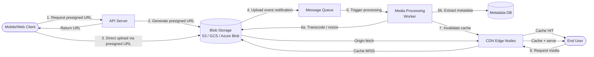

# 1.7 Blob Storage & CDN

> Every system that handles images, videos, or files needs blob storage for persistence and a CDN for delivery — mastering the upload-process-store-serve pipeline is essential for media-heavy system designs like Instagram, YouTube, or Dropbox.

## Why This Matters

When an interviewer asks you to design Instagram, YouTube, or a file-sharing service, the core technical challenge is not the social features — it is the media pipeline. How do you handle a 4K video upload from a mobile client on a spotty connection? How do you serve 100 million image thumbnails per second? How do you ensure a user in Tokyo gets their content as fast as a user in New York?

Blob (Binary Large Object) storage like S3 is the foundation — it provides durable, scalable, cost-effective storage for unstructured data. But storage alone is not enough. A CDN (Content Delivery Network) caches content at edge locations worldwide, reducing latency from 200ms to under 20ms for cached content. Together, they form the backbone of every media-serving architecture.

Netflix serves over 15 billion hours of video per year using a custom CDN (Open Connect) with edge servers placed directly inside ISP networks. Cloudflare processes over 57 million HTTP requests per second across its global edge network. Understanding how these systems work gives you the vocabulary to design any media-heavy service.

## How It Works

### Media Upload Pipeline



**Why presigned URLs?** They allow the client to upload directly to blob storage, bypassing your API servers entirely. This avoids your servers becoming a bottleneck for large file transfers and reduces bandwidth costs. The presigned URL is time-limited (5-15 minutes) and can restrict file size and content type.

### Blob Storage Concepts

| Concept | Description | Example |
|---------|-------------|---------|
| **Bucket / Container** | Top-level namespace for objects | `prod-user-uploads`, `staging-thumbnails` |
| **Object Key** | Unique identifier within a bucket (can include path-like prefixes) | `users/123/avatar/2024-01-15.jpg` |
| **Metadata** | Key-value pairs attached to an object | Content-Type, upload timestamp, user ID |
| **Versioning** | Keep multiple versions of the same object | Enable for critical data, compliance requirements |
| **Lifecycle Policies** | Automatically transition or delete objects based on age | Move to cold storage after 30 days, delete after 1 year |

### Storage Tiers

| Tier | Access Frequency | Retrieval Latency | Cost (relative) | Use Case |
|------|-----------------|-------------------|-----------------|----------|
| **Standard (Hot)** | Frequently accessed | Milliseconds | $$$ | Active user content, thumbnails |
| **Infrequent Access** | Once per month | Milliseconds | $$ | Backup, older content |
| **Archive / Glacier** | Once per year | Minutes to hours | $ | Compliance, rarely accessed logs |

### CDN: Push vs Pull

| Type | How It Works | Pros | Cons |
|------|-------------|------|------|
| **Pull CDN** | CDN fetches from origin on first request, then caches | Self-managing, less storage cost at edge | First request per edge is slow (cache miss) |
| **Push CDN** | You upload content directly to CDN edge nodes | Instant availability, no cold-cache penalty | You manage what is cached, higher storage cost |

**Interview default:** Pull CDN is the standard. Push CDN is used for viral/predictable content (a new Netflix show that will be watched by millions on release day).

### CDN Cache Invalidation

| Strategy | How It Works | When to Use |
|----------|-------------|-------------|
| **TTL (Time To Live)** | Content expires after a fixed duration | Default approach — set appropriate TTL per content type |
| **Cache Busting (Versioned URLs)** | `/image-v2.jpg` or `/image.jpg?v=abc123` | Immutable deployments, static assets with hash filenames |
| **Purge API** | Explicitly delete content from CDN edge cache | Emergency fixes, content removal (DMCA, privacy) |
| **Stale-While-Revalidate** | Serve stale content while fetching fresh copy in background | High-traffic content that changes periodically |

**Best practice:** Use **content-addressable URLs** where the filename includes a hash of the content (e.g., `avatar-a3f8b2c1.jpg`). Content is immutable — when it changes, the URL changes. Set an extremely long TTL (1 year) since the URL itself guarantees freshness.

## Key Concepts

| Concept | Description | When to Use |
|---------|-------------|-------------|
| **Presigned URLs** | Time-limited URLs granting temporary upload/download access without exposing credentials | File uploads from clients, temporary download links |
| **Multipart Upload** | Split large files into chunks; upload in parallel; reassemble server-side | Files larger than 100 MB — enables resumable uploads |
| **Cross-Origin Resource Sharing (CORS)** | Configure blob storage to accept requests from your web domain | Browser-based direct uploads |
| **Server-Side Encryption (SSE)** | Encrypt objects at rest automatically | Always-on for production workloads |
| **Origin Shield** | CDN intermediary cache between edge and origin to reduce origin load | High-traffic origins, reducing S3 request costs |
| **Edge Computing** | Run logic at CDN edge (Cloudflare Workers, Lambda@Edge) | Image resizing, A/B testing, header manipulation |

## Trade-offs

| Approach A | Approach B | Choose A When | Choose B When |
|-----------|-----------|---------------|---------------|
| Presigned URL (direct upload) | Proxy through API server | Large files, reducing server load | Need server-side validation, small files |
| Pull CDN | Push CDN | General web content, dynamic traffic patterns | Predictable viral content, instant global availability |
| Long CDN TTL + cache busting | Short CDN TTL | Static assets, content-addressed URLs | Dynamic content that changes frequently |
| Single storage region | Multi-region replication | Cost-sensitive, single-region users | Global users, disaster recovery requirements |
| Process synchronously | Process asynchronously via queue | Simple transformations, low volume | Video transcoding, thumbnail generation, high volume |

## Interview Cheat Sheet

- **Presigned URLs** are the standard pattern for file uploads — never stream large files through your API servers
- **Multipart upload** with automatic retry is mandatory for files > 100 MB (S3 supports up to 5 TB per object)
- **CDN cache hit ratio** is the key metric — aim for 90%+ by using content-addressed URLs and long TTLs
- **Origin shield** reduces origin load and S3 costs by adding a caching layer between edge nodes and your storage
- **Image resizing on-the-fly** at CDN edge (via Lambda@Edge or Cloudflare Workers) eliminates the need to pre-generate all thumbnail sizes
- Instagram stores over **2 billion images** in S3 with multiple resolution variants per image
- Netflix Open Connect has **custom edge servers inside ISP networks** to serve content at local network speed
- YouTube **transcodes every uploaded video** into 20+ resolution/codec combinations asynchronously
- **Lifecycle policies** automatically move old content to cheaper storage tiers — mention for cost optimization

## Common Interview Questions

1. Design a media upload pipeline for a photo-sharing app.
2. How would you serve images to users globally with minimal latency?
3. Explain presigned URLs — why not upload through the API server?
4. How does a CDN work? What happens on a cache miss?
5. How would you handle a 2 GB video upload on a mobile connection?
6. Compare push vs pull CDN strategies.
7. How would you invalidate cached content across a global CDN?

## Deep Dive: Designing an Image Processing Pipeline

This is a **common sub-problem** in Instagram, Pinterest, or any UGC (User Generated Content) system design.

**Requirements:** Users upload photos. The system must generate thumbnails (150px, 300px, 600px), strip EXIF data for privacy, apply content moderation, and serve the processed images globally.

**Architecture:**

1. **Upload:** Client requests a presigned URL from the API server. Client uploads directly to S3 (original bucket). S3 is configured to emit an event notification on new object creation.

2. **Process:** The S3 event triggers a message on an SQS queue (or Kafka topic). A fleet of processing workers consumes messages and performs:
   - **Thumbnail generation:** Resize to 150px, 300px, 600px (using ImageMagick, Sharp, or Pillow).
   - **EXIF stripping:** Remove GPS coordinates and camera metadata for user privacy.
   - **Content moderation:** Call an ML model (AWS Rekognition, Google Vision) to detect inappropriate content.
   - **Storage:** Write processed variants to a separate S3 bucket (`processed-images/`).

3. **Metadata:** Worker writes image metadata (URLs of each variant, dimensions, moderation result) to the metadata database. The image status is updated from `processing` to `ready`.

4. **Serve:** All processed images are served through a CDN with content-addressed URLs (`/images/a3f8b2c1-300px.jpg`) and 1-year TTL.

**Key design decisions:**
- **Separate buckets** for originals and processed images — different lifecycle policies, access patterns, and cost tiers.
- **Asynchronous processing** — the upload API returns immediately; the client polls or receives a push notification when processing completes.
- **Idempotent processing** — if the same message is processed twice, the output is identical (overwrite with same content, do not duplicate).
- **Retry with DLQ** — failed processing (corrupt image, moderation service outage) goes to a dead letter queue for manual inspection.

---

## First-time Recognition Signals

When you read a brand-new system design prompt, this building block is the right tool if you see:

- **"Upload, store, and serve photos / videos / audio / PDFs / user files"** — object storage (S3, GCS, Azure Blob) is the default, not a database.
- **"Static assets: JS, CSS, fonts, images"** served to a worldwide audience — origin in S3, edge in CloudFront/Akamai/Cloudflare.
- **"Files are write-once, read-many and don't change after upload"** — exactly the shape blob stores are optimized for.
- **"Geographically distributed users / multi-region read latency must be < 50 ms"** — a CDN with origin in blob storage is the lever.
- **"Signed URLs / time-limited access to private files"** — blob stores natively support presigned URLs; doing this in a DB is awkward.

### Anti-signals (looks like this building block, isn't)

- **"Many small mutations per second to the same record"** (counter, inventory, balance) — blob stores have second-scale eventual consistency on overwrites; use a KV / SQL store.
- **"Need to query / filter / aggregate inside the files"** — blob storage is opaque per-object; index the metadata in a separate DB.
- **"Per-byte access control with row-level security"** — possible via signed URLs but heavy; structured data with row-level permissions belongs in a database.

---

### Intuition

Blob storage is the modern attic: cheap, infinite-feeling, and dumb. It stores opaque objects keyed by name and offers no fast way to ask "find all PNGs over 1 MB" — it's not a database. A CDN bolts a global cache on top of that attic so users in São Paulo don't have to fetch a Tokyo-origin video on every play. Your real design knobs are **cache key design** (what counts as the same object?), **hit ratio target** (how often the edge avoids origin?), and **tier strategy** (does every POP hold a hot copy, or do regional shields fan in?).

### Worked Example: Sizing CDN for a 5 Gbps origin

You serve video. Origin egress is 5 Gbps at peak, and you want **95 %** of bytes served from the CDN.

**Implied scale:**

```
If 5 Gbps = the 5% that misses, total user demand = 5 Gbps / 0.05 = 100 Gbps
Target CDN egress = 95 Gbps
Per typical mid-tier POP egress ≈ 5 Gbps  →  POPs needed = 95 / 5 ≈ 19 POPs
```

**Cache key is the single highest-leverage decision:**

| Cache key strategy | Hit ratio | Why |
|---|---|---|
| Full URL including query string | 60–70 % | Different `?token=...` per user → each is a fresh object |
| URL **without** auth params | 85–90 % | Canonical content cached; auth still validated at edge |
| URL + `Accept-Encoding` (vary) | 92–95 % | One gzip + one brotli cached; common best practice |
| Content-hash keying (advanced) | 97 %+ | De-dupes "same bytes, different URL" for image variants |

**Surprise:** a naive cache key including signed-URL tokens turns your 95 % target into ~60 % overnight. Stripping auth params from the cache key (while still validating them at the edge) is typically a **2–3× reduction in origin egress with no extra hardware**. **Lesson:** cache-key design beats POP count for hit ratio.

For the 95 % target, also stack:
- **Tiered caching** (edge POP → regional shield → origin): turns 19 POP-miss streams into 1–3 regional fans, protecting origin.
- **`Cache-Control: s-maxage=86400, stale-while-revalidate=3600`**: serves stale on origin failure, smooths refresh.
- **Range request alignment**: CDNs cache 1 MB chunks; align video segment boundaries to chunk boundaries to avoid cross-chunk reads.

### Further Reading

- [AWS Storage Blog — S3 design tenets and durability](https://aws.amazon.com/blogs/storage/) — erasure coding, 11-nines durability math.
- [Netflix Open Connect overview](https://openconnect.netflix.com/en/) — purpose-built CDN, fleet sizing, cache fill strategy.
- [Cloudflare — Cache keys](https://developers.cloudflare.com/cache/how-to/cache-keys/) — what to include and what to strip.
- [Fastly — Best practices: cache keys](https://www.fastly.com/documentation/guides/concepts/cache-keys/) — surrogate keys and per-object purging.

