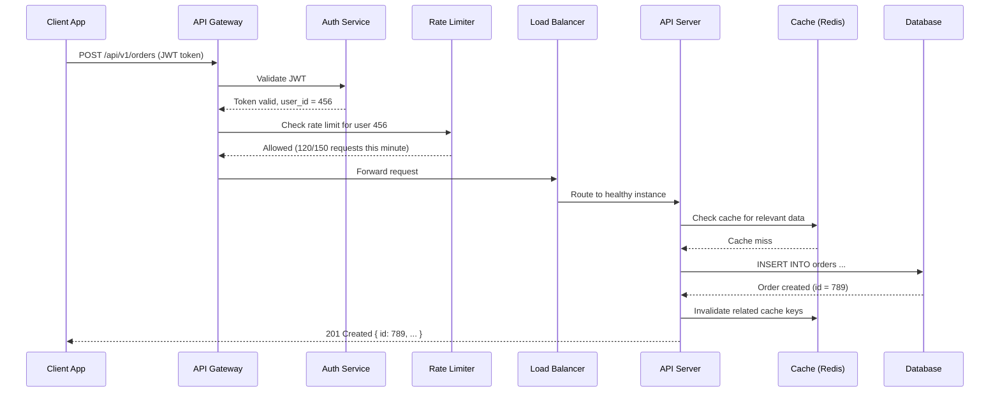

# 1.8 API Design

> APIs are the contract between your services and the outside world — a well-designed API makes your system extensible, a poorly designed one creates years of technical debt. Interviewers evaluate your API design skills in almost every system design question.

## Why This Matters

Every system design interview includes a moment where you define how clients interact with your backend. Whether you are designing a URL shortener, a chat application, or a ride-sharing platform, the API endpoints you propose reveal how well you understand the domain, how you handle edge cases, and whether your design can evolve without breaking existing clients.

Interviewers assess API design as a proxy for professional maturity. Can you design idempotent endpoints? Do you think about pagination for large result sets? Do you handle authentication and rate limiting? These details separate candidates who have shipped real APIs from those who have only consumed them.

Companies like Stripe, Twilio, and GitHub are famous for their API design. Stripe's API is often cited as best-in-class — versioned, consistent, idempotent, and beautifully documented. Understanding why their design choices work helps you make similar decisions in interviews.

## How It Works

### API Request Flow

### REST vs GraphQL vs gRPC

| Feature | REST | GraphQL | gRPC |
|---------|------|---------|------|
| **Protocol** | HTTP/1.1 or HTTP/2 | HTTP (single endpoint) | HTTP/2 |
| **Data Format** | JSON (usually) | JSON | Protocol Buffers (binary) |
| **Schema** | OpenAPI/Swagger (optional) | Strongly typed schema (required) | .proto files (required) |
| **Overfetching** | Common (fixed response shape) | Solved (client specifies fields) | Minimal (strict contract) |
| **Underfetching** | Common (multiple round trips) | Solved (nested queries) | Solved (streaming) |
| **Caching** | Easy (HTTP caching, CDN) | Harder (POST requests, custom caching) | Hard (binary, no HTTP cache) |
| **Real-time** | WebSocket add-on | Subscriptions built-in | Bidirectional streaming built-in |
| **Learning Curve** | Low | Medium | High |
| **Best For** | Public APIs, CRUD, web apps | Mobile apps, complex UIs, BFF | Internal microservices, low-latency |

**Interview decision tree:**
- **Public API for third-party developers?** → REST (universal, cacheable, well-understood)
- **Mobile app with complex, nested data needs?** → GraphQL (reduce round trips, fetch only needed fields)
- **Internal service-to-service communication?** → gRPC (type-safe, fast, streaming support)

### Pagination Strategies

| Strategy | How It Works | Pros | Cons |
|----------|-------------|------|------|
| **Offset-based** | `GET /items?offset=20&limit=10` | Simple, random access to any page | Slow for large offsets (DB scans), inconsistent with inserts/deletes |
| **Cursor-based** | `GET /items?cursor=abc123&limit=10` | Consistent results, performant at scale | No random page access, opaque cursor |
| **Keyset-based** | `GET /items?after_id=123&limit=10` | Fastest (index-backed), stable | Requires a unique, sortable column |

**Interview default:** Use **cursor-based pagination** for feeds and lists. Mention that offset-based breaks at scale because `OFFSET 1000000 LIMIT 10` requires the DB to scan and discard 1M rows.

### Idempotency

An operation is idempotent if performing it multiple times produces the same result as performing it once.

| HTTP Method | Idempotent? | Explanation |
|-------------|------------|-------------|
| GET | Yes | Reading data does not change state |
| PUT | Yes | Replacing a resource with the same data is a no-op |
| DELETE | Yes | Deleting an already-deleted resource returns 404 (same outcome) |
| POST | **No** | Creating a resource twice creates two resources |

**Making POST idempotent:** Use an **Idempotency-Key** header. The client generates a unique key (UUID) per request. The server checks if the key was already processed — if yes, return the cached response. Stripe uses this pattern for payment APIs.

### Rate Limiting

| Algorithm | How It Works | Pros | Cons |
|-----------|-------------|------|------|
| **Token Bucket** | Tokens added at fixed rate; each request consumes a token | Allows bursts, smooth rate limiting | Requires token state per client |
| **Sliding Window** | Count requests in a rolling time window | Accurate rate enforcement | Memory for per-client windows |
| **Fixed Window** | Count requests in fixed time intervals | Simple to implement | Burst at window boundary (2x rate) |
| **Leaky Bucket** | Requests processed at fixed rate; overflow dropped | Smooth output rate | No burst tolerance |

### API Versioning

| Strategy | Example | Pros | Cons |
|----------|---------|------|------|
| **URL Path** | `/api/v1/users` | Clear, easy routing | URL pollution |
| **Query Parameter** | `/api/users?version=1` | Optional versioning | Easy to miss |
| **Header** | `Accept: application/vnd.api.v1+json` | Clean URLs | Hidden, harder to test |
| **No versioning** | Evolve API with backward-compatible changes | Simplest | Breaking changes require careful migration |

**Interview default:** URL path versioning (`/v1/`, `/v2/`). It is the most explicit and the approach used by Stripe, GitHub, and most major APIs.

## Key Concepts

| Concept | Description | When to Use |
|---------|-------------|-------------|
| **HATEOAS** | Responses include links to related actions/resources | Discoverable APIs (rarely used in practice) |
| **Content Negotiation** | Client specifies desired response format (Accept header) | APIs serving multiple formats (JSON, XML, CSV) |
| **ETags** | Server-generated hash for cacheable responses; enables conditional requests | Read-heavy APIs with cacheable responses |
| **Webhook** | Server pushes events to a client-registered URL | Real-time event notification (payment confirmed, build complete) |
| **API Gateway** | Single entry point handling auth, rate limiting, routing | Microservice architectures (covered in module 1.9) |
| **Backend for Frontend (BFF)** | Dedicated API aggregation layer per client type | Mobile app needs different data shape than web app |

## Trade-offs

| Approach A | Approach B | Choose A When | Choose B When |
|-----------|-----------|---------------|---------------|
| REST | GraphQL | Public APIs, simple CRUD, HTTP caching needed | Complex nested data, mobile bandwidth concerns |
| REST | gRPC | Browser clients, human-readable debugging | Internal services, need streaming, performance critical |
| Offset Pagination | Cursor Pagination | Small datasets, need page jumping | Large datasets, real-time feeds, consistent ordering |
| Synchronous response | Async (202 + polling/webhook) | Fast operations (< 1s) | Long-running operations (video processing, ML inference) |
| JWT (stateless) | Session tokens (stateful) | Microservices, no central session store | Simple apps, need instant revocation |

## Interview Cheat Sheet

- **Always define your API endpoints** early in a design interview — it shows structured thinking
- **Use nouns for resources** (`/users`, `/orders`), not verbs (`/getUsers`, `/createOrder`)
- **Return appropriate HTTP status codes:** 200 (OK), 201 (Created), 400 (Bad Request), 401 (Unauthorized), 404 (Not Found), 429 (Rate Limited), 500 (Server Error)
- **Idempotency keys** are essential for payment and order APIs — mention them proactively
- **Cursor-based pagination** is the correct answer for any feed or timeline design
- **Rate limiting** should be mentioned for any public-facing API
- Stripe uses **URL versioning** (`/v1/charges`), **idempotency keys**, and **webhook events** — a gold standard
- GitHub API uses **cursor-based pagination** (GraphQL) and **Link header pagination** (REST)
- **Long-running operations:** Return 202 Accepted with a status URL. Client polls `GET /operations/{id}` for completion

## Common Interview Questions

1. Design the API for a URL shortener (create, redirect, analytics).
2. REST vs GraphQL — when would you choose each?
3. How do you handle pagination for a social media feed?
4. What is idempotency and why does it matter for payment APIs?
5. How would you version your API? What happens to old clients?
6. Design the API for a ride-sharing app (request ride, match driver, track ride).
7. How do you rate limit API requests? What algorithm would you use?

## Deep Dive: Designing Idempotent APIs

Idempotency is the **most important API design concept for financial and e-commerce systems** and a frequent interview deep-dive topic.

**The problem:** Network failures are inevitable. A client sends a payment request, the server processes it and charges the credit card, but the response is lost due to a timeout. The client retries — and now the card is charged twice.

**The solution: Idempotency keys.**

1. Client generates a unique key (UUID v4) and includes it in the request header: `Idempotency-Key: 8e03978e-40d5-43e8-bc93-6894a57f9324`.

2. Server receives the request and checks if this key exists in its idempotency store (Redis or DB):
   - **Key not found:** Process the request normally. Store the key, request fingerprint, and response. Return the response.
   - **Key found, same request:** Return the stored response (do not reprocess).
   - **Key found, different request:** Return 422 Unprocessable Entity (key reuse with different payload).

3. The key has a TTL (24-72 hours). After expiration, the same key can be reused.

**Critical implementation details:**
- The idempotency check and request processing must be **atomic** (use a database transaction or distributed lock).
- Store the **complete response**, not just "processed" — the client must receive identical responses on retries.
- Idempotency is **per endpoint per key** — different endpoints can use the same key independently.

**What Stripe does:** Every POST request to Stripe's API accepts an `Idempotency-Key` header. Stripe stores the key for 24 hours. Retries within that window return the original response. This is why Stripe's API is considered the gold standard for financial APIs.

**What to say in an interview:** "For any write operation that has side effects — especially financial transactions — I would implement idempotency keys. The client sends a UUID with each request, and the server checks against a Redis-backed idempotency store. This guarantees safe retries across network failures without double-processing."

---

## First-time Recognition Signals

When you read a brand-new system design prompt, this building block is the right tool if you see:

- **"Design the API / sketch the endpoints for X"** — the interviewer is explicitly asking for the contract.
- **"Public-facing API with third-party integrations / SDKs"** — versioning, deprecation, and idempotency keys become first-class concerns.
- **"Mobile and web clients talking to the same backend"** — REST/GraphQL design choices (over-fetching, batching, pagination) directly affect mobile bandwidth.
- **"Strict typing / generated clients across multiple services"** — gRPC + protobuf or OpenAPI-generated SDKs.
- **"Real-time bidirectional updates / chat / live cursor"** — WebSocket / Server-Sent Events, not REST.

### Anti-signals (looks like this building block, isn't)

- **"Internal service-to-service RPC behind a service mesh"** — REST is fine but gRPC is usually faster and more typed; pick consciously.
- **"Fire-and-forget commands with no synchronous response"** — a message queue is the API surface, not REST.
- **"Streaming large file uploads / downloads"** — direct-to-blob (presigned URL) is better than streaming through your API.

---

### Intuition

An API contract is the part of your system that's hardest to change once shipped — every caller hard-codes against it. Good API design front-loads decisions that are expensive to reverse: pagination shape, error model, versioning. The classic trap is offset pagination — it works great on page 2 of 50 and *fatally* breaks on page 50,000 because the database has to skip rows it then throws away. Cursor pagination trades the ability to "jump to page N" for predictable performance at any depth.

### Worked Example: Cursor vs offset pagination over 10M rows

`SELECT id, body FROM events ORDER BY created_at DESC, id DESC LIMIT 20 OFFSET ?` against a 10 M-row table with an index on `(created_at, id)`.

| Offset | Query plan | Avg latency | p99 |
|---|---|---|---|
| 0 | Index scan, fetch 20 | 2 ms | 5 ms |
| 1,000 | Index scan, skip 1k, fetch 20 | 5 ms | 12 ms |
| 100,000 | Index scan, skip 100k, fetch 20 | 90 ms | 250 ms |
| **1,000,000** | Index scan, skip 1M, fetch 20 | **900 ms** | **2,500 ms** |

The DB literally walks 1,000,020 index entries to return 20. Worse: any insert between page fetches shifts every offset → users see duplicates or skips.

**Cursor pagination:** `WHERE (created_at, id) < (last_created_at, last_id) ORDER BY created_at DESC, id DESC LIMIT 20`.

| Offset (depth) | Query plan | Latency | Stability under inserts |
|---|---|---|---|
| Any | Index seek to cursor + fetch 20 | 2–5 ms (constant) | **Stable** — cursor anchored to a real row |

**Surprise:** cursor pagination is *not* harder than offset for the typical "next page" UX — just round-trip the last row's `(created_at, id)` to the client as an opaque token. The only thing you lose is "jump to page 47", which most products don't actually need. **Lesson:** if your dataset will ever exceed ~10k rows, default to cursor; reserve offset for admin tools.

For public APIs, also bake in:
- **Idempotency keys** on POST (Stripe pattern) so retries don't double-charge.
- **Versioning via header** (`Stripe-Version: 2024-01-15`) — URL never changes.
- **Standardized error envelope** — `{ code, message, request_id, retryable }`.

### Further Reading

- [Google AIP (API Improvement Proposals)](https://google.aip.dev/) — canonical resource for naming, pagination, error model.
- [Stripe API Blog — Designing robust and predictable APIs with idempotency](https://stripe.com/blog/idempotency)
- Fielding, *Architectural Styles and the Design of Network-based Software Architectures*, ch. 5 — the REST dissertation; statelessness, uniform interface.
- [gRPC documentation](https://grpc.io/docs/) — Protobuf schema evolution rules and internal-RPC patterns.

