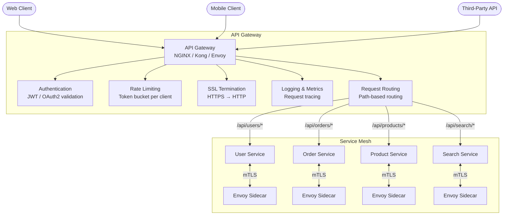

# 1.9 Proxies & API Gateways

> Proxies and API gateways are the front door to your microservices — they handle cross-cutting concerns like authentication, rate limiting, and routing so your services do not have to. Every production architecture has one, and interviewers expect you to know when and why.

## Why This Matters

As monoliths decompose into microservices, a new problem emerges: how do clients discover and communicate with dozens (or hundreds) of backend services? Without a centralized entry point, each service must independently handle authentication, rate limiting, SSL termination, request logging, and protocol translation. This leads to duplicated logic, inconsistent behavior, and security gaps.

API gateways solve this by providing a single entry point that centralizes cross-cutting concerns. Proxies (forward and reverse) are the underlying mechanism that makes this possible. Interviewers test this knowledge because it reveals whether you understand microservice architecture beyond just "split into services."

Netflix's Zuul gateway handles billions of API requests daily. Amazon's API Gateway powers AWS Lambda-backed serverless APIs. Envoy (created by Lyft) has become the de facto proxy for service meshes. Kong, NGINX, and Traefik are standard open-source gateways. Understanding the landscape and trade-offs is essential for any senior-level interview.

## How It Works

### API Gateway Architecture

### Forward Proxy vs Reverse Proxy

| Feature | Forward Proxy | Reverse Proxy |
|---------|--------------|---------------|
| **Who uses it** | Clients (outbound requests) | Servers (inbound requests) |
| **Client awareness** | Client knows about the proxy | Client does not know (transparent) |
| **Purpose** | Privacy, content filtering, caching, access control | Load balancing, SSL termination, caching, security |
| **Example** | Corporate proxy, VPN, Squid | NGINX, HAProxy, Cloudflare |
| **Sits between** | Client ↔ Internet | Internet ↔ Backend servers |

**Interview shortcut:** "A forward proxy acts on behalf of the client; a reverse proxy acts on behalf of the server."

### API Gateway Responsibilities

| Responsibility | What It Does | Why It Matters |
|---------------|-------------|----------------|
| **Request Routing** | Route `/api/users/*` to User Service, `/api/orders/*` to Order Service | Clients use a single domain; gateway handles dispatch |
| **Authentication** | Validate JWT tokens, API keys, or OAuth2 tokens before forwarding | Centralized auth — services trust pre-validated requests |
| **Rate Limiting** | Enforce request quotas per client/API key | Protect backend services from abuse or accidental DDoS |
| **SSL Termination** | Decrypt HTTPS at the gateway, forward plain HTTP to services | Offload crypto from backend services, simplify cert management |
| **Request/Response Transformation** | Modify headers, rewrite URLs, aggregate responses | API versioning, backend migration without client changes |
| **Circuit Breaking** | Stop forwarding to a failing service after N errors | Prevent cascading failures across the system |
| **Caching** | Cache GET responses at the gateway layer | Reduce load on backend services for repeated requests |
| **Logging & Tracing** | Log all requests, inject trace IDs (correlation IDs) | Observability across the entire request lifecycle |

### Gateway Patterns

| Pattern | Description | When to Use |
|---------|-------------|-------------|
| **Edge Gateway** | Single gateway at the system perimeter | Most common; all external traffic enters through one point |
| **Backend for Frontend (BFF)** | Separate gateway per client type (web, mobile, IoT) | Different clients need different data shapes and aggregations |
| **Gateway Aggregation** | Gateway combines responses from multiple services into one | Reduce round trips for mobile clients (one call instead of five) |
| **Gateway Offloading** | Gateway handles cross-cutting concerns; services focus on business logic | Standard microservice architecture |

### Service Mesh & Sidecar Pattern

A **service mesh** handles service-to-service communication (east-west traffic) using sidecar proxies deployed alongside each service instance.

| Component | What It Does |
|-----------|-------------|
| **Sidecar Proxy (Envoy)** | Intercepts all inbound/outbound traffic for a service. Handles mTLS, retries, circuit breaking, load balancing. |
| **Control Plane (Istio/Linkerd)** | Configures all sidecars: routing rules, policies, certificates. No data flows through it. |
| **Data Plane** | All sidecar proxies collectively form the data plane — actual traffic flows through them. |

**Why service mesh?**
- **mTLS everywhere:** Automatic encryption between all services without code changes.
- **Observability:** Distributed tracing, metrics, and access logs for every inter-service call.
- **Traffic management:** Canary deployments, A/B testing, traffic mirroring — all at the proxy layer.
- **Resilience:** Retries, timeouts, circuit breakers configured centrally, not in each service's code.

## Key Concepts

| Concept | Description | When to Use |
|---------|-------------|-------------|
| **SSL/TLS Termination** | Decrypt encrypted traffic at the proxy/gateway | Standard for all production gateways |
| **mTLS (Mutual TLS)** | Both client and server authenticate each other | Zero-trust service-to-service communication |
| **Circuit Breaker** | Trip after N failures; stop sending requests to a failing service for a cooldown period | Prevent cascading failures in microservices |
| **Retry with Exponential Backoff** | Retry failed requests with increasing delays (1s, 2s, 4s, 8s) | Transient failures (network blips, temporary overload) |
| **Correlation ID / Trace ID** | Unique ID propagated through all services handling a request | Distributed tracing (Zipkin, Jaeger, Datadog APM) |
| **Blue-Green / Canary Deployment** | Route a percentage of traffic to a new version via the gateway | Zero-downtime deployments, risk mitigation |

## Trade-offs

| Approach A | Approach B | Choose A When | Choose B When |
|-----------|-----------|---------------|---------------|
| API Gateway | Direct client-to-service | Microservices, need centralized concerns | Monolith, simple architecture, internal tools |
| Single Gateway | BFF (Backend for Frontend) | Uniform client needs | Mobile vs web have vastly different data requirements |
| NGINX / HAProxy | Kong / AWS API Gateway | Full control, performance-sensitive | Need managed plugins (auth, rate limiting, analytics) |
| Service Mesh (Istio) | Library-based (Netflix OSS) | Polyglot services, infrastructure-level concerns | Single-language stack, simpler ops |
| Gateway-level rate limiting | Service-level rate limiting | Simple, centralized enforcement | Different rate limits per service or endpoint |

## Interview Cheat Sheet

- **API gateways centralize cross-cutting concerns** — always mention one in microservice designs
- **Reverse proxy is the building block** of load balancers, API gateways, and CDNs
- **SSL termination at the gateway** saves backend CPU and simplifies certificate management
- **Circuit breakers** (mention the library: Hystrix, resilience4j, or Envoy's built-in) prevent cascading failures
- **BFF pattern:** Use when mobile and web clients need fundamentally different API shapes
- **Service mesh** adds observability and security to service-to-service communication without code changes
- Netflix's **Zuul** gateway handles **authentication, routing, canary testing, and request logging** for all inbound traffic
- Amazon **API Gateway** can directly integrate with Lambda, DynamoDB, and S3 without a backend server
- **Rate limiting at the gateway is defense against abuse**; rate limiting at the service is defense against bugs
- **Always mention a correlation/trace ID** — it shows you understand distributed system debugging

## Common Interview Questions

1. What is the difference between a forward proxy and a reverse proxy?
2. Why do microservice architectures need an API gateway?
3. How do you implement rate limiting at the gateway level?
4. Explain the circuit breaker pattern. When would you use it?
5. What is a service mesh? When would you add one vs using a library-based approach?
6. How would you handle API versioning at the gateway level?
7. Design the gateway layer for an e-commerce platform with web, mobile, and third-party API clients.

## Deep Dive: Circuit Breaker Pattern

The **circuit breaker** is the most interview-relevant resilience pattern and naturally belongs at the proxy/gateway layer.

**The problem:** Service A calls Service B. Service B becomes slow (2s response time instead of 50ms). Service A's thread pool fills up waiting for B. Service A itself becomes slow. Clients of Service A start failing. The failure cascades through the entire system.

**The solution:** A circuit breaker monitors calls to Service B and trips (opens) when the failure rate exceeds a threshold.

**Circuit breaker states:**

| State | Behavior | Transition |
|-------|----------|------------|
| **Closed** (normal) | All requests pass through to the downstream service | Opens when failure rate exceeds threshold (e.g., 50% of last 100 requests) |
| **Open** (tripped) | All requests immediately fail with a fallback response (no call to downstream) | After a timeout (e.g., 30s), transitions to Half-Open |
| **Half-Open** (testing) | A small number of requests pass through to test if downstream has recovered | If successful → Closed. If failing → Open again |

**Implementation in practice:**
- **Envoy proxy** has built-in circuit breaking (max connections, max pending requests, max retries).
- **Resilience4j** (Java), **Polly** (.NET), **Hystrix** (legacy Netflix) are library implementations.
- **Service mesh** (Istio/Envoy) applies circuit breaking at the sidecar level — no code changes needed.

**Fallback strategies when the circuit is open:**
- Return cached data (slightly stale but available).
- Return a degraded response (e.g., show a generic product recommendation instead of personalized).
- Queue the request for retry later.
- Return an error with a clear retry-after header.

**What to say in an interview:** "Between services, I would implement circuit breakers — either via Envoy sidecar if we are using a service mesh, or via a library like resilience4j. The circuit opens when the failure rate exceeds 50% over a sliding window of 100 requests. While open, requests fail fast with a cached fallback response. After 30 seconds, the circuit enters half-open state to test recovery. This prevents one slow service from cascading failures across the entire system."
