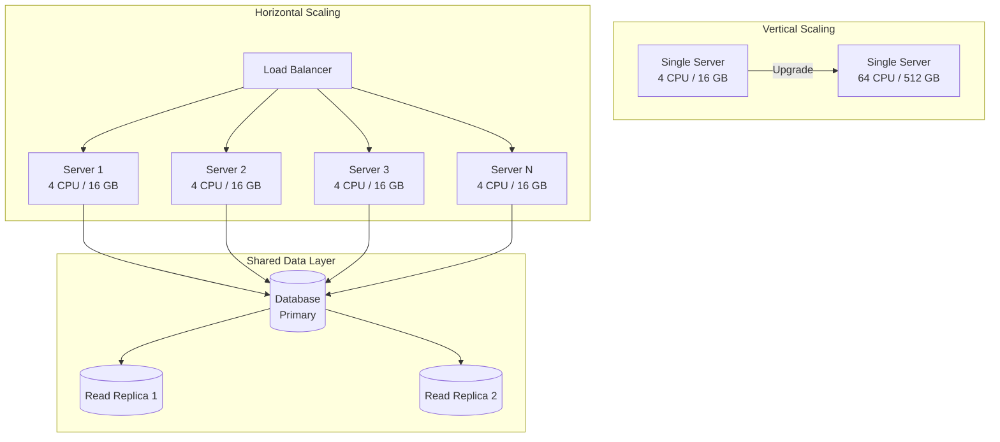

# 01 Scalability

> Scalability is the ability of a system to handle growing amounts of work by adding resources — it is the foundation of every system design interview answer.

## Why This Matters

Scalability is arguably the single most important topic in system design interviews. Nearly every design question — from "Design a URL shortener" to "Design Netflix" — requires you to articulate how your system handles 10x, 100x, or 1000x growth. Interviewers use scalability discussions to gauge whether you can think beyond a single-server prototype and reason about real-world production systems.

Understanding scalability means knowing *where* bottlenecks form (CPU, memory, network, disk I/O, database connections) and *which* strategies resolve them. A strong candidate doesn't just say "add more servers" — they explain stateless service design, database read replicas, cache layers, and async processing, and they know when each applies.

Companies like Google, Amazon, and Netflix have solved scalability at planet scale. Referencing their patterns — Google's Bigtable for storage scaling, Netflix's microservice decomposition, Amazon's service-oriented architecture — signals depth and real-world awareness.

## How It Works

### Vertical vs Horizontal Scaling

**Vertical scaling** (scaling up) means adding more power to an existing machine — more CPU, RAM, or faster disks. It's simple but has hard limits: you can't buy a server with 10 TB of RAM. **Horizontal scaling** (scaling out) means adding more machines to a pool. It's theoretically unlimited but introduces complexity: distributed state, network partitions, and coordination overhead.

### Stateless vs Stateful Services

A **stateless** service stores no session data on the server itself. Every request contains all the information needed to process it. This is critical for horizontal scaling because any server in the pool can handle any request — load balancers can distribute traffic freely.

A **stateful** service ties a user's session to a specific server. This creates "sticky sessions" and limits your ability to scale or recover from failures. The fix: externalize state to a shared store (Redis, Memcached, or a database).

| Property | Stateless | Stateful |
|----------|-----------|----------|
| Horizontal scaling | Trivial — add servers behind LB | Requires sticky sessions or state migration |
| Failure recovery | Any server can take over | Session lost if server dies |
| Example | REST API servers | WebSocket chat servers |
| State location | External store (Redis, DB) | In-process memory |

### Database Scaling Strategies

The database is almost always the first bottleneck. Strategies, in order of complexity:

1. **Connection pooling** — Reuse DB connections instead of opening new ones per request.
2. **Read replicas** — Route read queries to replicas, writes to the primary. Works when read:write ratio is high (common in most apps).
3. **Caching** — Put a cache (Redis/Memcached) in front of the DB for hot data. Cache hit rates of 90%+ dramatically reduce DB load.
4. **Denormalization** — Pre-join data to avoid expensive queries at read time. Trade storage for speed.
5. **Sharding** — Split data across multiple databases by a partition key. Last resort due to complexity (covered in Module 02).

### Microservices vs Monolith

| Dimension | Monolith | Microservices |
|-----------|----------|---------------|
| Deployment | Single unit | Independent services |
| Scaling | Scale entire app | Scale individual services |
| Team ownership | Shared codebase | Service per team |
| Complexity | Simple at small scale | Operational overhead (service mesh, tracing) |
| Data | Single database | Database per service |
| Example | Early Amazon, early eBay | Netflix (700+ services), Uber |

**Interview tip:** Don't default to microservices. Start with a monolith in your design, then decompose when you identify scaling bottlenecks in specific components.

## Key Concepts

| Concept | Description | When to Use |
|---------|-------------|-------------|
| Vertical scaling | Add resources to one machine | Quick fix, small-scale systems, databases |
| Horizontal scaling | Add more machines | Web/app tier, stateless services |
| Read replicas | Copy data to read-only DB instances | Read-heavy workloads (>80% reads) |
| Caching | Store hot data in memory | Reduce DB load, speed up reads |
| Denormalization | Duplicate data to avoid joins | High-read, low-write access patterns |
| Sharding | Split data across DB instances | When single DB can't handle write volume |
| Async processing | Offload work to queues | Non-blocking user-facing requests |

## Trade-offs

| Approach A | Approach B | Choose A When | Choose B When |
|-----------|-----------|--------------|--------------|
| Vertical scaling | Horizontal scaling | Simple app, single DB, quick fix | Need fault tolerance, beyond single-machine limits |
| Monolith | Microservices | Small team, early-stage product | Large org, independent scaling per component |
| Sync processing | Async (queues) | Response needed immediately | Work can be deferred (email, analytics) |
| SQL (normalized) | NoSQL (denormalized) | Complex queries, ACID needed | High throughput, flexible schema, horizontal scale |

## Interview Cheat Sheet

- Always identify the **bottleneck** before proposing a scaling solution.
- Default to **stateless services** behind a load balancer.
- Use **caching** before reaching for sharding — it's simpler and often sufficient.
- Quantify: "At 10K QPS, a single Postgres instance is fine. At 100K QPS, we need read replicas and caching."
- Mention **CDNs** for static content (images, JS, CSS) — it's free scalability.
- **Database is usually the bottleneck**, not the application servers.
- Scale reads with replicas, writes with sharding, both with caching.

## Common Interview Questions

1. "How would you scale this system to handle 10x traffic?" — Identify bottleneck, add caching/replicas, then shard if needed.
2. "What happens when a server goes down?" — Stateless design means LB routes to healthy servers; externalized state survives.
3. "When would you break a monolith into microservices?" — When teams can't deploy independently, or one component needs different scaling.
4. "How do you handle a slow database?" — Read replicas, caching, query optimization, connection pooling, then sharding.
5. "What's the difference between horizontal and vertical scaling?" — Vertical = bigger machine (limited), horizontal = more machines (complex but unlimited).

## Deep Dive: Identifying and Resolving Scaling Bottlenecks

A systematic approach to scaling starts with measurement, not guessing:

1. **Instrument everything** — Use metrics (Prometheus/Grafana) to find where latency lives: app server CPU? DB query time? Network?
2. **Profile the database** — Slow query logs reveal the 5% of queries consuming 95% of resources. Add indexes before adding hardware.
3. **Check connection limits** — A Postgres server with `max_connections=100` will reject requests at moderate concurrency. Use PgBouncer or similar.
4. **Evaluate the read:write ratio** — If 95% reads, add replicas and caching. If write-heavy, look at sharding or write-behind caching.
5. **Look for hot partitions** — One celebrity's profile getting 100x the traffic of others? Cache that specific key, or redesign the access pattern.

**Real-world example:** Instagram scaled to millions of users on a single Django monolith by aggressively using Memcached and read replicas before ever considering microservices. Simplicity scales further than most engineers expect.
