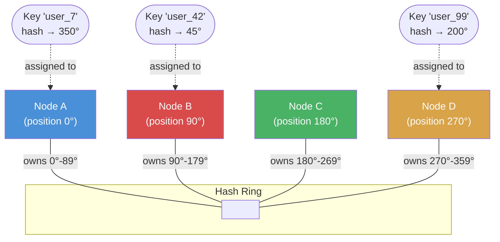

# 02 Partitioning & Sharding

> Sharding splits data across multiple machines so no single database becomes a bottleneck — it's how systems like Google, Facebook, and Uber handle petabytes of data.

## Why This Matters

When your database can no longer handle the write volume on a single machine (even after read replicas, caching, and query optimization), sharding is the answer. Interviewers expect you to know *how* to partition data, *which strategy* to choose, and the *consequences* of each approach — especially hotspots, rebalancing, and cross-shard queries.

Sharding appears in nearly every large-scale design: "Design a chat system" requires sharding messages by conversation ID; "Design a social network" requires sharding user data; "Design a URL shortener" requires sharding the URL mappings. Understanding consistent hashing — the dominant sharding strategy in modern distributed systems — separates strong candidates from average ones.

This topic connects directly to replication (Module 03), consistency (Module 04), and unique ID generation (Module 06), making it a linchpin of distributed systems knowledge.

## How It Works

### Hash-Based Partitioning

Apply a hash function to the partition key and use modulo to assign to a shard: `shard = hash(key) % N`. Simple, but **rebalancing is catastrophic** — changing N reshuffles almost every key.

### Range-Based Partitioning

Assign contiguous ranges of keys to each shard (e.g., A-F → Shard 1, G-M → Shard 2). Simple to understand, supports range queries, but prone to **hotspots** if some ranges are accessed more than others.

### Consistent Hashing

The industry-standard approach. Nodes and keys are placed on a hash ring. Each key is assigned to the first node encountered clockwise on the ring. Adding or removing a node only affects its immediate neighbors, minimizing data movement.

**Virtual nodes** solve load imbalance: each physical node gets multiple positions on the ring (e.g., 150 virtual nodes each). This smooths out the distribution. Amazon's Dynamo and Apache Cassandra both use this approach.

### Directory-Based Partitioning

A separate lookup service maps each key to its shard. Maximum flexibility (any mapping logic), but the directory becomes a single point of failure and a potential bottleneck. Used when partition logic is complex or changes frequently.

## Key Concepts

| Concept | Description | When to Use |
|---------|-------------|-------------|
| Hash partitioning | `hash(key) % N` | Simple, uniform distribution, no range queries needed |
| Range partitioning | Key ranges per shard | Need range queries (time-series, alphabetical) |
| Consistent hashing | Keys and nodes on a hash ring | Dynamic cluster membership, minimal rebalancing |
| Virtual nodes | Multiple ring positions per physical node | Fix load imbalance in consistent hashing |
| Directory-based | Lookup table maps keys → shards | Complex or frequently changing partition logic |
| Composite partitioning | Combine strategies (e.g., range + hash) | Multi-tenant systems, complex access patterns |

## Trade-offs

| Approach A | Approach B | Choose A When | Choose B When |
|-----------|-----------|--------------|--------------|
| Hash partitioning | Range partitioning | Uniform access, no range queries | Need range scans (dates, IDs) |
| Consistent hashing | Simple modulo hash | Cluster size changes often | Fixed cluster size, simplicity preferred |
| Single shard key | Composite shard key | One dominant access pattern | Multiple access patterns (e.g., by user AND by time) |
| Application-level sharding | Proxy-based sharding | Full control, custom logic | Transparent to application, managed (e.g., Vitess) |

## Hotspot Mitigation Strategies

Hotspots occur when one shard receives disproportionate traffic. Common causes and fixes:

| Cause | Example | Mitigation |
|-------|---------|------------|
| Celebrity problem | Justin Bieber's profile on a user-sharded DB | Cache hot keys, add read replicas for that shard |
| Temporal skew | All writes go to "current day" shard | Add random suffix to partition key, aggregate later |
| Poor key choice | Sharding by country → US shard gets 60% traffic | Choose higher-cardinality key or composite key |
| Hash collision | Multiple hot keys hash to same shard | Virtual nodes, better hash function |

## Rebalancing Strategies

| Strategy | How It Works | Downside |
|----------|-------------|----------|
| Fixed partitions | Pre-create many partitions (e.g., 1000), assign groups to nodes | Hard to change partition count later |
| Dynamic splitting | Split a partition when it exceeds a size threshold | Complexity, momentary unavailability during split |
| Consistent hashing | Add node to ring, only neighbors rebalance | Vnodes needed for even distribution |
| Manual | Operator decides when and how to rebalance | Slow, error-prone, doesn't scale |

## Interview Cheat Sheet

- **Always specify your shard key** and justify why it distributes evenly.
- Consistent hashing with virtual nodes is the default answer for most distributed systems.
- Cross-shard queries are expensive — design your shard key to co-locate data accessed together.
- Mention **scatter-gather** pattern for queries that must span shards (but note it's slow).
- Secondary indexes on sharded data: local (per-shard, fast writes) vs global (cross-shard, fast reads).
- Resharding is painful — over-provision partitions upfront when possible.
- **Real examples:** DynamoDB uses consistent hashing; Cassandra uses vnodes; Vitess manages MySQL sharding for YouTube.

## Common Interview Questions

1. "How would you shard a user database?" — By `user_id` using consistent hashing. Co-locate user data to avoid cross-shard joins.
2. "What if one shard gets too hot?" — Identify the hot key, cache it, or split the shard. Virtual nodes help prevent this.
3. "How do you handle cross-shard queries?" — Scatter-gather: query all shards in parallel, merge results. Avoid if possible through smart key choice.
4. "What happens when you add a new shard?" — With consistent hashing, only adjacent keys migrate. With modulo hash, everything reshuffles — unacceptable.
5. "How does Cassandra distribute data?" — Consistent hashing with virtual nodes. Each node owns multiple token ranges on the ring.

## Deep Dive: Consistent Hashing in Practice

**Amazon DynamoDB** popularized consistent hashing in its 2007 Dynamo paper. Key design decisions:

1. **Ring with virtual nodes:** Each physical node gets ~150 virtual nodes on the ring, ensuring even distribution even with heterogeneous hardware.
2. **Replication on the ring:** Each key is replicated to the next N-1 nodes clockwise, giving both partitioning and replication in one mechanism.
3. **Preference list:** The list of nodes responsible for a key. Skips positions that map to the same physical node to ensure replicas land on different machines.
4. **Coordinator node:** The first node in the preference list handles the request and coordinates with replicas.

**Practical impact:** When a node joins or leaves, only ~1/N of the data needs to move. Compare this to modulo hashing where all data reshuffles — at scale, this difference is the difference between a 30-second rebalance and a multi-hour outage.

**Interview tip:** Draw the ring. Interviewers love seeing you sketch the hash ring, place nodes, show where a key lands, then demonstrate what happens when a node is added. It's one of the most effective whiteboard explanations in system design.
