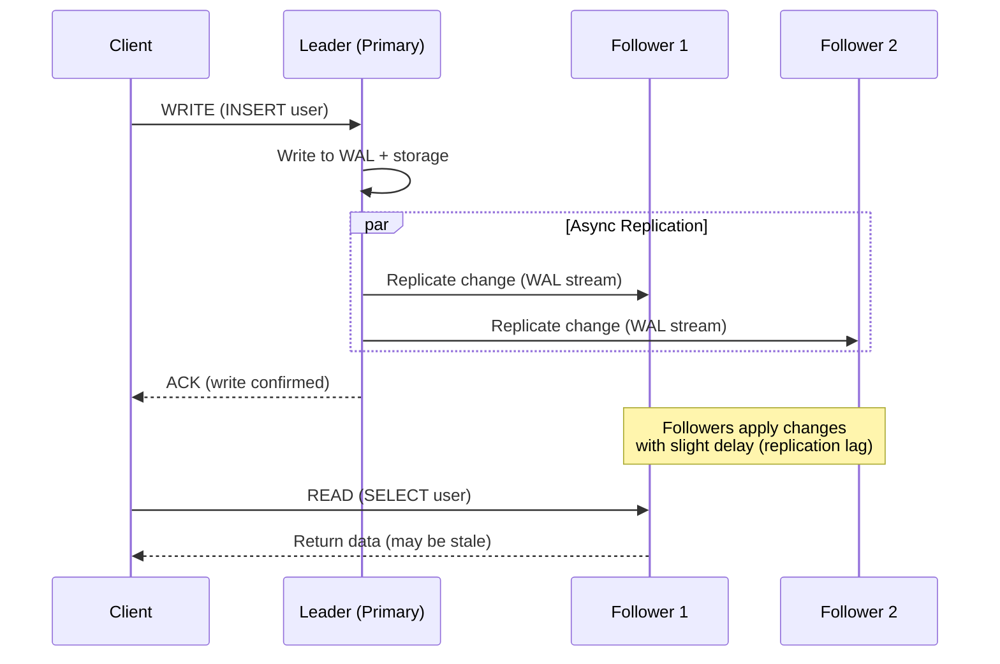

# 03 Replication

> Replication copies data across multiple machines so your system survives hardware failures and serves reads faster — it's how every major database achieves durability and availability.

## Why This Matters

Every system design interview expects fault tolerance. When you say "we'll use a database," the interviewer immediately thinks: "What happens when that server dies?" Replication is the answer. Understanding the trade-offs between synchronous and asynchronous replication, leader-based and leaderless topologies, and conflict resolution strategies is essential for any design involving data storage.

Replication connects directly to consistency models (Module 04) and consensus (Module 07). When you replicate data asynchronously, you get eventual consistency — is that acceptable for your use case? When you need strong consistency, you pay with latency. These are the trade-offs interviewers want to hear you reason about.

Real-world systems make different choices: PostgreSQL uses leader-follower with streaming replication; Cassandra uses leaderless with quorum reads/writes; CockroachDB uses Raft-based consensus for strong consistency. Knowing which architecture fits which requirements demonstrates senior-level thinking.

## How It Works

### Leader-Follower (Primary-Replica) Replication

The most common model. One node (the leader/primary) handles all writes. It replicates changes to follower/replica nodes, which serve read traffic. This is how PostgreSQL, MySQL, MongoDB, and Redis work by default.

**Synchronous replication:** Leader waits for at least one follower to confirm before ACKing the client. Guarantees no data loss on leader failure, but increases write latency. PostgreSQL supports "synchronous_standby_names" for this.

**Asynchronous replication:** Leader ACKs immediately after local write. Faster writes, but a follower promoted to leader after a crash may be missing recent writes. This is the default for most systems.

**Semi-synchronous:** One follower is synchronous (guaranteed up-to-date), the rest are asynchronous. A pragmatic middle ground used by MySQL Group Replication and some PostgreSQL setups.

### Multi-Leader Replication

Multiple nodes accept writes. Used for multi-datacenter setups (one leader per datacenter) or collaborative editing (Google Docs). The fundamental challenge is **write conflicts** — two leaders may modify the same record simultaneously.

| Use Case | Example |
|----------|---------|
| Multi-datacenter | Leader in US-East and EU-West, each accepts local writes |
| Offline clients | Mobile app writes locally, syncs when online (CouchDB) |
| Collaborative editing | Google Docs — each user's edits are local writes |

### Leaderless Replication

No designated leader — any node can accept reads and writes. The client sends writes to multiple nodes and reads from multiple nodes. Correctness is maintained through **quorum** rules. Used by Cassandra, DynamoDB, and Riak.

**Quorum formula:** With N replicas, W write nodes, R read nodes — if `W + R > N`, reads are guaranteed to see the latest write.

| Configuration | N | W | R | Behavior |
|--------------|---|---|---|----------|
| Strong consistency | 3 | 2 | 2 | Always see latest write |
| Fast writes | 3 | 1 | 3 | Writes are fast, reads hit all nodes |
| Fast reads | 3 | 3 | 1 | Reads are fast, writes hit all nodes |
| Eventual consistency | 3 | 1 | 1 | Fast but may read stale data |

## Conflict Resolution Strategies

When multiple nodes accept writes concurrently (multi-leader or leaderless), conflicts arise:

| Strategy | How It Works | Pros | Cons |
|----------|-------------|------|------|
| Last-Write-Wins (LWW) | Timestamp-based, latest write wins | Simple, convergent | Data loss — earlier write silently dropped |
| Vector clocks | Track causal dependencies per node | Detects true conflicts | Complex, metadata overhead |
| CRDTs | Data structures that auto-merge | No conflicts by design | Limited to specific data types (counters, sets) |
| Application-level | App logic resolves (e.g., merge) | Full control | Developer burden |
| Operational transform | Transform concurrent ops (Google Docs) | Real-time collaboration | Complex to implement |

## Replication Lag and Its Effects

Asynchronous replication introduces lag — followers may be seconds (or minutes, under load) behind the leader. This causes:

| Problem | Symptom | Solution |
|---------|---------|----------|
| Read-after-write inconsistency | User writes data, immediately reads from a replica, sees old value | Read-your-writes: route user's reads to leader for recently written data |
| Non-monotonic reads | User reads from Replica A (up-to-date), then Replica B (behind) → appears data vanished | Monotonic reads: pin user to one replica |
| Causality violation | User B sees User A's reply before seeing User A's original post | Causal consistency: track dependencies |

## Key Concepts

| Concept | Description | When to Use |
|---------|-------------|-------------|
| Leader-follower | Single writer, multiple readers | Most OLTP workloads, read-heavy apps |
| Multi-leader | Multiple writers across regions | Multi-datacenter, offline-first apps |
| Leaderless | Any node reads/writes with quorum | High availability, partition tolerance (AP systems) |
| Synchronous replication | Leader waits for follower ACK | Zero data loss requirement |
| Asynchronous replication | Leader ACKs immediately | Low-latency writes, tolerate small data loss |
| WAL shipping | Stream write-ahead log to replicas | PostgreSQL, MySQL physical replication |

## Trade-offs

| Approach A | Approach B | Choose A When | Choose B When |
|-----------|-----------|--------------|--------------|
| Sync replication | Async replication | Cannot lose any committed write | Need low write latency, tolerate brief inconsistency |
| Leader-follower | Leaderless | Simple, need strong consistency | Need high availability, tolerate eventual consistency |
| Single leader | Multi-leader | Single region, simpler conflict model | Multi-region, need local write latency |
| LWW conflict resolution | Vector clocks | Simplicity, can tolerate data loss | Data integrity critical, need conflict detection |

## Interview Cheat Sheet

- Default to **leader-follower with async replication** — it's the most common and easiest to reason about.
- **Replication ≠ backup.** Replication is for availability and read scaling; backups are for disaster recovery.
- Know the quorum formula: `W + R > N` → strong consistency in leaderless systems.
- **Failover** is the hard part: detecting leader failure, electing a new leader, and avoiding split-brain. Mention this proactively.
- Multi-leader = multi-datacenter. Don't propose multi-leader for a single-datacenter design.
- Replication lag is inevitable with async — design your application to handle it.

## Common Interview Questions

1. "How does your database handle a server failure?" — Leader-follower: promote a follower. Leaderless: quorum ensures other nodes have the data.
2. "What's the trade-off between sync and async replication?" — Sync = durability but slower writes. Async = fast writes but possible data loss on failover.
3. "How does Cassandra achieve high availability?" — Leaderless replication with tunable quorum (W, R, N). No single point of failure.
4. "What happens if two users edit the same document?" — Conflict. Resolve with LWW (simple, lossy) or CRDTs (complex, lossless).
5. "How do you handle replication lag?" — Read-your-writes guarantee for the writing user; monotonic reads via session pinning.

## Deep Dive: Failover — The Hardest Part of Replication

Leader failure triggers the most dangerous sequence in a replicated system:

1. **Detection:** Is the leader actually dead, or just slow? Most systems use heartbeat timeouts (e.g., 30 seconds). Too short = false alarms; too long = prolonged unavailability.
2. **Election:** Followers must agree on a new leader. If the old leader had un-replicated writes, they're lost. If two followers think they're the leader → **split-brain** → data corruption.
3. **Catch-up:** The new leader may be behind. Clients that read from it see stale data. Some systems (e.g., MongoDB) have a "readConcern: majority" that only returns data confirmed on a majority of replicas.
4. **Old leader returns:** When the old leader comes back online, it must become a follower and discard any writes not replicated to the new leader. GitHub had a famous incident (2012) where a stale primary was promoted, causing data loss.

**Interview tip:** Mention split-brain proactively. Saying "we need to prevent split-brain during failover, perhaps using a consensus algorithm like Raft" shows you understand the real-world complexity beyond textbook replication.
