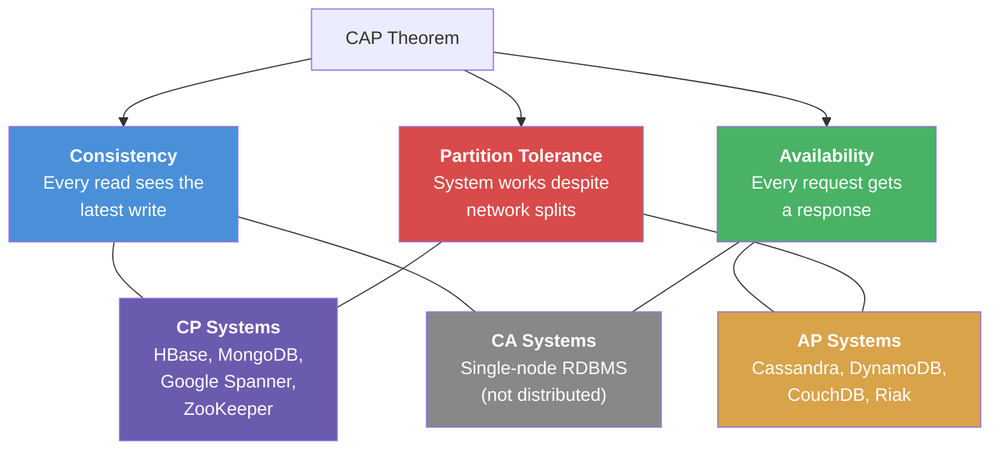

# 04 Consistency Models

> Consistency models define the rules for what data a reader can see after a write — choosing the right model is the trade-off at the heart of every distributed system.

## Why This Matters

The CAP theorem and consistency models come up in nearly every system design interview. When you propose a database, a cache, or a replicated service, the interviewer will probe: "Is this strongly consistent or eventually consistent? What's the impact of that choice?" Candidates who can precisely articulate the spectrum of consistency models — from linearizability to eventual consistency — and map them to real-world systems instantly demonstrate distributed systems fluency.

Understanding consistency is also the key to resolving a common interview trap: "Can you build a system that's both highly available and strongly consistent?" The answer is nuanced — CAP theorem says you can't during a network partition, but PACELC extends this to say even *without* partitions, you still trade latency for consistency.

Systems like Google Spanner achieve "externally consistent" (effectively linearizable) reads globally using TrueTime. DynamoDB offers tunable consistency per-request. Cassandra defaults to eventual but supports quorum reads for stronger guarantees. Knowing these mappings shows you've studied real architectures.

## How It Works

### The CAP Theorem

The CAP theorem states that in the presence of a **network partition** (P), a distributed system must choose between **Consistency** (C) — every read returns the latest write — and **Availability** (A) — every request receives a response.

**Important nuance:** CAP is about behavior during a partition. Most of the time, there's no partition, and the system can be both consistent and available. The choice only matters when a partition occurs.

### PACELC Extension

PACELC says: if there's a **P**artition, choose **A**vailability or **C**onsistency; **E**lse (normal operation), choose **L**atency or **C**onsistency.

| System | During Partition (PAC) | Normal Operation (ELC) |
|--------|----------------------|----------------------|
| DynamoDB | PA (available) | EL (low latency) |
| Cassandra | PA (available) | EL (low latency) |
| Google Spanner | PC (consistent) | EC (consistent, higher latency) |
| MongoDB | PC (consistent) | EC (consistent, higher latency) |
| CockroachDB | PC (consistent) | EC (consistent) |

### Consistency Spectrum

From strongest to weakest:

| Model | Guarantee | Real-World Example |
|-------|-----------|-------------------|
| **Linearizability** | Reads always return the most recent write. As if there's a single copy of data. | Google Spanner (TrueTime), ZooKeeper |
| **Sequential consistency** | All operations appear in some total order consistent with each program's order. | Less common in practice |
| **Causal consistency** | Causally related operations appear in order; concurrent operations may appear in any order. | MongoDB (causal sessions), COPS |
| **Read-your-writes** | A user always sees their own writes immediately. | Common session guarantee |
| **Monotonic reads** | Once a user reads value X, they never see an older value. | Session-pinned reads |
| **Eventual consistency** | Given enough time with no new writes, all replicas converge to the same value. | DynamoDB (default), Cassandra, DNS |

### When Each Model Applies

| Use Case | Required Consistency | Why |
|----------|---------------------|-----|
| Bank account balance | Linearizable | Cannot show wrong balance — money appears/disappears |
| Social media feed | Eventual | Slight delay in seeing a post is acceptable |
| Shopping cart | Read-your-writes | User must see items they just added |
| Leader election | Linearizable | Two leaders = split-brain disaster |
| Analytics dashboard | Eventual | Data is aggregated, slight lag is fine |
| Inventory count | Sequential or strong | Overselling is expensive, but can batch |
| Chat message ordering | Causal | Messages within a conversation must be ordered; across conversations, order doesn't matter |

## Key Concepts

| Concept | Description | When to Use |
|---------|-------------|-------------|
| Linearizability | Strongest: behaves like a single copy | Coordination, leader election, financial data |
| Eventual consistency | Weakest: replicas converge over time | High availability, read-heavy, latency-sensitive |
| Causal consistency | Orders causally related events | Social feeds, messaging, collaborative apps |
| Read-your-writes | User sees own writes | Any user-facing write-then-read flow |
| Monotonic reads | No "going back in time" | Paginated lists, dashboards |
| Quorum reads | Read from majority for freshness | Leaderless DBs (Cassandra, DynamoDB) |

## Trade-offs

| Approach A | Approach B | Choose A When | Choose B When |
|-----------|-----------|--------------|--------------|
| Strong consistency | Eventual consistency | Correctness critical (finance, inventory) | Availability and latency critical (social, analytics) |
| Linearizable reads | Stale reads from replica | Need latest data always | Can tolerate slight staleness for speed |
| Quorum (W+R>N) | Low quorum (W=1, R=1) | Need consistency in leaderless system | Need maximum speed, tolerate staleness |
| Single-leader writes | Multi-leader writes | Simple consistency model | Multi-region low-latency writes |

## Interview Cheat Sheet

- **CAP is about partitions.** Don't say "CAP means you can only pick 2 of 3." Say "During a network partition, you choose between consistency and availability."
- **PACELC is more useful** in practice — it covers the latency-consistency trade-off during normal operation.
- Most real-world systems are **eventually consistent by default** with options for stronger reads.
- Linearizability is expensive — it typically requires consensus (Paxos/Raft) and adds latency.
- **"Consistent" in CAP ≠ "consistent" in ACID.** CAP consistency = linearizability. ACID consistency = application invariants.
- Google Spanner achieves global strong consistency using **TrueTime** (atomic clocks + GPS) — mention this as a gold standard.

## Common Interview Questions

1. "Is your design CP or AP?" — Depends on the component. User auth = CP (must be correct). Social feed = AP (availability matters more).
2. "What's eventual consistency?" — All replicas converge given no new writes. The window of inconsistency may be milliseconds to seconds.
3. "Can you have strong consistency and high availability?" — Not during a partition (CAP). Without partitions, you trade latency for consistency (PACELC).
4. "How does DynamoDB handle consistency?" — Default is eventual (fast). Supports "strongly consistent reads" which read from the leader partition at higher latency.
5. "When would you use causal consistency?" — Chat applications, social media feeds — where ordering within a conversation matters but global ordering doesn't.

## Deep Dive: Google Spanner and TrueTime

Google Spanner is the only globally distributed database that offers **external consistency** (a form of linearizability) without sacrificing too much on availability. The secret: **TrueTime**.

TrueTime is a clock API that returns a time interval `[earliest, latest]` rather than a single timestamp. Each Google datacenter has atomic clocks and GPS receivers. The uncertainty interval is typically < 7ms.

**How it enables strong consistency:**
- Every transaction gets a timestamp from TrueTime.
- Before committing, the leader *waits out* the uncertainty interval (called "commit wait").
- This guarantees that if transaction T1 committed before T2 started, T1's timestamp < T2's timestamp.
- Readers at any replica can serve a consistent snapshot by reading at a chosen timestamp.

**Why this matters in interviews:** Spanner shows that the CAP trade-off isn't absolute — with enough engineering (atomic clocks!), you can push the boundary. But for most systems, you don't have TrueTime, so you're choosing between consistency and latency. Mentioning Spanner as a reference point shows you understand both theory and practice.
