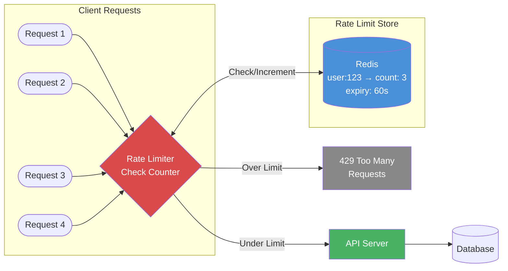

# 05 Rate Limiting

> Rate limiting protects your system from being overwhelmed by too many requests — it's a critical defense mechanism that every production API must implement.

## Why This Matters

"Design a rate limiter" is a standalone interview question at companies like Stripe, Cloudflare, and Google. But rate limiting also appears as a component in nearly every system design: API gateways, login systems, payment processing, and messaging platforms all need rate limiting. An interviewer who asks "How do you prevent abuse?" expects a nuanced answer covering algorithms, distributed coordination, and placement.

Understanding rate limiting demonstrates your ability to think about system protection, fairness, and graceful degradation. A strong candidate knows multiple algorithms (token bucket, sliding window), can compare their trade-offs, and can explain how to implement rate limiting across multiple servers using Redis — a common production pattern used by Stripe, GitHub, and Discord.

Rate limiting intersects with other system design concepts: load balancing (where to place the limiter), caching (rate limit counters in Redis), and distributed systems (synchronizing limits across nodes).

## How It Works

### Rate Limiting Algorithms



### Token Bucket

A bucket holds tokens (up to a max capacity). Each request consumes one token. Tokens are added at a fixed rate. If the bucket is empty, the request is rejected.

**Properties:** Allows bursts (up to bucket capacity), simple, memory-efficient (2 values per user: token count + last refill timestamp). Used by **Amazon API Gateway** and **Stripe**.

| Parameter | Description | Example |
|-----------|-------------|---------|
| Bucket size | Max tokens (burst capacity) | 10 |
| Refill rate | Tokens added per second | 2/sec |
| Steady-state rate | Sustained throughput | 2 req/sec |
| Burst | Short burst up to bucket size | 10 requests instantly |

### Leaking Bucket

Requests enter a FIFO queue of fixed size. Requests are processed at a fixed rate. If the queue is full, new requests are dropped. Produces a perfectly smooth output rate regardless of input burstiness.

**Properties:** Fixed output rate (no bursts allowed), queue-based. Used by **Shopify** (via Nginx).

### Fixed Window Counter

Divide time into fixed windows (e.g., 1-minute intervals). Count requests per window per user. If count exceeds limit, reject. Simple but has an **edge burst problem:** a user can send `limit` requests at the end of window N and `limit` requests at the start of window N+1, effectively doubling throughput in a short span.

### Sliding Window Log

Store the timestamp of each request. To check the limit, count timestamps within the last window duration. Precise but **memory-intensive** — stores every request timestamp.

### Sliding Window Counter

A hybrid: combine the current window's count with a weighted portion of the previous window's count. Approximates the sliding window log with fixed memory per user.

**Formula:** `count = current_window_count + previous_window_count * overlap_percentage`

**Example:** Window = 1 minute. Current window (0:30 elapsed) has 6 requests. Previous window had 10 requests. Estimated count = 6 + 10 × 0.5 = 11. If limit is 10, reject.

## Algorithm Comparison

| Algorithm | Memory | Accuracy | Allows Bursts | Complexity |
|-----------|--------|----------|---------------|------------|
| Token bucket | Low (2 values) | Good | Yes (up to capacity) | Low |
| Leaking bucket | Low (queue size) | Exact | No (smooth output) | Low |
| Fixed window | Low (1 counter) | Poor (edge burst) | Yes (unintentional) | Very low |
| Sliding window log | High (all timestamps) | Exact | No | Medium |
| Sliding window counter | Low (2 counters) | Good (approximate) | Slight | Low |

## Rate Limiting at Different Layers

| Layer | How | Example |
|-------|-----|---------|
| Client-side | Client self-throttles | Mobile app retry with exponential backoff |
| Load balancer / CDN | IP-based, connection limits | Cloudflare, AWS WAF |
| API Gateway | Per-user, per-API-key limits | Kong, AWS API Gateway |
| Application | Business-logic limits | 5 password attempts per hour |
| Database | Connection pool limits | PgBouncer max connections |

## Distributed Rate Limiting

In a multi-server deployment, each server must share rate limit state. Two approaches:

**Centralized (Redis):** All servers check/increment a counter in Redis. Atomic operations (`INCR` + `EXPIRE`) ensure correctness. Stripe, Discord, and GitHub all use Redis-based rate limiting.

**Eventual consistency (local + sync):** Each server tracks limits locally, periodically syncing to a central store. Faster but less precise — a user could slightly exceed the limit during sync gaps.

| Approach | Latency | Accuracy | Complexity |
|----------|---------|----------|------------|
| Redis centralized | +1-2ms per request | Precise | Low — Redis handles atomicity |
| Local + sync | No added latency | Approximate | Medium — sync logic needed |
| Sticky sessions | No added latency | Precise per server | Low, but limits load balancing |

## Key Concepts

| Concept | Description | When to Use |
|---------|-------------|-------------|
| Token bucket | Tokens refilled at steady rate, consumed per request | Default choice — simple, allows bursts |
| Sliding window counter | Weighted combo of current + previous window | Need accuracy without high memory cost |
| Distributed rate limiting | Shared state (Redis) across servers | Multi-server deployments |
| Rate limit headers | `X-RateLimit-Remaining`, `Retry-After` | Good API design — help clients self-throttle |
| Graceful degradation | Degrade service instead of hard reject | Priority users, intermittent overload |

## Trade-offs

| Approach A | Approach B | Choose A When | Choose B When |
|-----------|-----------|--------------|--------------|
| Token bucket | Sliding window counter | Need burst tolerance | Need strict per-window limits |
| Centralized (Redis) | Local counters | Precision matters | Ultra-low latency needed |
| Hard reject (429) | Graceful degradation | Strict enforcement (security) | User experience matters (degrade, don't block) |
| Per-user limits | Per-IP limits | Authenticated API | Public endpoints, DDoS protection |

## Interview Cheat Sheet

- **Token bucket** is the default recommendation — it's used by Amazon, Stripe, and most API gateways.
- Always mention **Redis** for distributed rate limiting with `INCR` + `EXPIRE` (or `MULTI/EXEC`).
- Return `429 Too Many Requests` with `Retry-After` header — standard HTTP practice.
- Rate limit by **user/API key** for authenticated APIs, **IP** for public endpoints.
- Mention **race conditions** in distributed settings: use Redis `INCR` (atomic) or Lua scripts.
- Tell the interviewer where you'd place the rate limiter: **API gateway** for global limits, **application layer** for business logic limits.

## Common Interview Questions

1. "Design a rate limiter." — Token bucket for per-user limits, Redis for shared state, API gateway placement. Discuss algorithm trade-offs.
2. "How do you rate limit across multiple servers?" — Centralized counter in Redis. Use `INCR` and `EXPIRE` atomically.
3. "Token bucket vs sliding window?" — Token bucket allows bursts and is simpler. Sliding window is more precise per-time-window.
4. "How does Cloudflare rate limit?" — At the edge (CDN layer), using IP-based and URL-pattern-based rules, before traffic hits origin servers.
5. "What if Redis goes down?" — Fall back to local in-memory rate limiting per server. Less precise but prevents the limiter from becoming a single point of failure.

## Deep Dive: Redis-Based Distributed Rate Limiter

A production rate limiter using Redis and the sliding window counter:

**Implementation pattern (pseudocode):**

```
function is_allowed(user_id, limit, window_seconds):
    key = "rate:{user_id}:{current_window}"
    prev_key = "rate:{user_id}:{previous_window}"

    current_count = REDIS.GET(key) or 0
    previous_count = REDIS.GET(prev_key) or 0

    elapsed = current_time - window_start
    weight = 1 - (elapsed / window_seconds)
    estimated = current_count + previous_count * weight

    if estimated >= limit:
        return REJECTED

    REDIS.INCR(key)
    REDIS.EXPIRE(key, window_seconds * 2)
    return ALLOWED
```

**Why this works in practice:**
- **Atomic increments:** Redis `INCR` is atomic — no race conditions.
- **Auto-cleanup:** `EXPIRE` ensures old keys don't accumulate.
- **Low memory:** Two keys per user per window, not per request.
- **~0.003% error rate:** The weighted approximation is extremely accurate in practice (Cloudflare measured this).

**Scaling:** Single Redis instance handles ~100K operations/sec. For higher scale, shard by user ID across Redis Cluster nodes. Discord uses this pattern to rate limit millions of concurrent users.

---

## First-time Recognition Signals

When you read a brand-new system design prompt, this topic is the right tool if you see:

- **"Protect the API from abuse / brute-force / scraping"** — per-IP or per-API-key rate limiting at the gateway.
- **"Free vs paid tiers with different request quotas"** — token-bucket or leaky-bucket per API key.
- **"Login / signup / password-reset endpoint flood"** — short, strict limits with exponential backoff.
- **"Prevent a misbehaving client from taking down the service"** — fairness limits per tenant.
- **"Public SMS / email sending endpoint with cost per request"** — quota enforcement is mandatory before the third-party bill explodes.

### Anti-signals (looks like this topic, isn't)

- **"Smooth out a traffic spike to a slow downstream service"** — a queue/buffer is the right tool; rate limiting *rejects* excess, queueing *delays* it.
- **"Internal RPC between trusted microservices with predictable load"** — concurrency limits / circuit breakers usually suffice; per-call rate limiting is overkill.
- **"Coalesce repeated writes to the same key"** — that is batching or write coalescing, not rate limiting.

---

### Intuition

Rate limiting is a polite "no" — a way to keep abusive or runaway clients from starving the well-behaved ones. The four common algorithms (fixed window, sliding window, leaky bucket, token bucket) trade exactness for memory and computation. Token bucket is the workhorse: it allows short *bursts* (using saved-up tokens) while enforcing a steady-state rate — which matches how most real clients actually use APIs.

### Worked Example: Token-bucket math (cap=100, refill=10/s)

Bucket capacity = 100 tokens, refill = 10 tokens/sec. Initially full (100 tokens). Each request consumes 1 token. Refusals return HTTP 429.

**Phase 1 — instantaneous burst of 150 requests at T=0:**

```
Available tokens at T=0    = 100
Requests 1..100           → tokens 100→0   → all accepted
Requests 101..150         → no tokens      → 50 rejected (429)
```

**Phase 2 — sustained 5 req/s for 60 s starting at T=0:**

```
Each second: refill 10, consume 5 → net +5 tokens/s
T = 1s:  tokens = 0 + 10 − 5 = 5
T = 2s:  tokens = 5 + 10 − 5 = 10
...
T = 20s: tokens cap at 100 (bucket full again)
All 60 × 5 = 300 requests accepted (steady rate well under refill).
```

**Phase 3 — at T=60s, another instantaneous burst of 150:**

```
Available tokens at T=60s = 100 (bucket refilled during steady phase)
Same as Phase 1: 100 accepted, 50 rejected.
```

| Window | Sent | Accepted | Rejected |
|---|---|---|---|
| T=0 burst | 150 | 100 | 50 |
| T=0–60 s steady | 300 | 300 | 0 |
| T=60 s burst | 150 | 100 | 50 |
| **Total** | **600** | **500** | **100** |

**Surprise:** the refill rate (10/s) is the *steady-state* limit, but the cap (100) lets clients burst at 10× that rate momentarily. Many teams misconfigure `cap = refill_rate` (no burst), which breaks any client that batches requests. **Lesson:** the cap is your burst budget — size it for the *largest reasonable batch* your legitimate clients send.

For distributed enforcement, implement the bucket in Redis with `INCR + EXPIRE` (or the official `CL.THROTTLE` from RedisCell), and let every gateway node read the same counter.

### Further Reading

- [Stripe — Scaling your API with rate limiters](https://stripe.com/blog/rate-limiters) — the canonical industry post; explains token vs leaky bucket.
- [Cloudflare — How we built rate limiting capable of scaling to millions of domains](https://blog.cloudflare.com/counting-things-a-lot-of-different-things/) — counting-things-fast tricks.
- Brandon Rhodes / Florian Heinle, *GCRA: A Generic Cell Rate Algorithm* — the math behind sliding-window rate limiting in O(1) memory.
- [Envoy — Global rate-limit service docs](https://www.envoyproxy.io/docs/envoy/latest/intro/arch_overview/other_features/global_rate_limiting)

