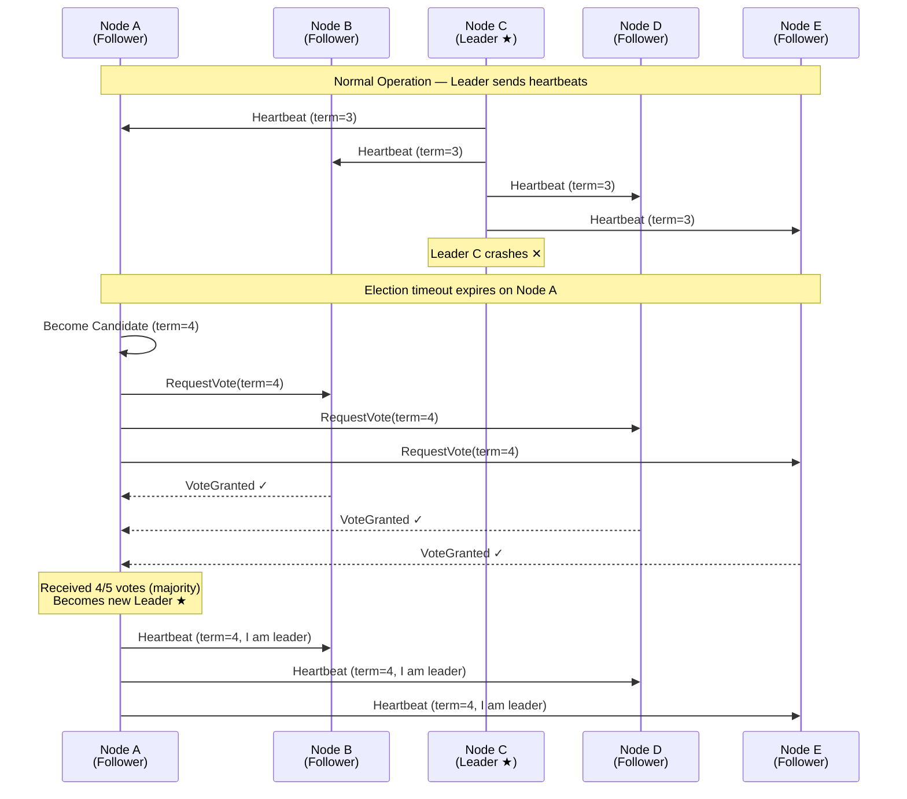

# 07 Distributed Consensus

> Distributed consensus is how multiple machines agree on a single value — it's the foundation of leader election, configuration management, and strongly consistent replicated systems.

## Why This Matters

Consensus is the hardest problem in distributed systems, and interviewers know it. When you propose a leader-follower database, they'll ask: "How is the leader elected?" When you say "we'll use ZooKeeper for coordination," they want to know: "What protocol does ZooKeeper use and why?" Understanding consensus — even at a high level — signals that you grasp the fundamental limits of distributed computing.

In interviews, consensus appears in three forms: (1) as a direct question ("Explain the Raft protocol"), (2) as a sub-problem ("How do you prevent split-brain in your database?"), and (3) as an infrastructure choice ("Why use etcd for service discovery?"). You don't need to implement Raft from scratch, but you must understand leader election, quorum writes, and what happens during network partitions.

Real systems running consensus: etcd (Raft) powers Kubernetes; ZooKeeper (ZAB) coordinates Kafka and HBase; Google's Chubby (Paxos) underpins Bigtable and GFS; CockroachDB uses Raft for every data range. These are the systems that keep the internet running.

## How It Works

### The Consensus Problem

Multiple nodes must agree on a value such that:
1. **Agreement:** All non-faulty nodes decide the same value.
2. **Validity:** The decided value was proposed by some node.
3. **Termination:** All non-faulty nodes eventually decide.

The **FLP impossibility result** proves that in an asynchronous system with even one possible crash, no deterministic algorithm can guarantee consensus. Practical protocols (Raft, Paxos) work around this by using timeouts and randomization — they sacrifice liveness guarantees in theory but work reliably in practice.

### Raft Protocol (Simplified)

Raft is designed to be understandable. It decomposes consensus into three sub-problems: leader election, log replication, and safety.

**Raft states:** Every node is in one of three states: **Follower** (default), **Candidate** (seeking votes), **Leader** (handles requests).

**Leader election flow:**
1. Followers expect periodic heartbeats from the leader.
2. If no heartbeat received within the **election timeout** (randomized, e.g., 150-300ms), follower becomes a candidate.
3. Candidate increments its **term** number and requests votes from all nodes.
4. A node votes for at most one candidate per term (first-come-first-served).
5. Candidate receiving votes from a **majority** (quorum) becomes the new leader.
6. Randomized timeouts prevent split votes (two candidates simultaneously).

**Log replication:** The leader receives client requests, appends them to its log, and replicates to followers. Once a **majority** of nodes confirm, the entry is committed and applied to the state machine.

### Paxos (High-Level)

Paxos (by Leslie Lamport) is the foundational consensus algorithm. It's more general than Raft but notoriously difficult to understand and implement. Key roles:

| Role | Responsibility |
|------|---------------|
| Proposer | Suggests a value for consensus |
| Acceptor | Votes on proposed values |
| Learner | Learns the decided value |

**Two-phase protocol:**
1. **Prepare phase:** Proposer sends a proposal number to acceptors. Acceptors promise not to accept proposals with lower numbers.
2. **Accept phase:** If a majority of acceptors promise, the proposer sends the actual value. Acceptors accept if no higher-numbered proposal has arrived.

**Multi-Paxos** optimizes for repeated consensus (like a replicated log) by electing a stable leader who skips the prepare phase for subsequent proposals. This is what Google's Chubby uses.

### Quorum Reads and Writes

For N replicas with W writers and R readers: if `W + R > N`, at least one reader overlaps with a writer, guaranteeing the reader sees the latest value.

| Quorum Setup | N=5, W=3, R=3 | Properties |
|-------------|----------------|------------|
| Overlap | At least 1 node has latest write | Strong consistency |
| Write tolerance | Can lose 2 nodes and still write | High durability |
| Read tolerance | Can lose 2 nodes and still read | High availability |

**Sloppy quorum:** During a partition, allow writes to nodes outside the designated replicas ("hinted handoff"). Improves availability but weakens consistency. Used by DynamoDB.

## The Split-Brain Problem

Split-brain occurs when a network partition causes two nodes to both believe they are the leader. Both accept writes independently, leading to **divergent state** and potential data corruption.

| Prevention Mechanism | How It Works | Used By |
|---------------------|-------------|---------|
| Majority quorum | Leader needs majority support; partition minority can't elect | Raft, Paxos, ZAB |
| Fencing tokens | New leader gets a monotonically increasing token; old token is rejected | ZooKeeper |
| STONITH | "Shoot The Other Node In The Head" — forcibly power off old leader | Pacemaker/Corosync |
| Lease-based | Leader holds a time-limited lease; must renew to stay leader | Chubby, etcd |

## ZooKeeper and etcd

| Feature | ZooKeeper | etcd |
|---------|-----------|------|
| Protocol | ZAB (ZooKeeper Atomic Broadcast) | Raft |
| Language | Java | Go |
| Data model | Hierarchical znodes (like filesystem) | Flat key-value |
| Watch mechanism | One-time watches | Streaming watches |
| Typical use | Kafka coordination, HBase | Kubernetes (all cluster state) |
| Consistency | Linearizable writes, serializable reads | Linearizable reads and writes |

**Common uses:** Leader election, distributed locks, service discovery, configuration management, cluster membership.

## Key Concepts

| Concept | Description | When to Use |
|---------|-------------|-------------|
| Raft | Understandable consensus: leader election + log replication | Default consensus choice for new systems |
| Paxos | Foundational consensus, more complex | Academic, Google infrastructure |
| Quorum (W+R>N) | Overlap guarantees latest-write visibility | Leaderless replicated data stores |
| Leader election | Consensus to pick one coordinator | Databases, message brokers, schedulers |
| Fencing token | Monotonic token to prevent stale leaders | Distributed locks, leader failover |
| ZAB | ZooKeeper's consensus protocol | Kafka, HBase, Hadoop ecosystem |

## Trade-offs

| Approach A | Approach B | Choose A When | Choose B When |
|-----------|-----------|--------------|--------------|
| Consensus (Raft/Paxos) | Gossip protocol | Need strong consistency, leader election | Need availability, AP system, membership |
| ZooKeeper | etcd | Existing Hadoop/Kafka ecosystem | Kubernetes ecosystem, Go-native |
| Strict quorum | Sloppy quorum | Consistency critical | Availability during partitions |
| Single leader consensus | Multi-Paxos | Simple coordination need | High-throughput replicated state machine |

## Interview Cheat Sheet

- **Raft > Paxos** for interviews — it's designed to be explainable. Walk through leader election step by step.
- A quorum requires **⌊N/2⌋ + 1** nodes. For N=5, quorum is 3. For N=3, quorum is 2.
- **Odd cluster sizes** (3, 5, 7) are standard because they maximize fault tolerance per node. N=4 tolerates 1 failure, same as N=3.
- Split-brain = two leaders = data corruption. **Always mention this risk** and how your design prevents it.
- ZooKeeper/etcd should be used as **coordination services**, not as general-purpose databases. They're designed for small, critical metadata.
- Consensus requires **synchronous assumptions** (timeouts) in practice, despite theoretical impossibility results (FLP).

## Common Interview Questions

1. "How does leader election work?" — Raft: timeout → candidate → request votes → majority wins. Randomized timeouts prevent ties.
2. "What is split-brain and how do you prevent it?" — Two leaders diverge. Prevent with majority quorum — a minority partition can't elect a leader.
3. "Explain the difference between Raft and Paxos." — Same problem, different design. Raft separates into leader election + log replication and is easier to understand. Paxos is more general but harder to implement.
4. "Why use ZooKeeper?" — For coordination tasks: leader election, distributed locks, config management. Not for storing application data.
5. "What happens if 2 of 5 nodes go down?" — System continues — 3 remaining nodes form a quorum. If 3 go down, system becomes unavailable (no quorum).

## Deep Dive: Why Odd-Numbered Clusters?

A cluster of size N tolerates ⌊(N-1)/2⌋ failures:

| Cluster Size | Quorum | Failures Tolerated | Extra Nodes vs N-1 |
|-------------|--------|-------------------|-------------------|
| 3 | 2 | 1 | — |
| 4 | 3 | 1 | 1 extra node, same fault tolerance |
| 5 | 3 | 2 | — |
| 6 | 4 | 2 | 1 extra node, same fault tolerance |
| 7 | 4 | 3 | — |

Notice: N=4 tolerates the same number of failures as N=3, but requires an additional node. The extra node adds cost and network overhead without improving fault tolerance. This is why production consensus clusters are almost always 3, 5, or 7 nodes.

**Production recommendation:**
- **3 nodes** — minimum viable. Tolerates 1 failure. Suitable for most applications (etcd in small Kubernetes clusters).
- **5 nodes** — recommended for production. Tolerates 2 failures. Used by most Kafka, ZooKeeper, and etcd deployments.
- **7 nodes** — rarely needed. Tolerates 3 failures. Only for critical infrastructure requiring extreme availability.

**Interview tip:** When an interviewer asks "how many ZooKeeper nodes?", say "5 — it tolerates 2 failures, which covers a node crash plus a rolling upgrade simultaneously." This level of operational reasoning impresses more than theoretical explanations.
