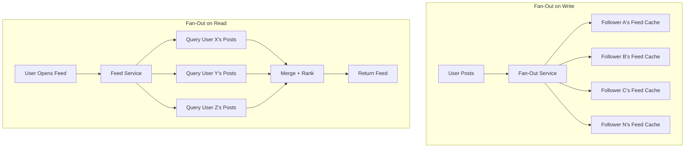

# 01 Fan-Out Patterns

> Fan-out determines how content reaches millions of users — get this wrong and your feed takes seconds instead of milliseconds.

## Why This Matters

Fan-out is one of the most frequently tested patterns in system design interviews. Any question involving news feeds, timelines, notification systems, or activity streams requires you to reason about fan-out strategies. Interviewers expect you to know the trade-offs between pushing content eagerly versus pulling it lazily — and when to combine both.

The classic example is Twitter's timeline architecture, which has been discussed publicly and forms the basis of many interview questions. Understanding fan-out signals to the interviewer that you can think about write amplification, storage costs, and latency trade-offs at scale. It also shows you understand that one-size-fits-all solutions rarely work when user behavior varies dramatically (a user with 50 followers versus one with 50 million).

If you're asked to design a social media feed, notification system, or any content distribution pipeline, fan-out is the core architectural decision you need to make in the first 10 minutes.

## The Pattern

### How It Works

Fan-out describes how a single write event (e.g., a new post) gets distributed to all interested consumers (e.g., followers). There are two fundamental approaches:

**Fan-Out on Write (Push Model):** When a user publishes content, the system immediately writes a copy to every follower's feed/inbox. The write is expensive, but reads are cheap — each user just reads their pre-built feed.

**Fan-Out on Read (Pull Model):** When a user opens their feed, the system queries all followed accounts in real time, merges and ranks results, then returns the feed. Writes are cheap, but reads are expensive.



### The Celebrity Problem

A user with 50 million followers creates massive write amplification under fan-out on write. Writing to 50 million feed caches for a single tweet is slow, expensive, and wasteful if most followers never check their feed.

### Variations

**Hybrid Fan-Out (Twitter's Approach):**
- **Normal users (< 5K followers):** Fan-out on write. Pre-compute feeds for fast reads.
- **Celebrities (> 5K followers):** Fan-out on read. When a follower opens their feed, celebrity posts are fetched and merged at read time.
- The threshold is tunable and represents a write-cost vs read-latency trade-off.

**Selective Fan-Out:** Only push to active users (logged in within last N days). Dormant users get fan-out on read when they return.

**Tiered Fan-Out:** Push to L1 cache (hot users), write to persistent store for others. Lazy-load into cache on demand.

## When to Use This Pattern

| Signal in Interview | Apply This Pattern |
|---|---|
| "Design a news feed / timeline" | Core pattern — discuss both models + hybrid |
| "Design a notification system" | Fan-out on write to notification inboxes |
| "Design a content delivery system" | Fan-out on write to edge caches |
| "Users follow other users" | Immediately consider follower count distribution |
| "Real-time updates needed" | Push model with WebSocket fan-out |

## Trade-offs

| Pros | Cons |
|---|---|
| **Push:** Ultra-fast reads (pre-computed) | **Push:** High write amplification for popular users |
| **Push:** Simple read path | **Push:** Wasted work for inactive followers |
| **Pull:** No write amplification | **Pull:** Slow reads (N queries + merge at read time) |
| **Pull:** Always fresh data | **Pull:** High read-time compute cost |
| **Hybrid:** Best of both worlds | **Hybrid:** Complex routing logic and dual code paths |

## Real-World Examples

- **Twitter:** Hybrid model. Pre-computes timelines for regular users, merges celebrity tweets at read time. Uses Redis for timeline caches (~800 entries per user).
- **Instagram:** Fan-out on write for feed, with ranking applied at read time. Uses Cassandra for feed storage.
- **LinkedIn:** Fan-out on write to a feed store, with downstream services handling ranking and deduplication.

## Interview Cheat Sheet

- Default to **fan-out on write** for most social feed designs — it's simpler and optimizes for the common case (reads >> writes).
- Mention the **celebrity problem** proactively — interviewers love this.
- Propose the **hybrid approach** as your refined solution.
- Quantify: "If avg followers = 200, a post generates 200 writes. At 500 posts/sec, that's 100K feed writes/sec — manageable."
- Fan-out on write pairs naturally with **Redis sorted sets** for timeline storage.

## Common Interview Questions

1. "How would you design a Twitter-like news feed?" — Full hybrid fan-out discussion.
2. "A celebrity with 100M followers posts — what happens?" — Celebrity problem + hybrid solution.
3. "How do you handle a user who follows 10,000 accounts?" — Fan-out on read for their feed, or pre-compute with async workers.
4. "How do you keep the feed consistent when a user unfollows someone?" — Lazy deletion vs active cleanup.

## Deep Dive: The Hybrid Threshold

The threshold between push and pull (e.g., 5,000 followers) is not arbitrary — it's derived from cost modeling. Calculate: `(avg_fan_out_writes_per_second × cost_per_write)` vs `(read_requests_per_second × cost_per_merge_query)`. The crossover point where push becomes more expensive than pull defines your threshold. In practice, this threshold is dynamic — it shifts based on time of day, user activity patterns, and infrastructure capacity. Mention this nuance in interviews to demonstrate operational maturity.

---

## First-time Recognition Signals

When you read a brand-new system design prompt, this pattern is the right tool if you see:

- **"News feed / timeline / activity stream / home page personalized per user"** — Twitter, Instagram, Facebook, LinkedIn all use fan-out.
- **"One write triggers updates to many subscribers / followers"** — the literal definition of fan-out.
- **"Notification system / push notifications to N devices"** — fan-out on write to per-device queues.
- **"Mix of normal users and celebrities (one user → millions of followers)"** — hybrid fan-out (push for normal, pull for celebrities) is the right answer.
- **"Read latency must be < 100 ms on a personalized feed"** — pre-computed fan-out beats live merge at read time.

### Anti-signals (looks like this pattern, isn't)

- **"One-to-one chat / direct message"** — message routing to one recipient, not fan-out to followers.
- **"Global leaderboard or trending list (same for everyone)"** — a single computed view served from cache, not per-user fan-out.
- **"Small N followers, simple merge at read time is fast enough"** — fan-out adds write amplification you don't need; pull-on-read is fine until N grows.

---

### Intuition

Fan-out is the choice of *when* to do the work: at write time (push: when you tweet, copies are pushed to every follower's inbox) or at read time (pull: when a follower opens the app, scan everyone they follow and merge). Push is fast for readers and brutal for writers with many followers; pull is the opposite. Most real systems land on a *hybrid*: push for normal accounts, pull (or fan-out-on-read) for celebrities — because a single celebrity tweet would DOS the push pipeline.

### Worked Example: Push vs pull break-even

System: 500 posts/sec across all users. Average user follows 200 accounts and has 200 followers.

**Push (fan-out on write):**

```
Each post → write to 200 follower inboxes (Redis Sorted Set inserts)
Total writes/sec = 500 × 200 = 100,000 writes/sec
Per-write cost ≈ 0.5 ms (Redis) → ~50% of a 200k-QPS Redis node.
```

**Pull (fan-out on read):**

```
Active feed views/sec ≈ 10,000 (users actually opening the app).
Each view → fetch last 50 posts from each of 200 followees, then merge.
Total DB queries/sec = 10,000 × 200 = 2,000,000 queries/sec on post storage.
```

**Push wins by 20×** on this back-of-envelope (100k writes ≪ 2M reads). But add a celebrity with **10M followers** posting once:

```
Push: 1 post × 10M = 10,000,000 writes for one tweet (minutes to fan out).
Pull: their posts are read by their followers as part of the same 200-merge above.
```

**Hybrid threshold.** Push if `followers < K`, pull-and-merge if `followers ≥ K`. Solve for K:

```
Push cost     ≈ F × write_cost ≈ F × 0.5 ms = produced per post
Pull cost     ≈ F × (active_view_rate / total_followers) × read_cost
            ≈ proportional to F under typical view rates
```

For Twitter's published numbers, the break-even sits around **K ≈ 10,000–100,000 followers**: below that, push wins; above that, pull-and-merge at read time wins.

| Strategy | Writer cost | Reader cost | Best for |
|---|---|---|---|
| Pure push | O(followers) per post | O(1) — read inbox | Most users (median followers small) |
| Pure pull | O(1) per post | O(follows) per view | Celebrities |
| Hybrid (Twitter) | push if F<K, else nothing | O(1) inbox + O(few celebs) merge | Real-world |

**Surprise:** Twitter flipped from push-only to hybrid (2013 → 2017) because a single celebrity tweet was DOSing the fan-out pipeline. **Lesson:** plan for a celebrity threshold from day 1; production fan-out is *never* purely push or pull.

### Further Reading

- [Twitter — The Infrastructure Behind Twitter: Scale (2017)](https://blog.twitter.com/engineering/en_us/topics/infrastructure/2017/the-infrastructure-behind-twitter-scale) — hybrid fan-out update.
- [Twitter Timelines at Scale (Raffi Krikorian, QCon 2013)](https://www.infoq.com/presentations/Twitter-Timeline-Scalability/) — original push-fan-out talk.
- [High Scalability — Twitter timeline architecture](http://highscalability.com/blog/2013/7/8/the-architecture-twitter-uses-to-deal-with-150m-active-users.html)
- [Instagram Engineering blog](https://instagram-engineering.com/) — feed and stories fan-out at photo scale.

