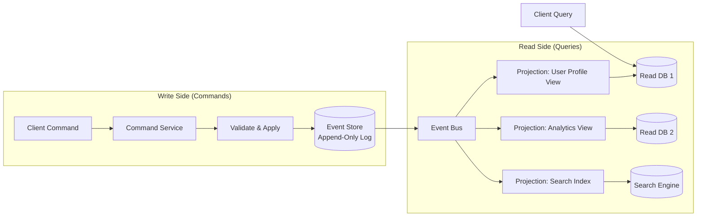

# 02 Event Sourcing & CQRS

> Instead of storing current state, store every change that ever happened — then derive any view you need.

## Why This Matters

Event sourcing and CQRS appear in interviews for systems requiring audit trails, temporal queries, or complex domain logic. When an interviewer asks you to design a banking system, order management platform, or collaborative editor, these patterns should surface naturally. They signal that you understand the limitations of CRUD and can reason about data models beyond simple row updates.

CQRS (Command Query Responsibility Segregation) often accompanies event sourcing but is independently useful. Any time your read and write patterns have drastically different performance requirements, CQRS is the answer. This comes up in e-commerce (high-volume reads for product pages, lower-volume writes for orders) and analytics systems.

Interviewers test these patterns to evaluate whether you can handle complexity without over-engineering. Knowing when NOT to use event sourcing is as important as knowing when to use it.

## The Pattern

### How It Works

**Event Sourcing:** Instead of storing the current state of an entity, you store an append-only sequence of events that describe every change. The current state is derived by replaying events from the beginning (or from a snapshot).

**CQRS:** Separate the write model (commands that produce events) from the read model (materialized views optimized for queries). Events flow from the write side to the read side through an event bus.



**Event Replay:** To rebuild state, replay all events for an entity. To create a new read model, replay the entire event log through a new projection.

**Snapshots:** For entities with many events, periodically save a snapshot of the current state. Replay only events after the snapshot.

### Variations

**Pure Event Sourcing:** No separate read store. Current state is always computed by replaying events. Simple but slow for read-heavy systems.

**Event Sourcing + CQRS:** Events are the source of truth on the write side. Multiple read-optimized projections are maintained asynchronously. This is the production-grade approach.

**CQRS Without Event Sourcing:** Separate read and write databases, but the write side uses traditional CRUD. Simpler to implement when you don't need full event history.

## When to Use This Pattern

| Signal in Interview | Apply This Pattern |
|---|---|
| "Design a banking / payment system" | Event sourcing for audit trail + CQRS for balance queries |
| "Design an order management system" | Event sourcing for order lifecycle tracking |
| "Need complete audit history" | Event sourcing is the natural fit |
| "Read and write patterns differ wildly" | CQRS to independently scale read/write |
| "Design a collaborative editor" | Event sourcing for operation log / conflict resolution |
| "Undo/redo functionality needed" | Event sourcing — replay minus the undone event |

## Trade-offs

| Pros | Cons |
|---|---|
| Complete audit trail for free | Eventual consistency between write and read models |
| Replay events to build any view | Event schema evolution is painful |
| Temporal queries ("state at time T") | Increased storage requirements |
| Independent scaling of read/write | Higher complexity — two models to maintain |
| Natural fit for event-driven architectures | Not worth it for simple CRUD applications |

## Real-World Examples

- **Banking Systems:** Every transaction is an event (deposit, withdrawal, transfer). Account balance is derived by summing events. Regulators require this level of auditability.
- **LinkedIn:** Uses event sourcing for activity feeds. Each user action is an event that feeds into multiple projections (feed, notifications, analytics).
- **Walmart:** CQRS for product catalog — separate write path for inventory updates from the read path serving millions of product page views.

## Interview Cheat Sheet

- Event sourcing stores **events**, not state. The event store is append-only.
- CQRS = different models for reads and writes. They can use different databases.
- **Snapshots** prevent slow replay for entities with thousands of events.
- Read models are **eventually consistent** — call this out and explain why it's acceptable.
- Use event sourcing when you need **auditability, temporal queries, or event replay**.
- Don't propose event sourcing for a simple CRUD app — interviewers will question your judgment.

## Common Interview Questions

1. "Design a banking ledger system" — Event sourcing for transaction log, CQRS for balance/statement views.
2. "How do you handle schema changes in the event store?" — Upcasting (transform old events to new schema on read) or versioned event types.
3. "What happens if the read model gets out of sync?" — Rebuild from event store by replaying all events.
4. "How do you query the current balance?" — Read from the materialized view, not by replaying events on every request.

## Deep Dive: Event Schema Evolution

The hardest operational challenge with event sourcing is evolving event schemas over time. When `OrderPlaced_v1` needs a new field, you have three strategies: (1) **Upcasting** — transform old events to the new schema at read time, (2) **Versioned events** — store both `v1` and `v2`, projections handle both, (3) **Copy-and-transform** — migrate the event store by rewriting events (rarely done, breaks immutability). In interviews, mention upcasting as the default approach and explain that the event store itself remains immutable — transformations happen in the projection layer.

---

## First-time Recognition Signals

When you read a brand-new system design prompt, this pattern is the right tool if you see:

- **"Full audit log of every state change / regulatory replay"** (banking, healthcare, trading) — events are the source of truth.
- **"Time-travel: replay the system as of an arbitrary past timestamp"** — only possible if events are the persistent record.
- **"Many different read views derived from the same writes"** (search index + cache + analytics + dashboard) — CQRS separates writes from each read model.
- **"Complex domain with rich invariants"** (DDD, aggregates, e-commerce, insurance) — append-only event streams preserve intent.
- **"Cross-service workflows that must be replayable for debugging"** — event log doubles as a debug timeline.

### Anti-signals (looks like this pattern, isn't)

- **"Simple CRUD app with two read patterns"** — CRUD + an index is enough; event sourcing is operational complexity you'll regret.
- **"User must read what they just wrote immediately"** — projections are eventually consistent; read-your-writes needs special handling.
- **"Small team unfamiliar with event-driven systems"** — the learning curve and debugging cost are real; pick boring CRUD until pain forces the switch.

---

### Intuition

Event sourcing stores every change to your data as an immutable log of events instead of a single mutable row. The "current state" is derived by replaying the log. CQRS pairs naturally with it by separating the *write* model (commands → events) from the *read* model (projections optimized per query). The price is operational complexity — snapshotting, replays, multiple data stores. The prize is perfect auditability *and* the ability to build new read views from history whenever you like.

### Worked Example: Replaying 6 months of orders

Order service has 6 months of events: 1,000 orders/day × 5 events/order × 180 days = **900,000 events**, ~500 B each (≈ 450 MB on disk).

**Naive full rebuild from the event log:**

```
Read 900k events in order:
  - I/O: 450 MB sequential read ≈ 5 s on NVMe SSD
  - Deserialize + apply to in-memory model: 900k × 50 µs = 45 s
Total cold rebuild: ~50 s
```

50 s is fine for a one-off rebuild. The cost matters when you change the *projector* (the code building a read view) and have to rebuild *every* aggregate from history:

```
180,000 orders alive × ~5 events each × 50 µs apply = ~45 s sequential
With 8-way parallelism → ~6 s.
```

**With snapshotting every 1k events** per aggregate:

```
Most orders only have ~5 events (short-lived) → snapshots add no benefit.
But long-lived aggregates (a customer with 10,000 lifetime events):
  Without snapshots: 10,000 × 50 µs = 500 ms per aggregate
  With snapshot every 1k: latest snapshot + ≤999 tail events ≈ 50 ms
  → 10× speedup per aggregate
```

**Storage cost of snapshots:** ~2 KB per snapshot, one per 1k events ≈ 2 KB per aggregate. Negligible compared to the event log itself.

| Operation | No snapshots | Snapshots every 1k |
|---|---|---|
| Cold-load a short-lived aggregate (5 events) | 250 µs | 250 µs (no snap exists) |
| Cold-load a long-lived aggregate (10k events) | 500 ms | 50 ms |
| Full system projection rebuild | 50 s | 5 s |
| Storage overhead | 0 | +5–10 % |

**Surprise:** the biggest win from snapshotting isn't per-aggregate latency — it's reducing **system-wide rebuild time** after a projector change, which is precisely when event-sourcing's operational complexity needs to pay back. **Lesson:** size the snapshot interval by the *longest-lived* aggregate, not the average. Without snapshots, a "harmless" projector change can turn into a 6-hour outage.

### Further Reading

- [Martin Fowler — Event Sourcing (bliki)](https://martinfowler.com/eaaDev/EventSourcing.html) + [CQRS](https://martinfowler.com/bliki/CQRS.html) — the canonical entry points.
- Greg Young — *CQRS Documents* (PDF, freely available) — foundational reference from the term's coiner.
- [EventStore — Event Sourcing docs](https://www.eventstore.com/event-sourcing) — practical patterns: snapshots, projections, sagas.
- [Microsoft Learn — CQRS pattern](https://learn.microsoft.com/en-us/azure/architecture/patterns/cqrs) — reference architecture with trade-offs.

