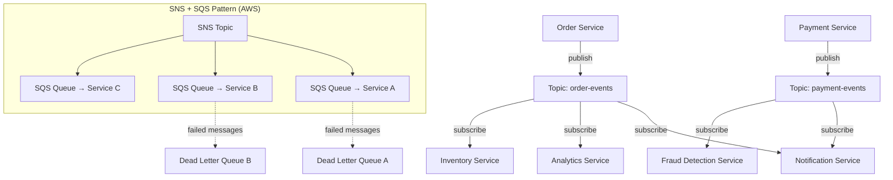

# 03 Pub/Sub Messaging

> Pub/sub decouples producers from consumers — the backbone of every scalable, event-driven architecture.

## Why This Matters

Publish-subscribe messaging is foundational to nearly every system design interview. When an interviewer asks how services communicate asynchronously, how you handle spikes in traffic, or how you decouple microservices, pub/sub is the answer. It appears in designs for notification systems, order pipelines, real-time analytics, and log aggregation.

Interviewers expect you to distinguish between pub/sub and point-to-point queues, understand delivery guarantees, and know real AWS/GCP/Azure service names. Saying "I'd use a message queue" is not enough — you need to specify whether you mean a topic (fan-out to all subscribers) or a queue (one consumer gets each message), and why.

The SNS+SQS pattern (or its equivalents) is so common in production systems that knowing it signals real-world experience. Dead letter queues, consumer groups, and idempotency are the details that separate strong candidates from average ones.

## The Pattern

### How It Works

A **publisher** sends messages to a **topic** (or channel). All **subscribers** registered to that topic receive a copy of every message. The publisher doesn't know or care who the subscribers are.

**Point-to-Point Queue:** Each message is consumed by exactly one consumer. Used for task distribution (e.g., processing jobs).

**Topic-Based Pub/Sub:** Each message is delivered to ALL subscribers. Used for event notification and fan-out.

### Delivery Guarantees

| Guarantee | Behavior | Example |
|---|---|---|
| **At-most-once** | Fire and forget. Messages may be lost. | UDP, basic webhooks |
| **At-least-once** | Retry until acknowledged. Duplicates possible. | SQS, Kafka (default) |
| **Exactly-once** | Each message processed exactly once. | Kafka with idempotent consumers (expensive) |

In practice, **at-least-once + idempotent consumers** is the standard approach. Exactly-once is extremely expensive and rarely necessary.

### Variations

**Consumer Groups (Kafka):** Multiple consumers in a group share partitions. Each message goes to exactly one consumer in the group, enabling parallel processing with ordering guarantees per partition.

**Fan-Out via SNS+SQS:** SNS topics fan out to multiple SQS queues. Each queue has its own retry policy, dead letter queue, and scaling. This is the standard AWS pattern for decoupled microservices.

**Dead Letter Queues (DLQ):** Messages that fail processing after N retries are moved to a DLQ for manual inspection or automated reprocessing. Always include DLQs in your design.

## When to Use This Pattern

| Signal in Interview | Apply This Pattern |
|---|---|
| "Services need to communicate asynchronously" | Pub/sub for event-driven decoupling |
| "Multiple services care about the same event" | Topic-based pub/sub (fan-out) |
| "Process tasks from a work queue" | Point-to-point queue with consumer groups |
| "Handle traffic spikes gracefully" | Queue as a buffer between producer and consumer |
| "Design a notification system" | Pub/sub topic per event type |

## Trade-offs

| Pros | Cons |
|---|---|
| Full decoupling — producers don't know consumers | Eventual consistency (messages have latency) |
| Independent scaling of producers and consumers | Message ordering is hard across partitions |
| Built-in buffering for traffic spikes | Debugging distributed flows is complex |
| Easy to add new consumers without changing producers | Exactly-once delivery is expensive |
| Retry and DLQ for fault tolerance | Additional infrastructure to manage |

## Real-World Examples

- **Amazon:** SNS+SQS for order processing. Order events fan out to fulfillment, billing, notification, and analytics services via separate queues.
- **Netflix:** Uses Apache Kafka for real-time event streaming. Viewing events flow to recommendation, analytics, and billing pipelines.
- **Uber:** Kafka for trip events. Every trip state change is published to topics consumed by pricing, ETA, driver matching, and analytics services.

## Interview Cheat Sheet

- **Topic** = fan-out to all subscribers. **Queue** = one consumer per message.
- Default to **at-least-once delivery + idempotent consumers**. Mention this explicitly.
- Always include **dead letter queues** for failed messages.
- **SNS+SQS** (AWS) or **Pub/Sub + Cloud Functions** (GCP) are standard patterns — use real service names.
- **Consumer groups** enable parallel processing while maintaining per-partition ordering.
- Pub/sub introduces **eventual consistency** — acknowledge this trade-off.
- Messages should be **small** (metadata + IDs). Large payloads go in object storage with a reference in the message.

## Common Interview Questions

1. "How do services communicate in your design?" — Pub/sub for events, queues for tasks.
2. "What if a consumer is down?" — Messages queue up. DLQ catches repeated failures. Consumer resumes on recovery.
3. "How do you ensure a message isn't processed twice?" — Idempotency keys. Consumer checks if the event ID was already processed.
4. "How do you handle message ordering?" — Partition by entity ID (e.g., order_id). Ordering within a partition is guaranteed.

## Deep Dive: Solving the Duplicate Message Problem

At-least-once delivery means consumers will occasionally receive the same message twice. The standard solution is **idempotency**: every message carries a unique `event_id`, and consumers maintain an idempotency store (e.g., a Redis set or database table of processed IDs). Before processing, the consumer checks if the `event_id` exists — if yes, skip it. For database operations, use **upsert** semantics or **idempotency keys** on the write. In interviews, state this pattern clearly: "All my consumers are idempotent — they check a deduplication store before processing, so at-least-once delivery is safe."
