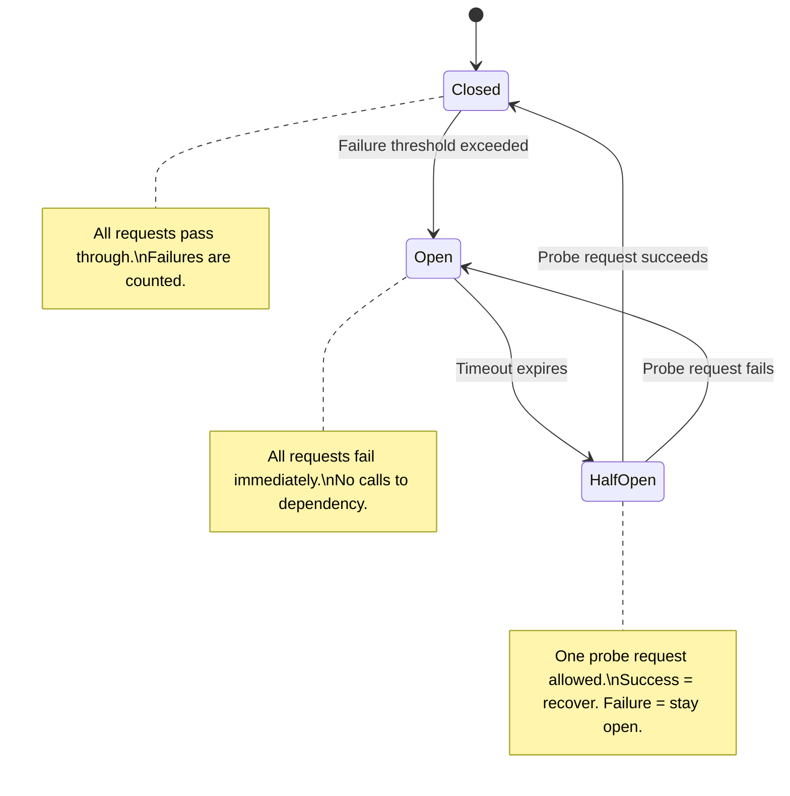

# 04 Circuit Breaker & Retry Patterns

> When a dependency fails, your system needs to fail gracefully — not cascade into a full outage.

## Why This Matters

Resilience patterns are tested in every system design interview that involves microservices, external API calls, or distributed dependencies. The moment you mention "Service A calls Service B," the interviewer will probe: "What happens when Service B is down?" If your answer isn't circuit breakers, retries with backoff, and graceful degradation, you'll lose points.

These patterns demonstrate operational maturity. Any engineer can design a happy-path system. Interviewers want to see that you think about failure modes, cascading failures, and recovery strategies. Netflix's Chaos Engineering culture (and their Hystrix library) popularized these patterns, and they remain the standard vocabulary for resilient distributed systems.

Circuit breakers, retries, bulkheads, and timeouts are complementary — they form a layered defense against dependency failures. Knowing how they interact and when to apply each one is what separates senior-level answers.

## The Pattern

### How It Works

A **circuit breaker** wraps calls to an external dependency and monitors failure rates. It has three states:



- **Closed (normal):** Requests flow through. The breaker counts failures. If failures exceed a threshold (e.g., 50% failure rate over 10 seconds), it trips to Open.
- **Open (tripped):** All requests **fail immediately** without calling the dependency. This prevents overwhelming a struggling service. After a timeout, it transitions to Half-Open.
- **Half-Open (probing):** A single probe request is allowed through. If it succeeds, the breaker resets to Closed. If it fails, it returns to Open.

### Exponential Backoff with Jitter

When retrying failed requests, use exponential backoff to avoid thundering herd:

```
wait_time = min(base_delay * 2^attempt + random_jitter, max_delay)
```

- **Attempt 1:** 100ms + jitter
- **Attempt 2:** 200ms + jitter
- **Attempt 3:** 400ms + jitter
- **Attempt 4:** 800ms + jitter
- Cap at `max_delay` (e.g., 30 seconds)

**Jitter is critical.** Without it, all failed clients retry at exactly the same intervals, creating synchronized spikes. Full jitter randomizes the wait across `[0, calculated_delay]`.

### Variations

**Bulkhead Pattern:** Isolate dependency calls into separate thread pools or connection pools. If one dependency stalls, it only exhausts its own pool — other dependencies remain unaffected. Think of watertight compartments on a ship.

**Timeout Pattern:** Set aggressive timeouts on all external calls. A slow response is often worse than a failed response because it holds resources (threads, connections) hostage.

**Graceful Degradation:** When a dependency is unavailable, return cached data, default values, or a reduced feature set instead of an error. Example: if the recommendation service is down, show trending items instead.

## When to Use This Pattern

| Signal in Interview | Apply This Pattern |
|---|---|
| "Service A depends on Service B" | Circuit breaker on the call boundary |
| "What if the database / cache is down?" | Retry with backoff + graceful degradation |
| "How do you prevent cascading failures?" | Circuit breaker + bulkhead + timeout |
| "External third-party API in your design" | Circuit breaker + retry + fallback |
| "High availability requirements" | Full resilience stack |

## Trade-offs

| Pros | Cons |
|---|---|
| Prevents cascading failures across services | Added latency from retry delays |
| Fast failure when dependency is down (circuit open) | Complexity in tuning thresholds and timeouts |
| Protects struggling services from being overwhelmed | False positives — circuit may open during transient issues |
| Enables graceful degradation | Stale data when serving from fallback/cache |
| Self-healing (half-open probe) | Monitoring overhead to track breaker states |

## Real-World Examples

- **Netflix Hystrix:** Pioneered the circuit breaker pattern for microservices. Each service dependency has its own circuit breaker with configurable thresholds. Now succeeded by Resilience4j.
- **AWS SDK:** Built-in exponential backoff with jitter for all API calls. Retry policies are configurable per operation.
- **Shopify:** Uses circuit breakers on all external payment gateway calls. If a gateway fails, traffic is routed to a backup gateway.

## Interview Cheat Sheet

- **Circuit breaker** prevents calling a known-failed dependency. **Retry** handles transient failures.
- Always pair retries with **exponential backoff + jitter** — never retry in a tight loop.
- **Bulkheads** isolate failures; **timeouts** bound waiting time. Use both with circuit breakers.
- Mention **graceful degradation** — what does the user see when a dependency is down?
- Only retry **idempotent** operations. Retrying a non-idempotent write can cause duplicates.
- Circuit breaker thresholds: typically 50% failure rate over a 10-second sliding window.
- Name concrete tools: Resilience4j (Java), Polly (.NET), or built-in cloud SDK retries.

## Common Interview Questions

1. "How do you handle a downstream service outage?" — Circuit breaker + fallback response.
2. "How do you prevent retry storms?" — Exponential backoff with jitter + circuit breaker.
3. "Service B is slow — how does that affect Service A?" — Timeouts + bulkhead isolation.
4. "How do you test resilience?" — Chaos engineering, fault injection, circuit breaker state monitoring.

## Deep Dive: Tuning Circuit Breaker Thresholds

The failure threshold and recovery timeout are the two most important tuning parameters. Set the **failure threshold** too low and the breaker trips on normal transient errors; set it too high and it doesn't protect against real outages. Start with 50% failure rate over a 10-second sliding window as a baseline. The **recovery timeout** (time in Open before transitioning to Half-Open) should be long enough for the dependency to recover — typically 30-60 seconds. In production, these values are tuned per dependency based on its SLA and failure characteristics. In interviews, state reasonable defaults and explain that they're tunable.
