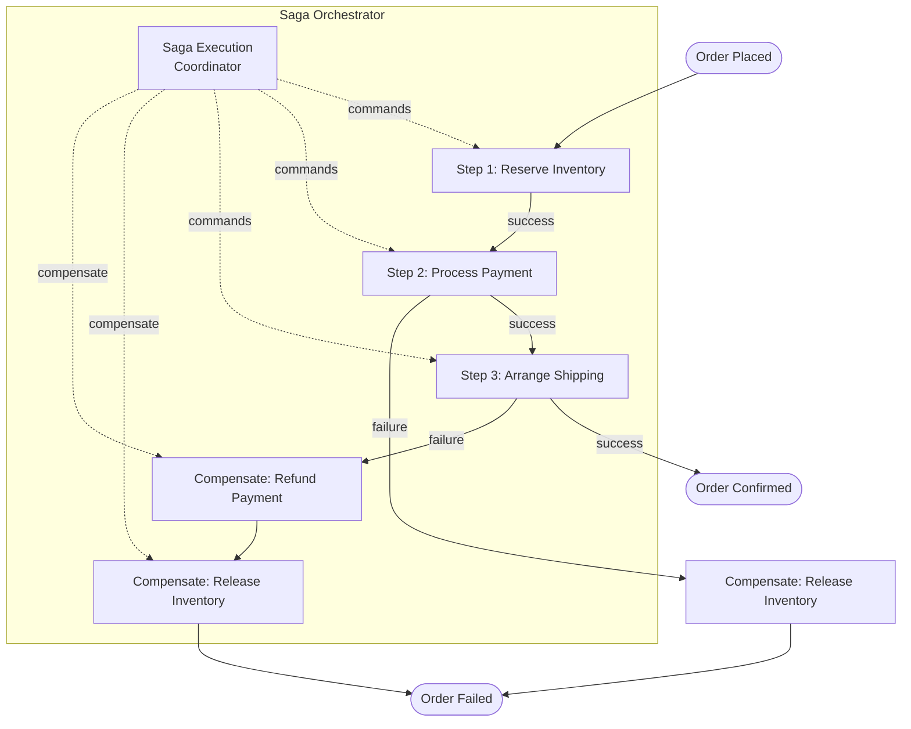

# 05 Saga Pattern

> When you can't use a distributed transaction, sagas coordinate multi-service workflows with compensating rollbacks.

## Why This Matters

The saga pattern appears in any interview involving transactions that span multiple services — e-commerce checkout, travel booking, money transfers, or order fulfillment. The moment your design has "Service A writes, then Service B writes, then Service C writes," the interviewer will ask: "What if Service C fails? How do you roll back A and B?"

You cannot use traditional ACID transactions across microservices. Two-phase commit (2PC) is too slow and creates tight coupling. Sagas are the industry-standard alternative. Knowing the difference between choreography and orchestration — and when to use each — is a strong differentiator.

Interviewers also test your understanding of **compensating transactions** — the logic required to undo a completed step. This is where many candidates struggle, because compensating actions are not simply "delete the row." They're domain-specific operations that restore business invariants.

## The Pattern

### How It Works

A **saga** is a sequence of local transactions across services. Each step either succeeds and triggers the next step, or fails and triggers **compensating transactions** for all previously completed steps.



### Choreography vs Orchestration

**Choreography:** Each service listens for events and decides what to do next. No central coordinator. Services publish events that trigger the next step.
- Pros: Loose coupling, simple for small workflows.
- Cons: Hard to track saga state, difficult to debug, implicit flow logic.

**Orchestration:** A central **Saga Execution Coordinator (SEC)** directs the workflow. It tells each service what to do and handles failures.
- Pros: Clear flow logic, easy to monitor, centralized error handling.
- Cons: Single point of coordination (mitigate with redundancy), tighter coupling to the orchestrator.

**Rule of thumb:** Use choreography for 2-3 step sagas. Use orchestration for 4+ steps or complex branching logic.

### Compensating Transactions

Each forward step must have a defined compensating action:

| Forward Step | Compensating Action |
|---|---|
| Reserve inventory | Release reserved inventory |
| Charge credit card | Issue refund |
| Create shipping label | Cancel shipment |
| Send confirmation email | Send cancellation email |

Compensating actions must be **idempotent** — they may be invoked more than once during retries.

### Variations

**Parallel Sagas:** Independent steps execute in parallel (e.g., reserve inventory AND validate address simultaneously). Compensation waits for all parallel steps.

**Nested Sagas:** A step in one saga triggers a child saga. Parent saga compensates by aborting the child saga.

## When to Use This Pattern

| Signal in Interview | Apply This Pattern |
|---|---|
| "Multi-service transaction" (order, booking, transfer) | Saga with orchestration |
| "What if step 3 fails after step 1 and 2 succeed?" | Compensating transactions |
| "Design an e-commerce checkout pipeline" | Saga across inventory, payment, shipping |
| "Design a travel booking system" | Saga across flights, hotels, car rentals |
| "How do you handle partial failures?" | Saga with defined rollback steps |

## When NOT to Use This Pattern

- **Single-service transactions:** Use regular database ACID transactions.
- **Read-only operations:** No state changes to compensate.
- **Simple two-step flows:** A retry or idempotent write may suffice.
- **When strong consistency is required:** Sagas provide eventual consistency. If you need immediate consistency, consider a synchronous approach with 2PC (if latency is acceptable).

## Trade-offs

| Pros | Cons |
|---|---|
| Maintains data consistency across services | Eventually consistent — intermediate states are visible |
| No distributed locks or 2PC | Compensating logic is complex and domain-specific |
| Each service owns its own data | Debugging saga failures requires centralized logging |
| Scales well in microservice architectures | Idempotency required for all steps and compensations |

## Real-World Examples

- **Amazon:** Order processing uses orchestrated sagas. The order orchestrator coordinates inventory, payment, fraud check, and fulfillment services.
- **Uber:** Trip lifecycle is a saga — rider request, driver matching, trip start, trip end, payment. Each step has compensating actions for cancellations.
- **Booking.com:** Hotel reservation sagas coordinate room holds, payment authorization, and confirmation across hotel partner APIs.

## Interview Cheat Sheet

- Sagas = sequence of local transactions + compensating transactions for rollback.
- **Choreography** for simple flows (2-3 steps). **Orchestration** for complex flows (4+ steps).
- Every forward step needs a **compensating action** — define these explicitly.
- Sagas are **eventually consistent** — intermediate states are visible to users.
- Compensating actions must be **idempotent**.
- Use a **saga log** (persistent state machine) to track progress and recover from orchestrator failures.
- Don't forget the **SEC failure case** — the orchestrator itself must be recoverable (persist saga state to a durable store).

## Common Interview Questions

1. "How do you handle distributed transactions across microservices?" — Sagas with orchestration.
2. "Design an order checkout flow" — Saga across inventory, payment, and shipping.
3. "What if the payment succeeds but shipping fails?" — Compensating transaction: refund the payment, release inventory.
4. "Choreography or orchestration — when do you pick each?" — Choreography for simple event chains, orchestration for complex multi-step workflows.

## Deep Dive: Saga State Recovery

The orchestrator maintains a **saga log** — a persistent record of which steps completed and which are pending. If the orchestrator crashes mid-saga, it reads the log on recovery and resumes from the last completed step. This log is typically stored in a durable database with the saga state machine (states: STARTED, STEP_N_COMPLETE, COMPENSATING, COMPLETED, FAILED). Each transition is written atomically. In interviews, mention this explicitly: "The saga orchestrator persists its state so it can recover from crashes and resume or compensate correctly."

---

## First-time Recognition Signals

When you read a brand-new system design prompt, this pattern is the right tool if you see:

- **"Multi-step business transaction across services"** (order → reserve inventory → charge payment → notify shipping) — saga sequences the steps.
- **"Each service owns its own DB / no distributed transaction available"** — XA / 2PC is off the table; compensation is your atomicity story.
- **"Need to undo earlier steps if a later step fails"** (refund payment if shipping cannot allocate) — compensating actions are saga's core.
- **"Long-running workflow with human approvals / delays"** (loan application, KYC) — orchestration sagas (Temporal, Camunda, Step Functions).
- **"Microservices, each with its own database, doing one logical operation"** — choreographed sagas via events, or orchestrated sagas via a workflow engine.

### Anti-signals (looks like this pattern, isn't)

- **"Single DB / single service"** — a local ACID transaction is simpler, faster, and correct; saga is overkill.
- **"All steps inside one trusted service"** — transactional outbox + retries is enough; you don't need compensations.
- **"Strict atomicity required across services"** — saga is eventually atomic. If you must roll back as if nothing happened, redesign the boundary or use a globally consistent DB.

---

### Intuition

A saga is how you fake a distributed transaction across services that don't share a database. Each step is a local transaction that publishes "I'm done." If a later step fails, the saga runs **compensating actions** on the earlier steps to undo their effects. It's not "atomic" in the ACID sense — there's a window where partial work is visible — but it's the best we have when a true 2PC across services is too expensive or unavailable.

### Worked Example: Booking saga compensation

Three steps, in order: **(1) Payment** → **(2) Inventory reservation** → **(3) Shipping label**.

**Failure at step 2 (inventory unavailable):**

```
T0:  Step 1  Payment.charge($100)             → success
T1:  Step 2  Inventory.reserve(item=X, qty=1) → FAILURE (out of stock)
T2:  Compensate Step 1: Payment.refund($100)
End: User sees "sorry, out of stock; refund issued"
```

Compensations fired: **Payment.refund** only. No shipping was reserved → no compensation needed there.

**Failure at step 3 (shipping integration timeout):**

```
T0:  Step 1  Payment.charge($100)             → success
T1:  Step 2  Inventory.reserve(item=X, qty=1) → success
T2:  Step 3  Shipping.createLabel(addr=Y)     → TIMEOUT
T3:  Retry Step 3 (with backoff)              → still failing
T4:  Compensate Step 2: Inventory.release(item=X, qty=1)
T5:  Compensate Step 1: Payment.refund($100)
End: Order marked FAILED, user sees "we couldn't ship; refund issued"
```

Compensations fired: **Inventory.release**, then **Payment.refund** — **in reverse order** (LIFO unwinding).

| Failing step | Compensations fired | Order |
|---|---|---|
| 1 (Payment) | none | — |
| 2 (Inventory) | Payment.refund | reverse |
| 3 (Shipping) | Inventory.release, Payment.refund | reverse |

**Two non-negotiable properties:**

1. Compensations run **in reverse order** of the original steps.
2. Compensations must be **idempotent** — they may run twice on retry (e.g., `refund(payment_id)` should be a no-op the second time).

**Subtle trap:** what if compensation itself fails? `Payment.refund` times out — you can't just give up; you've taken the customer's money. **Resolution:** mark the saga as `PENDING_MANUAL` and route to an ops queue. Sagas guarantee *eventual* atomicity, not strict atomicity — design for the manual-intervention case from day one.

**Choreography vs orchestration:**

| Approach | Pros | Cons |
|---|---|---|
| Choreography (each service listens for events) | Loosely coupled; no central component | Hard to see the whole flow; testing is painful |
| Orchestration (central saga coordinator) | Visible flow; easier debugging | Coordinator is a single point of failure (mitigate with Temporal / Raft-backed store) |

### Further Reading

- [Chris Richardson — Microservices.io: Saga pattern](https://microservices.io/patterns/data/saga.html) — the standard reference.
- [Microsoft — Saga distributed transaction pattern](https://learn.microsoft.com/en-us/azure/architecture/reference-architectures/saga/saga)
- [Temporal — Sagas, compensation, and workflows](https://docs.temporal.io/encyclopedia/application-design-patterns) — orchestrator with built-in retry & compensation.
- Hector Garcia-Molina & Kenneth Salem, *Sagas* (SIGMOD '87) — the original paper coining the term.

