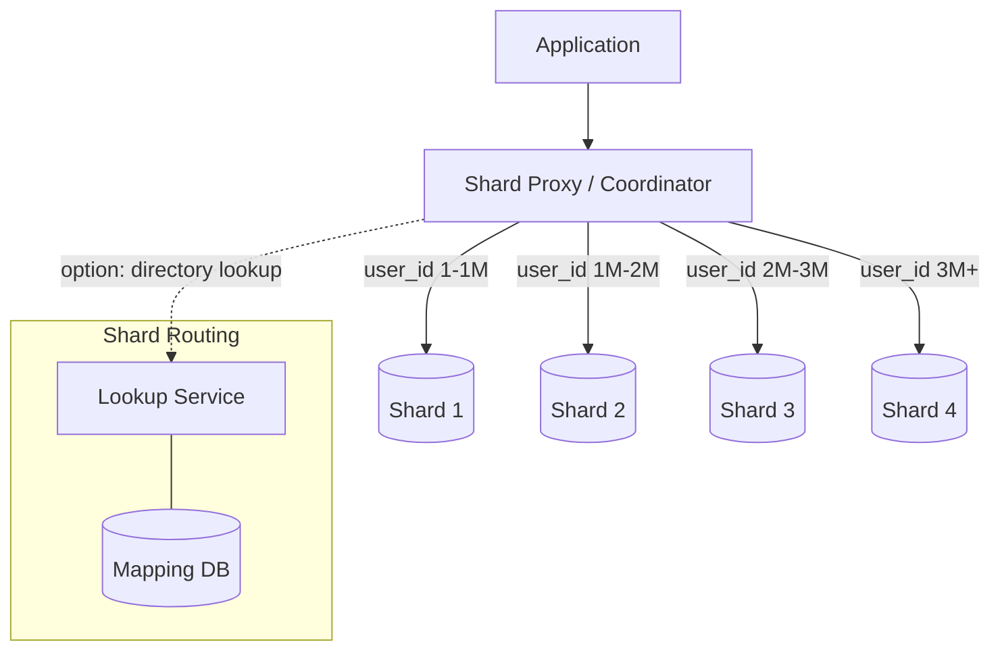

# 06 Sharding Strategies

> When one database can't hold all your data, sharding splits it across many — the question is how.

## Why This Matters

Sharding is one of the most tested topics in system design interviews. Any question involving "billions of rows," "petabytes of data," or "millions of QPS" eventually requires partitioning data across multiple database nodes. Interviewers expect you to know the three sharding strategies, articulate their trade-offs, and reason about the hardest parts: resharding and cross-shard queries.

This pattern comes up in designs for user databases, chat systems, analytics platforms, and any system that outgrows a single database. Saying "I'd shard the database" without explaining HOW you'd shard it is insufficient. You need to specify the shard key, the strategy, and how you handle the edge cases.

Understanding sharding also unlocks discussions about consistent hashing (Phase 2), replication, and data locality — all topics that compound into a strong performance in senior-level interviews.

## The Pattern

### How It Works

**Sharding** (horizontal partitioning) splits data across multiple database instances. Each shard holds a subset of the data. A **shard key** determines which shard a given record belongs to.



### Three Sharding Strategies

**1. Hash-Based Sharding**
`shard = hash(shard_key) % num_shards`
- Distributes data evenly across shards.
- Adding/removing shards requires rehashing (mitigated by consistent hashing).
- No range queries across the shard key.

**2. Range-Based Sharding**
`shard = range(shard_key)` — e.g., users A-F on shard 1, G-L on shard 2.
- Supports range queries efficiently.
- Risk of **hotspots** if data is unevenly distributed (e.g., more users with names starting A-F).
- Common for time-series data: shard by date range.

**3. Directory-Based (Lookup) Sharding**
A lookup table maps each shard key to its shard.
- Maximum flexibility — any key can be on any shard.
- The lookup service is a single point of failure and a potential bottleneck.
- Resharding is easy — just update the mapping.

### Choosing a Shard Key

The shard key is the most critical decision. A good shard key has:
- **High cardinality** — many distinct values for even distribution.
- **Even distribution** — no single value generates disproportionate traffic.
- **Query alignment** — most queries include the shard key, avoiding cross-shard lookups.

| Use Case | Good Shard Key | Bad Shard Key |
|---|---|---|
| User database | `user_id` | `country` (uneven distribution) |
| Chat messages | `conversation_id` | `timestamp` (hot shard for "now") |
| E-commerce orders | `customer_id` | `order_status` (low cardinality) |

### Variations

**Shard Proxy (Vitess Model):** A proxy layer sits between the application and sharded databases. The app sends queries as if talking to a single database; the proxy routes to the correct shard. Vitess does this for MySQL at YouTube scale.

**Hierarchical Sharding:** First shard by region (geographic), then by user_id within each region. Combines data locality with even distribution.

## When to Use This Pattern

| Signal in Interview | Apply This Pattern |
|---|---|
| "Billions of records" or "petabytes of data" | Sharding to distribute storage |
| "Millions of queries per second" | Sharding to distribute read/write load |
| "Single database is a bottleneck" | Shard to horizontally scale |
| "Design a chat system at scale" | Shard by conversation_id |
| "Global user base with data locality needs" | Geographic sharding |

## Trade-offs

| Pros | Cons |
|---|---|
| Horizontal scaling — add shards as data grows | Cross-shard queries are expensive |
| Each shard can be independently replicated | Resharding is operationally complex |
| Isolates failures to a single shard | JOIN across shards is impractical |
| Better data locality when sharded geographically | Application complexity increases |

## Real-World Examples

- **YouTube (Vitess):** Uses Vitess to shard MySQL databases. The proxy handles routing, resharding, and schema migrations transparently.
- **Instagram:** Shards PostgreSQL by user_id using consistent hashing. Each logical shard maps to a physical database with replication.
- **Discord:** Shards message storage by `channel_id`. Each channel's messages live on a single shard for fast retrieval.

## Interview Cheat Sheet

- Three strategies: **hash-based**, **range-based**, **directory-based** — know trade-offs of each.
- **Shard key** choice is the most important decision. Optimize for query patterns and even distribution.
- **Cross-shard queries** are expensive — design to minimize them.
- **Resharding** is the hardest operational challenge. Mention consistent hashing or Vitess-style online resharding.
- Pair sharding with **replication** — each shard should have read replicas for availability.
- A **shard proxy** abstracts sharding from the application layer.

## Common Interview Questions

1. "How would you scale the database for 1 billion users?" — Hash-based sharding by user_id.
2. "How do you handle a query that spans multiple shards?" — Scatter-gather: query all shards in parallel, merge results. Expensive — design to avoid it.
3. "What happens when you need to add more shards?" — Consistent hashing minimizes data movement. Alternatively, double shards and split ranges.
4. "How do you handle hotspots?" — Monitor shard load, split hot shards, or add a secondary shard key.

## Deep Dive: Resharding Without Downtime

Resharding (adding shards to a running system) is the operational nightmare of sharding. The Vitess approach: (1) Add new shards with empty databases. (2) Start replicating data from old shards to new shards using binlog streaming. (3) Once caught up, atomically update the routing table to point to new shards. (4) Drain old shards. This is called **online resharding** and avoids downtime. In interviews, mention that resharding is hard but solvable with proxy-based architectures, and name Vitess as a concrete example.

---

## First-time Recognition Signals

When you read a brand-new system design prompt, this pattern is the right tool if you see:

- **"Choose how to partition this dataset"** (and the interviewer is fishing for a *strategy*, not just "shard it") — name range, hash, directory, consistent hashing.
- **"Avoid hot keys / hot shards"** — consistent hashing with virtual nodes; or key salting; or split-and-replicate the hot key.
- **"Add or remove nodes with minimum reshuffling"** — consistent hashing is the textbook answer.
- **"Multi-tenant SaaS: one tenant per shard, or pool small tenants"** — directory-based or hybrid sharding.
- **"Time-series: drop old data wholesale"** — range sharding by time enables cheap retention.

### Anti-signals (looks like this pattern, isn't)

- **"Tiny dataset, no growth expected"** — picking a sharding strategy is premature; revisit when growth is real.
- **"Cross-shard joins on every query"** — denormalize, change the shard key, or rethink the access pattern; sharding strategy alone won't save you.
- **"Single-region MVP with one DB"** — pick the shard key on paper but defer implementation; pre-sharding is a frequent over-engineering trap.

---

### Intuition

Once you've decided to shard, the next question is *how*: by range, by hash, or by directory. Hash sharding gives uniform distribution but kills range scans; range sharding preserves locality but creates hot shards; directory sharding (a lookup table) is flexible but adds a hop. **Consistent hashing with virtual nodes (vnodes)** is the modern compromise — most of the locality benefits, almost no rebalancing cost when you add or remove nodes.

### Worked Example: Resharding via consistent hash with vnodes

Current cluster: **N = 8** physical nodes, each owning 256 vnodes (2,048 vnodes total on the ring).

You add a 9th node. With **naive hash sharding** (`hash(key) % N`):

```
Old: hash % 8
New: hash % 9
Keys that stay on the same node: ≈ 1/9 ≈ 11%
Keys that MOVE:                 ≈ 89% of all data — catastrophic
```

With **consistent hashing + vnodes**:

```
9th node picks 256 vnodes from the ring (uniformly random slots).
Each vnode it takes used to belong to some existing node.
Expected fraction moved = 1 / (N + 1) = 1 / 9 ≈ 11.1%
```

Only `1/9` of data moves to the new node, evenly drained from the other 8.

**Concrete numbers — 10 TB cluster, adding node N+1:**

| Approach | Data moved | Network egress | Time to drain (10 Gbps) |
|---|---|---|---|
| `hash % N` (modulo rehash) | 8.89 TB (~89 %) | 8.89 TB | ≈ 2 hours |
| Consistent-hash + vnodes | **1.11 TB (~11 %)** | 1.11 TB | ≈ 15 min |

**Hot-spot handling with vnodes:** even if one *physical* node has a hotter dataset (a celebrity's keys), the load is split across its 256 vnodes — and you can shed load by reassigning some vnodes to other physical nodes without moving the rest of the data.

**Adding more nodes:** the 10th node moves `1/10`, the 11th `1/11` — cost per added node *shrinks* as the cluster grows (opposite of the modulo-hash horror).

**Surprise:** consistent hashing's *uniformity* depends entirely on vnodes-per-physical-node. With 1 vnode/node, variance can hit 50–100 % across nodes; with 256+, variance drops below 5 %. **Lesson:** always use vnodes (Cassandra defaults to 256), never raw consistent hashing.

### Further Reading

- DeCandia et al., *Dynamo: Amazon's Highly Available Key-value Store* (SOSP '07) — the consistent-hash + vnode formula.
- [Apache Cassandra — Data distribution and virtual nodes](https://cassandra.apache.org/doc/latest/cassandra/architecture/dynamo.html)
- [Discord — How Discord Stores Billions of Messages (2017)](https://discord.com/blog/how-discord-stores-billions-of-messages) — real Cassandra resharding lessons; precursor to the ScyllaDB migration.
- Karger et al., *Consistent Hashing and Random Trees* (STOC '97) — the original paper.

