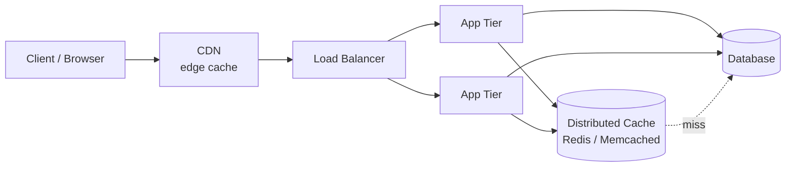
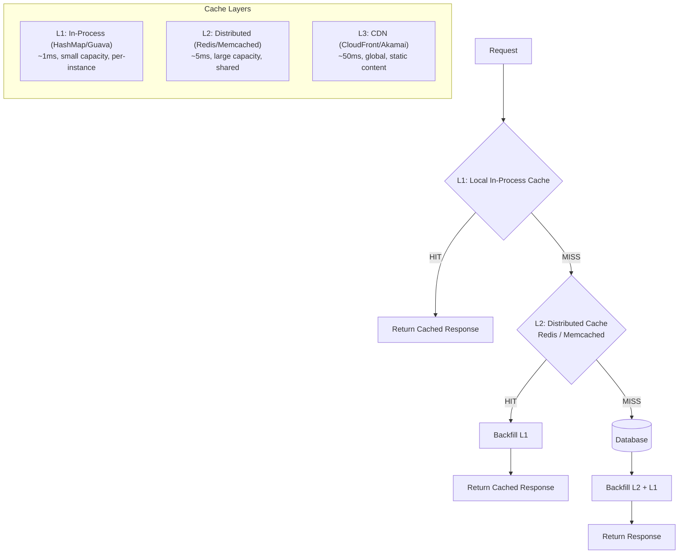

# 07 Cache Patterns

> Caching turns O(expensive) into O(1) — but the devil is in the invalidation strategy and failure modes.

## Why This Matters

Caching is discussed in virtually every system design interview. Whether you're designing a URL shortener, social media feed, or e-commerce platform, the interviewer expects you to introduce caching, explain your invalidation strategy, and handle failure scenarios. The phrase "there are only two hard things in computer science: cache invalidation and naming things" exists for a reason.

What separates strong candidates is depth beyond "add Redis." Interviewers probe for cache stampede solutions, write-behind vs write-through trade-offs, multi-level cache architectures, and warming strategies. These details demonstrate production experience and operational maturity.

Cache stampede (thundering herd) is a particularly popular interview topic because it's a real failure mode that has caused outages at major companies. Having four solutions ready for this single problem shows deep expertise.

## The Pattern

### Where Caches Live: 3-Tier Web Architecture

Before picking a cache *pattern*, it helps to see where caches actually sit in a typical web stack. Caching shows up at *every* layer between the user and the data of record.



Each layer absorbs a different class of traffic: the CDN absorbs static/edge requests, the distributed cache absorbs hot keys from the app tier, and the DB sees only what neither of the above could answer. The patterns below describe *how* the app tier interacts with that distributed cache.

### How It Works: Multi-Level Cache

Production systems use multiple cache layers. A request checks each layer in order; the first hit serves the response.



### Write Strategies

| Strategy | How It Works | Best For |
|---|---|---|
| **Cache-Aside (Lazy)** | App reads cache → miss → read DB → populate cache | Read-heavy, tolerates stale data |
| **Write-Through** | App writes to cache + DB simultaneously | Consistency-critical, read-after-write |
| **Write-Behind (Write-Back)** | App writes to cache; cache async writes to DB | Write-heavy, tolerates data loss risk |
| **Read-Through** | Cache itself fetches from DB on miss | Simplifies app code |

**Cache-aside** is the default for most interview scenarios. Mention write-through when the interviewer emphasizes consistency, and write-behind when optimizing write throughput.

### Cache Stampede (Thundering Herd)

When a popular cache key expires, hundreds of concurrent requests simultaneously miss the cache and hit the database, potentially causing a cascading failure.

**Four solutions:**

1. **Locking (Mutex):** Only one request fetches from DB; others wait for the cache to be repopulated. Simple and effective.

2. **Early Expiration (Staggered TTL):** Set TTL with random jitter so not all keys expire at the same time. Reduces but doesn't eliminate stampede.

3. **Probabilistic Early Recomputation:** Each request has a small probability of refreshing the cache BEFORE it expires. The closer to expiration, the higher the probability.

4. **Background Refresh:** A background worker refreshes popular keys before they expire. The cache never actually expires for hot keys.

### Variations

**Cache Warming:** Pre-populate the cache before traffic hits. Used during deployments or after cache failures. Strategies include replaying recent queries or loading a known hot-key set.

**Negative Caching:** Cache "not found" results to prevent repeated DB lookups for nonexistent keys. Use a short TTL to avoid serving stale negatives.

**Cache-Aside with Lease (Facebook's Memcache):** On cache miss, the cache issues a "lease" token. Only the holder can populate the cache. Prevents both stampede and stale sets.

## When to Use This Pattern

| Signal in Interview | Apply This Pattern |
|---|---|
| "Read-heavy workload" | Cache-aside with Redis/Memcached |
| "Reduce database load" | Multi-level cache (L1 local + L2 distributed) |
| "Sub-millisecond latency required" | L1 in-process cache |
| "Global content delivery" | CDN as L3 cache |
| "Hot key problem" | Background refresh + locking for stampede |
| "Write-heavy with read-after-write" | Write-through cache |

## Trade-offs

| Pros | Cons |
|---|---|
| Dramatically reduces latency and DB load | Stale data — cache may serve outdated values |
| Scales reads horizontally | Cache invalidation complexity |
| In-memory = orders of magnitude faster than disk | Memory is expensive at scale |
| CDN caches reduce global latency | Cold start problem after cache failures |
| Protects DB from traffic spikes | Cache stampede risk on popular key expiry |

## Real-World Examples

- **Facebook:** Custom Memcache layer with lease-based stampede prevention. Multi-region cache invalidation via McSqueal (tailing MySQL binlog to invalidate cache entries).
- **Twitter:** Redis for timeline caches. Each user's home timeline is a sorted set cached in Redis.
- **Netflix:** EVCache (built on Memcached) as a distributed L2 cache. Local in-process caches (Guava) as L1. CDN for static content.

## Interview Cheat Sheet

- Default to **cache-aside** pattern. Explain it step by step (check cache → miss → query DB → populate cache).
- Always specify a **TTL** (time-to-live). Without one, cache grows unbounded and serves stale data forever.
- Cache stampede has **4 solutions** — locking, early expiry, probabilistic refresh, background refresh. Know at least two.
- **Multi-level cache:** L1 (local, ~1ms) + L2 (Redis, ~5ms) + L3 (CDN, ~50ms).
- **Write-through** for consistency. **Write-behind** for write performance. **Cache-aside** for simplicity.
- Use **consistent hashing** for distributing keys across cache nodes (links to sharding knowledge).
- Mention **cache warming** when discussing deployment or failover scenarios.

## Common Interview Questions

1. "How do you handle cache invalidation?" — TTL-based expiry + event-driven invalidation (publish DB changes to invalidate cache).
2. "What's cache stampede and how do you prevent it?" — Describe the problem + mutex locking solution + probabilistic refresh.
3. "Cache-aside or write-through?" — Cache-aside for most cases. Write-through when consistency matters.
4. "How do you handle a cache node failure?" — Consistent hashing redistributes keys. Cache warming to rebuild. Fallback to DB with rate limiting.

## Deep Dive: Facebook's Lease-Based Stampede Prevention

Facebook's Memcache system uses a **lease** mechanism: when a client gets a cache miss, Memcache issues a lease token (a 64-bit ID). The client fetches from the DB and sets the cache value with the lease. If another client tries to set the same key with a stale lease, Memcache rejects it. Meanwhile, clients that miss during the refresh period receive a "hot miss" notification and either wait briefly and retry, or use a slightly stale value. This approach solves both stampede and the "stale set" problem where a slow client overwrites a fresh value with an old one. In interviews, referencing this specific mechanism shows you've studied real-world caching at scale.

---

## First-time Recognition Signals

When you read a brand-new system design prompt, this pattern deserves explicit discussion if you see:

- **"Pick a caching strategy: cache-aside / write-through / write-behind / write-around"** — the interviewer wants a named pattern and a justification.
- **"Cache stampede / thundering herd when a hot key expires"** — single-flight lock, probabilistic early expiration, or stale-while-revalidate.
- **"Hot key overwhelms a single cache node"** — replicate the key across nodes or split the key with a random suffix.
- **"Multi-tier cache: in-process L1, Redis L2, DB origin"** — pattern is about consistency and invalidation across tiers.
- **"Invalidation: when does cached data become stale, and who tells the cache?"** — TTL, explicit invalidation, or event-driven invalidation each have a place.

### Anti-signals (looks like this pattern, isn't)

- **"Write-only workload (logs, telemetry, raw events)"** — there is nothing to cache; caching layers add no value.
- **"Each request is unique"** (per-user reports with one-off parameters) — cache hit rate near zero; cache the *building blocks* instead.
- **"Every read must be strongly consistent"** — caching introduces a stale window by definition; either skip the cache or use write-through with single-writer guarantees.

---

### Intuition

Choosing a caching strategy is mostly choosing what you're willing to be wrong about, and for how long. **Cache-aside** is the lazy default: the app reads from cache, falls back to the DB on miss, populates the cache, and never blocks writes. **Write-through** guarantees the cache is always fresh — at the cost of slower writes. **Write-behind** is the opposite: writes hit the cache fast and trickle to the DB later, at the cost of risking durability if the cache crashes. The matrix below is the cheat-sheet to pick the right one in 30 seconds.

### Worked Example: Choosing between cache-aside, write-through, write-behind, write-around

Two axes drive the choice: read:write ratio and consistency tolerance.

| Workload | Read:Write | Consistency tolerance | Best pattern | Why |
|---|---|---|---|---|
| User profile page | 100 : 1 | seconds-stale OK | **Cache-aside** | Default; tolerates stale; simple |
| Shopping cart (read your own write) | 10 : 1 | none — must be fresh | **Write-through** | Cache & DB updated atomically; reads always fresh |
| Real-time analytics counter | 1 : 50 (write-heavy) | minutes-stale OK | **Write-behind** | Cache absorbs spikes; DB writes batched (10× fewer); accept loss-on-crash risk |
| Product catalog (admins edit, users rarely read) | 1 : 100 | minutes-stale OK | **Write-around** | Skip cache on write; populate lazily on read; avoids cache churn |
| Hot leaderboard (top-100 of millions) | 10,000 : 1 | seconds-stale OK | **Cache-aside + background refresh** | Hottest possible; preempt stampede with proactive refresh |

**Numerical example — write-through vs cache-aside for a cart**

User adds an item; immediately views cart on the next page.

```
Cache-aside path:
  POST /cart/add  → DB write (5 ms) + invalidate cache key (1 ms) = 6 ms
  GET  /cart      → cache miss (1 ms) + DB read (5 ms) + cache fill (1 ms) = 7 ms
  Total user-perceived: 6 + 7 = 13 ms

Write-through path:
  POST /cart/add  → DB write + cache write (in parallel: max 5 ms) = 5 ms
  GET  /cart      → cache hit (1 ms) = 1 ms
  Total user-perceived: 5 + 1 = 6 ms
```

Write-through is **~2× faster for read-after-write** *and* never serves a stale cart. The only cost: if the cache write fails after the DB write, cache & DB diverge until the next invalidation (mitigation: idempotent dual-write + a reconciler).

**Surprise:** write-behind looks tempting for "make writes fast" — but a cache crash before flush = silent data loss. Production write-behind requires a durable buffer (e.g., Kafka in front of the DB), at which point you're approaching event sourcing. **Lesson:** write-behind is for *tolerant* workloads (telemetry, analytics) only.

### Further Reading

- Alex Xu, *System Design Interview vol. 1*, ch. 5 — the clearest practical treatment of the four patterns.
- Bronson et al., *TAO: Facebook's Distributed Data Store for the Social Graph* (USENIX ATC '13) — write-through + read-cache at planetary scale.
- Nishtala et al., *Scaling Memcache at Facebook* (NSDI '13) — lease-based stampede prevention; the canonical paper.
- [AWS Caching Best Practices](https://aws.amazon.com/caching/best-practices/) — pragmatic pattern matrix.

