# 08 The System Design Answer Template

> A structured approach to 45 minutes can mean the difference between "hire" and "no hire" — don't wing it.

## Why This Matters

Most candidates fail system design interviews not because they lack technical knowledge, but because they lack structure. They jump into database schemas in minute 3, spend 20 minutes on one component, and run out of time before discussing the most interesting parts. Interviewers evaluate your communication and prioritization as much as your technical depth.

A structured template gives you a repeatable framework for any question. It ensures you cover all the dimensions interviewers evaluate: requirements gathering, high-level design, detailed design, trade-off analysis, and scaling. It also gives you natural checkpoints to calibrate with the interviewer.

This template is derived from how top candidates at FAANG companies structure their answers. Adapt it to your style, but never walk into an interview without a plan for how you'll spend those 45 minutes.

> For the full extended template with per-phase scripts and example walkthroughs, see `templates/answer-template.md`.

## The Template

### Time Allocation

```mermaid
gantt
    title 45-Minute System Design Interview
    dateFormat mm
    axisFormat %M min

    section Phase 1
    Requirements & Scope       :req, 00, 5m

    section Phase 2
    High-Level Design          :hld, after req, 10m

    section Phase 3
    Detailed Design            :det, after hld, 15m

    section Phase 4
    Scaling & Trade-offs       :scale, after det, 10m

    section Phase 5
    Wrap-up & Questions        :wrap, after scale, 5m
```

### Phase 1: Requirements & Scope (0:00 - 0:05)

**Goal:** Clarify what you're building, narrow scope, and align with the interviewer.

**What to do:**
- Ask about **functional requirements** — what features does the system need?
- Ask about **non-functional requirements** — latency, availability, consistency, scale.
- Establish **scale numbers** — users, requests/sec, data volume.
- Explicitly state what you will and won't cover.

**Key phrases:**
- "Before I start, let me make sure I understand the requirements."
- "Are we designing for X million daily active users?"
- "Should I focus on the core feed/messaging/search functionality, or also cover the admin/moderation side?"
- "I'll assume we need high availability — is strong consistency required, or is eventual consistency acceptable?"

**Common mistake:** Jumping straight into design without clarifying scope. This leads to solving the wrong problem.

### Phase 2: High-Level Design (0:05 - 0:15)

**Goal:** Draw the major components and their interactions. Establish the data flow.

**What to do:**
- Draw 5-8 major boxes: clients, load balancer, API gateway, core services, databases, caches, message queues.
- Show the primary read and write data flows with arrows.
- Identify the **core entities** and their relationships.
- Choose the **database type** (SQL vs NoSQL) and justify briefly.

**Key phrases:**
- "Let me start with the high-level architecture."
- "The main entities are: User, Post, Follow, Feed."
- "I'll use a relational database for user data and a NoSQL store for the feed because..."
- "Here's the write path... and here's the read path..."

**Common mistake:** Drawing too many boxes or getting into implementation details. Keep it to the essential components.

### Phase 3: Detailed Design (0:15 - 0:30)

**Goal:** Deep dive into 2-3 critical components. This is where you demonstrate expertise.

**What to do:**
- Pick the **hardest or most interesting** components — the interviewer will often guide you.
- Discuss data models, API design, and algorithms for these components.
- Apply relevant design patterns (fan-out, caching, sharding, pub/sub).
- Draw more detailed diagrams for each component.

**Key phrases:**
- "Let me dive into the feed generation service, since that's the most complex part."
- "For the shard key, I'll use user_id because it distributes evenly and aligns with our query patterns."
- "I'll use a write-through cache here because we need read-after-write consistency."

**Common mistake:** Spending all 15 minutes on one component. Cover 2-3 components, 5 minutes each.

### Phase 4: Scaling & Trade-offs (0:30 - 0:40)

**Goal:** Demonstrate that your design handles scale and that you understand trade-offs.

**What to do:**
- Walk through **bottlenecks** and how to address each (caching, sharding, replication).
- Discuss **trade-offs** you've made (consistency vs availability, latency vs throughput).
- Mention **failure modes** and how the system handles them (circuit breakers, retries, graceful degradation).
- Touch on **monitoring and observability** — what metrics would you track?

**Key phrases:**
- "The main bottleneck is the database — I'll add read replicas for the read path and shard writes by user_id."
- "The trade-off here is between consistency and latency. I've chosen eventual consistency because..."
- "If the recommendation service goes down, we degrade gracefully by showing chronological feed."

**Common mistake:** Only discussing the happy path. Interviewers want to see that you think about failures.

### Phase 5: Wrap-up (0:40 - 0:45)

**Goal:** Summarize, acknowledge limitations, and suggest future improvements.

**What to do:**
- Briefly recap the design and key decisions.
- Mention 2-3 things you'd add with more time (monitoring, CDN, rate limiting, analytics pipeline).
- Ask the interviewer if there's any area they'd like to explore further.

## When to Use This Pattern

| Signal in Interview | Apply This Pattern |
|---|---|
| Any system design question | Always use this structure |
| "Design X" with no constraints given | Phase 1 becomes critical — you define the scope |
| Interviewer seems impatient | Compress Phase 1, expand Phase 3 |
| Interviewer keeps asking follow-ups | Good sign — go deeper on their questions in Phase 3 |

## Trade-offs

| Pros | Cons |
|---|---|
| Ensures you cover all evaluation dimensions | Can feel rigid if followed too strictly |
| Natural checkpoints to calibrate with interviewer | Some interviewers prefer a more conversational style |
| Prevents time management disasters | Requires practice to internalize |
| Demonstrates structured thinking | May need to adapt timing for 30-min or 60-min formats |

## Interview Cheat Sheet

- **First 5 minutes** determine the trajectory. Clarify scope or risk solving the wrong problem.
- **Draw before you talk.** A diagram organizes your thoughts and gives the interviewer a visual anchor.
- **Narrate your thinking.** "I'm choosing NoSQL here because..." is better than silently drawing boxes.
- **Check in with the interviewer.** "Does this make sense so far? Should I go deeper here or move on?" shows collaboration.
- **Name real technologies.** "Redis for caching, Kafka for event streaming, PostgreSQL for user data" sounds more credible than "a cache, a queue, a database."
- **Don't aim for perfection.** No design is complete in 45 minutes. Show prioritization.
- **Acknowledge trade-offs proactively.** "The downside of this approach is... and I'd mitigate it by..."

## Common Mistakes to Avoid

1. **No requirements gathering.** Jumping into design without clarifying scope.
2. **Over-engineering.** Adding components that aren't needed for the stated requirements.
3. **Ignoring non-functional requirements.** Never discussing latency, availability, or concurrency.
4. **Monologue instead of conversation.** Talking for 10 minutes straight without checking in.
5. **Only happy path.** Never discussing failure modes, retries, or degradation.
6. **Vague technology choices.** "Some kind of database" instead of "PostgreSQL because we need ACID transactions for financial data."

## Deep Dive: Phrases That Impress Interviewers

Specific phrases signal experience and structured thinking:

- **"Let me think about the read-to-write ratio here..."** — Shows you optimize based on workload characteristics.
- **"This gives us eventual consistency, which is acceptable because..."** — Demonstrates CAP theorem reasoning.
- **"The trade-off is latency vs consistency — for this use case, I'd choose..."** — Explicit trade-off analysis.
- **"If this service goes down, the user experience degrades to..."** — Failure mode awareness.
- **"At 10K QPS this works, but at 1M QPS we'd need to..."** — Scaling inflection point reasoning.
- **"Let me back-of-the-envelope this..."** — Quantitative reasoning under pressure.
- **"In production, I'd add monitoring for..."** — Operational maturity.

These phrases work because they mirror how senior engineers reason about systems in real life. Practice incorporating them naturally.
