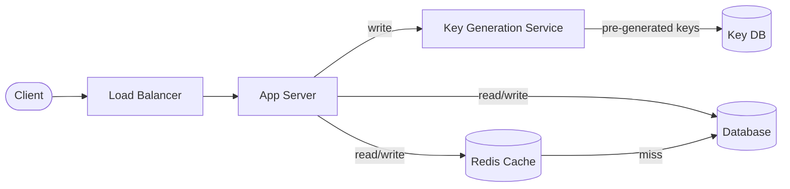

# Solution: Design a URL Shortener

## 1. Requirements & Estimation

### Functional Requirements

- Shorten: Given a long URL → return a short URL
- Redirect: Given a short URL → 301/302 redirect to the original
- Custom aliases: Users can optionally pick their own short key
- Expiration: URLs expire after a configurable TTL (default 5 years)
- Analytics: Track click count per URL

### Non-Functional Requirements

- High availability (99.99%) — redirect path is critical
- Low latency redirects (< 100ms p99)
- Eventual consistency acceptable for analytics
- System must handle 6 billion URLs over 5 years

### Estimation

| Metric | Calculation | Result |
|--------|-------------|--------|
| Write QPS | 100M / (30 × 86400) | ~40 QPS |
| Read QPS | 40 × 100 | ~4,000 QPS |
| Peak read QPS | 4,000 × 3 | ~12,000 QPS |
| Storage / year | 100M × 12 × 1 KB | ~1.2 TB/year |
| Storage (5 years) | 1.2 × 5 | ~6 TB |
| Cache (20% hot) | 4,000 × 86400 × 0.2 × 1 KB | ~70 GB |

## 2. High-Level Design



### Write Path

1. Client submits a long URL to the API.
2. App server requests an unused key from the Key Generation Service (KGS).
3. App server stores the mapping `{shortKey → longURL, createdAt, expiresAt}` in the database.
4. Returns the short URL to the client.

### Read Path (Redirect)

1. Client visits `short.ly/abc123`.
2. App server checks Redis cache for the short key.
3. Cache hit → return 301 redirect immediately.
4. Cache miss → query the database, populate cache, return redirect.

## 3. API Design

### Shorten URL

```
POST /api/v1/shorten
{
  "long_url": "https://example.com/very/long/path",
  "custom_alias": "my-link",    // optional
  "expires_in": 86400           // optional, seconds
}

Response 201:
{
  "short_url": "https://short.ly/abc123",
  "expires_at": "2031-04-14T00:00:00Z"
}
```

### Redirect

```
GET /{short_key}

Response: 301 Moved Permanently
Location: https://example.com/very/long/path
```

### Analytics

```
GET /api/v1/stats/{short_key}

Response 200:
{
  "short_url": "https://short.ly/abc123",
  "long_url": "https://example.com/...",
  "clicks": 14523,
  "created_at": "2026-04-14T00:00:00Z"
}
```

## 4. Data Model

### URL Mapping Table

| Column | Type | Notes |
|--------|------|-------|
| short_key | VARCHAR(7) | Primary key |
| long_url | TEXT | Original URL |
| user_id | BIGINT | Creator (nullable) |
| created_at | TIMESTAMP | Creation time |
| expires_at | TIMESTAMP | Expiry time |
| click_count | BIGINT | Redirect counter |

### Database Choice

**NoSQL (DynamoDB / Cassandra)** — the access pattern is simple key-value lookup with no joins or complex queries. NoSQL provides:

- Horizontal scaling with consistent hashing
- Fast point reads by partition key (`short_key`)
- Easy to shard across nodes

Alternative: A relational database (PostgreSQL) works fine at moderate scale with proper indexing on `short_key`.

## 5. Detailed Design

### Key Generation Service (KGS)

Pre-generate random 7-character Base62 keys and store them in a dedicated key database with two tables:

| Table | Purpose |
|-------|---------|
| `unused_keys` | Pool of available keys |
| `used_keys` | Keys already assigned |

**How it works:**

1. KGS pre-generates millions of keys offline.
2. App server requests a batch of keys (e.g., 1,000 at a time).
3. Keys move atomically from `unused_keys` → `used_keys`.
4. Each app server holds a local buffer of keys to avoid per-request DB calls.

**Why KGS over hashing?**

- Zero collision risk — every key is unique by construction.
- No need to check the database before inserting.
- Decouples key generation from the write path.

**Single point of failure mitigation:**

- Run two KGS instances, each assigned a non-overlapping key range.
- If one fails, the other continues serving keys.

### Caching Strategy

- **What to cache:** `short_key → long_url` mappings
- **Eviction:** LRU (Least Recently Used)
- **Cache size:** ~70 GB for 20% of daily unique URLs
- **Write-through:** On creation, write to both DB and cache
- **TTL:** Match the URL's expiration

### 301 vs 302 Redirect

| Code | Meaning | Trade-off |
|------|---------|-----------|
| 301 | Permanent redirect | Browser caches it — fewer server hits, less accurate analytics |
| 302 | Temporary redirect | Every click hits the server — accurate analytics, more load |

Use **302** if analytics matter. Use **301** if minimizing server load is the priority.

### URL Expiration

- Add a `expires_at` column to every record.
- Run a background cleanup job (daily) to delete expired URLs and return keys to the pool.
- On read, check `expires_at` — if expired, return 404 and lazily delete.

## 6. Scaling & Trade-offs

### Bottlenecks

| Bottleneck | Mitigation |
|------------|------------|
| Database read load | Redis cache handles ~80% of reads |
| KGS as single point | Run multiple KGS instances with partitioned key ranges |
| Hot URLs (viral links) | Cache replication; CDN for extreme cases |
| Storage growth | Expire and purge old URLs; compress metadata |

### Trade-offs

| Decision | Trade-off |
|----------|-----------|
| KGS vs hash-based keys | KGS has zero collisions but adds operational complexity |
| NoSQL vs SQL | NoSQL scales easier but loses ACID transactions |
| 301 vs 302 | Server load vs analytics accuracy |
| Custom aliases | Extra uniqueness check required on write path |

### Future Improvements

- **Rate limiting:** Prevent abuse by capping URL creation per user/IP.
- **Link preview:** Generate Open Graph previews for shared links.
- **Geographic analytics:** Track redirects by region using GeoIP.
- **Private links:** Password-protected short URLs.
- **A/B testing:** Redirect to different destinations based on percentage splits.

---

## First-time Recognition Signals

When the interviewer's prompt sounds like this, the URL-shortener playbook (Base62 + KGS + Redis-fronted KV) is the right answer:

- **"Map long URLs to short codes — give me back something tweetable"** — direct match for the shorten/redirect pair.
- **"Custom alias support / branded short links"** — alias namespace collision check is the giveaway.
- **"Track clicks per link / count redirects globally"** — short-key → counter, ideally via an async event stream.
- **"100M new URLs/month, 1B redirects/month, 100:1 read-heavy"** — the canonical estimation prompt that points at KGS + cache.
- **"Short codes should not be predictable / not be a sequential counter"** — KGS with random Base62 (not raw counter) fits.

### Anti-signals (looks like this design, isn't)

- **"Generate unguessable single-use security tokens"** — that's a CSPRNG / UUIDv4 producer; there is no long→short mapping to store, so the design is library-only.
- **"Encode the entire payload inside the URL itself"** — that's stateless URL encoding (JWT-in-URL or base64-encoded params), no server-side mapping table at all.
- **"Mask the destination of an affiliate / ad link"** — that's an ad-network redirector with fraud, attribution, and policy concerns that a shortener doesn't address.

## Further Reading

- Bit.ly Engineering blog — "DRBs at Bit.ly" / their data-store and KGS choices.
- *System Design Interview Vol. 1* (Alex Xu), Chapter 8 — Design a URL Shortener.
- *Designing Data-Intensive Applications* (Kleppmann), Chapter 6 — Partitioning of Key-Value Data.
- Discord Engineering — "How Discord stores billions of messages" — applicable patterns for short-key sharded data.

## Variant Prompts

If the interviewer mutates the problem mid-round, pivot like this:

- **"What if writes are 100× this (4k QPS shorten)?"** — partition KGS by node range, write to a regional primary, push analytics through Kafka so the redirect DB sees no extra write load.
- **"What if reads must be globally < 50 ms?"** — anycast LB + Cloudflare/CloudFront edge cache of the 301/302 response; regional read replicas of the short-key DB.
- **"What if we cannot lose any short link, ever?"** — synchronous quorum write to the URL store, dual-region replication of the `used_keys` table, daily S3 snapshot of the mapping.
- **"What if the team only has 2 engineers?"** — skip KGS; use Postgres `bigserial` → Base62, managed Redis, and Cloudflare for cache/CDN. Defer analytics to a managed product like Plausible.
