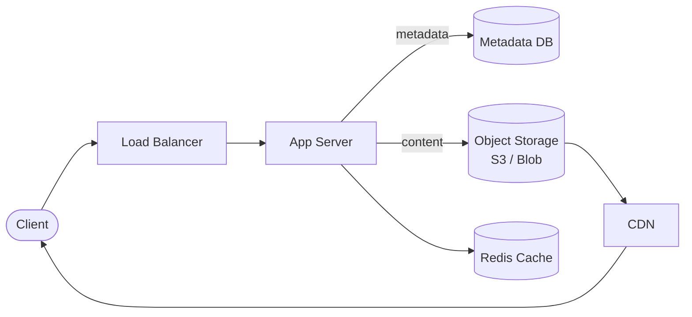

# Solution: Design Pastebin

## 1. Requirements & Estimation

### Functional Requirements

- Create: Upload text content → receive a unique URL
- Read: Visit URL → view the paste content
- Expiration: Pastes can expire after a set duration
- Visibility: Public (listed) or unlisted (link only)
- Syntax highlighting: Detect or accept language hint

### Non-Functional Requirements

- High durability — content must never be lost
- Low read latency (< 200ms p99)
- 99.9% availability
- Support pastes up to 10 MB

### Estimation

| Metric | Calculation | Result |
|--------|-------------|--------|
| Write QPS | 5M / 86400 | ~58 QPS |
| Read QPS | 58 × 5 | ~290 QPS |
| Peak read QPS | 290 × 3 | ~870 QPS |
| Storage / day | 5M × 10 KB | ~50 GB/day |
| Storage / year | 50 GB × 365 | ~18 TB/year |
| Storage (5 years) | 18 × 5 | ~90 TB |

## 2. High-Level Design



### Write Path

1. Client uploads text content via API.
2. App server generates a unique paste key (via KGS or hash).
3. Content is stored in object storage (S3) with the key as the object name.
4. Metadata (key, user, language, expiry, size) is stored in the metadata database.
5. Return the paste URL to the client.

### Read Path

1. Client requests `paste.io/{key}`.
2. CDN serves the content if cached.
3. On CDN miss, app server checks Redis for metadata.
4. Fetches content from object storage.
5. Returns content with appropriate syntax highlighting headers.

## 3. API Design

### Create Paste

```
POST /api/v1/pastes
Content-Type: text/plain

Body: <raw text content>

Headers:
  X-Language: python         // optional
  X-Expires-In: 3600         // optional, seconds
  X-Visibility: unlisted     // optional

Response 201:
{
  "paste_url": "https://paste.io/xK9mQ2p",
  "expires_at": "2026-04-15T00:00:00Z",
  "size_bytes": 4320
}
```

### Read Paste

```
GET /{paste_key}

Response 200:
Content-Type: text/plain
X-Language: python
X-Created-At: 2026-04-14T00:00:00Z

<paste content>
```

### Delete Paste

```
DELETE /api/v1/pastes/{paste_key}
Authorization: Bearer <token>

Response 204: No Content
```

## 4. Data Model

### Metadata Table (SQL or DynamoDB)

| Column | Type | Notes |
|--------|------|-------|
| paste_key | VARCHAR(8) | Primary key |
| user_id | BIGINT | Creator (nullable) |
| language | VARCHAR(20) | Syntax hint |
| size_bytes | INT | Content size |
| visibility | ENUM | public / unlisted |
| created_at | TIMESTAMP | Creation time |
| expires_at | TIMESTAMP | Expiry (nullable) |
| content_path | VARCHAR(255) | Object storage path |

### Content Storage

- **Object storage (S3 / Azure Blob):** Ideal for variable-size text blobs.
- Object key: `pastes/{paste_key}.txt`
- Enables lifecycle policies for automatic expiration.
- Extremely durable (99.999999999% in S3).

### Why Separate Metadata from Content?

| Concern | Metadata DB | Object Storage |
|---------|-------------|----------------|
| Size | Fixed, small (~200 bytes) | Variable (100B – 10MB) |
| Access pattern | Index lookups, filtering | Sequential read/write |
| Scaling | Vertical + read replicas | Horizontally infinite |
| Cost | Higher per GB | Very low per GB |

## 5. Detailed Design

### Key Generation

Reuse the KGS approach from URL shortener:

- Pre-generate 8-character Base62 keys.
- App servers hold local batches to avoid per-request coordination.
- 62^8 ≈ 218 trillion possible keys — far more than needed.

### Content Storage Optimization

| Paste size | Strategy |
|------------|----------|
| < 1 KB | Store inline in metadata DB (optional optimization) |
| 1 KB – 10 MB | Store in object storage |
| > 10 MB | Reject with 413 Payload Too Large |

### Caching Strategy

- **CDN caching:** Paste content is immutable — set `Cache-Control: public, max-age=31536000, immutable`.
- **Redis cache:** Cache metadata for fast lookups. LRU eviction with ~5 GB capacity.
- **Hot paste handling:** CDN edge nodes absorb traffic spikes for viral pastes.

### Paste Expiration

1. **Lazy deletion:** On read, check `expires_at`. If expired, return 404 and enqueue deletion.
2. **Active cleanup:** A background cron job runs daily:
   - Queries metadata DB for `expires_at < NOW()`.
   - Deletes object from storage.
   - Removes metadata record.
3. **S3 lifecycle policy:** Set object expiration as a safety net.

### Rate Limiting

- Anonymous users: 10 pastes/minute by IP.
- Authenticated users: 60 pastes/minute by user ID.
- Reject with 429 Too Many Requests.

## 6. Scaling & Trade-offs

### Bottlenecks

| Bottleneck | Mitigation |
|------------|------------|
| Object storage read latency | CDN caching for immutable content |
| Metadata DB at scale | Shard by paste_key hash; read replicas |
| Large paste uploads | Stream uploads; enforce size limits |
| Expired paste accumulation | Background cleanup + lifecycle policies |

### Trade-offs

| Decision | Trade-off |
|----------|-----------|
| Object storage vs DB blobs | Cheaper and more scalable, but adds a network hop |
| Inline small pastes | Faster reads for tiny pastes, but complicates the data model |
| CDN for all pastes | Great for popular ones, wasted for pastes read once |
| Content deduplication | Saves storage but adds hash computation and lookup overhead |

### Future Improvements

- **Paste versioning:** Allow editing with version history.
- **Collaboration:** Real-time collaborative editing (like Google Docs lite).
- **Paste forking:** Let users fork and modify someone else's paste.
- **Rich formatting:** Support Markdown rendering alongside raw text.
- **Burn after reading:** Self-destructing pastes that disappear after first read.
- **Encryption:** Client-side encryption for private pastes.

---

## First-time Recognition Signals

When the interviewer's prompt sounds like this, the Pastebin playbook (KGS + SQL metadata + S3 body + CDN) is the right answer:

- **"Users paste text snippets and get a shareable URL"** — direct write-once / read-many pattern with a body to store.
- **"Support pastes up to 10 MB / large bodies"** — body size pushes you off the URL-shortener row-only design and onto object storage.
- **"Pastes expire after N days / burn-after-read one-time view"** — paste-lifecycle sweeper + TTL.
- **"Show syntax highlighting and a view count"** — split metadata (highlight language, view count) from content (the text blob).
- **"Anyone with the link can view, no login required"** — unguessable random key + public-read object, the classic Pastebin posture.

### Anti-signals (looks like this design, isn't)

- **"Real-time collaborative editing of a shared document"** — that's an OT/CRDT design (Google Docs), not write-once Pastebin.
- **"Store user-uploaded images / videos with a feed"** — same metadata+blob shape but the design pivots to Instagram/YouTube (transcode, thumbnails, CDN).
- **"Run pasted code snippets and return the output"** — that's a sandboxed execution service (Replit, LeetCode); Pastebin only stores, never executes.

## Further Reading

- GitHub Engineering — search "How Gist works" / GitHub's repo and gist storage architecture.
- *System Design Interview Vol. 1* (Alex Xu), Chapter 9 — Pastebin (extends the URL Shortener chapter).
- AWS blog — "Using Amazon S3 pre-signed URLs" — exact pattern for serving private bodies.
- *Designing Data-Intensive Applications* (Kleppmann), Chapter 4 — Encoding and compression for the body store.

## Variant Prompts

- **"What if writes are 100× this?"** — partition KGS, route writes to a write-region, async fan-out to S3 cross-region replication.
- **"What if reads must be globally < 50 ms?"** — CDN-cache the body keyed by short_key; CloudFront + S3 Multi-Region Access Points; metadata reads via regional replicas.
- **"What if we cannot lose a paste, ever?"** — S3 versioning + cross-region replication, MD5/SHA on every paste, async restore on integrity failure.
- **"What if the team only has 2 engineers?"** — Postgres metadata + S3 body, UUIDv7 encoded as Base62 (no custom KGS), Cloudflare in front.
