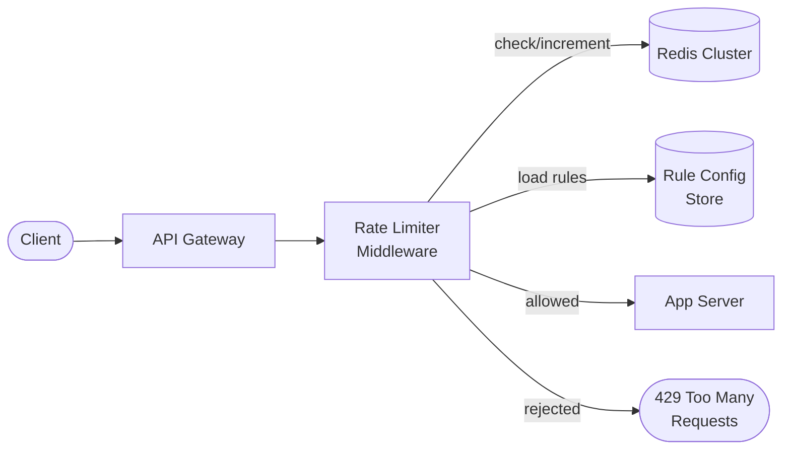

# Solution: Design a Rate Limiter

## 1. Requirements & Estimation

### Functional Requirements

- Throttle requests based on configurable rules (per user, IP, endpoint)
- Return 429 with `Retry-After` header when limit is exceeded
- Support multiple rate limiting algorithms
- Rules are configurable via API or config files

### Non-Functional Requirements

- Sub-5ms overhead per request
- Distributed — consistent across multiple servers
- Fail-open — if the rate limiter is unavailable, allow traffic
- Support 10M+ checks per second

### Estimation

| Metric | Calculation | Result |
|--------|-------------|--------|
| Checks / second | 10M (given) | 10M QPS |
| Counter size | 100 bytes × 100M clients | ~10 GB |
| Rules storage | 1 KB × 500K rules | ~500 MB |
| Redis cluster | 10M ops/sec ÷ 100K per node | ~100 shards |

## 2. High-Level Design



### Request Flow

1. Client sends a request to the API gateway.
2. The rate limiter middleware intercepts the request.
3. It identifies the client (user ID, IP, API key).
4. Loads applicable rules from the cached rule store.
5. Checks the counter in Redis against the limit.
6. If under the limit → increment counter, forward request.
7. If over the limit → return 429 with `Retry-After`.

## 3. API Design

### Rate Limit Response Headers

Every response includes rate limit headers:

```
X-RateLimit-Limit: 100         // max requests in window
X-RateLimit-Remaining: 42      // remaining requests
X-RateLimit-Reset: 1681500000  // window reset (Unix epoch)
```

### When Rate Limited

```
HTTP/1.1 429 Too Many Requests
Retry-After: 30
X-RateLimit-Limit: 100
X-RateLimit-Remaining: 0

{
  "error": "Rate limit exceeded",
  "retry_after_seconds": 30
}
```

### Rule Configuration API

```
PUT /api/v1/rate-rules
{
  "rules": [
    {
      "client_type": "user",
      "endpoint": "/api/v1/messages",
      "max_requests": 100,
      "window_seconds": 60,
      "algorithm": "sliding_window"
    }
  ]
}
```

## 4. Data Model

### Rule Configuration

| Field | Type | Notes |
|-------|------|-------|
| rule_id | UUID | Primary key |
| client_type | ENUM | user / ip / api_key |
| endpoint | VARCHAR | URL pattern or wildcard |
| max_requests | INT | Limit per window |
| window_seconds | INT | Time window size |
| algorithm | ENUM | token_bucket / sliding_window / fixed_window |
| tier | VARCHAR | free / pro / enterprise |

### Redis Counter Keys

```
rate:{client_id}:{endpoint}:{window_timestamp}
```

Example: `rate:user_123:/api/messages:1681500000`

TTL is set to `window_seconds + 1` to auto-expire.

## 5. Detailed Design

### Algorithm Comparison

| Algorithm | Burst Tolerance | Memory | Accuracy | Complexity |
|-----------|----------------|--------|----------|------------|
| Fixed Window | Allows 2x at boundary | Low | Medium | Simple |
| Sliding Window Log | None — exact | High | Perfect | Medium |
| Sliding Window Counter | Minimal | Low | High | Medium |
| Token Bucket | Configurable | Low | High | Simple |
| Leaking Bucket | None — smooths | Low | High | Simple |

### Recommended: Token Bucket

Best balance of simplicity, burst tolerance, and memory efficiency.

**How it works:**

1. Each client has a bucket with `max_tokens` capacity.
2. Tokens are added at a fixed rate (`refill_rate` per second).
3. Each request consumes one token.
4. If no tokens are available, the request is rejected.

**Redis implementation (Lua script for atomicity):**

```lua
local key = KEYS[1]
local max_tokens = tonumber(ARGV[1])
local refill_rate = tonumber(ARGV[2])
local now = tonumber(ARGV[3])

local bucket = redis.call('HMGET', key, 'tokens', 'last_refill')
local tokens = tonumber(bucket[1]) or max_tokens
local last_refill = tonumber(bucket[2]) or now

-- Refill tokens
local elapsed = now - last_refill
local new_tokens = math.min(max_tokens, tokens + elapsed * refill_rate)

if new_tokens >= 1 then
    redis.call('HMSET', key, 'tokens', new_tokens - 1, 'last_refill', now)
    redis.call('EXPIRE', key, max_tokens / refill_rate + 1)
    return 1  -- allowed
else
    return 0  -- rejected
end
```

**Why a Lua script?** Redis executes Lua atomically — no race condition between reading and updating the counter, even with concurrent requests.

### Sliding Window Counter (Alternative)

Combines the accuracy of sliding window log with the efficiency of fixed window:

1. Split time into fixed windows (e.g., 1-minute buckets).
2. For the current request timestamp, calculate a weighted count:
   - `count = prev_window_count × overlap% + current_window_count`
3. If `count < limit` → allow; otherwise reject.

### Distributed Rate Limiting

**Challenge:** With multiple rate limiter instances, a client can hit different servers. Each server's local Redis check sees only its slice of traffic.

**Solutions:**

| Approach | How it works | Trade-off |
|----------|-------------|-----------|
| Centralized Redis | All servers share one Redis cluster | Single point of failure |
| Redis Cluster | Shard counters across nodes | Minor inconsistency during splits |
| Local + sync | Each node does local counting, syncs periodically | Allows slight over-limit |

**Recommended:** Redis Cluster with consistent hashing. Client keys are deterministically routed to the same shard, ensuring atomic operations.

### Rule Evaluation Pipeline

1. Extract client identity (user ID, IP, API key).
2. Match against rule store (most specific rule wins).
3. Apply the algorithm for each matching rule.
4. If ANY rule rejects, block the request.

Rules are cached locally with a 30-second TTL to avoid fetching from the config store on every request.

## 6. Scaling & Trade-offs

### Bottlenecks

| Bottleneck | Mitigation |
|------------|------------|
| Redis throughput | Cluster with sharding; pipeline operations |
| Network latency to Redis | Co-locate Redis with app servers; use local caching |
| Hot partitions (single user) | Deterministic sharding ensures one shard per key |
| Rule config updates | Local cache with periodic refresh (30s) |

### Trade-offs

| Decision | Trade-off |
|----------|-----------|
| Fail-open vs fail-closed | Fail-open risks abuse during outages; fail-closed risks blocking legitimate users |
| Centralized vs distributed | Centralized is more accurate but creates a dependency |
| Lua scripts vs pipeline | Lua is atomic but harder to debug |
| Token Bucket vs Sliding Window | Token Bucket allows bursts; Sliding Window is smoother |

### Future Improvements

- **Adaptive rate limiting:** Adjust limits based on system load in real-time.
- **Quota management:** Monthly/daily usage quotas in addition to per-second limits.
- **Client-specific headers:** Let clients pre-check their remaining quota before making requests.
- **Analytics dashboard:** Show rate limit hit metrics per client, endpoint, and rule.
- **Webhook alerts:** Notify when a client is consistently hitting rate limits.
- **IP reputation scoring:** Dynamically adjust limits based on client behavior patterns.

---

## First-time Recognition Signals

When the interviewer's prompt sounds like this, the rate-limiter playbook (token bucket + Lua-atomic Redis counters + gateway middleware) is the right answer:

- **"Cap API requests per user to 100/sec / 1000/min"** — direct token-bucket match with refill rate and burst capacity.
- **"Different tiers — free users get 60/min, paid get 6000/min"** — rule-based multi-tenant limiter with rule store + cached evaluator.
- **"Return HTTP 429 with Retry-After when over limit"** — standard rate-limit semantics; you should also surface `X-RateLimit-Remaining`.
- **"Prevent brute-force login attempts"** — per-IP sliding-window-counter on the auth endpoint.
- **"Protect downstream from a sudden traffic burst"** — token bucket with `burst = 10 × rate` absorbs spikes cleanly.

### Anti-signals (looks like this design, isn't)

- **"Smooth a sustained high incoming rate so the downstream doesn't queue"** — that's load shedding / backpressure / queue buffering, not a hard limiter.
- **"Fairly share one expensive resource between many tenants"** — that's weighted fair queueing / scheduling, not a 429-returning cap.
- **"Mitigate volumetric DDoS at the network edge"** — that's L3/L4 protection (Cloudflare, AWS Shield); an L7 limiter is one layer above and won't stop SYN floods.

## Further Reading

- Stripe Engineering — "Scaling your API with rate limiters" (the canonical industry post).
- Cloudflare blog — "How we built rate limiting capable of scaling to millions of domains".
- *System Design Interview Vol. 1* (Alex Xu), Chapter 4 — Design a Rate Limiter.
- *Designing Data-Intensive Applications* (Kleppmann), Chapter 8 — Trouble with Distributed Systems (for the counter-consistency discussion).

## Variant Prompts

- **"What if writes are 100× this (10M RPM)?"** — sharded Redis Cluster with key-sharded counters; per-region limiters with periodic global reconciliation.
- **"What if reads must be globally < 50 ms?"** — local edge limiters (Cloudflare Workers, Envoy ratelimit filter); accept slight over-limit in exchange for latency.
- **"What if we cannot lose counter state?"** — Redis with AOF persistence + replica, but small counter loss is usually acceptable; lean into idempotent retry semantics.
- **"What if the team only has 2 engineers?"** — `limit_req` in Nginx or AWS API Gateway built-in throttling; no custom service.
