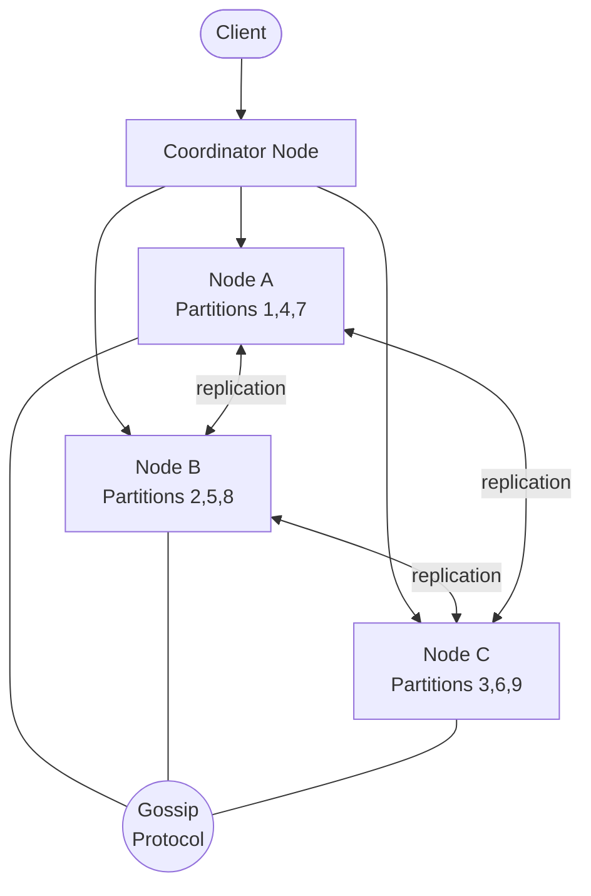

# Solution: Design a Distributed Key-Value Store

## 1. Requirements & Estimation

### Functional Requirements

- `put(key, value)` → store or update
- `get(key)` → retrieve value
- `delete(key)` → remove key
- Tunable consistency (strong, eventual, quorum)

### Non-Functional Requirements

- Horizontal scalability (50-200 nodes)
- p99 latency < 10ms for reads and writes
- 99.99% availability
- Partition tolerant (AP or CP depending on config)
- Durable — data survives node failures

### Estimation

| Metric | Calculation | Result |
|--------|-------------|--------|
| Read QPS per node (100 nodes) | 500K / 100 | ~5K per node |
| Write QPS per node | 200K / 100 | ~2K per node |
| Data per node | 100 TB / 100 × 3 (replication) | ~3 TB per node |
| Memory per node (hot data) | 20% of 3 TB | ~600 GB (SSD) |

## 2. High-Level Design



### Architecture Overview

- **Coordinator node:** Any node can be the coordinator for a request. It routes the request to the correct partition owner(s).
- **Consistent hash ring:** Maps keys to nodes. Virtual nodes ensure balanced distribution.
- **Replication:** Each key is stored on N consecutive nodes on the ring (N=3).
- **Gossip protocol:** Nodes share membership and health information.

## 3. API Design

### Put

```
PUT /kv/{key}
Body: <raw bytes>
Headers:
  X-Consistency: quorum   // one | quorum | all
  X-TTL: 3600             // optional, seconds

Response 200:
{
  "version": "v3_1681500000_nodeA"
}
```

### Get

```
GET /kv/{key}
Headers:
  X-Consistency: quorum

Response 200:
{
  "value": "<base64 encoded>",
  "version": "v3_1681500000_nodeA"
}
```

### Delete

```
DELETE /kv/{key}
Response 200:
{
  "deleted": true
}
```

## 4. Data Model

### On-Disk Storage (per node)

Each node uses an LSM-tree (Log-Structured Merge Tree) storage engine:

| Component | Purpose |
|-----------|---------|
| Write-Ahead Log (WAL) | Durability — write before acknowledging |
| MemTable | In-memory sorted buffer (Red-Black tree) |
| SSTables | Immutable sorted files on disk |
| Bloom filters | Skip SSTables that don't contain the key |

### Key Metadata

| Field | Type | Notes |
|-------|------|-------|
| key | bytes | Partition key for hash ring |
| value | bytes | Actual data (up to 1 MB) |
| version | vector_clock | Conflict detection |
| timestamp | uint64 | Last modification time |
| tombstone | bool | Marks deleted keys |
| ttl | uint32 | Time-to-live (optional) |

## 5. Detailed Design

### Consistent Hashing with Virtual Nodes

- Hash each physical node to 100-200 positions (virtual nodes) on the ring.
- To find which node owns a key: hash the key, walk clockwise to the first virtual node.
- Virtual nodes ensure even data distribution even with heterogeneous hardware.

**Adding a node:** New node takes over a portion of the ring. Only keys in the affected range are transferred — minimal data movement.

**Removing a node:** Its key ranges are absorbed by the next node on the ring.

### Replication

- Each key is stored on the first N distinct physical nodes clockwise from its position on the ring.
- The first node is the **coordinator** for that key; the others are **replicas**.
- Writes are sent to all N replicas simultaneously.

### Consistency with Quorum

Given N replicas, W write acknowledgements, R read acknowledgements:

| Config | Guarantee | Trade-off |
|--------|-----------|-----------|
| W=1, R=1 | Eventual consistency | Fastest, lowest durability |
| W=N, R=1 | Strong write durability | Slow writes |
| W=⌈N/2⌉+1, R=⌈N/2⌉+1 | Strong consistency (W+R > N) | Balanced |
| W=1, R=N | Read-heavy strong consistency | Read repairs at read time |

**Default (quorum):** W=2, R=2, N=3. This guarantees at least one node in the read-set has the latest write.

### Conflict Resolution

When a quorum read returns different versions from different replicas:

1. **Vector clocks:** Each node maintains a vector clock per key. If one version causally dominates another → keep the newer one. If versions are concurrent (neither dominates) → conflict.
2. **Application-level resolution:** Return all conflicting versions to the client. The client merges them (like a shopping cart union).
3. **Last-Write-Wins (LWW):** Simpler alternative — keep the version with the highest timestamp. Risks losing writes but is much simpler.

### Failure Detection — Gossip Protocol

Every node periodically:

1. Picks a random peer.
2. Exchanges membership and heartbeat tables.
3. If a node's heartbeat hasn't updated in T seconds → marked as **suspected**.
4. If still suspected after 2T seconds → marked as **failed**.

Gossip converges in O(log N) rounds for N nodes.

### Handling Failures

| Scenario | Response |
|----------|----------|
| Temporary failure | **Sloppy quorum** — write to a healthy node temporarily; it hands off data when the failed node recovers (hinted handoff). |
| Permanent failure | **Anti-entropy** — use Merkle trees to detect and repair divergent data between replicas. |
| Data center failure | Cross-DC replication with async writes. |

### Merkle Trees for Anti-Entropy

- Each node builds a Merkle tree (hash tree) over its key ranges.
- To sync two replicas: compare tree roots. If different, drill down to find the divergent key ranges.
- Only the differing keys are transferred — efficient reconciliation.

### Write Path

1. Client sends `put(key, value)` to any node (coordinator).
2. Coordinator hashes the key to find the N responsible nodes.
3. Coordinator sends the write to all N replicas.
4. Waits for W acknowledgements.
5. Returns success to the client.

### Read Path

1. Client sends `get(key)` to the coordinator.
2. Coordinator sends the read to all N replicas.
3. Waits for R responses.
4. Returns the value with the highest version.
5. If stale replicas detected → triggers read repair (async update).

## 6. Scaling & Trade-offs

### Bottlenecks

| Bottleneck | Mitigation |
|------------|------------|
| Hot keys (celebrity problem) | Add a cache layer; replicate hot keys to more nodes |
| Large values (1 MB) | Chunk large values; separate metadata from data |
| Compaction spikes (LSM-tree) | Leveled compaction with rate limiting |
| Cross-DC latency | Async replication; local reads |

### Trade-offs

| Decision | Trade-off |
|----------|-----------|
| AP vs CP (CAP theorem) | AP (Dynamo-style) favors availability; CP (Etcd-style) favors consistency |
| Vector clocks vs LWW | Vector clocks are correct but complex; LWW is simple but lossy |
| Gossip vs centralized | Gossip is decentralized and resilient; centralized (ZooKeeper) is faster to converge |
| Virtual nodes count | More virtual nodes = better balance but higher memory overhead |

### Future Improvements

- **Multi-region replication:** Async cross-DC writes with conflict resolution.
- **Transactions:** Support multi-key transactions with 2PC or Paxos.
- **Secondary indexes:** Allow querying by value (adds complexity and write amplification).
- **Tiered storage:** Hot data on SSD, cold data on HDD with automatic migration.
- **Compression:** Compress SSTables with LZ4 or Zstd to reduce storage footprint.

---

## First-time Recognition Signals

When the interviewer's prompt sounds like this, the Dynamo-style KV playbook (consistent hashing + leaderless quorum + vector clocks + gossip) is the right answer:

- **"Single-key get/put at petabyte scale"** — the canonical KV access pattern; no joins, no range queries.
- **"Always-writable, no outage tolerated even during partitions"** — pushes you to AP / Dynamo, not CP / Spanner.
- **"Cross-region replication with eventual consistency"** — leaderless quorum with hinted handoff fits.
- **"Add or remove nodes without downtime, rebalance automatically"** — consistent hashing with virtual nodes is the answer.
- **"Tolerate node failures and self-heal data"** — gossip + Merkle-tree anti-entropy is the playbook.

### Anti-signals (looks like this design, isn't)

- **"Strong consistency across multi-key transactions / move money between accounts"** — that's a CP store (Spanner, CockroachDB), not a Dynamo-style AP design.
- **"Range queries — list orders for a user between two dates"** — needs an ordered store (Cassandra wide rows with clustering keys, DynamoDB sort key); pure hash-partitioned KV won't do it efficiently.
- **"Sub-millisecond per-op with a 10 GB hot set"** — that's an in-memory cache (Redis Cluster), not a disk-backed KV store.

## Further Reading

- "Dynamo: Amazon's Highly Available Key-value Store" — DeCandia et al., SOSP 2007 (the foundational paper).
- "Cassandra: A Decentralized Structured Storage System" — Lakshman & Malik.
- *Designing Data-Intensive Applications* (Kleppmann), Chapter 5 (Replication) and Chapter 6 (Partitioning).
- *System Design Interview Vol. 1* (Alex Xu), Chapter 6 — Design a Key-Value Store.

## Variant Prompts

- **"What if writes are 100× this?"** — increase node count linearly; coordinator-less write path; widen replication factor only if you also widen the network.
- **"What if reads must be globally < 50 ms?"** — geo-aware partitioning so each region owns a primary replica; read-local with eventual cross-region replication.
- **"What if we cannot lose any write, ever?"** — N=5, R=3, W=3 (sync quorum), enable hinted handoff, run Merkle anti-entropy hourly, snapshot to S3.
- **"What if the team only has 2 engineers?"** — managed DynamoDB or Cassandra-as-a-service (ScyllaDB Cloud, Astra); the design discussion is the same but you do not operate it.
