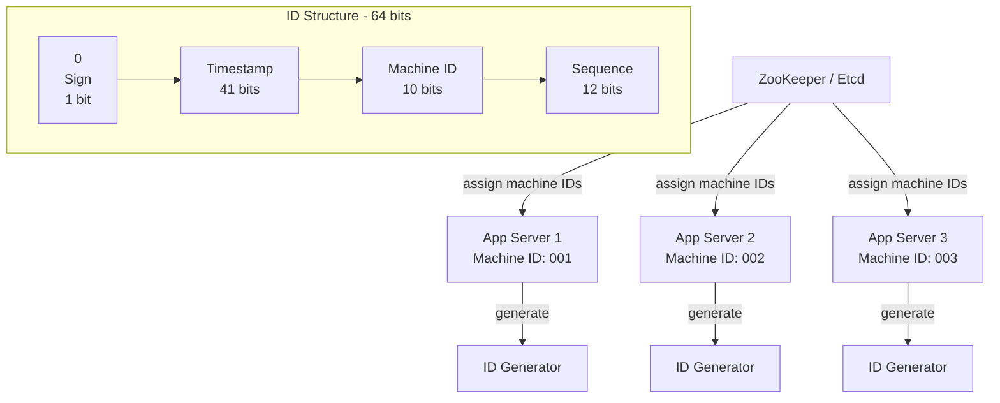

# Solution: Design a Unique ID Generator

## 1. Requirements & Estimation

### Functional Requirements

- Generate globally unique 64-bit integer IDs
- IDs must be roughly time-sortable
- No single point of failure or centralized coordination
- Support 10K+ IDs per second per server

### Non-Functional Requirements

- Sub-millisecond generation latency
- Zero collisions — guaranteed uniqueness
- Availability: 99.999%
- IDs are numeric and fit in a 64-bit integer

### Estimation

| Metric | Calculation | Result |
|--------|-------------|--------|
| Total IDs/sec | 1000 nodes × 10K | 10M IDs/sec |
| IDs per ms per node | 10K / 1000 | 10 IDs/ms |
| Bits for timestamp (69 yrs) | ceil(log2(69×365×24×3600×1000)) | 41 bits |
| Bits for machine ID | ceil(log2(1024)) | 10 bits |
| Bits for sequence | 64 - 1 - 41 - 10 | 12 bits (4096/ms) |

## 2. High-Level Design



### ID Bit Layout (Snowflake-style)

| Segment | Bits | Range | Purpose |
|---------|------|-------|---------|
| Sign bit | 1 | Always 0 | Keeps IDs positive |
| Timestamp | 41 | 2^41 ms ≈ 69 years | Milliseconds since custom epoch |
| Machine ID | 10 | 0-1023 | Unique per server |
| Sequence | 12 | 0-4095 | Per-millisecond counter |

**Custom epoch:** Instead of Unix epoch (1970), use a recent date (e.g., 2024-01-01) to maximize the 69-year window.

## 3. API Design

### Internal Library Call

```python
id_generator = SnowflakeGenerator(machine_id=42)
new_id = id_generator.next_id()  # Returns: 7192837465102938112
```

### ID Decomposition (for debugging)

```python
def decompose(id: int) -> dict:
    timestamp = (id >> 22) + CUSTOM_EPOCH
    machine_id = (id >> 12) & 0x3FF
    sequence = id & 0xFFF
    return {
        "timestamp": datetime.fromtimestamp(timestamp / 1000),
        "machine_id": machine_id,
        "sequence": sequence
    }
```

## 4. Data Model

This system generates IDs in-memory — no persistent storage is needed for the ID generation itself. The only external state is machine ID assignment.

### Machine ID Registry (ZooKeeper/Etcd)

| Path | Value | Notes |
|------|-------|-------|
| `/id-gen/machines/001` | `server-a.prod` | Lease-based assignment |
| `/id-gen/machines/002` | `server-b.prod` | Expires if node dies |

## 5. Detailed Design

### Snowflake Algorithm Implementation

```
function next_id():
    current_time = now() - CUSTOM_EPOCH  // ms since epoch

    if current_time == last_time:
        sequence = (sequence + 1) & 0xFFF  // 4095 max
        if sequence == 0:
            // Exhausted 4096 IDs this ms — wait for next ms
            current_time = wait_until_next_ms(last_time)
    else:
        sequence = 0

    if current_time < last_time:
        // Clock moved backward!
        throw ClockBackwardException

    last_time = current_time
    return (current_time << 22) | (machine_id << 12) | sequence
```

### Clock Backward Handling

NTP can cause the system clock to jump backward. Strategies:

| Strategy | How | Trade-off |
|----------|-----|-----------|
| Throw error | Refuse to generate IDs until clock catches up | Causes downtime |
| Wait | Sleep until `last_time` is reached | Minor latency spike |
| Extra bits | Reserve 2-3 bits as a "clock sequence" that increments on backward jumps | Fewer bits for other segments |

**Recommended:** Wait for short drifts (< 5ms). Alert + refuse for large drifts (> 5ms).

### Machine ID Assignment

| Approach | Pros | Cons |
|----------|------|------|
| ZooKeeper/Etcd lease | Automatic recycling, no manual config | External dependency |
| Config file | Simple, no dependency | Manual management |
| MAC address hash | Zero coordination | Collision risk |

**Recommended:** ZooKeeper with ephemeral nodes. Each server acquires a lease on startup. If it crashes, the lease expires and the ID is recycled.

### Alternative Approaches Comparison

| Approach | Uniqueness | Sortable | Size | Coordination |
|----------|-----------|----------|------|-------------|
| UUID v4 | Probabilistic | No | 128 bits | None |
| Snowflake | Guaranteed | Yes (rough) | 64 bits | Machine ID only |
| ULID | Probabilistic | Yes (rough) | 128 bits | None |
| DB auto-increment | Guaranteed | Yes (strict) | 64 bits | Centralized |
| DB ticket server | Guaranteed | Yes (strict) | 64 bits | 2 servers |

### Multi-Datacenter Extension

Split the machine ID into datacenter ID + machine ID:

| Segment | Bits | Range |
|---------|------|-------|
| Datacenter ID | 5 | 0-31 (32 DCs) |
| Machine ID | 5 | 0-31 (32 per DC) |

This reduces to 32 machines per datacenter but supports 32 datacenters.

## 6. Scaling & Trade-offs

### Bottlenecks

| Bottleneck | Mitigation |
|------------|------------|
| 4096 IDs/ms per machine | Sufficient for most workloads; add machines if needed |
| Clock drift between servers | NTP with tight synchronization (< 5ms) |
| Machine ID exhaustion (1024) | Split into DC + machine bits; use ZooKeeper leases |
| Single-ms burst > 4096 | Wait for next millisecond (adds <1ms latency) |

### Trade-offs

| Decision | Trade-off |
|----------|-----------|
| 41-bit timestamp vs more sequence bits | Longer lifespan (69 yrs) vs more IDs per ms |
| Snowflake vs UUID | Compact and sortable, but requires machine ID coordination |
| Custom epoch | Maximizes time range but all systems must agree on it |
| ZK for machine IDs | Automatic management but adds external dependency |

### Future Improvements

- **Embedded metadata:** Encode entity type or shard ID in unused bits for routing.
- **Monotonic within a node:** Guarantee strict ordering per machine (useful for event sourcing).
- **ID prediction protection:** Add randomized lower bits to prevent ID enumeration attacks.
- **Time-based partitioning:** Use the timestamp prefix for efficient time-range queries in the database.
- **Graceful degradation:** If ZK is down, fall back to random machine IDs with collision detection.

---

## First-time Recognition Signals

When the interviewer's prompt sounds like this, the Snowflake playbook (timestamp + machine-id + sequence in a 64-bit int) is the right answer:

- **"Generate globally unique IDs at high throughput without a central DB"** — direct Snowflake match.
- **"IDs must be sortable by creation time"** — time-prefixed (Snowflake, ULID, UUIDv7), not UUIDv4.
- **"Compact 64-bit ID suitable for a B-tree primary key"** — bit-packed Snowflake.
- **"Generated client-side / in-process with no network call"** — library Snowflake with a machine-id lease, not a service.
- **"Twitter-style tweet/like/post IDs"** — Twitter literally invented this for that.

### Anti-signals (looks like this design, isn't)

- **"Strong cryptographic randomness for unguessable tokens"** — that's a CSPRNG / UUIDv4; Snowflake's timestamp prefix leaks creation time.
- **"Short, human-readable code (max 8 characters)"** — that's a Base62 counter / KGS (the URL-shortener pattern), not a 64-bit number.
- **"Distributed counter that returns the current count"** — that's a counting service (etcd lease counter, Redis INCR), not an opaque ID.

## Further Reading

- Twitter blog — "Announcing Snowflake" (2010, the original).
- Discord Engineering — "Why we use Snowflake IDs" (great practical write-up).
- Instagram blog — "Sharding & IDs at Instagram" (Postgres-function variant of the same idea).
- *Designing Data-Intensive Applications* (Kleppmann), Chapter 8 — Lamport timestamps and logical clocks.

## Variant Prompts

- **"What if you need 100× the IDs/sec?"** — drop sequence bits, widen to UUIDv7 with random tail; or run multiple Snowflake instances per host with different machine-ids.
- **"What if global p99 must be < 50 ms?"** — library-in-process gives sub-microsecond generation; no further work needed.
- **"What if duplicates are unacceptable, ever?"** — ZooKeeper-leased machine-ids + monotonic-clock guard + refuse-on-backward-skew.
- **"What if the team only has 2 engineers?"** — Postgres `bigserial` sharded per region; or UUIDv7 from a stdlib — no service to run.
