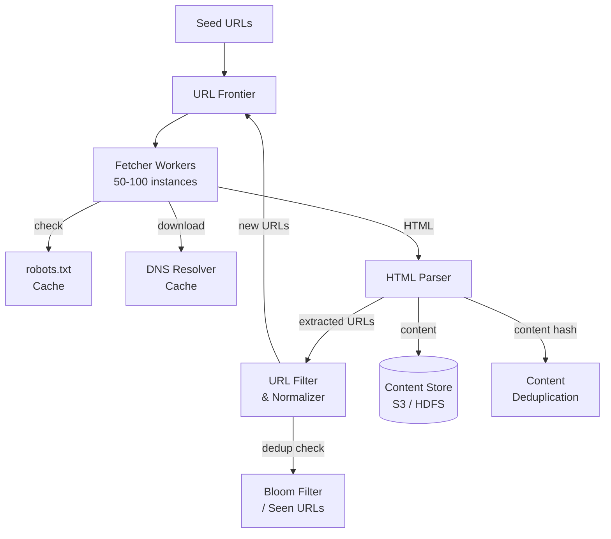

# Solution: Design a Web Crawler

## 1. Requirements & Estimation

### Functional Requirements

- Crawl pages starting from seed URLs using BFS
- Store downloaded HTML content
- Extract and follow links to discover new pages
- Respect `robots.txt` and politeness constraints
- Deduplicate URLs and content
- Prioritize important pages

### Non-Functional Requirements

- Throughput: 400 pages/sec sustained
- Politeness: Max 1 request/sec per domain
- Robustness: Handle traps, malformed HTML, timeouts
- Scalable: Add more workers to increase throughput

### Estimation

| Metric | Calculation | Result |
|--------|-------------|--------|
| Pages / second | 1B / (30 × 86400) | ~400 /sec |
| Storage / month | 1B × 500 KB | ~500 TB |
| Storage (5 years) | 500 TB × 60 | ~30 PB |
| URLs in frontier | 50 links/page × 2M pages ahead | ~100M |
| Bloom filter (1B URLs) | 10 bits/item | ~1.2 GB |

## 2. High-Level Design



### Crawl Loop

1. **Pick URL:** Frontier selects the highest-priority URL that is polite to fetch.
2. **DNS resolve:** Look up the domain (cached).
3. **Robots.txt check:** Verify the path is allowed (cached per domain).
4. **Fetch:** Download the page with a timeout.
5. **Parse:** Extract text content and outgoing links.
6. **Store:** Save the raw HTML to content storage.
7. **Deduplicate:** Check extracted URLs against the Bloom filter.
8. **Enqueue:** Add new, unseen URLs to the frontier.

## 3. API Design

This is an internal system — no external API. The key interfaces are:

### Frontier Interface

```
frontier.add(url, priority, domain)
frontier.get_next() -> (url, domain)
frontier.mark_done(url)
```

### Fetcher Interface

```
fetcher.fetch(url) -> (status_code, html, headers)
fetcher.check_robots(domain, path) -> bool
```

### Content Store Interface

```
store.save(url, html, metadata)
store.exists(content_hash) -> bool
```

## 4. Data Model

### Crawl Metadata (SQL or NoSQL)

| Column | Type | Notes |
|--------|------|-------|
| url_hash | BIGINT | Primary key (hash of normalized URL) |
| url | TEXT | Full URL |
| domain | VARCHAR | Extracted domain |
| status | ENUM | pending / fetched / failed / redirect |
| content_hash | BIGINT | Simhash for content dedup |
| last_crawled | TIMESTAMP | When last fetched |
| http_status | INT | Response code |

### Content Storage

- **Object storage (S3 / HDFS):** Store raw HTML files.
- Key: `crawl/{date}/{url_hash}.html.gz` (compressed).
- Metadata in a separate database for fast lookups.

## 5. Detailed Design

### URL Frontier (Two-Tier Architecture)

The frontier handles two concerns: **priority** and **politeness**.

**Front queue (priority):**

- Multiple priority queues (high, medium, low).
- Priority based on: PageRank, domain authority, freshness, crawl depth.
- A prioritizer assigns incoming URLs to the appropriate queue.

**Back queue (politeness):**

- One queue per domain.
- A router maps each URL to its domain queue.
- A scheduler ensures each domain is fetched at most once per second.
- Maintains a heap of `(next_allowed_time, domain)` for scheduling.

### URL Normalization

Before dedup or enqueue, normalize URLs:

| Rule | Before | After |
|------|--------|-------|
| Lowercase scheme/host | `HTTP://Example.COM/Path` | `http://example.com/Path` |
| Remove default port | `http://site.com:80/page` | `http://site.com/page` |
| Remove fragment | `http://site.com/page#section` | `http://site.com/page` |
| Sort query params | `?b=2&a=1` | `?a=1&b=2` |
| Remove trailing slash | `http://site.com/page/` | `http://site.com/page` |
| Resolve relative URLs | `../page.html` | Full absolute URL |

### URL Deduplication (Bloom Filter)

- Bloom filter with 1.2 GB memory for 1 billion URLs.
- False positive rate: ~1% (acceptable — a few missed pages).
- No false negatives — never crawl the same URL twice.
- Backed by a persistent URL set (RocksDB) for recovery after restart.

### Content Deduplication (Simhash)

- Compute a simhash fingerprint of each page's text content.
- Two pages with Hamming distance ≤ 3 are considered duplicates.
- Store simhashes in the metadata DB for comparison.
- This catches mirror sites, syndicated content, and soft duplicates.

### Spider Trap Handling

| Trap Type | Detection | Mitigation |
|-----------|-----------|------------|
| Infinite URL parameters | URL length > 256 chars | Discard |
| Calendar pages | Repeating date patterns | Regex filter |
| Session IDs in URL | Random-looking path segments | Normalize/strip session params |
| Crawl depth | Depth > 15 from seed | Deprioritize or skip |

### robots.txt Compliance

- Fetch and cache `robots.txt` for each domain (TTL: 24 hours).
- Parse for `User-Agent`, `Disallow`, `Crawl-delay` directives.
- If `robots.txt` fetch fails → treat as "allow all" (be lenient).
- Honor `Crawl-delay` as the minimum interval between requests.

### DNS Resolution Caching

- DNS lookups are slow (~10-100ms each).
- Maintain a local DNS cache (TTL-based) to avoid redundant lookups.
- Pre-resolve domains in batches when new URLs are added to the frontier.

## 6. Scaling & Trade-offs

### Bottlenecks

| Bottleneck | Mitigation |
|------------|------------|
| Network bandwidth | Run fetchers in multiple data centers close to target regions |
| DNS resolution | Local DNS cache + pre-resolution |
| Politeness delays | Parallelize across many domains simultaneously |
| Bloom filter memory | Partition by URL hash prefix; distribute across machines |
| Content storage growth | Compress HTML (gzip); tiered storage (hot/cold) |

### Trade-offs

| Decision | Trade-off |
|----------|-----------|
| BFS vs DFS crawl | BFS gives broader coverage; DFS goes deeper faster |
| Bloom filter vs exact set | Bloom uses less memory but has false positives |
| Politeness (1 req/sec) | Slower per domain but avoids getting blocked |
| Content dedup | Saves storage but adds CPU cost per page |
| Depth limit | Avoids traps but might miss deep content |

### Future Improvements

- **JavaScript rendering:** Use headless browsers (Puppeteer) for JS-heavy sites.
- **Incremental re-crawling:** Track page change frequency and re-crawl high-churn pages more often.
- **Distributed frontier:** Use Kafka or a distributed queue for the URL frontier across multiple crawl clusters.
- **Content extraction:** Add NLP pipeline for entity extraction, summarization, and indexing.
- **Adaptive politeness:** Adjust crawl rate based on server response times and error rates.
