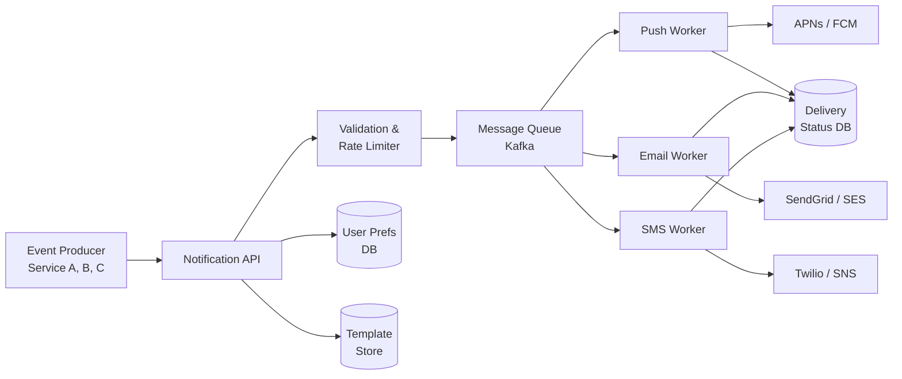

# Solution: Design a Notification System

## 1. Requirements & Estimation

### Functional Requirements

- Multi-channel delivery: push, SMS, email
- Template-based messages with personalization
- User preference management (channel opt-in, quiet hours)
- Delivery tracking and analytics
- Scheduled and real-time notifications

### Non-Functional Requirements

- At-least-once delivery
- Real-time notifications within 5 seconds
- 99.9% availability
- Extensible for new channels

### Estimation

| Metric | Calculation | Result |
|--------|-------------|--------|
| Avg notifications / sec | 10M / 86400 | ~116 /sec |
| Peak / sec | 116 × 5 | ~500 /sec |
| Push / day | 10M × 60% | 6M |
| Email / day | 10M × 30% | 3M |
| SMS / day | 10M × 10% | 1M |
| Storage (logs, 1 year) | 10M × 1 KB × 365 | ~3.6 TB |

## 2. High-Level Design



### Flow

1. **Event trigger:** A service (e.g., payment, social) sends a notification event.
2. **API server:** Validates the request, renders the template, checks user preferences.
3. **Fan-out:** Routes to per-channel message queues based on user preferences and device info.
4. **Workers:** Channel-specific workers consume from queues and call third-party APIs.
5. **Tracking:** Workers update delivery status in the status database.

## 3. API Design

### Send Notification

```
POST /api/v1/notifications
{
  "user_id": "user_123",
  "template_id": "order_shipped",
  "channels": ["push", "email"],     // optional override
  "data": {
    "order_id": "ORD-456",
    "tracking_url": "https://..."
  },
  "scheduled_at": null,               // null = immediate
  "priority": "high"                   // high / normal / low
}

Response 202:
{
  "notification_id": "notif_789",
  "status": "queued"
}
```

### Get Delivery Status

```
GET /api/v1/notifications/notif_789/status

Response 200:
{
  "notification_id": "notif_789",
  "channels": {
    "push": { "status": "delivered", "delivered_at": "..." },
    "email": { "status": "sent", "sent_at": "..." }
  }
}
```

## 4. Data Model

### Notification Table

| Column | Type | Notes |
|--------|------|-------|
| notification_id | UUID | Primary key |
| user_id | BIGINT | Recipient |
| template_id | VARCHAR | Template reference |
| data_json | JSON | Template variables |
| priority | ENUM | high / normal / low |
| created_at | TIMESTAMP | Event time |
| scheduled_at | TIMESTAMP | null = immediate |

### Delivery Status Table

| Column | Type | Notes |
|--------|------|-------|
| delivery_id | UUID | Primary key |
| notification_id | UUID | FK to notification |
| channel | ENUM | push / email / sms |
| status | ENUM | queued / sent / delivered / failed |
| provider_id | VARCHAR | Third-party message ID |
| attempts | INT | Retry count |
| last_attempt_at | TIMESTAMP | Last try time |
| error_message | TEXT | Failure reason |

### User Preferences Table

| Column | Type | Notes |
|--------|------|-------|
| user_id | BIGINT | Primary key |
| push_enabled | BOOL | Opt-in for push |
| email_enabled | BOOL | Opt-in for email |
| sms_enabled | BOOL | Opt-in for SMS |
| quiet_start | TIME | e.g., 22:00 |
| quiet_end | TIME | e.g., 08:00 |
| timezone | VARCHAR | User's timezone |

## 5. Detailed Design

### Template Engine

Templates use variable placeholders:

```
Subject: Your order {{order_id}} has shipped!
Body: Track your package: {{tracking_url}}
```

- Templates are stored in a template database and cached in memory.
- Rendering happens at the API layer before queueing.
- Channel-specific templates: push (short), email (HTML), SMS (160 chars).

### Channel Routing Logic

```
for channel in [push, email, sms]:
    if user.has_opted_in(channel):
        if channel == push:
            for device in user.devices:
                enqueue(push_queue, notification, device)
        else:
            enqueue(channel_queue, notification)
```

### Reliability: Retry and Dead-Letter Queue

| Attempt | Delay | Action |
|---------|-------|--------|
| 1 | Immediate | First try |
| 2 | 30 seconds | First retry |
| 3 | 2 minutes | Second retry |
| 4 | 10 minutes | Third retry |
| 5 | 1 hour | Final retry |
| > 5 | — | Move to Dead-Letter Queue (DLQ) |

- Workers use exponential backoff with jitter.
- DLQ messages are investigated by ops (device token expired, bad email, etc.).

### Deduplication

- Each notification has a unique `notification_id`.
- Before sending, the worker checks the delivery status table.
- If a record with `status = sent/delivered` exists for this `(notification_id, channel)` → skip.
- This prevents duplicate deliveries during retries.

### Rate Limiting

- Per-user: Max 10 notifications per hour (configurable per channel).
- Per-template: Max 1 per user per event (e.g., don't send "order shipped" twice for the same order).
- Global: Each channel worker respects the third-party API rate limits.

### Scheduled Notifications

- If `scheduled_at` is set, the notification is stored and picked up by a scheduler.
- A cron-like scheduler runs every minute, queries for due notifications, and enqueues them.
- For quiet hours: delay non-critical notifications until `quiet_end` in the user's timezone.

## 6. Scaling & Trade-offs

### Bottlenecks

| Bottleneck | Mitigation |
|------------|------------|
| Push worker throughput | Batch sends to APNs/FCM (up to 500 per request) |
| Email rendering (HTML) | Pre-render at API layer; cache compiled templates |
| SMS cost | Only send SMS for critical/transactional messages |
| Third-party outages | Circuit breaker pattern; fallback to alternate provider |
| Large fan-out events | Queue-based processing; limit notifications per event |

### Trade-offs

| Decision | Trade-off |
|----------|-----------|
| At-least-once vs exactly-once | At-least-once is simpler but requires client-side dedup |
| Per-channel queues vs single queue | Per-channel allows independent scaling but more infra |
| Render at API vs worker | API-side rendering is simpler; worker-side allows channel-specific templates |
| Push vs pull for scheduling | Push (cron) is simpler; pull (worker polling) avoids thundering herd |

### Future Improvements

- **Notification grouping:** Batch similar notifications ("5 people liked your post").
- **A/B testing:** Test different templates and measure open rates.
- **Rich push:** Support images, action buttons, and deep links.
- **WebSocket channel:** Real-time in-app notifications without polling.
- **ML-based send time optimization:** Send when the user is most likely to engage.
- **Unsubscribe management:** One-click unsubscribe with preference center.
