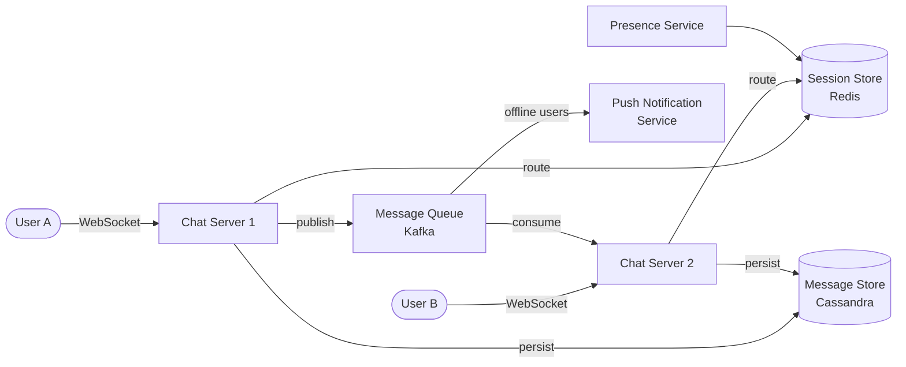

# Solution: Design a Chat System

## 1. Requirements & Estimation

### Functional Requirements

- 1:1 and group messaging (up to 500 members)
- Real-time delivery via persistent connections
- Delivery receipts (sent → delivered → read)
- Online/offline presence
- Multi-device sync
- Message history

### Non-Functional Requirements

- < 100ms delivery latency
- At-least-once delivery — zero message loss
- Message ordering within a conversation
- 99.99% availability

### Estimation

| Metric | Calculation | Result |
|--------|-------------|--------|
| Message QPS | 10B / 86400 | ~115K QPS |
| Peak QPS | 115K × 3 | ~350K QPS |
| Storage / day | 10B × 500 bytes | ~5 TB |
| Storage (5 years) | 5 TB × 365 × 5 | ~9 PB |
| Concurrent WebSockets | 50M × 40% online | ~20M |
| Chat servers (10K conn each) | 20M / 10K | ~2,000 servers |

## 2. High-Level Design



### Message Flow (1:1)

1. User A sends a message via WebSocket to Chat Server 1.
2. Chat Server 1 generates a message ID (Snowflake) and persists it to the message store.
3. Chat Server 1 looks up User B's session in Redis to find their chat server.
4. **If User B is online:** Route the message to Chat Server 2 via the message queue. Chat Server 2 pushes it to User B's WebSocket.
5. **If User B is offline:** Enqueue a push notification. The message waits in the DB until User B comes online and syncs.

### Message Flow (Group)

1. User A sends a message to group G.
2. Chat Server 1 persists the message to the group's message store.
3. For each member of group G:
   - Look up their session.
   - Route to their chat server or enqueue a push notification.
4. Fan-out happens through the message queue — each member's chat server consumes their messages.

## 3. API Design

### WebSocket Messages

**Send message:**

```json
{
  "action": "send",
  "conversation_id": "conv_123",
  "content": "Hello!",
  "type": "text",
  "client_msg_id": "uuid-from-client"
}
```

**Receive message:**

```json
{
  "action": "receive",
  "message_id": "msg_789",
  "conversation_id": "conv_123",
  "sender_id": "user_456",
  "content": "Hello!",
  "timestamp": 1681500000000
}
```

**Delivery receipt:**

```json
{
  "action": "ack",
  "message_id": "msg_789",
  "status": "delivered"
}
```

### REST Endpoints

```
GET /api/v1/conversations/{conv_id}/messages?before={msg_id}&limit=50
GET /api/v1/conversations
POST /api/v1/conversations  (create group)
```

## 4. Data Model

### Message Table (Cassandra)

Partition key: `conversation_id`, Clustering key: `message_id` (time-sorted)

| Column | Type | Notes |
|--------|------|-------|
| conversation_id | UUID | Partition key |
| message_id | BIGINT | Snowflake ID (clustering key, DESC) |
| sender_id | BIGINT | Who sent it |
| content | TEXT | Message body |
| type | ENUM | text / image / file |
| created_at | TIMESTAMP | Server timestamp |

**Why Cassandra?**

- Optimized for write-heavy workloads (115K writes/sec).
- Partition by conversation → all messages in a chat are co-located.
- Range queries by `message_id` for pagination.

### Session Table (Redis)

```
session:{user_id} → {
  "server": "chat-server-42",
  "connected_at": 1681500000,
  "devices": ["phone_ios", "desktop_mac"]
}
```

### Conversation Table (SQL)

| Column | Type | Notes |
|--------|------|-------|
| conversation_id | UUID | Primary key |
| type | ENUM | direct / group |
| name | VARCHAR | Group name (null for 1:1) |
| created_at | TIMESTAMP | Creation time |

### Conversation Members Table

| Column | Type | Notes |
|--------|------|-------|
| conversation_id | UUID | FK |
| user_id | BIGINT | Member |
| role | ENUM | admin / member |
| joined_at | TIMESTAMP | Join time |
| last_read_msg | BIGINT | Last read message ID |

## 5. Detailed Design

### Connection Management

- Each client maintains a WebSocket connection to one chat server.
- Heartbeat every 30 seconds to detect stale connections.
- If no heartbeat for 90 seconds → mark user offline, close connection.
- On reconnect, client sends `last_received_msg_id` → server sends all newer messages.

### Message Ordering

- Each message gets a Snowflake ID (time-based, monotonic per server).
- Within a conversation, messages are ordered by their Snowflake ID.
- Clients display messages sorted by `message_id`.
- Cassandra's clustering key ensures storage order matches display order.

### Delivery Receipts

| Status | Triggered when |
|--------|----------------|
| Sent | Server persists the message |
| Delivered | Recipient's device ACKs receipt |
| Read | Recipient opens the conversation |

- The sender's client receives status updates via WebSocket.
- For groups: "delivered" means delivered to all members; "read" shows per-user read status.

### Online Presence

- When a user connects → publish `online` event to their contacts.
- When heartbeat fails → publish `offline` event.
- To avoid flapping (brief disconnects), use a grace period:
  - Mark offline only after 30 seconds of no heartbeat.
  - If reconnected within 30 seconds → no status change.

**Optimization for large friends lists:** Use a pub/sub channel per user. Contacts subscribe to presence changes for their friends list.

### Group Message Delivery

**Small groups (< 50 members):** Fan-out on write — copy the message to each member's chat server immediately.

**Large groups (50-500 members):** Fan-out on read — store the message once in the group partition. Members fetch from the group partition when they open the chat.

### Multi-Device Sync

- Each device maintains its own WebSocket connection.
- Messages are delivered to ALL connected devices.
- Each device tracks its own `last_synced_msg_id`.
- On app open, the device fetches messages since its `last_synced_msg_id`.

## 6. Scaling & Trade-offs

### Bottlenecks

| Bottleneck | Mitigation |
|------------|------------|
| 20M concurrent WebSockets | 2,000+ chat servers; 10K connections per server |
| Group fan-out (500 members) | Message queue; fan-out on read for large groups |
| Message storage (5 TB/day) | Cassandra cluster; TTL for old messages |
| Hot conversations | Partition by conversation; cache recent messages |
| Thundering herd on reconnect | Staggered sync; limit sync window |

### Trade-offs

| Decision | Trade-off |
|----------|-----------|
| WebSocket vs long polling | WebSocket is more efficient but harder to scale through L7 proxies |
| Fan-out on write vs read | Write is faster for recipients; read reduces storage duplication |
| Cassandra vs SQL | Cassandra handles high write throughput; SQL is better for complex queries |
| At-least-once vs exactly-once | At-least-once is simpler; clients must handle duplicate detection |
| Presence heartbeat interval | Shorter = more accurate but more network overhead |

### Future Improvements

- **End-to-end encryption:** Signal protocol for 1:1; Sender Keys for groups.
- **Message reactions:** Lightweight metadata updates on existing messages.
- **Typing indicators:** Short-lived presence events via WebSocket.
- **Voice/video calls:** Extend WebSocket signaling with WebRTC.
- **Message search:** Elasticsearch index populated asynchronously.
- **Disappearing messages:** TTL-based auto-deletion with client-side enforcement.
