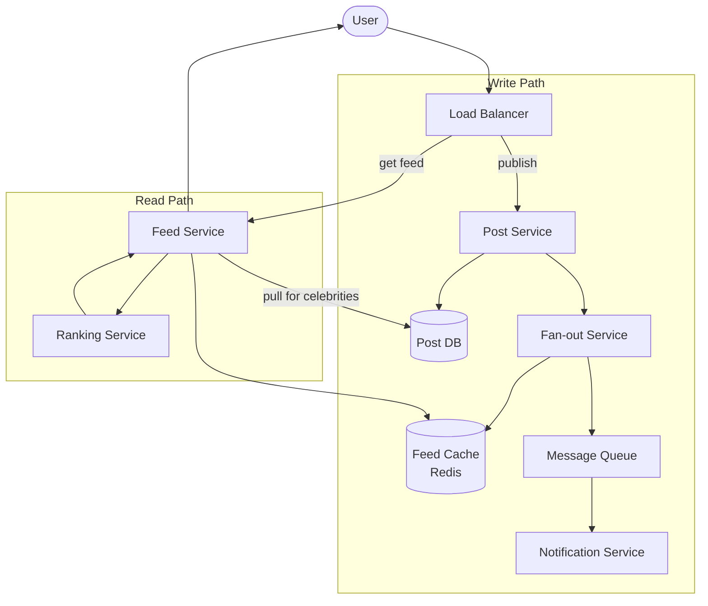

# Solution: Design a News Feed

## 1. Requirements & Estimation

### Functional Requirements

- Publish posts (text, image, video)
- Personalized, ranked feed from followed accounts
- Paginated infinite scrolling
- Near-real-time delivery (< 5 seconds)

### Non-Functional Requirements

- Feed load time < 200ms
- 99.99% availability
- Eventual consistency is acceptable
- Handle celebrity users (millions of followers)

### Estimation

| Metric | Calculation | Result |
|--------|-------------|--------|
| Feed QPS | 5B / 86400 | ~58K QPS |
| Peak feed QPS | 58K × 3 | ~175K QPS |
| Post write QPS | 500M / 86400 | ~5,800 QPS |
| Fan-out (avg) | 5,800 × 300 followers | ~1.7M writes/sec |
| Feed cache (all users) | 500M × 400 KB | ~200 TB (hot only) |
| Feed cache (20% active) | 100M × 400 KB | ~40 TB |

## 2. High-Level Design



### Hybrid Fan-Out Strategy

| User type | Strategy | Reason |
|-----------|----------|--------|
| Normal (< 10K followers) | Fan-out on write (push) | Followers get instant feed updates |
| Celebrity (> 10K followers) | Fan-out on read (pull) | Avoid 10M+ writes per post |

When a user opens their feed:
1. Fetch pre-computed feed from cache (pushed posts).
2. Fetch recent posts from followed celebrities (pulled posts).
3. Merge, rank, and return.

## 3. API Design

### Publish Post

```
POST /api/v1/posts
{
  "content": "Hello world!",
  "media_ids": ["img_123"],
  "visibility": "public"
}

Response 201:
{
  "post_id": "post_789",
  "created_at": "2026-04-14T12:00:00Z"
}
```

### Get Feed

```
GET /api/v1/feed?cursor={last_post_id}&limit=20

Response 200:
{
  "posts": [
    {
      "post_id": "post_789",
      "author": { "id": "user_456", "name": "Jane" },
      "content": "Hello world!",
      "likes": 42,
      "comments": 7,
      "created_at": "2026-04-14T12:00:00Z"
    }
  ],
  "next_cursor": "post_750"
}
```

## 4. Data Model

### Post Table (SQL or Cassandra)

| Column | Type | Notes |
|--------|------|-------|
| post_id | BIGINT | Snowflake ID (primary key) |
| author_id | BIGINT | Who posted |
| content | TEXT | Post text |
| media_urls | JSON | Attached media |
| created_at | TIMESTAMP | Publish time |
| like_count | INT | Denormalized counter |
| comment_count | INT | Denormalized counter |

### Feed Cache (Redis Sorted Set)

```
Key: feed:{user_id}
Score: post timestamp (or ranking score)
Value: post_id

ZREVRANGE feed:user_123 0 19  → top 20 posts
```

Each user's feed cache holds the most recent 500 post IDs, sorted by rank.

### Social Graph (Adjacency List)

| Column | Type | Notes |
|--------|------|-------|
| follower_id | BIGINT | Who follows |
| followee_id | BIGINT | Who is followed |
| created_at | TIMESTAMP | Follow time |

Index on both `follower_id` (get who I follow) and `followee_id` (get my followers).

## 5. Detailed Design

### Fan-Out on Write (Push)

When a normal user publishes a post:

1. Save the post to the post database.
2. Fan-out service queries the user's follower list.
3. For each follower, insert the `post_id` into their feed cache (Redis sorted set).
4. If any follower is online, push a real-time notification.

**Optimization:** Use a message queue (Kafka) for the fan-out. The fan-out service consumes post events and writes to feed caches asynchronously. This decouples the write path from fan-out latency.

### Fan-Out on Read (Pull) for Celebrities

When a user opens their feed:

1. Fetch the pre-computed feed from Redis (pushed posts from normal users).
2. Get the list of celebrity accounts the user follows.
3. Fetch each celebrity's recent posts directly from the post database.
4. Merge the two sets.

**Caching celebrity posts:** Cache each celebrity's recent posts in a separate Redis key (`celebrity_posts:{user_id}`). This avoids per-follower fan-out while still serving fast reads.

### Feed Ranking

A lightweight ranking model scores each candidate post:

```
score = w1 × recency
      + w2 × engagement_rate
      + w3 × affinity(user, author)
      + w4 × content_type_preference
      + w5 × diversity_boost
```

| Signal | Description |
|--------|-------------|
| Recency | Time decay — newer posts score higher |
| Engagement rate | Likes + comments relative to impressions |
| Affinity | How often the user interacts with the author |
| Content type | User prefers images? Videos? Text? |
| Diversity | Avoid flooding the feed with one author |

Ranking happens at read time on the merged candidate set (~500 posts → top 20).

### Feed Pagination

- Use cursor-based pagination (not offset) to handle new posts arriving mid-scroll.
- Cursor = `post_id` of the last seen post.
- Next page: `ZREVRANGEBYSCORE feed:{user_id} ({cursor} -inf LIMIT 0 20`
- This ensures no duplicates even if new posts are added between page loads.

### Cache Invalidation

| Event | Action |
|-------|--------|
| User unfollows X | Remove X's posts from user's feed cache (lazy) |
| Post deleted | Remove from author's post list; propagate to feed caches |
| New follow | Backfill recent posts from new followee into the feed cache |

## 6. Scaling & Trade-offs

### Bottlenecks

| Bottleneck | Mitigation |
|------------|------------|
| Fan-out for popular users | Hybrid push/pull; celebrity threshold at 10K followers |
| Feed cache memory (Redis) | Store only post_ids (not full posts); limit to 500 per user |
| Ranking latency | Pre-score posts during fan-out; light re-rank at read time |
| Social graph queries | Cache follower lists; denormalize counts |
| Post DB reads for celebrities | Cache celebrity post lists with short TTL |

### Trade-offs

| Decision | Trade-off |
|----------|-----------|
| Push vs pull | Push = fast reads, expensive writes. Pull = cheap writes, slow reads |
| Hybrid threshold (10K) | Lower threshold = less fan-out but more pull queries |
| Ranking at write vs read | Write-time ranking is cheaper but less personalized |
| Redis sorted set vs list | Sorted set enables ranking but uses more memory |
| Eventual consistency | Feed might be a few seconds stale; acceptable for social media |

### Future Improvements

- **ML ranking:** Replace weighted score with a trained model (gradient boosted trees, neural ranker).
- **Interest-based recommendations:** Show posts from users you don't follow but might like.
- **Story/Reel feed:** Separate feed for ephemeral and video content.
- **Feed diversity controls:** Let users tune their feed (more from friends, less suggested).
- **Real-time updates:** Push new posts to the feed via WebSocket while the user is scrolling.
- **Content moderation:** Filter flagged, spam, or harmful content before it reaches the feed.

---

## First-time Recognition Signals

When the interviewer's prompt sounds like this, the news-feed playbook (hybrid push/pull fan-out + Redis sorted-set feed cache + precomputed ranking) is the right answer:

- **"Show posts from people I follow, ranked or newest-first"** — direct match for fan-out + feed cache.
- **"Some users have 100M followers — handle the celebrity case"** — pure push won't work; switch to hybrid (pull on read for celebs).
- **"Personalized ranking, not strictly chronological"** — ranker tier between candidate generation and serving.
- **"Infinite scroll with low first-paint latency"** — pre-built per-user feed cache + cursor pagination.
- **"Posts may include text, photo, or video — surface them in one stream"** — content URLs are stored in the cache; payloads stay in blob storage / CDN.

### Anti-signals (looks like this design, isn't)

- **"Chronological list of *my own* posts on my profile"** — that's a simple `WHERE user_id = ? ORDER BY time` query; no fan-out needed.
- **"Real-time chat conversation feed"** — that's the chat-system with WS push, not a follow-graph fan-out.
- **"Personalized product recommendations on the homepage"** — that's a recsys (collaborative filtering / two-tower), not a follow-graph feed.

## Further Reading

- Twitter blog — "Timelines at Scale" (Yao Yue, QCon talk + post).
- Facebook Engineering — "TAO: Facebook's Distributed Data Store for the Social Graph".
- *System Design Interview Vol. 1* (Alex Xu), Chapter 11 — Designing a News Feed System.
- *Designing Data-Intensive Applications* (Kleppmann), Chapter 1 — uses the Twitter timeline as the running fan-out example.

## Variant Prompts

- **"What if there are 100× more posts/day?"** — shard the post store by `post_id`, partition fan-out workers by `user_id` range, increase the celebrity threshold.
- **"What if global p99 feed reads must be < 50 ms?"** — edge-cache top-N items per user via CDN; precompute the visible window and only re-rank lazily.
- **"What if no post can ever be missed from a feed?"** — durable post log (Kafka), replay-able fan-out worker, periodic reconciliation between source-of-truth and feed cache.
- **"What if the team only has 2 engineers?"** — pure pull from a posts table + a thin Redis read-through cache; skip the fan-out service entirely.
