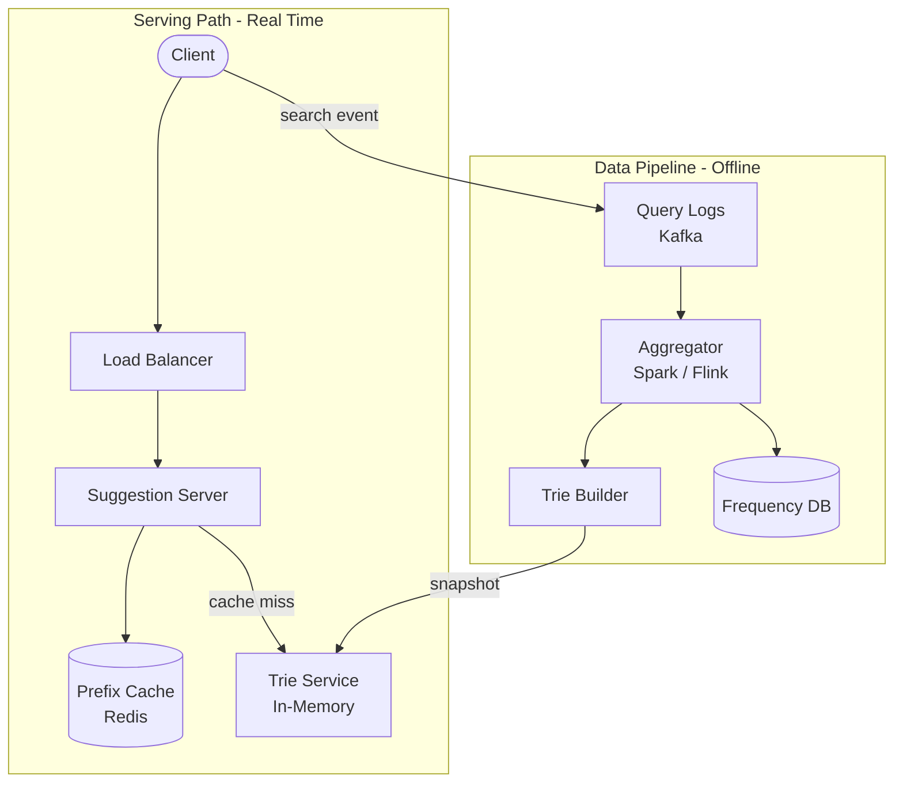

# Solution: Design Typeahead / Autocomplete

## 1. Requirements & Estimation

### Functional Requirements

- Return top 5-10 suggestions for a given prefix
- Suggestions ranked by popularity (search frequency)
- Support multi-word queries
- Filter offensive content
- Near-real-time freshness for trending topics

### Non-Functional Requirements

- < 50ms response time per keystroke
- 99.99% availability
- Trending queries reflected within 15-30 minutes
- Horizontally scalable

### Estimation

| Metric | Calculation | Result |
|--------|-------------|--------|
| Suggestion QPS | 10B queries × 8 keystrokes / 86400 | ~930K QPS |
| With client-side optimization | 930K × 0.13 (debounce + cache) | ~120K QPS |
| Trie storage | 1B queries × 50 bytes avg | ~50 GB |
| Top-K cache (top prefixes) | 100M prefixes × 500 bytes | ~50 GB |
| Query log / day (for aggregation) | 10B × 20 bytes | ~200 GB |

## 2. High-Level Design



### Two-Layer Architecture

1. **Serving layer (real-time):** Handles user keystrokes. Reads from cache or in-memory trie. Latency-critical.
2. **Data pipeline (offline):** Collects query logs, aggregates frequencies, rebuilds the trie periodically.

## 3. API Design

### Get Suggestions

```
GET /api/v1/suggestions?prefix=how+to&limit=10

Response 200:
{
  "suggestions": [
    { "query": "how to tie a tie", "score": 95000 },
    { "query": "how to cook rice", "score": 87000 },
    { "query": "how to lose weight", "score": 82000 },
    { "query": "how to screenshot", "score": 78000 },
    { "query": "how to make money", "score": 71000 }
  ]
}
```

### Client-Side Optimizations

| Optimization | Effect |
|-------------|--------|
| Debounce (200ms) | Only send request after user pauses typing |
| Local cache | Cache prefix → suggestions on the client for the session |
| Prefetch | On first keystroke, prefetch results for 2-3 character prefixes |
| Abort previous | Cancel in-flight request when a new keystroke arrives |

These optimizations reduce server QPS by ~87%.

## 4. Data Model

### Trie Node (In-Memory)

```
TrieNode {
  children: Map<char, TrieNode>
  top_k: List<(query, score)>    // precomputed top-K at this node
  is_end: bool
}
```

Each node stores the precomputed top-K suggestions for the prefix ending at that node. This avoids traversing the entire subtree at query time.

### Frequency Table (for rebuilding)

| Column | Type | Notes |
|--------|------|-------|
| query | VARCHAR | Normalized search query |
| frequency | BIGINT | Total search count |
| last_updated | TIMESTAMP | Most recent update |
| is_blocked | BOOL | Content moderation flag |

### Prefix Cache (Redis)

```
Key: prefix:{normalized_prefix}
Value: JSON array of top 10 suggestions
TTL: 1 hour (or until next trie rebuild)
```

## 5. Detailed Design

### Trie with Top-K Precomputation

**Building the trie:**

1. Collect all unique queries with their frequencies.
2. Insert each query into the trie character by character.
3. At each node along the path, update the top-K list if the query's frequency qualifies.

**Querying:**

1. Traverse the trie following the prefix characters.
2. At the final node, return the precomputed `top_k` list.
3. Time complexity: O(prefix_length) — independent of the number of queries.

**Why precompute top-K?** Without precomputation, finding the top-K suggestions requires traversing the entire subtree below the prefix node. For prefixes like "a" or "th", the subtree can contain millions of queries. Precomputation makes reads O(1) at the cost of O(N × prefix_length) at build time.

### Data Collection Pipeline

```
User searches → Query logs (Kafka) → Aggregator (Flink)
                                          ↓
                                    Frequency DB
                                          ↓
                                    Trie Builder (every 15 min)
                                          ↓
                                    Trie Snapshot (S3)
                                          ↓
                                    Trie Servers (load snapshot)
```

**Aggregation strategy:**

- **Real-time stream (Flink):** Maintain sliding window counts (last 1h, 24h, 7d).
- **Weighted scoring:** `score = w1 × count_1h + w2 × count_24h + w3 × count_7d`
- This naturally boosts trending queries while retaining long-term popular queries.

### Trie Rebuild and Deployment

1. Trie builder runs every 15 minutes.
2. Builds a new trie snapshot and serializes it to object storage.
3. Trie servers periodically check for new snapshots.
4. On a new snapshot: load it into memory, swap the active trie (blue-green).
5. Zero-downtime updates — the old trie serves requests until the new one is ready.

### Content Moderation

- Maintain a blocklist of offensive queries in the frequency DB (`is_blocked = true`).
- During trie build, blocked queries are excluded.
- For real-time blocking (before next rebuild): maintain a small in-memory blocklist on each suggestion server. Filter results before returning.

### Sharding the Trie

For 50 GB+ tries that don't fit on a single server:

| Strategy | How it works | Trade-off |
|----------|-------------|-----------|
| Range-based | Shard by first character (a-m, n-z) | Simple but unbalanced |
| Hash-based | Hash the prefix to determine shard | Balanced but multi-shard queries |
| Prefix-based | Shard by 2-character prefix | Good balance, predictable routing |

**Recommended:** Range-based sharding by first 1-2 characters. The gateway routes the request based on the prefix. Each shard holds a subset of the trie.

### Handling Trending Queries

Normal pipeline takes 15 minutes. For breaking news:

1. A fast path aggregator detects spike patterns (query count jumps 10x in 5 minutes).
2. Inserts the trending query directly into a **trending overlay** in Redis.
3. Suggestion servers merge results from the trie + trending overlay.
4. Trending queries get a temporary score boost.
5. On the next scheduled rebuild, the trending queries are absorbed into the main trie.

## 6. Scaling & Trade-offs

### Bottlenecks

| Bottleneck | Mitigation |
|------------|------------|
| Trie memory (50 GB) | Shard across multiple servers; limit depth to 30 chars |
| Cache miss storms | Pre-warm common prefixes on trie rebuild |
| Query log volume (200 GB/day) | Stream processing (Flink); sample low-frequency queries |
| Trie rebuild time | Parallel build; incremental updates for small diffs |
| Multi-language support | Separate trie per language; route by detected language |

### Trade-offs

| Decision | Trade-off |
|----------|-----------|
| Precomputed top-K vs dynamic | Precomputed is O(1) reads but stale until rebuild |
| Full rebuild vs incremental | Full rebuild is simpler; incremental is faster but complex |
| Client debounce (200ms) | Reduces QPS 5x but adds perceived latency |
| Sharded vs replicated trie | Sharded fits larger datasets; replicated is simpler |
| 15-min freshness vs real-time | 15-min is simpler; real-time needs a fast path overlay |

### Future Improvements

- **Personalized suggestions:** Blend user's search history with global popularity. Store per-user top queries and mix them at serving time.
- **Spell correction:** Suggest corrections for misspelled prefixes using edit distance or phonetic matching.
- **Context-aware suggestions:** Use the user's current page, location, or time of day to adjust ranking.
- **Entity-enriched results:** Show rich suggestions with images, categories, or prices alongside the query text.
- **Federated learning:** Train personalized models on-device without collecting individual query histories.
- **Zero-prefix suggestions:** Show trending/personalized suggestions before the user types anything.

---

## First-time Recognition Signals

When the interviewer's prompt sounds like this, the typeahead playbook (trie / FST with per-node top-K + offline rebuild + edge cache) is the right answer:

- **"Show top 10 suggestions as the user types each character"** — direct prefix-match latency problem.
- **"Frequency-ranked / most popular first"** — top-K precomputed at each trie node.
- **"< 50 ms per keystroke at global scale"** — edge cache + precomputed top-K + client-side debounce.
- **"Surface trending queries in real time"** — streaming aggregator (Flink/Kafka Streams) updating the trie hourly.
- **"Spell-correct or fuzzy match the prefix"** — trie + edit-distance / FST with permitted edits.

### Anti-signals (looks like this design, isn't)

- **"Full-text search across a product catalog with filters"** — that's Elasticsearch with facets, not a prefix typeahead.
- **"Recommend products the user might like"** — that's a recsys (collaborative filtering / embeddings), not frequency-ranked prefixes.
- **"Autocomplete code in an IDE"** — language-server (LSP) is syntax/type aware, not frequency-ranked text.

## Further Reading

- *System Design Interview Vol. 1* (Alex Xu), Chapter 13 — Design Search Autocomplete.
- Elasticsearch blog — "Suggesters: completion suggester" (the alternative implementation).
- LinkedIn Engineering — "Did you mean Galene?" — their search-infra evolution.
- Google Research — "Indexing Tens of Trillions of Web Pages" for the data-pipeline shape.

## Variant Prompts

- **"What if QPS is 100× higher (10M QPS)?"** — more trie shards (sharded by first 2 chars), more edge POPs, aggressive CDN caching of suggestions.
- **"What if latency must be < 20 ms globally?"** — heavier client-side debounce (200 ms), edge POPs serve cached top-10 by prefix; only rare prefixes hit origin.
- **"What if no query can be lost from the trends pipeline?"** — durable query log (Kafka) with checkpointed aggregator; replay-able trie build.
- **"What if the team only has 2 engineers?"** — Elasticsearch managed cluster + completion suggester; skip the custom trie.
