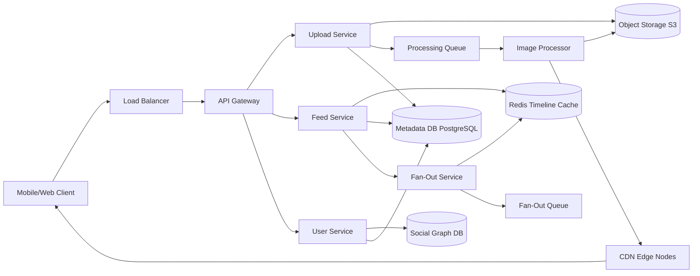

# Solution: Design Instagram / Photo Sharing

## 1. Requirements & Estimation

### Traffic Estimates

- **DAU:** 500M users
- **Photo uploads:** 100M/day → ~1,160/sec average, ~3,000/sec peak
- **Feed reads:** 500M users × 10 feed loads/day = 5B reads/day → ~58,000/sec average, ~2M/sec peak

### Storage Estimates

- **Original photo:** 3 MB average
- **Resized variants:** 4 per photo → thumbnail (20 KB), small (100 KB), medium (500 KB), large (1.5 MB) ≈ 2.1 MB total variants
- **Per photo total:** ~5.1 MB
- **Daily new storage:** 100M × 5.1 MB = **510 TB/day**
- **Annual storage:** ~186 PB/year

### Bandwidth Estimates

- **Upload bandwidth:** 100M × 3 MB / 86,400 = ~3.5 GB/sec ingress
- **Download bandwidth:** 5B reads × 500 KB avg served = ~29 GB/sec egress (mostly served from CDN)

## 2. High-Level Design



## 3. API Design

### Upload Photo

```
POST /api/v1/photos
Headers: Authorization: Bearer <token>, Idempotency-Key: <uuid>
Body: multipart/form-data { image, caption, location?, tags[]? }
Response: 202 Accepted { photo_id, status: "processing" }
```

### Get Feed

```
GET /api/v1/feed?cursor=<timestamp>&limit=20
Response: 200 { posts: [...], next_cursor: <timestamp> }
```

### Follow User

```
POST /api/v1/users/{user_id}/follow
Response: 200 { following: true }
```

### Explore / Discover

```
GET /api/v1/explore?cursor=<token>&limit=30
Response: 200 { posts: [...], next_cursor: <token> }
```

## 4. Data Model

### Photos Table (PostgreSQL, sharded by user_id)

| Column | Type | Notes |
|--------|------|-------|
| photo_id | BIGINT (Snowflake) | Primary key |
| user_id | BIGINT | Partition key |
| caption | TEXT | Max 2200 chars |
| location | GEOGRAPHY | Optional |
| created_at | TIMESTAMP | Indexed |
| storage_key | VARCHAR | S3 object key |
| status | ENUM | processing, active, deleted |

### Feed Cache (Redis sorted set per user)

```
Key: feed:{user_id}
Score: timestamp
Value: photo_id
Max entries: 800 (paged by client)
```

### Social Graph (Adjacency list, sharded by follower_id)

| Column | Type |
|--------|------|
| follower_id | BIGINT |
| followee_id | BIGINT |
| created_at | TIMESTAMP |

**Index:** (followee_id, follower_id) for "who follows me" queries.

## 5. Detailed Design

### Upload Pipeline Deep Dive

1. Client uploads original image to API Gateway.
2. Upload Service generates a `photo_id` (Snowflake ID), writes metadata to PostgreSQL, stores original to S3.
3. Upload Service publishes a message to the **Processing Queue** (Kafka/SQS).
4. **Image Processor** workers consume the message:
   - Resize to 4 variants (thumbnail 150×150, small 320×320, medium 640×640, large 1080×1080).
   - Strip EXIF data (privacy).
   - Generate a BlurHash placeholder for progressive loading.
   - Upload all variants to S3.
   - Update metadata DB with variant URLs.
   - Trigger CDN warmup for popular regions.
5. **Fan-Out Service** is notified that the photo is ready:
   - Fetches the uploader's follower list.
   - For non-celebrity users (<10K followers): pushes `photo_id` into each follower's Redis timeline cache.
   - For celebrities (>10K followers): does NOT fan out — followers pull celebrity posts at read time.

**Failure handling:** Each step is idempotent. Failed processing messages return to the queue with exponential backoff. A dead-letter queue captures permanently failed items for manual inspection.

### Feed Generation Deep Dive

The feed uses a **hybrid fan-out** model:

**Write path (push model, for users with <10K followers):**
- When a non-celebrity user posts, the Fan-Out Service writes the `photo_id` to each follower's Redis sorted set.
- This is the 99% case — most users have <1000 followers.
- Cost: 1 post × N followers writes to Redis.

**Read path (pull model, for celebrity posts):**
- When a user loads their feed, the Feed Service:
  1. Reads the pre-computed timeline from Redis (already contains non-celebrity posts).
  2. Fetches the list of celebrities the user follows.
  3. Queries the latest posts from each celebrity (small set, ~5-20 celebrities per user).
  4. Merges and ranks the combined list.
  5. Returns the top 20 posts.

**Ranking:** The Feed Ranking Service applies an ML model considering:
- Recency (time decay).
- Engagement signals (like probability, comment probability).
- Relationship strength (how often the user interacts with this account).
- Content type preference (photos vs. videos vs. Stories).

**Cache invalidation:** Timeline caches have a 24-hour TTL. If a user hasn't loaded their feed in 24 hours, it's rebuilt on the next read.

### Explore/Discover Deep Dive

The Explore page shows content from accounts the user does NOT follow, selected by a recommendation engine:

1. **Candidate generation:** Collaborative filtering identifies posts liked by users similar to the current user.
2. **Content-based filtering:** Analyze image features (using a pre-trained CNN) to find visually similar content to what the user engages with.
3. **Ranking:** A separate ML model ranks candidates by predicted engagement.
4. **Diversity:** A re-ranking step ensures variety in content type, creator, and topic.

The Explore index is pre-computed hourly and stored in a dedicated serving layer.

## 6. Scaling & Trade-offs

### Bottlenecks & Mitigations

| Bottleneck | Mitigation |
|-----------|------------|
| Celebrity fan-out (100M followers) | Pull model for celebrities; never fan out to all followers |
| Image processing lag | Auto-scaling worker fleet; priority queues for popular creators |
| Feed cache memory | Limit cached posts per user to 800; evict inactive users after 7 days |
| Hot partition (viral post) | CDN absorbs read load; cache like counts in Redis with periodic DB flush |
| Storage cost (186 PB/year) | Tiered storage: hot (SSD, 30 days) → warm (HDD, 1 year) → cold (Glacier) |

### Key Trade-offs

- **Consistency vs. latency:** Feed uses eventual consistency (a post might take 5-10 seconds to appear in all followers' feeds). Acceptable for social media.
- **Push vs. pull:** Hybrid approach adds complexity but avoids the celebrity fan-out problem while keeping latency low for most users.
- **Storage duplication vs. processing:** Storing 4 variants per photo costs 2× storage but eliminates runtime resizing and reduces CDN bandwidth.

### Future Improvements

- **Video support:** Extend the processing pipeline with a transcoding DAG (similar to YouTube).
- **Stories:** Ephemeral content with a 24-hour TTL stored in a separate Redis cluster with automatic expiry.
- **Reels recommendation:** Extend Explore with a short-video recommendation engine using watch-time signals.
- **Cross-region replication:** Active-active deployment for feed serving across 3+ regions.

---

## First-time Recognition Signals

When the interviewer's prompt sounds like this, the Instagram playbook (photo upload + transcode + CDN + sharded feed cache + explore recsys) is the right answer:

- **"Users post photos and followers see them in a feed"** — direct match for photo-sharing with a social graph.
- **"Generate multiple resolutions / thumbnails on upload"** — async transcode pipeline + CDN.
- **"Personalized Explore tab"** — recsys overlay separate from the follow-graph feed.
- **"Tag people and places in photos"** — entity index on top of the photo metadata.
- **"Stories that expire in 24 hours"** — TTL-bucketed object store and feed cache.

### Anti-signals (looks like this design, isn't)

- **"Live broadcast of a creator to millions of viewers"** — that's live-video streaming (YouTube Live, Twitch); needs HLS, ingest, and per-viewer low latency.
- **"In-app photo editor with filters running on the phone"** — client-side image processing; not a backend system at all.
- **"Cloud photo backup (Google Photos / iCloud Photos)"** — has no social graph; it's a sync/backup design (closer to Dropbox).

## Further Reading

- Instagram Engineering — "What Powers Instagram: Hundreds of Instances, Dozens of Technologies".
- Instagram blog — "Sharding & IDs at Instagram" (Postgres function variant of Snowflake).
- *System Design Interview Vol. 2* (Alex Xu), Instagram chapter.
- AWS blog — "Amazon S3 + CloudFront for media at scale" patterns.

## Variant Prompts

- **"What if uploads are 100× this (1M photos/min)?"** — parallel transcode fleet, regional ingest, partition the photo store by `user_id`.
- **"What if global feed reads must be < 50 ms?"** — CDN-cached thumbnails, per-region feed cache, precomputed top-N for active users.
- **"What if no photo can ever be lost?"** — S3 versioning + cross-region replication; checksum on upload and on every retrieval.
- **"What if the team only has 2 engineers?"** — Firebase Storage + Cloudinary for transcode + Firestore for feed; defer the recsys to a managed service.
