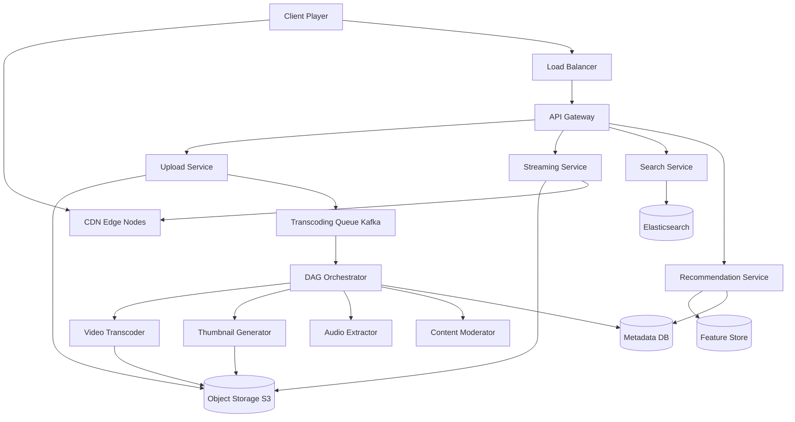
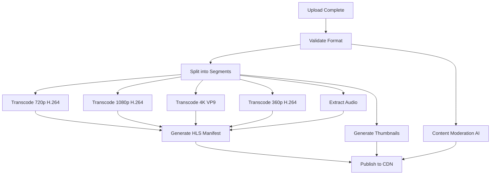

# Solution: Design YouTube / Video Streaming

## 1. Requirements & Estimation

### Traffic Estimates

- **DAU:** 800M users
- **Video uploads:** 500 hours/min → ~30,000 hours/day → ~4,300 videos/min (avg 7 min each)
- **Concurrent streams (peak):** 50M
- **Search queries:** 3B/day → ~35,000/sec

### Storage Estimates

- **Original video:** 1.5 GB average
- **Transcoded variants:** 10-15 per video (resolutions × codecs) → ~10 GB per video total
- **Daily new storage:** 4,300 videos/min × 1,440 min × 10 GB = **62 PB/day**
- **Total stored:** 1+ exabyte

### Bandwidth Estimates

- **Upload ingress:** ~4.5 GB/sec
- **Streaming egress:** 50M viewers × 5 Mbps average = **250 Tbps** (mostly served from CDN edge)

## 2. High-Level Design



## 3. API Design

### Upload Video (Chunked Resumable)

```
POST /api/v1/videos/upload/init
Body: { title, description, tags[], file_size, content_type }
Response: 201 { upload_id, chunk_size: 8MB, upload_url }

PUT /api/v1/videos/upload/{upload_id}/chunks/{chunk_number}
Body: <binary chunk>
Response: 200 { received_bytes, status }

POST /api/v1/videos/upload/{upload_id}/complete
Response: 202 { video_id, status: "processing" }
```

### Stream Video

```
GET /api/v1/videos/{video_id}/manifest.m3u8
Response: 200 (HLS master playlist with available quality levels)

GET /api/v1/videos/{video_id}/segments/{quality}/{segment_number}.ts
Response: 200 (binary video segment, served from CDN)
```

### Search

```
GET /api/v1/search?q=<query>&cursor=<token>&limit=20
Response: 200 { results: [...], next_cursor }
```

## 4. Data Model

### Videos Table (PostgreSQL, sharded by video_id)

| Column | Type | Notes |
|--------|------|-------|
| video_id | BIGINT (Snowflake) | Primary key |
| creator_id | BIGINT | FK to users |
| title | VARCHAR(100) | Indexed for search |
| description | TEXT | |
| duration_sec | INT | |
| status | ENUM | uploading, processing, active, removed |
| storage_key | VARCHAR | S3 prefix for all variants |
| created_at | TIMESTAMP | Indexed |
| view_count | BIGINT | Approximate, updated async |

### Video Variants Table

| Column | Type | Notes |
|--------|------|-------|
| video_id | BIGINT | FK |
| resolution | VARCHAR | 144p, 360p, 720p, 1080p, 4K |
| codec | VARCHAR | h264, vp9, av1 |
| bitrate_kbps | INT | |
| segment_count | INT | Number of HLS/DASH segments |
| storage_key | VARCHAR | S3 path to manifest + segments |

### View Counts (Redis + Cassandra)

- **Redis:** Real-time approximate counter per video (HyperLogLog for unique views).
- **Cassandra:** Periodic flush of aggregated view counts (time-series, partitioned by video_id + date).

## 5. Detailed Design

### Video Transcoding Pipeline Deep Dive

The transcoding pipeline is modeled as a **Directed Acyclic Graph (DAG)** of tasks:



**Orchestration details:**

1. **Upload Complete** triggers a Kafka message.
2. **DAG Orchestrator** (custom, or Apache Airflow) creates a task graph per video.
3. Tasks that can run in parallel do so (all transcodes run simultaneously).
4. Each task is idempotent — if a 720p transcode fails, only that task is retried.
5. **Content Moderation** runs in parallel with transcoding; if it flags the video, publication is blocked.
6. A single video produces 10-15 variants: (144p, 360p, 480p, 720p, 1080p, 4K) × (H.264, VP9) minus 4K H.264.
7. Each variant is split into **2-10 second segments** for adaptive streaming.
8. **HLS manifest** (`.m3u8`) lists available quality levels and segment URLs.

**Failure handling:** Each task has 3 retries with exponential backoff. Persistent failures move the video to a "manual review" queue. The orchestrator tracks task state in a relational DB.

### Adaptive Bitrate Streaming Deep Dive

1. Client requests the **master manifest** (`manifest.m3u8`), which lists available quality levels.
2. Client's ABR algorithm selects an initial quality based on detected bandwidth.
3. Client requests **segments** sequentially (each 2-10 seconds of video).
4. After each segment download, the client measures:
   - Download speed (bytes/time).
   - Buffer occupancy (seconds of video buffered ahead).
5. If bandwidth drops, the next segment is requested at a lower quality.
6. If bandwidth improves and buffer is healthy, quality increases.

**CDN strategy:**
- **Hot content** (top 10% by views, last 48 hours): Pre-warmed on all edge nodes globally.
- **Warm content** (next 30%): Cached on regional CDN nodes, pulled from origin on first request per region.
- **Cold content** (long tail, 60%): Served directly from origin (S3) or a single CDN shield node.
- **Origin shield:** A mid-tier CDN layer that absorbs cache misses from edge, preventing thundering herd on origin.

### Recommendation Engine Deep Dive

The recommendation system generates the home page feed:

1. **Candidate generation:** Two parallel pipelines:
   - **Collaborative filtering:** Matrix factorization on the user-video interaction matrix (watch history, likes, subscriptions).
   - **Content-based:** Video embeddings (title, tags, visual features from CNN) matched to user preference vectors.
2. **Scoring/ranking:** A neural network model scores each candidate video with features including:
   - Predicted watch time (primary objective).
   - Click-through rate probability.
   - User-creator affinity (subscription, past watch ratio).
   - Video freshness and quality signals.
3. **Re-ranking:** Business rules applied (diversity, freshness boost, creator fairness, demotion of clickbait).
4. **Serving:** Top-K results cached per user in Redis, refreshed every 30 minutes or on user action.

## 6. Scaling & Trade-offs

### Bottlenecks & Mitigations

| Bottleneck | Mitigation |
|-----------|------------|
| Transcoding compute cost | Spot/preemptible instances for non-urgent transcoding; priority queue for popular creators |
| CDN bandwidth (250 Tbps) | Multi-CDN strategy; direct peering with major ISPs; adaptive bitrate reduces wasted bandwidth |
| View count accuracy | HyperLogLog for approximate unique views; batch reconciliation for exact counts |
| Search index freshness | Near-real-time indexing pipeline; new videos searchable within 60 seconds |
| Storage cost (exabyte scale) | Tiered storage; remove low-quality variants for unwatched videos after 1 year |

### Key Trade-offs

- **Transcoding breadth vs. cost:** More variants = better viewer experience but higher storage and compute cost. Start with 6 key variants; add others based on demand.
- **CDN caching vs. freshness:** Aggressive caching saves egress cost but delays new content propagation. Solution: short TTL (5 min) for manifests, long TTL (1 year, immutable) for segments.
- **Recommendation relevance vs. exploration:** Optimizing purely for watch time creates filter bubbles. The re-ranking step deliberately injects diverse content.

### Future Improvements

- **Live streaming:** Add a real-time ingest pipeline (RTMP → HLS/DASH transcoding in real time).
- **AV1 codec migration:** 30% bitrate savings over VP9, reducing CDN costs significantly.
- **Edge computing:** Run lightweight recommendation models at CDN edge for personalized thumbnail selection.
- **Shorts/vertical video:** Separate pipeline optimized for short-form content with different caching and recommendation strategies.
