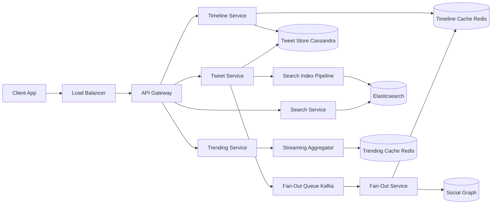

# Solution: Design Twitter / Social Network

## 1. Requirements & Estimation

### Traffic Estimates

- **DAU:** 400M users
- **Tweets/day:** 600M → ~7,000/sec average, ~15,000/sec peak
- **Timeline reads:** 400M × 20 loads/day = 8B/day → ~93,000/sec average, ~3M/sec peak
- **Search queries:** 500,000/sec peak

### Storage Estimates

- **Tweet size:** ~500 bytes (text + metadata, excluding media)
- **Daily tweet storage:** 600M × 500 B = **300 GB/day** (text only)
- **Media (images/videos):** ~10% of tweets have media → 60M × 2 MB avg = 120 TB/day
- **5-year tweet storage:** ~550 TB text, ~219 PB media

### Bandwidth Estimates

- **Timeline egress:** 3M reads/sec × 20 tweets × 500 B = ~30 GB/sec (text only; media via CDN)
- **Fan-out writes:** Average tweet → 200 followers → 7,000 tweets/sec × 200 = 1.4M Redis writes/sec

## 2. High-Level Design



## 3. API Design

### Post Tweet

```
POST /api/v1/tweets
Headers: Idempotency-Key: <uuid>
Body: { text, media_ids[]?, reply_to_id? }
Response: 201 { tweet_id, created_at }
```

### Get Home Timeline

```
GET /api/v1/timeline?cursor=<tweet_id>&limit=20
Response: 200 { tweets: [...], next_cursor }
```

### Search

```
GET /api/v1/search?q=<query>&type=tweets|users&cursor=<token>&limit=20
Response: 200 { results: [...], next_cursor }
```

### Get Trending Topics

```
GET /api/v1/trends?region=<country_code>
Response: 200 { trends: [{ topic, tweet_count, rank }] }
```

## 4. Data Model

### Tweets Table (Cassandra, partitioned by tweet_id)

| Column | Type | Notes |
|--------|------|-------|
| tweet_id | BIGINT (Snowflake) | Partition key, time-ordered |
| user_id | BIGINT | Author |
| text | VARCHAR(280) | Tweet content |
| reply_to_id | BIGINT | Nullable, for reply chains |
| retweet_of_id | BIGINT | Nullable, for retweets |
| media_urls | LIST<VARCHAR> | S3 references |
| created_at | TIMESTAMP | |
| like_count | INT | Denormalized, async updated |
| retweet_count | INT | Denormalized, async updated |

### Social Graph (Adjacency list in Cassandra)

| Column | Type | Notes |
|--------|------|-------|
| user_id | BIGINT | Partition key |
| following_ids | SET<BIGINT> | Who this user follows |
| follower_count | INT | Denormalized |
| following_count | INT | Denormalized |

**Separate table** for follower lookup:
- Partition key: `followee_id`, clustering key: `follower_id`.
- Enables efficient "get all followers of user X" for fan-out.

### Timeline Cache (Redis Sorted Set)

```
Key: timeline:{user_id}
Score: tweet_id (Snowflake, time-ordered)
Value: tweet_id
Max size: 800 entries (ZREMRANGEBYRANK to trim)
```

## 5. Detailed Design

### Hybrid Fan-Out Deep Dive

This is the core innovation of Twitter's architecture.

**Classification of users:**
- **Regular users** (<10K followers): ~99.9% of all users.
- **Celebrity users** (≥10K followers): ~0.1% of users, but their tweets reach billions of timelines.

**Write path — when a regular user tweets:**
1. Tweet Service writes the tweet to Cassandra.
2. Publishes event to Kafka (fan-out topic).
3. Fan-Out Service reads the user's follower list.
4. For each follower: `ZADD timeline:{follower_id} <tweet_id> <tweet_id>` in Redis.
5. Trim timeline to 800 entries.
6. Total fan-out: ~200 writes (average followers). Completes in <1 second.

**Write path — when a celebrity tweets:**
1. Tweet Service writes the tweet to Cassandra.
2. **No fan-out happens.** The tweet is stored only in the celebrity's own tweet list.
3. A lightweight event is published (for search indexing, trending, and notifications only).

**Read path — assembling a user's timeline:**
1. Timeline Service reads the pre-computed timeline from Redis (contains all non-celebrity tweets).
2. Fetches the user's list of followed celebrities (~5-20 accounts typically).
3. For each celebrity, fetches their latest N tweets from Cassandra.
4. Merges the pre-computed timeline with celebrity tweets.
5. Applies ranking model (optional, for algorithmic timeline).
6. Returns paginated results.

**Why this works:** 99.9% of tweets are fully pre-computed (fast reads). The 0.1% celebrity tweets require a small merge at read time, but the set of celebrities per user is small, making it an acceptable cost.

### Trending Topics Deep Dive

Trending detection uses a **streaming aggregation** pipeline:

1. Every tweet is published to a Kafka topic.
2. **Stream processors** (Flink/Spark Streaming) extract hashtags and significant n-grams (2-3 word phrases).
3. Each term is counted in a **sliding window** (5-minute tumbling windows).
4. The current count is compared to the **baseline** (average count for this term at this time of day over the past 30 days).
5. **Trend score** = (current_count - baseline) / sqrt(baseline). Terms with score > threshold are trending.
6. Trends are regionalized by associating tweets with their author's location.
7. Top 30 trending topics per region are written to Redis every 30 seconds.

**Spam filtering:** Terms associated with spam accounts (detected by a classifier) are excluded. Sudden spikes from coordinated bot networks are filtered by requiring diversity in the set of users posting the term.

### Search with Elasticsearch Deep Dive

**Indexing pipeline:**
1. New tweets are published to a Kafka topic.
2. A consumer writes tweets to Elasticsearch in near-real-time (batched, ~1-second delay).
3. Index schema: `tweet_id`, `text` (analyzed with standard + edge-ngram analyzers), `user_id`, `created_at`, `hashtags`, `language`.
4. Index is sharded by time (daily indices) for efficient time-range queries and easy retention.

**Query flow:**
1. Parse query: extract hashtags, mentions, operators (`from:`, `since:`, `filter:media`).
2. Build Elasticsearch query (bool query with must/should/filter clauses).
3. Execute across relevant time-range indices.
4. Boost recent tweets and tweets from verified/followed accounts.
5. Return top-K results with highlighted snippets.

**Scaling:** Elasticsearch cluster with 50+ data nodes, 3 replicas per shard. Recent indices (last 7 days) on SSD; older indices on HDD with fewer replicas.

### Tweet ID Generation (Snowflake)

```
| 1 bit unused | 41 bits timestamp (ms) | 10 bits machine ID | 12 bits sequence |
```

- **41-bit timestamp:** Milliseconds since custom epoch → ~69 years of unique timestamps.
- **10-bit machine ID:** 1,024 ID generator instances.
- **12-bit sequence:** 4,096 IDs per millisecond per machine → 4M IDs/sec per machine.
- IDs are roughly time-ordered, enabling efficient time-range queries.

## 6. Scaling & Trade-offs

### Bottlenecks & Mitigations

| Bottleneck | Mitigation |
|-----------|------------|
| Fan-out lag for 10K-follower users | Threshold tuning: push for <10K, pull for ≥10K. Monitor fan-out latency p99. |
| Timeline Redis memory | 800 tweets/user × 400M users × 16 bytes ≈ 5 TB. Evict inactive users (no login in 30 days). |
| Celebrity tweet merge latency | Cache celebrity tweets aggressively; pre-merge for users following the same set of celebrities. |
| Viral tweet (1M retweets) | Retweet counts updated async via Kafka aggregation, not synchronous per-request. |
| Search index size | Time-based index rotation; delete indices > 2 years old. |

### Key Trade-offs

- **Push vs. pull:** Hybrid adds read-path complexity (merge step) but eliminates the worst-case fan-out problem. Worth it.
- **Eventual consistency:** A tweet appears in followers' timelines within 5 seconds, not instantly. Acceptable for social media.
- **Chronological vs. algorithmic timeline:** Chronological is simpler and fairer. Algorithmic optimizes engagement but adds ranking infrastructure. Twitter supports both.

### Future Improvements

- **Spaces (audio rooms):** Add real-time audio streaming infrastructure (WebRTC-based).
- **Community notes:** Crowdsourced fact-checking system with its own ranking algorithm.
- **Long-form content:** Extend tweet storage and display for longer articles.
- **Decentralized identity:** Federation protocol for cross-platform social networking.

---

## First-time Recognition Signals

When the interviewer's prompt sounds like this, the Twitter playbook (tweet store + Snowflake IDs + hybrid fan-out + Elasticsearch tweet index + trending heavy-hitters) is the right answer:

- **"Post a 280-char tweet, follow others, see a home timeline"** — direct match for the microblog plus follow-graph design.
- **"Show trending hashtags worldwide in real time"** — streaming heavy-hitters / count-min sketch over the tweet stream.
- **"Search across every tweet ever written"** — Elasticsearch index, sharded by time.
- **"Verified accounts with tens of millions of followers"** — celebrity / pull-on-read branch of hybrid fan-out.
- **"Globally sortable tweet IDs"** — Snowflake (this design's birthplace).

### Anti-signals (looks like this design, isn't)

- **"Private 1:1 messaging app between two users"** — that's the chat-system; flat-timeline microblog logic doesn't apply.
- **"Forum with deeply nested threaded discussions"** — Reddit/Discourse model; Twitter's reply chain is much shallower and treated as a fan-out tail.
- **"Reverse-chronological blog from one author"** — no follow graph, no fan-out; a simple posts-by-author query suffices.

## Further Reading

- Twitter Engineering — "The Infrastructure Behind Twitter" series.
- Yao Yue — "Timelines at Scale" (QCon talk; the canonical reference).
- *System Design Interview Vol. 2* (Alex Xu), Twitter chapter.
- "Manhattan, our real-time, multi-tenant distributed database" — Twitter blog on their KV store.

## Variant Prompts

- **"What if there are 100× more tweets/day?"** — partition the tweet store by `tweet_id` snowflake range; more fan-out workers; raise the celebrity threshold.
- **"What if global timeline reads must be < 50 ms?"** — regional timeline caches with cross-region replication; precompute the visible window per user.
- **"What if no tweet can ever be lost?"** — durable Kafka log of every tweet; replay-able fan-out; dual-region writes before ack.
- **"What if the team only has 2 engineers?"** — Postgres for tweets + Redis for timelines + managed Elasticsearch for search; skip Manhattan-equivalent and let RDS scale handle it for a long time.
