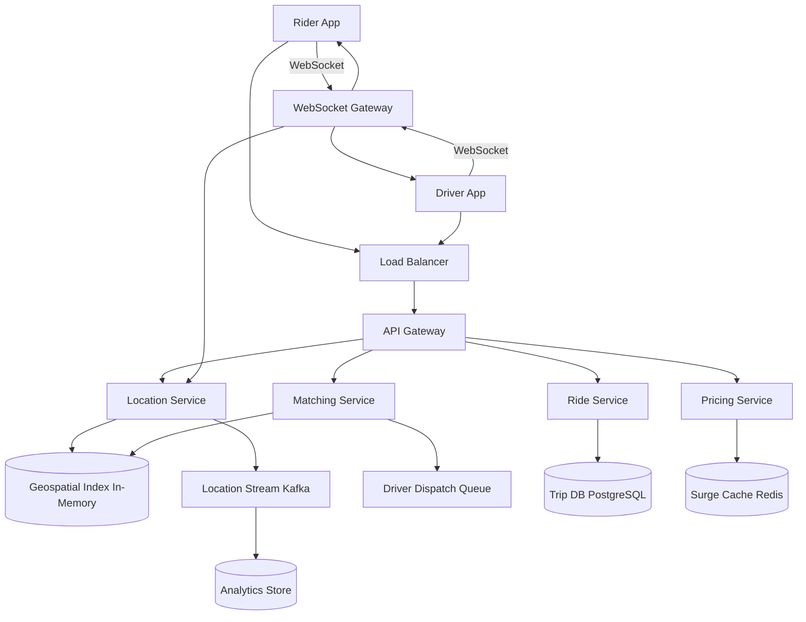

# Solution: Design Uber / Ride Sharing

## 1. Requirements & Estimation

### Traffic Estimates

- **Daily rides:** 20M
- **Ride requests/sec (peak):** 10,000
- **Concurrent active drivers:** 5M
- **Driver location updates:** 5M / 3 sec = **1.67M writes/sec**
- **Active rider tracking sessions:** ~1.3M concurrent (20M rides/day × 15 min avg / 1440 min)

### Storage Estimates

- **Location update:** ~100 bytes (driver_id, lat, lng, timestamp, heading, speed)
- **Location updates/day:** 1.67M/sec × 86,400 = 144B events/day → **~14 TB/day** (raw, for analytics)
- **Current location state:** 5M drivers × 100 bytes = **500 MB** (fits in memory)
- **Trip data/day:** 20M × 2 KB = 40 GB/day

### Bandwidth Estimates

- **Location ingress:** 1.67M × 100 bytes = ~167 MB/sec
- **Tracking egress:** 1.3M sessions × 100 bytes × every 3 sec = ~43 MB/sec via WebSocket

## 2. High-Level Design



## 3. API Design

### Request Ride

```
POST /api/v1/rides/request
Body: { pickup: {lat, lng}, dropoff: {lat, lng}, ride_type: "UberX" }
Response: 200 { ride_id, estimated_fare, estimated_eta, surge_multiplier }
```

### Update Driver Location

```
WebSocket: ws://location.uber.com/driver/{driver_id}
Message: { lat, lng, heading, speed, timestamp }
(Sent every 3 seconds by driver app)
```

### Track Ride

```
WebSocket: ws://tracking.uber.com/rides/{ride_id}
Server pushes: { driver_lat, driver_lng, eta_seconds, updated_at }
(Pushed every 3 seconds to rider)
```

### Get Surge Pricing

```
GET /api/v1/pricing/surge?lat={lat}&lng={lng}
Response: 200 { surge_multiplier: 1.5, demand_level: "high" }
```

## 4. Data Model

### Trips Table (PostgreSQL, sharded by trip_id)

| Column | Type | Notes |
|--------|------|-------|
| trip_id | UUID | Primary key |
| rider_id | BIGINT | FK |
| driver_id | BIGINT | FK, null until matched |
| status | ENUM | requested, matched, driver_en_route, in_progress, completed, cancelled |
| pickup_loc | GEOGRAPHY | |
| dropoff_loc | GEOGRAPHY | |
| fare_cents | INT | Calculated at completion |
| surge_multiplier | DECIMAL(3,2) | Snapshot at request time |
| requested_at | TIMESTAMP | |
| completed_at | TIMESTAMP | Nullable |

### Geospatial Index (In-Memory, per city)

```
Data structure: Geohash grid (precision 6, ~1.2km² cells)
Key: geohash_cell → Set<DriverState>
DriverState: { driver_id, lat, lng, heading, speed, status, last_updated }

Operations:
- UPDATE: O(1) — remove from old cell, insert into new cell
- QUERY "nearby drivers": O(1) — read center cell + 8 adjacent cells, filter by radius
```

### Driver State (Redis Hash)

```
Key: driver:{driver_id}
Fields: { status: available|busy|offline, lat, lng, current_trip_id, last_updated }
```

## 5. Detailed Design

### Geospatial Indexing Deep Dive

The "find nearby drivers" query is the most frequent operation. We use a **geohash-based spatial index**:

**Geohash:** Encodes latitude/longitude into a string. Nearby points share a common prefix. At precision 6, each cell is ~1.2 km × 0.6 km.

**Index structure (per city):**
- An in-memory hash map: `geohash_prefix → HashSet<DriverState>`.
- Each city has its own index instance, running on dedicated servers.

**Location update flow:**
1. Driver sends GPS update via WebSocket.
2. Location Service computes the geohash of the new position.
3. If the geohash changed from the previous update:
   - Remove driver from the old cell's set.
   - Add driver to the new cell's set.
4. Update the driver's state in Redis.
5. Publish the location event to Kafka (for analytics, tracking, and surge).

**Nearby driver query:**
1. Compute the geohash of the rider's pickup location.
2. Retrieve drivers from the center cell and all 8 adjacent cells (to handle boundary effects).
3. Filter to only `status=available` drivers.
4. Compute actual Haversine distance and filter to within the search radius (default 3 km).
5. Return candidate list, sorted by ETA (not straight-line distance).

**Why not a database spatial index?** At 1.67M updates/sec, even a specialized database struggles. The in-memory index handles updates in O(1) and queries in O(1) with constant overhead proportional to the number of adjacent cells.

### Driver-Rider Matching Deep Dive

When a ride request arrives:

1. **Candidate retrieval:** Query the geospatial index for available drivers within 3 km (expand to 5 km if insufficient candidates).
2. **ETA estimation:** For each candidate driver, compute ETA to the rider's pickup using a lightweight routing engine (pre-computed travel times per road segment).
3. **Scoring:** Score each candidate:
   ```
   score = w1 × (1/ETA) + w2 × driver_rating + w3 × heading_alignment + w4 × acceptance_rate
   ```
   - **ETA** (primary signal): Lower ETA = higher score.
   - **Heading alignment:** A driver heading toward the rider is preferred over one heading away.
   - **Driver rating:** Prefer higher-rated drivers.
   - **Acceptance rate:** Prefer drivers who are more likely to accept.
4. **Dispatch:** Send the ride request to the top-scoring driver. The driver has 15 seconds to accept.
5. **Timeout/decline:** If declined or timed out, dispatch to the next-best driver.
6. **Locking:** The moment a request is dispatched to a driver, that driver is temporarily locked (status changes to `dispatching`), preventing double-dispatch.

**Concurrency control:** A distributed lock per driver (Redis `SET NX EX 15`) prevents two concurrent ride requests from being dispatched to the same driver.

### Surge Pricing Deep Dive

Surge pricing balances supply and demand:

1. **Grid partitioning:** The city is divided into geohash cells (precision 5, ~5 km²).
2. **Demand signal:** Count ride requests per cell in the last 5 minutes (from Kafka stream).
3. **Supply signal:** Count available drivers per cell (from the geospatial index).
4. **Surge multiplier calculation:**
   ```
   demand_supply_ratio = demand_count / max(supply_count, 1)
   surge = max(1.0, min(demand_supply_ratio × k, max_surge))
   ```
   Where `k` is a tuning constant and `max_surge` is the cap (e.g., 5.0×).
5. **Smoothing:** Surge changes gradually (max ±0.2× per update cycle) to avoid price whiplash.
6. **Update frequency:** Recalculated every 2 minutes per cell, stored in Redis.
7. **Rider transparency:** Surge multiplier is shown to the rider before they confirm the ride request.

### Real-Time Tracking Deep Dive

During an active ride, the rider sees the driver's live position:

1. Driver's location updates flow through the **WebSocket Gateway**.
2. The gateway identifies all active tracking subscriptions for this driver (via the trip → rider mapping in Redis).
3. The driver's latest position is pushed to the rider's WebSocket connection.
4. **Optimization:** Location updates are throttled to every 3 seconds and interpolated on the client for smooth animation.
5. **Fallback:** If WebSocket disconnects, the client falls back to polling the REST API every 5 seconds.

## 6. Scaling & Trade-offs

### Bottlenecks & Mitigations

| Bottleneck | Mitigation |
|-----------|------------|
| 1.67M location writes/sec | In-memory geospatial index sharded by city; write-optimized data structure |
| Matching latency | Pre-computed ETAs, candidate pruning by geohash, timeout after 15 sec per driver |
| WebSocket connections (millions) | Horizontally scaled WebSocket Gateway fleet with sticky sessions |
| Surge calculation accuracy | Trade-off: coarser cells = less accurate but more stable; finer cells = noisier |
| Cross-cell rides | Matching service queries adjacent cells; fare computed independently of cell boundaries |

### Key Trade-offs

- **ETA accuracy vs. latency:** Precise routing (Dijkstra on full graph) is too slow for matching. Use pre-computed travel times per road segment, updated every 5 minutes with live traffic.
- **Immediate dispatch vs. batching:** Dispatching immediately gets a fast response. Batching ride requests for 5 seconds and solving a global matching optimization could yield better overall matching, but adds latency.
- **Surge stability vs. responsiveness:** Aggressive surge changes maximize revenue but frustrate riders. Smoothing improves UX but may under-price during genuine demand spikes.

### Future Improvements

- **Ride pooling (UberPool):** Multi-rider matching optimization using vehicle routing algorithms.
- **Autonomous vehicles:** Integration with self-driving fleet dispatch.
- **Predictive positioning:** Pre-position drivers in high-demand areas before demand materializes (using historical patterns + events data).
- **Multi-modal transport:** Combine ride-sharing with public transit, bikes, and scooters for optimal routes.

---

## First-time Recognition Signals

When the interviewer's prompt sounds like this, the Uber playbook (geospatial indexing + driver-rider matching + surge pricing + real-time tracking) is the right answer:

- **"Match riders to the nearest available driver within 2 km"** — direct geospatial indexing (S2 cells / H3 hexagons / quadtree).
- **"Show the driver moving on a map in real time"** — WebSocket location stream + driver-state Redis hash.
- **"Surge pricing in high-demand zones"** — supply/demand telemetry per cell with a pricing service.
- **"ETA prediction accounting for traffic"** — road-graph routing + traffic data layer.
- **"Process payment automatically when the ride ends"** — handoff to a payment system + ledger.

### Anti-signals (looks like this design, isn't)

- **"Food delivery with restaurant menu and order tracking"** — DoorDash-style; same geospatial primitives but inventory + multi-leg routing dominate.
- **"Pre-book a ride for tomorrow at 9 a.m."** — that's a scheduling service, not real-time matching; matching happens minutes before pickup.
- **"Station-based bike/scooter rental"** — fixed inventory at known coordinates; no driver-rider matching at all.

## Further Reading

- Uber Engineering — "H3: Uber's Hexagonal Hierarchical Spatial Index".
- Uber blog — "Schemaless: Uber Engineering's Datastore Using MySQL".
- *System Design Interview Vol. 2* (Alex Xu), Uber chapter.
- Google S2 Geometry library documentation.

## Variant Prompts

- **"What if there are 100× more rides/sec at peak?"** — partition matching per city, autoscale per region, pre-warm dispatcher pools before known peaks.
- **"What if driver locations must be < 50 ms fresh globally?"** — edge POPs receive location updates; regional matchers read locally; cross-region replication is async.
- **"What if we cannot lose a location update or a ride record?"** — Kafka log for locations (best-effort retention), durable trip store, dual-write on ride completion.
- **"What if the team only has 2 engineers?"** — Mapbox for routing + Twilio for SMS + Stripe for payments; build only the matching service over PostGIS.
