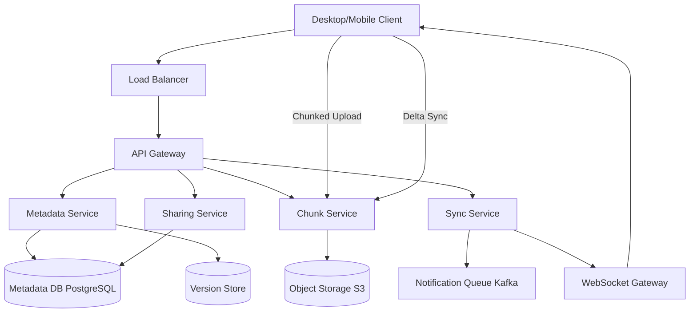

# Solution: Design Dropbox / File Storage & Sync

## 1. Requirements & Estimation

### Traffic Estimates

- **DAU:** 100M users
- **File uploads/day:** 2B files → ~23,000/sec
- **Sync events/sec (peak):** 500,000
- **File downloads/day:** ~2B (sync-driven, read ≈ write)

### Storage Estimates

- **Average file size:** 1 MB
- **New storage/day:** 2B × 1 MB = **2 PB/day**
- **With dedup:** Empirically ~50% dedup ratio → **~1 PB/day net new**
- **Chunk size:** 4 MB → average file = 1 chunk; large files split into multiple chunks
- **Total chunks stored (after 5 years):** ~1 trillion+

### Bandwidth Estimates

- **Upload ingress:** 23,000 files/sec × 1 MB = ~23 GB/sec
- **With delta sync:** ~70% reduction for file updates → ~7 GB/sec for updates
- **Sync notification traffic:** 500K events/sec × 200 bytes = ~100 MB/sec

## 2. High-Level Design



## 3. API Design

### Upload File (Chunked)

```
POST /api/v1/files/upload/init
Body: { path, file_size, checksum_sha256, chunk_checksums[] }
Response: 200 { upload_id, chunks_needed: [0, 3, 7], chunk_size: 4MB }
(Server replies with only the chunk indices it doesn't already have — dedup!)

PUT /api/v1/files/upload/{upload_id}/chunks/{chunk_index}
Body: <binary 4MB chunk>
Response: 200 { received: true }

POST /api/v1/files/upload/{upload_id}/complete
Response: 200 { file_id, version: 3, synced: true }
```

### Get File Metadata

```
GET /api/v1/files/metadata?path=/documents/report.docx
Response: 200 { file_id, path, size, version, checksum, modified_at, chunks: [...] }
```

### Sync Changes

```
GET /api/v1/sync/changes?cursor=<sequence_number>&limit=100
Response: 200 { changes: [{path, action, version}], new_cursor, has_more }
```

## 4. Data Model

### File Metadata (PostgreSQL, sharded by user_id)

| Column | Type | Notes |
|--------|------|-------|
| file_id | UUID | Primary key |
| user_id | BIGINT | Partition key |
| path | VARCHAR(4096) | Full path within user's namespace |
| is_directory | BOOLEAN | |
| size_bytes | BIGINT | |
| checksum | CHAR(64) | SHA-256 of entire file |
| version | INT | Incremented on each update |
| status | ENUM | active, deleted, conflict |
| created_at | TIMESTAMP | |
| modified_at | TIMESTAMP | Indexed |

### Chunks Table (PostgreSQL / Cassandra)

| Column | Type | Notes |
|--------|------|-------|
| chunk_hash | CHAR(64) | SHA-256, primary key (content-addressable) |
| size_bytes | INT | |
| ref_count | INT | Number of file versions referencing this chunk |
| storage_key | VARCHAR | S3 object key |
| created_at | TIMESTAMP | |

### File-to-Chunks Mapping (per version)

| Column | Type | Notes |
|--------|------|-------|
| file_id | UUID | |
| version | INT | |
| chunk_index | INT | Position in file (0, 1, 2...) |
| chunk_hash | CHAR(64) | FK to chunks table |

**Composite PK:** (file_id, version, chunk_index)

### Sync Journal (Kafka + PostgreSQL)

Each file change generates a journal entry:
```json
{ "user_id": 123, "file_id": "abc", "action": "update", "version": 4, "sequence": 98765 }
```
Clients poll using their last `sequence` cursor to discover changes.

## 5. Detailed Design

### File Chunking & Content-Addressable Storage Deep Dive

Each file is split into **4 MB fixed-size chunks** (last chunk may be smaller):

1. Client computes SHA-256 hash for each chunk.
2. Client sends the list of chunk hashes to the server in the upload init request.
3. Server checks which chunk hashes already exist in the Chunks table.
4. Server responds with "only upload these chunks" (the ones it doesn't have).
5. Client uploads only missing chunks → **cross-user deduplication**.

**Why 4 MB chunks?**
- Smaller chunks = better dedup + finer delta sync, but more metadata overhead and more S3 PUT requests.
- Larger chunks = fewer objects, but poor dedup and wasteful delta sync.
- 4 MB is empirically optimal for general-purpose file storage.

**Dedup example:** 100 users upload the same 100 MB PDF → stored once (25 chunks), referenced 100 times. Ref counts track chunk lifetime; a chunk is garbage-collected when ref_count reaches 0.

### Delta Sync Deep Dive

When a user modifies an existing file:

1. Client splits the updated file into 4 MB chunks and computes hashes.
2. Client compares chunk hashes with the previous version's chunk list (cached locally).
3. Only chunks with changed hashes need to be uploaded.
4. Client sends the upload init request with the full chunk hash list.
5. Server creates a new file version pointing to a mix of existing and new chunks.

**Rolling hash optimization (for within-chunk changes):**
- If a user inserts text at the beginning of a file, all fixed-boundary chunks shift.
- Using **content-defined chunking** (Rabin fingerprint / rolling hash) to determine chunk boundaries based on content reduces this problem — boundaries are stable under insertions.
- Trade-off: content-defined chunking has variable chunk sizes (1-8 MB) but much better delta performance.

### Conflict Resolution Deep Dive

**Scenario:** User edits `report.docx` on laptop (offline) and also edits it on phone. Both sync when they come online.

**Detection:**
- Each file has a `version` counter.
- Client sends its expected `base_version` with each upload.
- If `base_version != current_version`, a conflict is detected.

**Resolution strategies:**

1. **Last-writer-wins (LWW):** The later upload overwrites the earlier one. Simple but loses data. Used for non-critical files.
2. **Conflict copy:** Both versions are kept. The conflicting file is renamed to `report (conflict copy - John's Laptop).docx`. User manually resolves. This is **Dropbox's default approach** and the safest option.
3. **Operational transform / CRDT:** For real-time collaborative editing (Google Docs-style). Overkill for Dropbox's file-level sync.

**Implementation:**
```
IF upload.base_version == file.current_version:
    Accept upload, increment version
ELSE:
    Create conflict copy with device name and timestamp
    Notify user on all devices about the conflict
```

### Notification & Sync Protocol Deep Dive

When a file changes on one device, other devices need to know:

1. File change creates a **sync journal entry** (Kafka event).
2. **WebSocket Gateway** maintains persistent connections to all online clients.
3. Gateway subscribes to the user's Kafka partition.
4. On new event: push a lightweight notification to all connected devices.
5. Client receives notification → fetches changes via `GET /sync/changes?cursor=<last_seen>`.
6. Client downloads only the new/changed chunks.

**Offline devices:** When a device reconnects, it resumes from its last cursor position. The sync journal retains entries for 30 days.

**Scaling:** WebSocket Gateway is horizontally scaled. A consistent hash ring maps `user_id` to a specific gateway instance, ensuring all of a user's devices connect to the same instance for efficient fan-out.

## 6. Scaling & Trade-offs

### Bottlenecks & Mitigations

| Bottleneck | Mitigation |
|-----------|------------|
| S3 PUT throughput (23K files/sec) | Batch small chunks; use multi-part upload; S3 scales horizontally |
| Metadata DB writes | Shard by user_id; batch version creation; async indexing |
| WebSocket connection count (100M DAU) | Horizontally scaled gateway fleet; only active devices maintain connections |
| Dedup check latency | Bloom filter in front of chunk table; local chunk cache on client |
| Conflict storms (many offline edits) | Rate-limit conflict notifications; batch conflict resolution UI |

### Key Trade-offs

- **Fixed vs. content-defined chunking:** Fixed is simpler and has predictable chunk sizes. Content-defined has better delta performance but variable sizes and more complex implementation. Start with fixed; migrate to content-defined for power users.
- **Strong vs. eventual consistency for metadata:** Strong consistency prevents phantom reads (file exists on one device but not another). Cost: higher write latency. Worth it for a file system.
- **Dedup scope:** Within-user dedup is simple and safe. Cross-user dedup saves 50%+ storage but raises privacy concerns (can you detect if another user has the same file?). Solution: dedup at the chunk level (not file level), and never expose dedup info to users.

### Future Improvements

- **Smart Sync (on-demand files):** Show file placeholders in the OS file explorer; download content only when opened. Requires OS-level integration (kernel filesystem driver).
- **Real-time collaboration:** Layer a CRDT-based collaborative editing system on top of the sync infrastructure for office documents.
- **Ransomware detection:** Detect abnormal patterns (mass encryption of files) and freeze sync, alerting the user.
- **Tiered storage:** Automatically migrate infrequently accessed file versions to cheaper cold storage.
