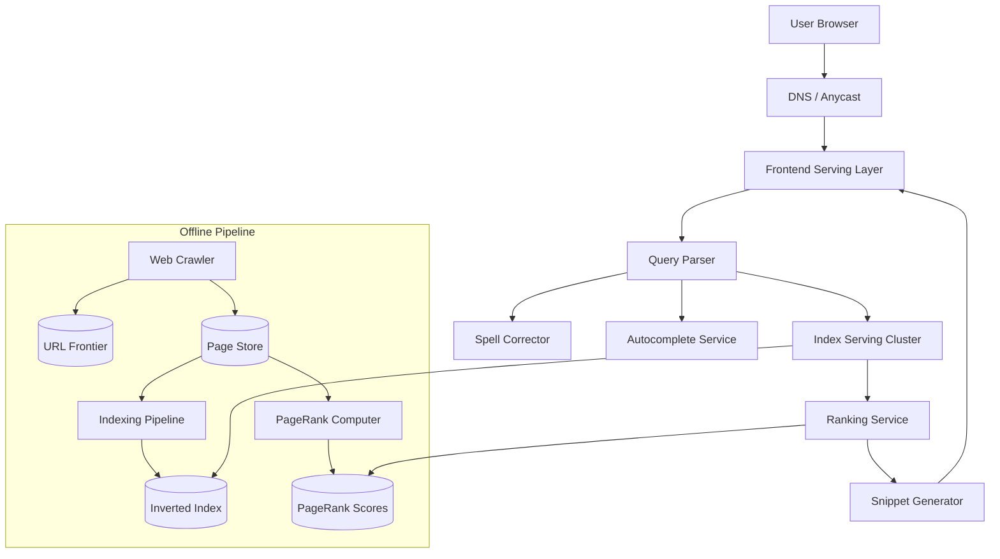

# Solution: Design Google Search

## 1. Requirements & Estimation

### Traffic Estimates

- **Search queries:** 100,000/sec average → 300,000/sec peak
- **Pages crawled/day:** 5B → ~58,000 pages/sec
- **Autocomplete requests:** ~500,000/sec (multiple per user query)

### Storage Estimates

- **Total indexed pages:** 100B+
- **Average page size (HTML):** 50 KB
- **Raw crawl data:** 100B × 50 KB = **5 PB** (compressed to ~500 TB)
- **Inverted index size:** ~100 PB (term → posting lists with positions, frequencies, metadata)
- **PageRank scores:** 100B pages × 8 bytes = ~800 GB

### Bandwidth Estimates

- **Crawl bandwidth:** 58,000 pages/sec × 50 KB = ~2.9 GB/sec egress to web
- **Query serving:** 100K queries/sec × 50 KB response = ~5 GB/sec egress to users
- **Index serving:** Internal traffic for index lookups is ~100 GB/sec across the serving cluster

## 2. High-Level Design



## 3. API Design

### Search Query

```
GET /search?q=<query>&start=0&num=10&lang=en&location=US
Response: 200 {
  results: [{ title, url, snippet, favicon_url, cached_url }],
  total_results: 1234567,
  spell_suggestion: "did you mean: ...",
  related_searches: [...],
  time_taken_ms: 230
}
```

### Autocomplete

```
GET /autocomplete?q=<partial_query>&lang=en
Response: 200 { suggestions: ["full query 1", "full query 2", ...] }
```

## 4. Data Model

### Forward Index (Document Store)

| Column | Type | Notes |
|--------|------|-------|
| doc_id | BIGINT | Unique document identifier |
| url | VARCHAR | Canonical URL |
| title | VARCHAR | Page title |
| content_hash | CHAR(64) | For dedup detection |
| last_crawled | TIMESTAMP | |
| pagerank_score | FLOAT | Pre-computed |
| language | CHAR(2) | Detected language |

### Inverted Index (Custom Data Structure)

```
Term → PostingList
PostingList: [(doc_id, term_frequency, [positions], field_flags)]

Example:
"distributed" → [
  (doc_42, tf=5, positions=[12, 45, 102, 230, 310], field=TITLE|BODY),
  (doc_99, tf=2, positions=[8, 55], field=BODY),
  ...
]
```

**Storage:** Posting lists are sorted by doc_id for efficient intersection. Delta-encoded and compressed with variable-byte encoding. Stored on SSD-backed distributed file system, sharded by term.

### URL Frontier (Priority Queue)

```
Priority = f(pagerank, last_crawl_time, change_frequency, domain_importance)
```
Stored in a distributed priority queue (Redis + disk spillover for the long tail).

## 5. Detailed Design

### Web Crawler Deep Dive

The crawler discovers and fetches web pages:

**Architecture:**
1. **URL Frontier:** A priority queue of URLs to crawl. High-PageRank, frequently-changing pages are prioritized.
2. **DNS Resolver:** Dedicated DNS cache to avoid repetitive lookups (saves ~100ms/request).
3. **Fetcher cluster:** Thousands of workers that HTTP GET pages. Each worker handles one domain at a time (politeness).
4. **Robots.txt cache:** Fetch and cache `robots.txt` per domain; obey `crawl-delay` directives.
5. **Content processor:** Parse HTML, extract text, extract outgoing links, detect language.
6. **Dedup detector:** Content-hash (SimHash) comparison to detect near-duplicate pages.
7. **URL extractor:** Normalize and canonicalize extracted URLs, add new ones to the frontier.

**Politeness policy:**
- Max 1 request/sec per domain (configurable per domain's `crawl-delay`).
- Worker maintains a per-domain rate limiter.
- Each worker dedicates to a set of domains (partitioned by domain hash).

**Recrawl scheduling:** Pages are recrawled based on their detected change frequency:
- News sites: every 15 minutes.
- Wikipedia: every few hours.
- Static pages: weekly to monthly.

### Inverted Index Construction Deep Dive

**Batch indexing pipeline (MapReduce-style):**

1. **Map phase:** For each crawled page:
   - Tokenize text (language-specific tokenizers).
   - Remove stop words, apply stemming/lemmatization.
   - Emit `(term, doc_id, term_frequency, positions)` tuples.
2. **Shuffle:** Group all tuples by term.
3. **Reduce phase:** For each term:
   - Sort posting list by doc_id.
   - Delta-encode doc_ids for compression.
   - Write compressed posting list to index shard.

**Incremental indexing:**
- New/updated pages are indexed in near-real-time via a streaming pipeline.
- A small "realtime index" (in-memory) stores recently indexed pages.
- At query time, results from the main index and realtime index are merged.
- The realtime index is periodically merged into the main index.

**Index sharding:** Two strategies:
- **Document-partitioned:** Each shard holds the full index for a subset of documents. Query must check all shards.
- **Term-partitioned:** Each shard holds posting lists for a subset of terms. Query touches fewer shards per term but multi-term queries require cross-shard communication.

Google uses **document-partitioned sharding** for simpler query routing and better locality.

### Ranking System Deep Dive

Query results are ranked by combining multiple signals:

**Stage 1 — Retrieval (fast, coarse):**
- Look up query terms in the inverted index.
- Intersect posting lists (for AND semantics) or union (for OR).
- Apply TF-IDF scoring:
  ```
  tf_idf(term, doc) = (1 + log(tf)) × log(N / df)
  ```
  Where `tf` = term frequency in doc, `df` = document frequency, `N` = total docs.
- Return top 1000 candidate documents.

**Stage 2 — Ranking (slower, precise):**
A learned ranking model (gradient-boosted trees or neural network) scores each candidate using 200+ features:

| Feature Category | Examples |
|-----------------|----------|
| **Query-document relevance** | BM25, TF-IDF, phrase match, semantic similarity |
| **Authority** | PageRank, domain authority, linking domains count |
| **Freshness** | Page last modified, content change rate |
| **User signals** | Click-through rate, dwell time, pogo-sticking rate |
| **Page quality** | Readability, ad density, mobile-friendliness |

**PageRank (simplified):**
```
PR(page) = (1 - d) + d × Σ(PR(linking_page) / outbound_links(linking_page))
```
Where `d` = damping factor (0.85). Computed iteratively over the entire web graph until convergence. The computation is done offline as a batch job (runs daily).

**Stage 3 — Re-ranking:** Business rules applied: diversity (no more than 2 results from the same domain), freshness boost for news queries, knowledge panel injection.

### Caching Strategy

Multi-tier caching dramatically reduces serving cost:

1. **Result cache (L1):** Stores complete search result pages. Key = normalized query string. Hit rate: ~30% (popular queries repeat frequently).
2. **Index cache (L2):** Posting lists for frequently queried terms cached in memory. Hit rate: ~80%.
3. **DNS cache:** Crawler's DNS resolutions cached for 24 hours.

**Cache invalidation:** Result cache entries have a 15-minute TTL for freshness-sensitive queries (news, sports) and 1-hour TTL for evergreen queries.

## 6. Scaling & Trade-offs

### Bottlenecks & Mitigations

| Bottleneck | Mitigation |
|-----------|------------|
| Index size (100 PB) | Compression (variable-byte encoding), tiered storage (hot terms in memory, cold on SSD) |
| Query latency tail (p99) | Index shards on SSD, speculative execution (send query to 2 replicas, take first response) |
| Crawl politeness vs. freshness | Prioritize high-change-rate domains; adaptive crawl frequency |
| Ranking model complexity | Two-stage ranking: fast retrieval (BM25) + expensive ML model (top 1000 only) |
| Long-tail queries (30% unique) | Result cache misses handled by index cache hits; pre-computed autocomplete reduces unique queries |

### Key Trade-offs

- **Index freshness vs. quality:** Indexing a page immediately risks indexing spam or low-quality content. Delaying allows quality signals to accumulate. Solution: two-track indexing (fast for known-good domains, slow for new/untrusted sites).
- **Recall vs. precision:** Returning more candidates (OR semantics) improves recall but increases ranking cost. AND semantics misses relevant pages that don't contain all terms. Solution: AND as default, OR fallback when AND returns too few results.
- **Document vs. term sharding:** Document sharding requires querying all shards (fan-out) but is simpler. Term sharding reduces fan-out but complicates multi-term queries. Google chose document sharding for operational simplicity.

### Future Improvements

- **Semantic search:** Use embedding-based retrieval (dense vectors from BERT/T5) alongside keyword-based retrieval for better understanding of query intent.
- **Knowledge graph integration:** Direct answers for factual queries (entity extraction + knowledge graph lookup).
- **Personalization:** Adjust ranking based on user's search history, location, and language preferences.
- **AI-generated summaries:** Use LLMs to synthesize answers from multiple source documents.

---

## First-time Recognition Signals

When the interviewer's prompt sounds like this, the Google-Search playbook (crawler + inverted index + ranking + heavy caching) is the right answer:

- **"Index the web and return results in under 200 ms"** — crawler + inverted index + sharded query fan-out.
- **"Rank results by relevance, not just match count"** — link-graph (PageRank) + ML ranker on top of TF-IDF / BM25.
- **"Autocomplete and spell-correct as I type"** — trie + n-grams + did-you-mean.
- **"Trillions of documents, billions of queries per day"** — index sharding by doc-id; query fan-out + merge.
- **"Personalize the top results based on user history"** — re-ranking layer with user-context features.

### Anti-signals (looks like this design, isn't)

- **"E-commerce product search with faceted filters and price ranges"** — that's Elasticsearch with structured filters; you don't need a web crawler.
- **"Search inside a single Slack workspace or Notion site"** — single-tenant search engine; the scale and ranking concerns are completely different.
- **"Conversational question answering with an LLM"** — RAG (retrieval-augmented generation) over an embedding index; the classic IR pipeline is one component but not the whole design.

## Further Reading

- Brin & Page — "The Anatomy of a Large-Scale Hypertextual Web Search Engine" (1998, the original Google paper).
- Manning, Raghavan, Schütze — *Introduction to Information Retrieval* (the textbook).
- *System Design Interview Vol. 2* (Alex Xu), Search chapter.
- Jeff Dean's talks on Google infrastructure (e.g. "Building Software Systems at Google and Lessons Learned").

## Variant Prompts

- **"What if QPS is 100× higher?"** — more replica fan-out; cache the top-K for popular queries at the query layer; widen the index fleet.
- **"What if global p99 must be < 50 ms?"** — aggressive result caching at edge; precompute results for head queries; multi-region index replicas.
- **"What if no document can ever be missed from the index?"** — durable crawl frontier (Kafka), dual indexer pipelines, periodic Merkle-tree comparison.
- **"What if the team only has 2 engineers?"** — Algolia or OpenSearch managed cluster over your owned corpus; no crawler, no custom ranker.
