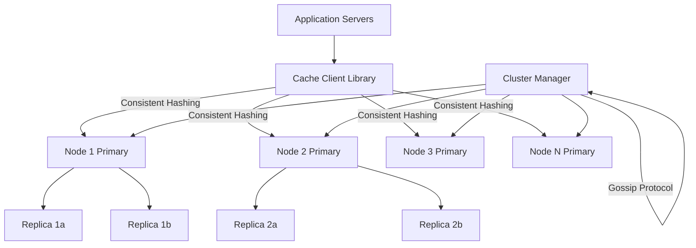

# Solution: Design a Distributed Cache (Redis)

## 1. Requirements & Estimation

### Traffic Estimates

- **Cluster operations/sec:** 100M (100 nodes × 1M ops/node)
- **Read:Write ratio:** 10:1 (90M reads, 10M writes per second)
- **p99 latency target:** < 1ms

### Storage Estimates

- **Total memory:** 10 TB (100 nodes × 100 GB each)
- **Average entry size:** 550 bytes (50 byte key + 500 byte value)
- **Total key-value pairs:** ~18 billion
- **With replication factor 3:** 30 TB raw memory needed (100 nodes × 100 GB × 3 copies = 30 TB, so we need ~300 nodes in practice, or 100 nodes with 300 GB each)

### Network Estimates

- **Inter-node replication traffic:** 10M writes/sec × 550 bytes × 2 replicas = ~11 GB/sec
- **Client traffic:** 100M ops/sec × 550 bytes = ~55 GB/sec

## 2. High-Level Design



## 3. API Design

### Core Operations

```
SET key value [EX seconds] [PX milliseconds] [NX|XX]
GET key
DEL key [key ...]
MGET key [key ...]  (multi-get, routed to multiple nodes)
EXPIRE key seconds
TTL key
EXISTS key
INCR key / DECR key
```

### Client Library Interface

```python
class CacheClient:
    def __init__(self, cluster_seeds: List[str]):
        """Initialize client, discover cluster topology via gossip."""
        self.hash_ring = ConsistentHashRing()
        self._discover_cluster(cluster_seeds)

    def get(self, key: str) -> Optional[bytes]:
        node = self.hash_ring.get_node(key)
        return node.execute("GET", key)

    def set(self, key: str, value: bytes, ttl_sec: int = None) -> bool:
        node = self.hash_ring.get_node(key)
        return node.execute("SET", key, value, ex=ttl_sec)
```

## 4. Data Model

### In-Memory Data Structure (per node)

```
HashTable (main dict):
  Key (string) → Entry {
    value: bytes,
    type: STRING | LIST | SET | HASH | ZSET,
    expire_at: timestamp | NULL,
    lru_clock: 24-bit timestamp (for approx LRU),
    encoding: RAW | INT | ZIPLIST | SKIPLIST,
    ref_count: int
  }

Expires Table (subset of keys with TTL):
  Key → expire_at timestamp
  (Separate dict for efficient expiration scanning)
```

### Slot-to-Node Mapping (cluster routing table)

```
Total slots: 16,384 (Redis Cluster standard)
Slot assignment: [0-5460] → Node 1, [5461-10922] → Node 2, [10923-16383] → Node 3
Key → Slot: CRC16(key) mod 16384
Slot → Node: Lookup in routing table
```

## 5. Detailed Design

### Consistent Hashing with Virtual Nodes Deep Dive

**Problem:** Naive modular hashing (`hash(key) % N`) causes massive key redistribution when nodes are added/removed. With 100 nodes, adding 1 node redistributes ~99% of keys.

**Consistent hashing solution:**
1. Map the hash space to a ring (0 to 2³² - 1).
2. Each physical node is mapped to multiple positions on the ring (virtual nodes).
3. A key is mapped to the ring and assigned to the first node encountered clockwise.
4. When a node is added, it takes ownership of a portion of its neighbors' keys. Only ~K/N keys move (K = total keys, N = nodes).

**Virtual nodes:** Each physical node creates 150-200 virtual nodes on the ring. This ensures:
- Even key distribution (avoids hot spots from unlucky hash positions).
- Proportional load when nodes have different capacities (more virtual nodes = more keys).

**Slot-based approach (Redis Cluster):**
Instead of a generic consistent hash ring, Redis uses **16,384 fixed slots**:
- `slot = CRC16(key) mod 16384`
- Each slot is assigned to exactly one primary node.
- Nodes own contiguous ranges of slots.
- Adding a node: migrate a subset of slots (and their keys) from existing nodes.
- Slot migration is live — reads/writes to migrating keys are redirected (ASK/MOVED).

### Replication Strategy Deep Dive

Each primary node replicates to 2 followers:

**Async replication (default):**
1. Client writes to primary → primary responds OK.
2. Primary asynchronously streams the write command to replicas.
3. Replicas apply the command to their local dataset.
4. **Risk:** If the primary crashes before replication, the write is lost (1-second window typical).

**Sync replication (optional, for critical data):**
1. Client writes to primary.
2. Primary forwards to replicas and waits for `WAIT` acknowledgment.
3. Primary responds to client only after N replicas confirm.
4. **Trade-off:** Higher latency (adds network round trip) but zero data loss.

**Failover:**
1. **Failure detection:** Each node sends periodic PINGs to peers. If a node doesn't respond within `cluster-node-timeout` (default 15 sec), it's marked as `PFAIL` (possibly failed).
2. **Consensus:** If a majority of primary nodes agree the node is unreachable, it's marked `FAIL`.
3. **Promotion:** The replica with the most recent replication offset is promoted to primary.
4. **Slot reassignment:** The new primary takes ownership of the failed node's slots.
5. **Client redirect:** Clients receive `MOVED` responses directing them to the new primary.

### Eviction Policies Deep Dive

When memory reaches the `maxmemory` limit:

| Policy | Algorithm | Use Case |
|--------|-----------|----------|
| **noeviction** | Reject writes, allow reads | Critical data, prefer errors over data loss |
| **allkeys-lru** | Approximate LRU across all keys | General-purpose cache |
| **volatile-lru** | Approximate LRU only among keys with TTL | Mix of cache and persistent data |
| **allkeys-lfu** | Least Frequently Used | Data with stable access patterns |
| **volatile-ttl** | Evict keys closest to expiration | Time-sensitive data |
| **allkeys-random** | Random eviction | Uniform access patterns |

**Approximate LRU implementation (Redis's approach):**
Perfect LRU requires maintaining a linked list of all keys ordered by access time — too expensive for billions of keys.

Redis uses **sampled LRU:**
1. Each key stores a 24-bit timestamp of its last access (resolution: ~10 seconds).
2. On eviction: randomly sample 5 keys (configurable via `maxmemory-samples`).
3. Evict the key with the oldest last-access timestamp among the sample.
4. With 10 samples, this approximates true LRU within 1-2% accuracy.

**TTL expiration (separate from eviction):**
- **Lazy expiration:** On each `GET`, check if the key has expired. If so, delete it and return nil.
- **Active expiration:** 10 times/sec, randomly sample 20 keys with TTL set; delete expired ones. If >25% are expired, repeat immediately.

### Cluster Management & Gossip Protocol Deep Dive

Nodes discover and monitor each other using a **gossip protocol:**

1. Every 1 second, each node selects a random peer and sends a `PING` containing:
   - Sender's node ID, IP, port, current slot assignments.
   - Known state of a random subset of other nodes (piggyback gossip).
2. Receiver responds with `PONG` containing its own node state and gossip data.
3. Each node maintains a local view of the cluster topology, updated via gossip.
4. **Convergence time:** In a 100-node cluster, full state propagation takes O(log N) gossip rounds ≈ ~10-20 seconds.

**Node addition (scaling out):**
1. New node joins the cluster by contacting any existing node.
2. Cluster administrator assigns slot ranges to the new node.
3. Existing nodes migrate keys belonging to reassigned slots to the new node (live migration).
4. During migration, keys in transit are served via `ASK` redirects.

## 6. Scaling & Trade-offs

### Bottlenecks & Mitigations

| Bottleneck | Mitigation |
|-----------|------------|
| Hot key (1 key = 10% of traffic) | Read replicas for hot keys; client-side caching with invalidation; key splitting |
| Network bandwidth for replication | Batch replication commands; compress large values; use RDMA in data centers |
| Slot migration during scaling | Rate-limit migration to avoid impacting live traffic; migrate during low-traffic periods |
| Memory fragmentation | Use jemalloc allocator; periodic `MEMORY PURGE`; active defragmentation |
| Large value serialization | Limit values to < 1 MB; use hashes for structured data (memory-efficient ziplist encoding) |

### Key Trade-offs

- **Consistency vs. availability (CAP):** Redis Cluster chooses availability. During a network partition, the minority partition may serve stale reads. Write operations require majority quorum for slot ownership. This is AP in the CAP theorem.
- **Memory vs. persistence:** Pure in-memory = fastest but volatile. RDB snapshots provide periodic durability. AOF (append-only file) provides per-command durability at the cost of write latency. Most deployments use async AOF (fsync every second).
- **Single-threaded vs. multi-threaded:** Redis is single-threaded for command execution (no lock contention, simple). Redis 6+ uses I/O threads for network processing. CPU-bound workloads benefit from multiple instances per machine (1 per core).

### Future Improvements

- **Client-side caching:** Clients cache frequently read keys locally. Server sends invalidation messages when keys change (Redis 6+ Tracking feature).
- **RDMA networking:** Bypass kernel networking stack for sub-100μs latency in data center environments.
- **Tiered storage:** Extend cache to SSD for warm data (Redis on Flash), keeping hot data in RAM and warm data on NVMe SSD.
- **Multi-model support:** Add native support for JSON documents, time-series, graph, and vector search within the cache engine.
