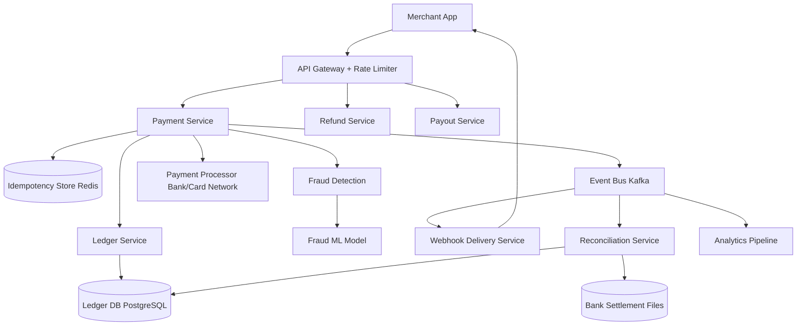

# Solution: Design a Payment System (Stripe)

## 1. Requirements & Estimation

### Traffic Estimates

- **Payments/sec (average):** 10,000
- **Payments/sec (peak — Black Friday):** 100,000
- **Webhooks/sec:** ~30,000 (3× payments due to multiple events per payment)
- **Ledger writes/sec:** ~20,000 (2 entries per payment — double entry)

### Storage Estimates

- **Payment record size:** ~2 KB (metadata, status history, idempotency key)
- **Daily payments:** 864M (10K/sec × 86,400)
- **Daily storage:** ~1.7 TB
- **Ledger entries/day:** 1.7B → ~3.4 TB (ledger is immutable, grows forever)
- **7-year retention** (regulatory): ~8.7 PB ledger data

### Financial Estimates

- **Average transaction:** $50
- **Daily volume:** $43B
- **Annual volume:** $15.7T

## 2. High-Level Design



## 3. API Design

### Create Payment

```
POST /api/v1/payments
Headers: Idempotency-Key: <uuid>, Authorization: Bearer <api_key>
Body: {
  amount: 5000,          // cents
  currency: "usd",
  payment_method: "pm_card_visa_123",
  description: "Order #12345",
  metadata: { order_id: "12345" }
}
Response: 200 {
  id: "pay_abc123",
  status: "succeeded",
  amount: 5000,
  currency: "usd",
  created_at: "2025-01-15T10:30:00Z"
}
```

### Refund Payment

```
POST /api/v1/payments/{payment_id}/refunds
Headers: Idempotency-Key: <uuid>
Body: { amount: 2000, reason: "customer_request" }
Response: 200 { refund_id: "ref_xyz", status: "pending", amount: 2000 }
```

### Get Payment

```
GET /api/v1/payments/{payment_id}
Response: 200 { id, status, amount, currency, timeline: [...], charges: [...] }
```

## 4. Data Model

### Payments Table (PostgreSQL, sharded by payment_id)

| Column | Type | Notes |
|--------|------|-------|
| payment_id | VARCHAR(26) | Primary key (ULID) |
| merchant_id | BIGINT | FK, indexed |
| amount_cents | BIGINT | Always in smallest currency unit |
| currency | CHAR(3) | ISO 4217 |
| status | ENUM | pending, authorized, captured, succeeded, failed, refunded |
| payment_method_id | VARCHAR | Tokenized, never stores raw card |
| idempotency_key | VARCHAR(64) | Unique per merchant, indexed |
| psp_reference | VARCHAR | External processor's reference ID |
| created_at | TIMESTAMP | |
| updated_at | TIMESTAMP | |

### Ledger Entries (PostgreSQL, append-only, sharded by entry_id)

| Column | Type | Notes |
|--------|------|-------|
| entry_id | BIGINT | Auto-increment |
| payment_id | VARCHAR(26) | FK |
| account_id | VARCHAR | Debit or credit account |
| entry_type | ENUM | DEBIT, CREDIT |
| amount_cents | BIGINT | Always positive |
| currency | CHAR(3) | |
| created_at | TIMESTAMP | Immutable |

**Invariant:** For every payment, `SUM(debits) = SUM(credits)`.

### Idempotency Store (Redis)

```
Key: idempotency:{merchant_id}:{idempotency_key}
Value: { payment_id, status, response_body }
TTL: 24 hours
```

## 5. Detailed Design

### Idempotency Deep Dive

Exactly-once payment semantics are enforced via idempotency keys:

**Flow:**
1. Client sends `POST /payments` with `Idempotency-Key: <uuid>`.
2. Payment Service checks Redis: `GET idempotency:{merchant}:{key}`.
3. **Key exists + completed:** Return the cached response immediately. No processing.
4. **Key exists + in-progress:** Return `409 Conflict` (concurrent duplicate request).
5. **Key doesn't exist:** Set `idempotency:{merchant}:{key}` with status `in_progress` and a 24-hour TTL.
6. Process the payment.
7. Update the idempotency entry with the final response.
8. Return the response.

**Corner case — server crash during processing:**
- The idempotency key is set to `in_progress` but never completed.
- A background job scans for stale `in_progress` entries (older than 5 minutes).
- It checks the downstream PSP to determine if the payment was actually processed.
- Resolution: either complete the entry or mark it as failed.

**Why Redis?** The idempotency check is on the hot path (every single payment request). It must be < 1ms. Redis provides this with the 24-hour TTL for automatic cleanup.

### Double-Entry Bookkeeping Deep Dive

Every financial movement creates exactly two ledger entries:

**Payment of $50:**
```
DEBIT   customer_payment_account   $50.00   (money flows in from customer)
CREDIT  merchant_receivable_account $50.00   (money owed to merchant)
```

**Stripe's fee ($1.50):**
```
DEBIT   merchant_receivable_account  $1.50   (fee deducted from merchant)
CREDIT  stripe_revenue_account       $1.50   (Stripe's revenue)
```

**Refund of $50:**
```
DEBIT   merchant_receivable_account  $50.00   (reverse the original credit)
CREDIT  customer_payment_account     $50.00   (money returned to customer)
```

**Audit invariant:** At any point in time, across all accounts:
```
SUM(all DEBIT entries) == SUM(all CREDIT entries)
```

**Implementation:**
- Ledger entries are **append-only** — never updated or deleted.
- Both entries for a transaction are written in a **single database transaction** (ACID).
- If the write fails, neither entry is created (atomicity).
- A nightly **balance check job** verifies the invariant across all accounts.

### Payment Flow with Saga Pattern Deep Dive

A payment touches multiple services. We use the **Saga pattern** (not 2PC) because the bank API is external and can't participate in distributed transactions.

**Happy path:**
```
1. [Payment Service]    Create payment record (status: pending)
2. [Fraud Service]      Run fraud check → PASS
3. [Payment Service]    Call bank/PSP API → authorize card → SUCCESS
4. [Ledger Service]     Write double-entry ledger records
5. [Payment Service]    Update payment status → succeeded
6. [Event Bus]          Publish payment.succeeded event
7. [Webhook Service]    Deliver webhook to merchant
```

**Compensating transactions (rollback on failure):**
```
Step 3 fails (bank declines):
  → Update payment status → failed
  → Publish payment.failed event
  → No ledger entries needed (nothing to reverse)

Step 4 fails (ledger write fails but bank charged):
  → CRITICAL: Bank charged the customer but ledger is inconsistent
  → Payment Service calls bank API to REVERSE the charge
  → Create a reconciliation alert for manual review
  → Update payment status → failed
```

**Timeout handling for bank API:**
- Bank API call has a 30-second timeout.
- If timeout occurs: payment status = `unknown`.
- A **resolution worker** polls the bank's query API every 60 seconds to determine the actual outcome.
- Once resolved: apply the appropriate ledger entries and notify the merchant.

### Reconciliation Batch Deep Dive

Every 24 hours, a reconciliation job ensures internal records match external bank records:

1. **Input:** Bank settlement file (CSV/SFTP) listing all transactions processed that day.
2. **Process:**
   - For each bank transaction, find the corresponding internal payment record (by `psp_reference`).
   - Compare amounts, currencies, and statuses.
   - Flag discrepancies.
3. **Discrepancy types:**
   - **Missing internal:** Bank processed a payment we don't have → investigate (possible crash during processing).
   - **Missing external:** We recorded a payment the bank doesn't have → investigate (possible timeout that was resolved incorrectly).
   - **Amount mismatch:** Amounts differ → flag for manual review.
4. **Resolution:** Finance team reviews flagged items. Adjusting entries are created in the ledger to correct discrepancies.

**Target:** Zero unresolved discrepancies older than 48 hours.

## 6. Scaling & Trade-offs

### Bottlenecks & Mitigations

| Bottleneck | Mitigation |
|-----------|------------|
| 100K payments/sec peak | Horizontal scaling; shard by merchant_id; circuit breaker per PSP |
| Ledger write throughput | Append-only + batch inserts; partition by time (monthly tables) |
| Bank API latency/failures | Circuit breaker pattern; fallback to queue + retry; multi-PSP routing |
| Webhook delivery at scale | Async with Kafka; exponential backoff retry (up to 72 hours); dead letter queue |
| Idempotency store size | Redis with 24-hour TTL; ~100M keys × 1 KB ≈ 100 GB (fits in a Redis cluster) |

### Key Trade-offs

- **Synchronous vs. async bank calls:** Synchronous keeps the flow simple (client waits for result). Async (queue the bank call) improves availability but complicates the merchant integration (they must handle webhooks). Stripe uses synchronous for card payments (fast) and async for bank transfers (slow).
- **2PC vs. Saga:** 2PC guarantees atomicity but requires all participants to be available (fragile with external bank APIs). Saga is more resilient but requires careful compensating transaction design. Payment systems universally prefer Saga.
- **Consistency vs. availability:** Payment processing is correctness-critical. We sacrifice some availability (reject payments to an unhealthy PSP) rather than risk duplicate charges or lost payments.

### Future Improvements

- **Multi-currency support:** Real-time FX rates, currency conversion ledger entries, settlement in local currency.
- **Subscription billing:** Recurring payment engine with dunning (retry failed payments), proration, and plan changes.
- **Instant payouts:** Move from T+2 settlement to real-time payouts via RTP/FedNow rail.
- **Fraud ML improvements:** Real-time feature store for transaction velocity, device fingerprinting, and behavioral biometrics.

---

## First-time Recognition Signals

When the interviewer's prompt sounds like this, the payment-system playbook (idempotency keys + double-entry ledger + Saga across PSP + daily reconciliation) is the right answer:

- **"Charge a card and refund it; never double-charge if the client retries"** — idempotency-key store is the headline.
- **"Money must never be lost or duplicated"** — append-only double-entry ledger.
- **"Multi-step flow across our service, the PSP, and the bank"** — Saga pattern with compensating actions.
- **"Settle daily with the bank and reconcile differences"** — batch reconciliation job comparing internal ledger with bank statements.
- **"Auditable trail for every cent"** — immutable ledger entries, no destructive updates.

### Anti-signals (looks like this design, isn't)

- **"P2P money send (Venmo / Cash App)"** — adjacent design with social graph and in-app wallet; idempotency still applies but UX dominates.
- **"Subscription billing engine (Recurly / Chargebee)"** — sits *on top of* a payment system; the design is about plan management, proration, dunning.
- **"Cryptocurrency on-chain settlement"** — different consensus model (PoW/PoS), UTXO ledger, no central PSP.

## Further Reading

- Stripe blog — "Designing robust and predictable APIs with idempotency" (industry-defining).
- Square Engineering — "Building reliable distributed systems for payments".
- Pat Helland — "Accountants Don't Use Erasers" (immutable-ledger paper).
- *System Design Interview Vol. 2* (Alex Xu), Payment System chapter.

## Variant Prompts

- **"What if payments are 100× higher peak?"** — partition payments by `payment_id`; autoscale processors; ledger ingest stays async via Kafka.
- **"What if global authorization p99 must be < 50 ms?"** — regional payment gateways close to PSPs; ledger fan-in is async and cross-region eventual.
- **"What if no payment can ever be lost?"** — append-only ledger + dual-PSP fallback + idempotency replay; daily reconciliation catches anything.
- **"What if the team only has 2 engineers?"** — Stripe Connect or Adyen Platform; you build only the ledger / reconciliation view on top of their idempotency primitives.
