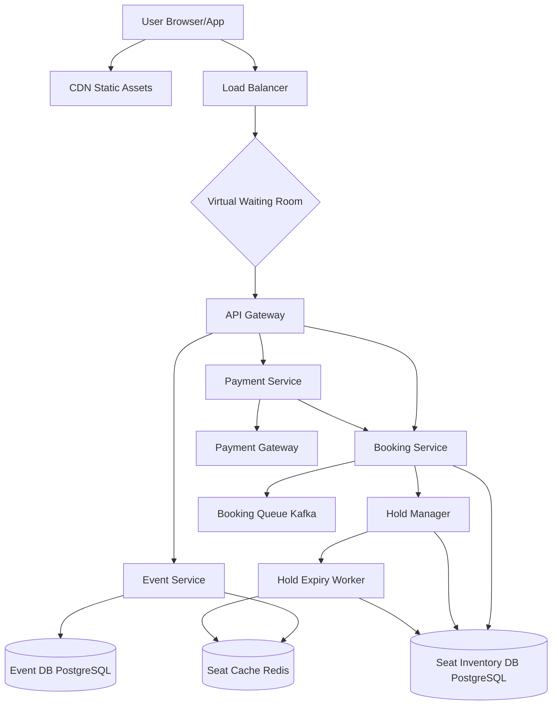
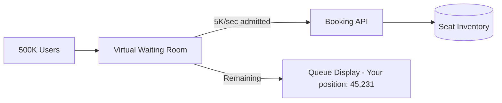

# Solution: Design a Ticket Booking System (BookMyShow / Ticketmaster)

## 1. Requirements & Estimation

### Traffic Estimates

- **Normal bookings/day:** 5M → ~58/sec average
- **Flash sale peak:** 50,000 booking attempts/sec per event
- **Seat availability queries (normal):** ~500,000/sec
- **Seat availability queries (flash sale):** ~2M/sec per event
- **Concurrent users on a popular event:** 100,000+

### Storage Estimates

- **Events/day:** 50,000
- **Average seats/event:** 5,000
- **Total seat inventory records:** 250M active at any time
- **Booking record size:** ~1 KB
- **Daily booking storage:** 5M × 1 KB = 5 GB/day
- **Hold records (transient):** ~500K concurrent holds × 200 bytes = 100 MB

### Financial Estimates

- **Average ticket price:** $75
- **Daily booking volume:** $375M
- **Hold expiry rate:** 30% of holds expire without payment

## 2. High-Level Design



## 3. API Design

### Get Event Seat Map

```
GET /api/v1/events/{event_id}/seats?section=<section_id>
Response: 200 {
  sections: [{
    section_id, name,
    seats: [{ seat_id, row, number, status: "available"|"held"|"booked", price_cents }]
  }],
  available_count: 4523,
  cached_at: "2025-01-15T10:30:00Z"   // staleness indicator
}
```

### Reserve Seats (Create Hold)

```
POST /api/v1/events/{event_id}/holds
Headers: Idempotency-Key: <uuid>
Body: { seat_ids: ["A1", "A2", "A3"], session_id: "<uuid>" }
Response: 200 {
  hold_id: "hold_abc123",
  seats: ["A1", "A2", "A3"],
  expires_at: "2025-01-15T10:40:00Z",   // 10 minutes from now
  payment_url: "/checkout/hold_abc123"
}
Response: 409 { error: "seats_unavailable", unavailable: ["A2"] }
```

### Complete Booking (Pay)

```
POST /api/v1/holds/{hold_id}/confirm
Body: { payment_method_id: "pm_visa_123" }
Response: 200 {
  booking_id: "book_xyz",
  status: "confirmed",
  tickets: [{ seat_id, qr_code_url }]
}
Response: 410 { error: "hold_expired" }
```

## 4. Data Model

### Events Table (PostgreSQL)

| Column | Type | Notes |
|--------|------|-------|
| event_id | UUID | Primary key |
| venue_id | UUID | FK |
| name | VARCHAR(200) | |
| event_date | TIMESTAMP | |
| on_sale_date | TIMESTAMP | Flash sale release time |
| total_seats | INT | |
| available_seats | INT | Denormalized counter |
| status | ENUM | draft, on_sale, sold_out, completed |

### Seat Inventory Table (PostgreSQL, sharded by event_id)

| Column | Type | Notes |
|--------|------|-------|
| seat_id | VARCHAR(20) | Composite: event_id + section + row + number |
| event_id | UUID | Partition key |
| section | VARCHAR(50) | |
| row_label | CHAR(2) | |
| seat_number | INT | |
| status | ENUM | available, held, booked |
| price_cents | INT | |
| held_by | UUID | session_id, nullable |
| held_until | TIMESTAMP | null if not held |
| booked_by | UUID | user_id, nullable |
| version | INT | Optimistic lock version |

**Index:** `(event_id, status)` for fast availability queries.
**Row lock:** `SELECT ... FOR UPDATE` on specific seat rows during booking.

### Holds Table (PostgreSQL + Redis)

| Column | Type | Notes |
|--------|------|-------|
| hold_id | UUID | Primary key |
| event_id | UUID | |
| session_id | UUID | |
| seat_ids | ARRAY<VARCHAR> | |
| status | ENUM | active, confirmed, expired, cancelled |
| expires_at | TIMESTAMP | Indexed for expiry worker |
| created_at | TIMESTAMP | |

**Redis mirror:** `ZADD holds_expiry <expires_at_unix> <hold_id>` — sorted set for efficient expiry scanning.

## 5. Detailed Design

### Seat Reservation with Pessimistic Locking Deep Dive

The critical challenge: prevent two users from booking the same seat.

**Reservation flow (database transaction):**

```sql
BEGIN;

-- Step 1: Lock the specific seat rows (pessimistic lock)
SELECT seat_id, status, version
FROM seat_inventory
WHERE event_id = :event_id
  AND seat_id IN (:seat_id_1, :seat_id_2, :seat_id_3)
FOR UPDATE;
-- FOR UPDATE acquires row-level exclusive locks

-- Step 2: Verify all seats are available
-- (Application code checks: all returned rows have status = 'available')
-- If any seat is not available → ROLLBACK and return 409

-- Step 3: Update seat status to 'held'
UPDATE seat_inventory
SET status = 'held',
    held_by = :session_id,
    held_until = NOW() + INTERVAL '10 minutes',
    version = version + 1
WHERE event_id = :event_id
  AND seat_id IN (:seat_id_1, :seat_id_2, :seat_id_3)
  AND status = 'available';

-- Step 4: Create hold record
INSERT INTO holds (hold_id, event_id, session_id, seat_ids, status, expires_at)
VALUES (:hold_id, :event_id, :session_id, ARRAY[:seats], 'active', NOW() + INTERVAL '10 minutes');

-- Step 5: Update available count
UPDATE events SET available_seats = available_seats - 3 WHERE event_id = :event_id;

COMMIT;
```

**Why pessimistic locking (not optimistic)?**
- In a flash sale, thousands of users target the same seats simultaneously.
- Optimistic locking (check version, retry on conflict) causes massive retry storms under high contention.
- Pessimistic locking serializes access — fewer retries, more predictable latency.
- Trade-off: pessimistic locks hold DB row locks longer, reducing throughput. Mitigated by keeping the transaction short.

### Hold Expiry System Deep Dive

Seats must be released if the user doesn't complete payment within 10 minutes.

**Approach: Redis sorted set + background worker:**

1. When a hold is created, add to Redis: `ZADD holds_expiry <expires_at_unix> <hold_id>`.
2. **Expiry worker** runs every 5 seconds:
   ```
   expired = ZRANGEBYSCORE holds_expiry 0 <now_unix> LIMIT 100
   For each expired hold_id:
     1. Update hold status → 'expired' in PostgreSQL
     2. Update seat_inventory: status → 'available', clear held_by/held_until
     3. Update events: available_seats += N
     4. ZREM holds_expiry hold_id
     5. Invalidate seat cache in Redis
   ```
3. **Idempotency:** The expiry worker checks the hold's current status before releasing. If it's already `confirmed` or `expired`, skip it.

**Edge case — slow payment:** If the payment gateway takes 11 minutes (beyond the hold timeout):
- Option A: **Strict** — hold expires, seats released, payment fails. User must rebook.
- Option B: **Lenient** — extend the hold when payment is initiated (add 5 minutes). Prevents frustrating the user who is mid-checkout.
- Recommended: Option B with a hard cap of 15 minutes total.

### Flash Sale Traffic Management Deep Dive

When a major event goes on sale, traffic spikes 100× normal:

**Virtual Waiting Room:**

1. **Pre-sale:** Users visit the event page; they're placed in a queue with a random position.
2. **On-sale time:** The waiting room starts admitting users at a controlled rate (e.g., 5,000/sec).
3. Each admitted user receives a **session token** (JWT with expiry) that grants access to the booking flow.
4. Users without a valid token are redirected back to the waiting room.
5. The admission rate is dynamically adjusted based on the booking service's current throughput and health.



**Implementation:**
- Waiting room is a lightweight static page served from CDN.
- Queue position is managed by a Redis sorted set: `ZADD waiting_room <join_timestamp> <session_id>`.
- Admission: pop from the front of the sorted set at the configured rate.
- Token: short-lived JWT (5-minute expiry) with `event_id` claim. API Gateway validates the token before forwarding to the booking service.

**Additional protections:**
- **Rate limiting:** Per-IP and per-session rate limits to prevent bots.
- **CAPTCHA:** Required before entering the waiting room.
- **Device fingerprinting:** Detect and throttle suspicious automated clients.
- **Seat holding limit:** Max 4 seats per session to prevent bulk buying.

### Seat Map Availability (Read Path) Deep Dive

Displaying real-time seat availability to 100K concurrent users:

1. **Snapshot caching:** Seat availability per section is cached in Redis with a 2-second TTL.
2. **Read flow:** `GET /events/{id}/seats` → check Redis → if miss, query PostgreSQL read replica → cache result.
3. **Staleness indicator:** Response includes `cached_at` timestamp so the client knows the freshness.
4. **Optimistic UI:** Client assumes the seat is available based on the cache. If it's actually held/booked when they try to reserve, they get a `409` and the UI refreshes.
5. **WebSocket updates (premium events):** For high-demand events, a WebSocket connection pushes seat status changes in real time (granularity: section-level counts, not individual seats).

## 6. Scaling & Trade-offs

### Bottlenecks & Mitigations

| Bottleneck | Mitigation |
|-----------|------------|
| Flash sale stampede (50K req/sec) | Virtual waiting room; queue-based admission; rate limiting |
| Row-level lock contention | Shard seat_inventory by event_id; each event's locks are isolated to one shard |
| Hold expiry lag | Multiple expiry workers; Redis sorted set ensures O(log N) scan; idempotent release |
| Seat map read load | Redis cache with 2-second TTL; CDN for static event data; read replicas |
| Payment timeout during hold | Extend hold on payment initiation; hard cap at 15 minutes |

### Key Trade-offs

- **Pessimistic vs. optimistic locking:** Pessimistic is better for high-contention flash sales (fewer retries). Optimistic is better for normal-traffic events (less lock overhead). Could dynamically switch based on load.
- **Strict vs. lenient hold timeout:** Strict is fairer (holds don't block others unnecessarily). Lenient is friendlier (user mid-checkout isn't punished). Configurable per event.
- **Real-time vs. cached availability:** Real-time is accurate but expensive. Cached (2-second TTL) is cheap and good enough — users tolerate "seat no longer available" errors at booking time.

### Future Improvements

- **Dynamic pricing:** Adjust ticket prices based on demand (like airline pricing). Higher demand → higher price.
- **Waitlist:** When an event sells out, offer a waitlist. Released holds or cancellations are offered to waitlist users.
- **Group booking:** Allow groups to coordinate seat selection in a shared session.
- **NFT tickets:** Issue tickets as blockchain tokens for verifiable ownership and controlled resale.
