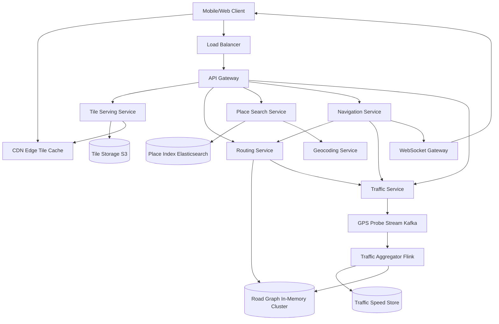

# Solution: Design Google Maps

## 1. Requirements & Estimation

### Traffic Estimates

- **MAU:** 1B users
- **Map tile requests/sec:** 5M (users pan, zoom, scroll)
- **Route calculation requests/sec:** 100,000
- **Navigation sessions (concurrent):** 10M
- **GPS probes/sec (for traffic):** 10M from active drivers/navigators

### Storage Estimates

- **Map tiles (all zoom levels):** ~50 PB
  - Zoom level 21: ~4.4 trillion tiles × 30 KB avg = ~132 PB (but sparse — only populated areas rendered)
  - Practical storage with sparse rendering: ~50 PB
- **Road network graph:** 500M nodes × 200 bytes + 1B edges × 100 bytes = ~200 GB (fits in memory across a cluster)
- **Traffic time-series:** 10M GPS probes/sec × 50 bytes × 86,400 sec = **~43 TB/day**
- **Historical traffic data (for ETA model):** ~5 PB (years of aggregated data)

### Bandwidth Estimates

- **Tile serving:** 5M req/sec × 30 KB = ~150 GB/sec (almost entirely from CDN edge)
- **GPS probe ingress:** 10M/sec × 50 bytes = ~500 MB/sec
- **Route responses:** 100K/sec × 5 KB = ~500 MB/sec

## 2. High-Level Design



## 3. API Design

### Get Map Tiles

```
GET /tiles/{style}/{zoom}/{x}/{y}.pbf
Response: 200 (binary protobuf vector tile, served from CDN)
Cache-Control: public, max-age=86400 (for base map tiles)
```

### Get Directions

```
GET /api/v1/directions?origin=37.7749,-122.4194&destination=37.3382,-121.8863
    &mode=driving&departure_time=now&alternatives=true
Response: 200 {
  routes: [{
    distance_meters: 77200,
    duration_seconds: 3480,
    duration_in_traffic_seconds: 4200,
    polyline: "encoded_polyline_string",
    steps: [{ instruction, distance, duration, polyline }],
    warnings: []
  }],
  traffic_model: "best_guess"
}
```

### Start Navigation Session

```
POST /api/v1/navigation/start
Body: { route_id, current_location: {lat, lng} }
Response: 200 { session_id, ws_url: "wss://nav.maps.com/session/<id>" }

WebSocket messages (server → client):
{ type: "guidance", next_step: {...}, eta_seconds: 2340, reroute: false }
{ type: "reroute", new_route: {...}, reason: "traffic_ahead" }
```

### Search Places

```
GET /api/v1/places/search?q=coffee&location=37.7749,-122.4194&radius=1000
Response: 200 { results: [{ place_id, name, address, lat, lng, rating, distance_m }] }
```

## 4. Data Model

### Road Network Graph (In-Memory, partitioned by region)

**Node (intersection/waypoint):**
```
struct Node {
    node_id: u64,
    lat: f64,
    lng: f64,
    edges: Vec<EdgeRef>,  // outgoing edges
}
```

**Edge (road segment):**
```
struct Edge {
    edge_id: u64,
    source_node: u64,
    target_node: u64,
    distance_meters: u32,
    base_travel_time_sec: u16,      // speed limit based
    current_travel_time_sec: u16,   // live traffic adjusted
    road_class: enum { HIGHWAY, ARTERIAL, LOCAL, RESIDENTIAL },
    is_one_way: bool,
    restrictions: Vec<Restriction>,  // no left turn, time-based, etc.
}
```

### Map Tiles (Object Storage)

```
Path: /tiles/{style}/{zoom}/{x}/{y}.pbf
Style: driving | satellite | terrain | transit
Zoom: 0-21
Tile format: Mapbox Vector Tile (MVT) protobuf
```

### Traffic Speed Data (Time-Series Store)

| Column | Type | Notes |
|--------|------|-------|
| edge_id | BIGINT | Road segment |
| timestamp | TIMESTAMP | 1-minute bucket |
| avg_speed_kmh | FLOAT | Average speed from GPS probes |
| sample_count | INT | Number of probes (confidence indicator) |
| confidence | FLOAT | Statistical confidence in the speed estimate |

## 5. Detailed Design

### Geospatial Tile System Deep Dive

The world map is rendered as a pyramid of tiles using the **Web Mercator** projection:

**Tile addressing (Slippy Map convention):**
- At zoom level `z`, the world is divided into `2^z × 2^z` tiles.
- Zoom 0: 1 tile (entire world). Zoom 10: ~1M tiles. Zoom 21: ~4.4 trillion tiles.
- Tile address: `(z, x, y)` where `x` and `y` are column and row indices.

**Vector tiles vs. raster tiles:**
- **Raster:** Pre-rendered PNG/JPEG images. Simple to serve but fixed style, large storage.
- **Vector:** Protocol buffer containing geometric shapes + metadata. Client renders locally. Smaller files, dynamic styling, rotation/tilt support.
- Google Maps uses **vector tiles** on mobile (smaller bandwidth, interactive) and raster tiles as fallback.

**Tile generation pipeline:**
1. Raw map data (OpenStreetMap or proprietary) is processed into styled layers (roads, buildings, water, labels).
2. Each layer is clipped to tile boundaries and encoded as MVT protobuf.
3. Tiles are stored in object storage (S3) with the path convention: `/{style}/{z}/{x}/{y}.pbf`.
4. Popular tiles (zoom 0-14, urban areas) are pre-rendered. Deep zoom tiles (15-21) for rural areas are rendered on-demand and cached.

**CDN strategy:**
- Base map tiles rarely change → long cache TTL (24 hours for zoom 0-14, 1 hour for zoom 15+).
- Traffic overlay tiles change every 1-2 minutes → short TTL (60 seconds) or served directly from the traffic service.
- CDN hit rate: >95% for base tiles (most requests are for the same popular areas).

### Graph-Based Routing Deep Dive

**The problem:** Find the shortest/fastest path between two points on a graph with 500M nodes and 1B edges. Dijkstra's algorithm is O((V + E) log V) — too slow for a graph this size (would take seconds).

**Solution: Contraction Hierarchies (CH)**

**Pre-processing phase (offline, runs daily):**
1. Assign an "importance" score to each node (based on edge density, road class, etc.).
2. Contract nodes from least important to most important:
   - Remove the node from the graph.
   - For each pair of (u, v) that used the removed node as a shortest path waypoint, add a **shortcut edge** directly from u to v with weight = dist(u, removed) + dist(removed, v).
   - This shortcut preserves shortest-path distances.
3. Result: a hierarchical graph where highways have shortcuts that skip over many local intersections.

**Query phase (online, <100ms):**
1. Run a **bidirectional Dijkstra** — one search forward from the origin, one backward from the destination.
2. Both searches only relax edges toward "more important" nodes (upward in the hierarchy).
3. The searches meet in the middle at a high-importance node (typically a highway junction).
4. The actual path is reconstructed by "unpacking" shortcut edges.

**Performance:** Pre-processing takes hours for a continent-sized graph. But query time drops from seconds to **<10ms** for most routes.

**Handling live traffic:** CH shortcuts are pre-computed with base travel times. To incorporate live traffic:
- **Customizable CH:** Separate the graph topology (fixed) from edge weights (variable). Update only the weights when traffic changes. Re-run a lightweight "customization" pass (~30 seconds for a country-sized graph) to update shortcut weights.
- Customization runs every 5 minutes with latest traffic speeds.

### ETA Prediction Deep Dive

Accurate ETA combines multiple data sources:

**Real-time traffic ingestion:**
1. Every navigating user's phone sends GPS probes every 3 seconds.
2. Probes are published to Kafka (10M/sec).
3. **Traffic Aggregator** (Flink) processes probes in 1-minute windows:
   - Maps each probe to the nearest road segment (map matching).
   - Computes average speed per edge per minute.
   - Publishes updated edge speeds to the graph store.

**ETA model:**
```
ETA = Σ(edge_travel_time) for all edges in the route
```

Where `edge_travel_time` is determined by:

| Priority | Source | Usage |
|----------|--------|-------|
| 1 | Live traffic speed | If ≥10 probes in last 5 min (high confidence) |
| 2 | Historical pattern | Same day-of-week, time-of-day from past 8 weeks |
| 3 | Road speed limit | Fallback when no data available |

**ML adjustments:** A gradient-boosted model applies corrections for:
- Weather conditions (rain → +15% travel time).
- Events (stadium event ending → +30% on nearby roads).
- Road construction zones.
- Time-of-day traffic pattern transitions (traffic building up → ETA increases progressively).

**Rerouting during navigation:**
1. Every 30 seconds, the Navigation Service checks if a faster route exists.
2. Compares current ETA (remaining) with ETA via alternative routes.
3. If an alternative saves >10% time, suggest reroute to the user.
4. Rerouting must feel smooth — avoid oscillating between routes (hysteresis threshold).

### Place Search & Geocoding Deep Dive

**Geocoding** (address → coordinates):
- A specialized index maps structured addresses (street, city, postal code) to lat/lng.
- Fuzzy matching handles typos and partial addresses.
- Reverse geocoding (coordinates → address) uses a spatial index (R-tree) to find the nearest address point.

**Place search** ("coffee near me"):
- **Elasticsearch index** with fields: name, category, lat/lng, rating, hours, price_level.
- Query: bool query combining text match (name/category) with geo_distance filter.
- Ranking: relevance × proximity × rating × popularity.
- Index updated in real-time as businesses update their information.

## 6. Scaling & Trade-offs

### Bottlenecks & Mitigations

| Bottleneck | Mitigation |
|-----------|------------|
| Tile storage (50 PB) | Sparse rendering: only generate deep-zoom tiles for populated areas; on-demand rendering for rare tiles |
| Routing latency | Contraction hierarchies: <10ms per query; partition graph by region for memory locality |
| GPS probe volume (10M/sec) | Kafka with 100+ partitions; Flink stateful processing with checkpoints |
| CDN bandwidth for tiles | Vector tiles (5× smaller than raster); aggressive caching (>95% hit rate) |
| Real-time traffic freshness | 1-minute aggregation windows; customizable CH update every 5 minutes |

### Key Trade-offs

- **Pre-computed vs. on-demand routing:** Pre-computing all possible routes is impossible (O(N²)). On-demand is feasible with Contraction Hierarchies (<10ms). Trade-off is the pre-processing time for CH (hours) and the delay in incorporating live traffic (5-minute lag).
- **Vector vs. raster tiles:** Vector tiles are smaller and more flexible but require client-side rendering (CPU/GPU intensive on low-end devices). Raster tiles are larger but render instantly. Solution: vector for modern devices, raster fallback for older ones.
- **ETA accuracy vs. privacy:** More GPS probes = better traffic data = better ETA. But collecting fine-grained location data raises privacy concerns. Mitigation: aggregate probes (never store individual user trajectories), differential privacy for low-traffic roads.

### Future Improvements

- **3D building rendering:** Use photogrammetry data for immersive 3D map views.
- **Augmented reality navigation:** Overlay turn-by-turn directions on the camera view (Google Live View).
- **Multi-modal routing:** Combine driving, walking, cycling, and public transit into a single optimal route.
- **Predictive routing:** Pre-compute likely routes based on user's calendar and commute patterns.
- **Indoor maps:** Map building interiors (malls, airports) with indoor positioning (Wi-Fi, BLE beacons).
